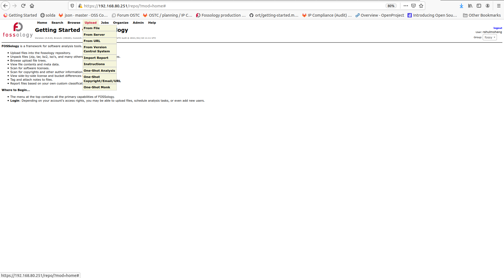
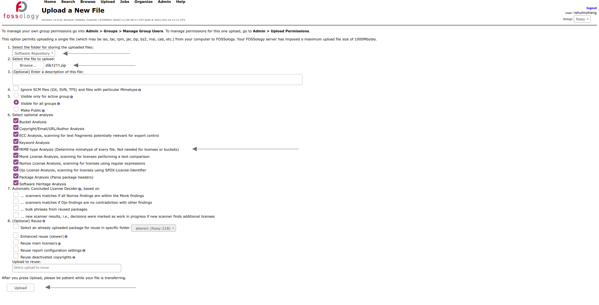
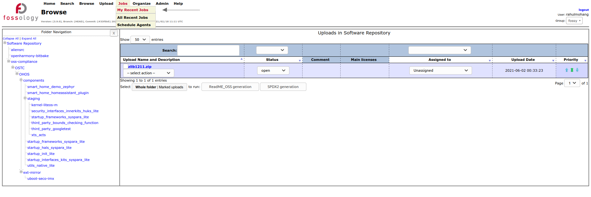
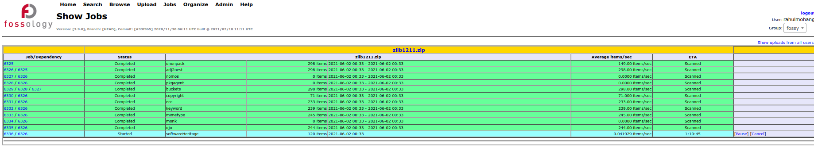
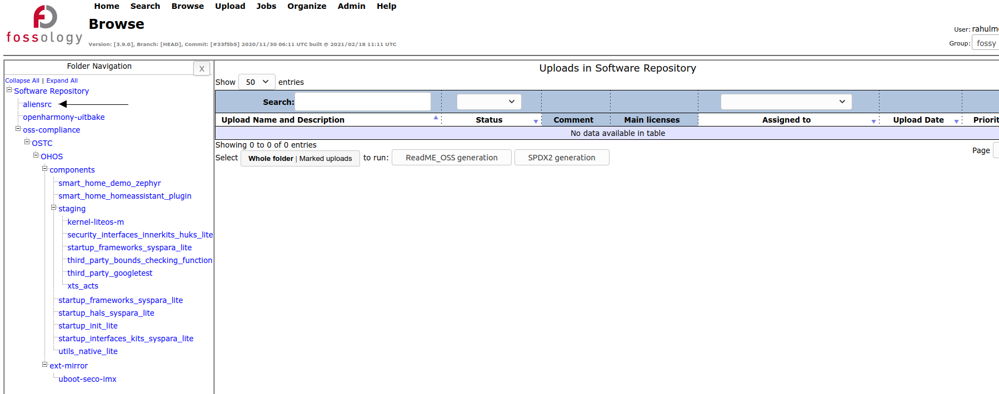

# Getting started with Fossology

## 1 Goal

The main goal of using Fossology is to clarify the incorrect or false positive identifications of licenses, copyrights, patent related statements, and ECC statements, by scanners in Fossology. The Fossology Basic [Workflow](https://www.fossology.org/get-started/basic-workflow/) documentation provide a very comprehensive step by step explanation of the workflow. 
 
## 2 Glossary

**Open Source License** In descending order of preference (a) an [OSI-approved license](https://opensource.org/licenses/), or (b) a license qualifying as
free software according to the [list published by the Free Software Foundation (FSF)](https://www.gnu.org/licenses/license-list.html#NonFreeSoftwareLicenses), or (c) a license falling within the [Open Source Definition](https://opensource.org/osd) and/or within the [FSF definition of Free Software](https://www.gnu.org/philosophy/free-sw.html), **but** which is neither OSI-approved nor expressly listed by FSF (note that this latter option requires a previous assessment by the internal Legal Team to be considered “open source”).

**license text reference** Reference to a license. It could be a standard english sentence refering to the license of a file, or [SPDX standardized short identifier](https://spdx.org/licenses/).

**FOSSology** [FOSSology](https://www.fossology.org/) is a open source license compliance software system and toolkit. As a toolkit you can run license, copyright and export control scans from the command line. As a system, a database and web ui are provided to give you a compliance workflow. License, copyright and export scanners are tools available to help with your compliance activities.

**Bulk recognition** Identification of licenses of multiple files in a single operation. 

**Identified Licenses** a set of Open Source Software licenses identified as a result of following an appropriate method of identifying Open Source components from which the Supplied Software is comprised.

## 3 Workflow

In general, to upload source code packages to Fossology, the 'Upload' tab may be used. This provides the user with options to upload files from a local location, from a server location, from a URL, and from version control systems, git and SVN. 

In this document, the option to upload files from a local location is detailed. As you may see in the figure below, a folder, internal to Fossology, could be selected to upload the source code. For the purpose of this document, the source code of a component is uploaded to 'Software Repository', that is, to the root folder in the Fossology folder structure. Fossology gives options to select the analyses to be done on the uploaded source code. Names of most of the analyses suggest what they perform. Some of them have short explanatory text as well, as shown in the figure. After selecting the required analyses, the user may press the 'Upload' button to upload the source code for scan in Fossology. 

As soon as the upload is finished, Fossology schedules the scan agents to run on the uploaded source package. Users may use the 'My Recent Jobs' option in the 'Jobs' tab to see the status of the jobs run by the scan agents on the source package. 

The status of the jobs run by the agents could be found in the 'My Recent Jobs' window.

Let us now get to know more about the Fossology folder structure that is maintained for auditing in All scenarios OS. The source code files that are uploaded to Fossology by running Aliens4Friends, are uploaded to a folder named, 'aliensrc':

