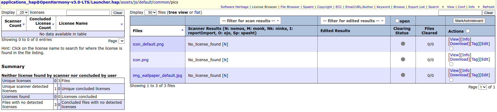
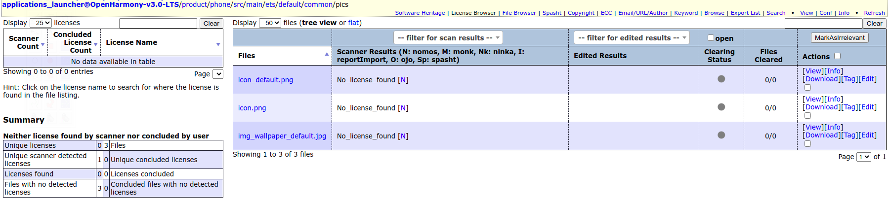
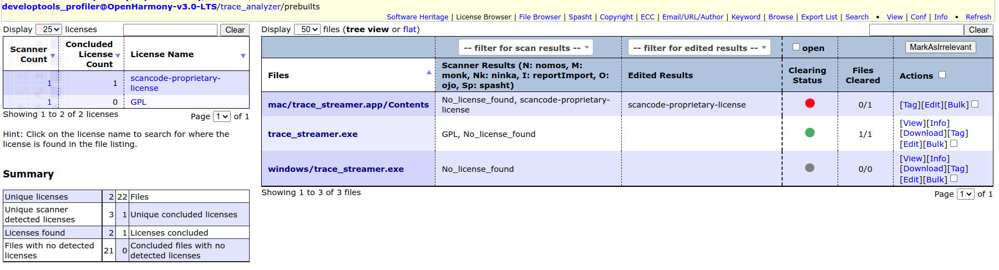
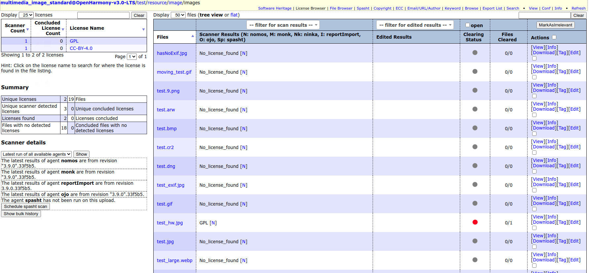
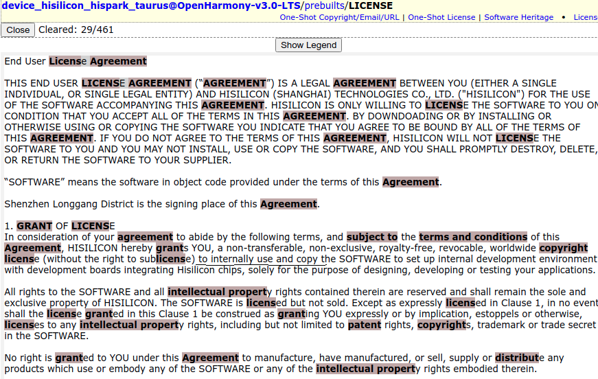
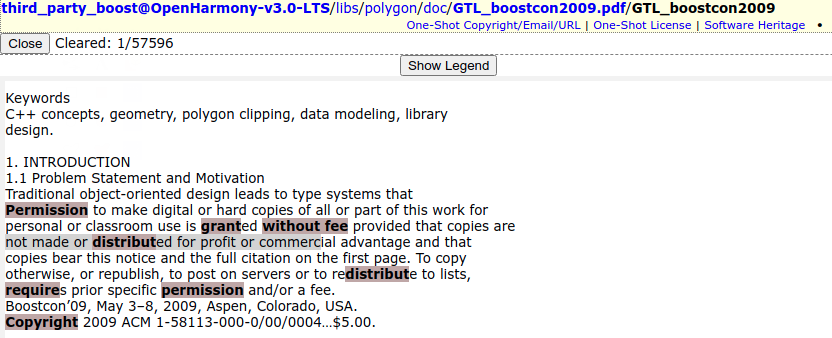
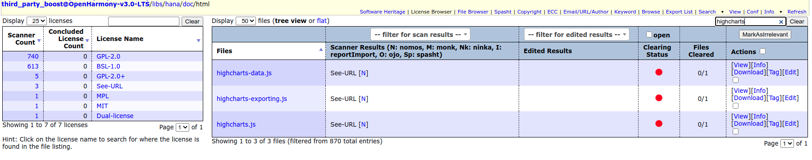
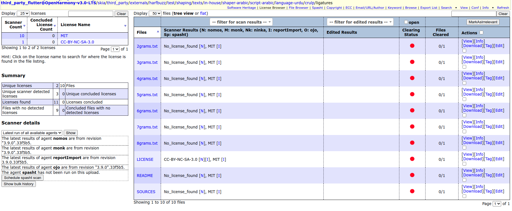
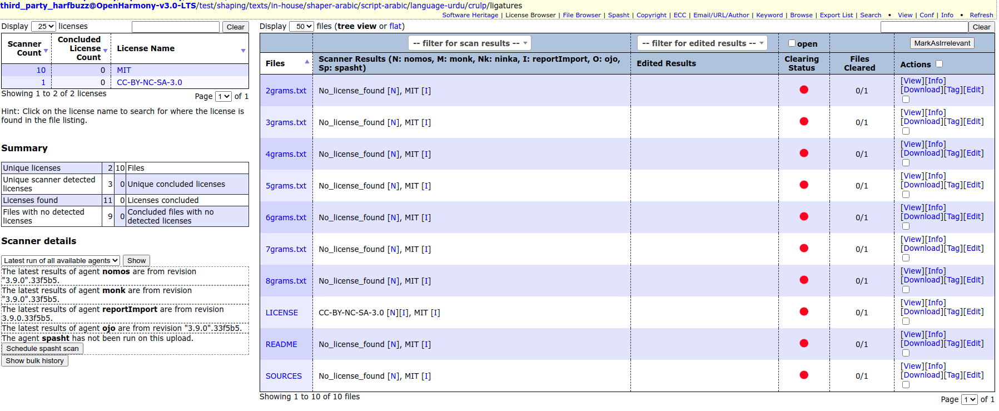

# Result of audit of OpenHarmony-3.0-LTS

## Table of contents

  * [Introduction](#introduction)
  - [1. First party components that have issues](#1-first-party-components-that-have-issues)
  - [1.1. Action - Please file issues in gitee](#11-action---please-file-issues-in-gitee)
  - [1.1.1. applications_hap@OpenHarmony-v3.0-LTS](#111-applications-hapopenharmony-v30-lts)
  - [1.1.2. applications_launcher@OpenHarmony-v3.0-LTS](#112-applications-launcheropenharmony-v30-lts)
  - [1.1.3. applications_photos@OpenHarmony-v3.0-LTS](#113-applications-photosopenharmony-v30-lts)
  - [1.1.4. developtools_profiler@OpenHarmony-v3.0-LTS](#114-developtools-profileropenharmony-v30-lts)
  - [1.1.5. multimedia_image_standard@OpenHarmony-v3.0-LTS](#115-multimedia-image-standardopenharmony-v30-lts)
  - [1.1.6. device_hisilicon_hi3516dv300@OpenHarmony-v3.0-LTS](#116-device-hisilicon-hi3516dv300openharmony-v30-lts---consider-moving-precompiled-binaries-to-a-separate-package-to-make-ip-checks-easier)
  * [1.2. Action - Request to talk to lawyers from Hisilicon](#12-action---request-to-talk-to-lawyers-it-would-be-great-if-we-can-have-meeting-arranged-between-alberto-carlo-rahul-and-the-legal-team-of-hisilicon-to-discuss)
  * [1.2.1 device_hisilicon_drivers@OpenHarmony-v3.0-LTS](#121-device-hisilicon-driversopenharmony-v30-lts)
  * [1.2.2. device_hisilicon_hardware@OpenHarmony-v3.0-LTS](#122-device-hisilicon-hardwareopenharmony-v30-lts)
  * [1.2.3. device_hisilicon_hispark_pegasus@OpenHarmony-v3.0-LTS](#123-device-hisilicon-hispark-pegasusopenharmony-v30-lts)
  * [1.2.4. device_hisilicon_modules@OpenHarmony-v3.0-LTS](#124-device-hisilicon-modulesopenharmony-v30-lts)
  * [1.2.5. signcenter_tool@OpenHarmony-v3.0-Beta1](#125-signcenter-toolopenharmony-v30-beta1)
  * [1.2.6. device_hisilicon_hispark_taurus@OpenHarmony-v3.0-LTS](#126-device-hisilicon-hispark-taurusopenharmony-v30-lts---consider-moving-precompiled-binaries-to-a-separate-package-to-make-ip-checks-easier)
  - [2. First party components that are clear in the initial audit](#2-first-party-components-that-are-clear-in-the-initial-ip-audit)
  * [3. Third party components that have issues](#3-third-party-components-that-have-issues)
  * [3.1. Action - Remove the affected files before distribution](#31-action---remove-the-affected-files-before-distribution)
  * [3.1.1. third_party_boost@OpenHarmony-v3.0-LTS](#311-third-party-boostopenharmony-v30-lts)
  * [3.1.2. third_party_flutter@OpenHarmony-v3.0-LTS](#312-third-party-flutteropenharmony-v30-lts)
  * [3.1.3. third_party_harfbuzz@OpenHarmony-v3.0-LTS](#313-third-party-harfbuzzopenharmony-v30-lts)
  - [4. Third party components that are clear in the initial audit](#4-third-party-components-that-are-clear-in-the-initial-audit)
  * [5. First party components with baniaries in the source tree](#5-first-party-components-with-baniaries-in-the-source-tree)
  - [6. Third party components with binaries in the source tree](#6-third-party-components-with-binaries-in-the-source-tree)
  * [7. List of image files found in the sources of third party components](#7-list-of-image-files-found-in-the-sources)
  - [8. List of audio files found in sources of third party components](#8-list-of-audio-files-found-in-sources)
  * [9. List of video files found in sources of third party components](#9-list-of-video-files-found-in-sources)
  
## Introduction 
This document list the components that were audited to prepare a risk analysis of the first party and third party source code of OpenHarmony-3.0-LTS. The audit has been done and this intermediate report has been  prepared so that the team could take actions on issues, if any, much before the SBOMs are ready. By issues, we mean any findings that may need further action from either the Eclipse Oniro team, or the OpenHarmony team or a third party community.    

## 1. First party components that have issues 

### 1.1. Action - Please file issues in gitee.

#### 1.1.1. applications hap@OpenHarmony-v3.0-LTS 
There is an image at the location, ‘applications_hap@OpenHarmony-v3.0-LTS/Launcher.hap/assets/js/default/common/pics/img_wallpaper_default.jpg’. We found a copyright statement from Apple in the image file, 'img_wallpaper_default.jpg'. So, we suspect that the image may be licensed by someone and we could not find a license in the component for the image. So, please remove the image when you distribute the software. If the other images are from unknown sources, please remove them as well.

 

[Back to table of contents](#table-of-contents)

#### 1.1.2. applications launcherOpenHarmony-v3.0-LTS
There are images at the location, ‘applications_launcher@OpenHarmony-v3.0-LTS/product/phone/src/main/ets/default/common/pics/’. We found a copyright statement from Apple in the image file, 'img_wallpaper_default.jpg'. So, we suspect that the image may be licensed by someone and we could not find a license in the component for the image. So, please remove the image when you distribute the software. If the other images are from unknown sources, please remove them as well.

[Back to table of contents](#table-of-contents)

#### 1.1.3. applications photos@OpenHarmony-v3.0-LTS 
There are images at the location, ‘applications_photos@OpenHarmony-v3.0-LTS/demos/’. We found a copyright statement from HP in the image file, '1.jpg'. So, we suspect that the image may be licensed by someone and we could not find a license in the component for the image. So, please remove the image when you distribute the software. If the other images are from unknown sources, please remove them as well.

[Back to table of contents](#table-of-contents)

#### 1.1.4. developtools profiler@OpenHarmony-v3.0-LTS 
There are binaries in the folder, ‘developtools_profiler@OpenHarmony-v3.0-LTS/trace_analyzer/prebuilts’ with scancode finding suggesting proprietary license for the files in the folder. The files could be related to Mac and Windows. 

[Back to table of contents](#table-of-contents)

#### 1.1.5. multimedia image standard@OpenHarmony-v3.0-LTS 
There are many image files in the folder, 'multimedia_image_standard@OpenHarmony-v3.0-LTS/test/resource/image/images'. In the image, 'test_exif.jpg', there is a copyright statement from Hewlett-Packard. So, we suspect that the image may be licensed by someone and we could not find a license in the component for the image. So, please remove the image when you distribute the software. If the other images are from unknown sources, please remove them as well.

[Back to table of contents](#table-of-contents)

#### 1.1.6. device hisilicon hi3516dv300@OpenHarmony-v3.0-LTS - consider moving precompiled binaries to a separate package to make IP checks easier.
It is mentioned in the README file that:
*- The **hi3516dv300\\sdk\_linux\\mpp\\bin** directory stores the HiSilicon-developed libraries, which comply with the end-user license agreement \(EULA\). This directory contains a license file.*
*- The **hi3516dv300\\sdk\_linux\\open\_source\\linux** directory stores the HiSilicon-developed code, which complies with the HiSilicon \(Shanghai\) copyright statement based on GPL. You can see the following license and copyright information at the beginning of the license file stored in this directory:*

However, there is no EULA in the mentioned location. The EULA was found in the location, 'device_hisilicon_hi3516dv300@OpenHarmony-v3.0-LTS/sdk_linux/open_source/bin/LICENSE' where we were supposed to find files licensed under GPL as per the second statement above. We would like to have clarity on the applicable EULA and it's location in the source code.

As per the EULA, the rights are to internally use and copy the binaries to set up internal development environment with development boards integrating Hisilicon chips, solely for the purpose of designing, developing or testing your applications. There is no grant of redistribution rights. 

[Back to table of contents](#table-of-contents)

### 1.2. Action - Request to talk to lawyers. It would be great if we can have meeting arranged between Alberto, Carlo, Rahul and the legal team of Hisilicon to discuss.

In this section, we have listed components that contains or are licensed under an end user license agreement from Hisilicon. We would like to clarify about Eclipse Oniro's rights to redistribute the software because we have not found statements regarding distribution in the license texts. e.g. The following is a paragraph found in all the variants of the Hisilicon end user license agreement that is not very clear for us:

*No right is granted to YOU under this Agreement to manufacture, have manufactured, or sell, supply or distribute any products which have taken into use or which embody any of the SOFTWARE or any of the intellectual property rights embodied therein.* 

#### 1.2.1. device hisilicon drivers@OpenHarmony-v3.0-LTS
There are files in the folder, 'device_hisilicon_drivers@OpenHarmony-v3.0-LTS/wifi/driver' that are licensed under the GPL v2.0 or later version. The 'BUILD.gn' file, and in general, the component is licensed under Apache v2.0 license. Apache-2.0 and GPL-2.0 are incompatible. Since we have a driver subject to GPL v2.0 or later and a kernel released under Apache-2.0, we have an incompatibility. Please contact the legal department of Hisilicon and request them to release the driver under a dual license GPL v2.0 or later and Apache-2.0.  

As per a sentence in 'device_hisilicon_drivers@OpenHarmony-v3.0-LTS/LICENSE' file, the firmware and libs subdirectories are licensed under End User License Agreement that is provided in the same file. As per the rights mentioned in the EULA, rights to design and develop applictions for use in conjunction with Hisilicon chip is explicit. However, right to distribute is not explicitly mentioned.  

[Back to table of contents](#table-of-contents)

#### 1.2.2. device hisilicon hardware@OpenHarmony-v3.0-LTS 
As per the rights mentiopned in the file, 'device_hisilicon_hardware@OpenHarmony-v3.0-LTS/LICENSE', the rights are granted to internally use and copy the binaries to set up internal development environment with development boards integrating Hisilicon chips, solely for the purpose of designing, developing or testing the applications of the user. The word 'internally' could mean that the end user may not have right to redistribute. Please clarify this.  

[Back to table of contents](#table-of-contents)

#### 1.2.3. device hisilicon hispark pegasus@OpenHarmony-v3.0-LTS 
As per the EULA in the location, 'device_hisilicon_hispark_pegasus@OpenHarmony-v3.0-LTS/sdk_liteos/build/libs/LICENSE', rights are granted to use and copy the binaries solely for the purpose of designing or developing applications for use in conjunction with Hisilicon chip. There is no grant of rights to redistribute. 

[Back to table of contents](#table-of-contents)

#### 1.2.4. device hisilicon modules@OpenHarmony-v3.0-LTS 
As per the EULA in the location, 'device_hisilicon_modules@OpenHarmony-v3.0-LTS/LICENSE', the rights are to internally use and copy the binaries to set up internal development environment with development boards integrating Hisilicon chips, solely for the purpose of designing, developing or testing your applications. There is no grant of redistribution rights. 

[Back to table of contents](#table-of-contents)

#### 1.2.5. signcenter tool@OpenHarmony-v3.0-Beta1 
As per the EULA in the location, 'signcenter_tool@OpenHarmony-v3.0-Beta1/LICENSE', rights are granted to use and copy the binaries solely for the purpose of designing or developing applications. There is no grant of rights to redistribute. 

[Back to table of contents](#table-of-contents)

#### 1.2.6. device hisilicon hispark taurus@OpenHarmony-v3.0-LTS - consider moving precompiled binaries to a separate package to make IP checks easier.
As per the EULA in the location, 'device_hisilicon_hispark_taurus@OpenHarmony-v3.0-LTS/prebuilts/LICENSE', the rights are to internally use and copy the binaries to set up internal development environment with development boards integrating Hisilicon chips, solely for the purpose of designing, developing or testing your applications. There is no grant of redistribution rights. 

[Back to table of contents](#table-of-contents)

## 2. First party components that are clear in the initial IP audit 

### 1. aafwk_aafwk_lite@OpenHarmony-v3.0-LTS
### 2. aafwk_standard@OpenHarmony-v3.0-LTS
### 3. account_os_account@OpenHarmony-v3.0-LTS
### 4. ace_ace_engine@OpenHarmony-v3.0-LTS
### 5. ace_engine_lite@OpenHarmony-v3.0-LTS  
### 6. ace_napi@OpenHarmony-v3.0-LTS
### 7. ai_engine@OpenHarmony-v3.0-Beta1
### 8. appexecfwk_appexecfwk_lite@OpenHarmony-v3.0-LTS
### 9. appexecfwk_standard@OpenHarmony-v3.0-LTS
### 10. applications_camera@OpenHarmony-v3.0-LTS
### 11. applications_camera_sample_communication@OpenHarmony-2.0-Canary
### 12. applications_camera_screensaver_app@OpenHarmony-2.0-Canary
### 13. applications_sample_camera@OpenHarmony-v3.0-LTS
### 14. applications_sample_wifi_iot@OpenHarmony-v2.2-Beta2
### 15. applications_settings@OpenHarmony-v3.0-LTS
### 16. applications_systemui@OpenHarmony-v3.0-LTS
### 17. ark_js_runtime@OpenHarmony-v3.0-LTS
### 18. ark_runtime_core@OpenHarmony-v3.0-LTS
### 19. ark_ts2abc@OpenHarmony-v3.0-LTS
### 20. build_lite@OpenHarmony-v3.0-LTS
### 21. build@OpenHarmony-v3.0-LTS
### 22. communication_bluetooth@OpenHarmony-v3.0-LTS
### 23. communication_dsoftbus@OpenHarmony-v3.0-LTS
### 24. communication_ipc_lite@OpenHarmony-v3.0-Beta1
### 25. communication_ipc@OpenHarmony-v3.0-LTS
### 26. communication_softbus_lite@OpenHarmony-v3.0-LTS
### 27. communication_wifi_aware@OpenHarmony-v3.0-LTS
### 28. communication_wifi_lite@OpenHarmony-v3.0-LTS
### 29. communication_wifi@OpenHarmony-v3.0-LTS
### 30. developtools_ace-ets2bundle@OpenHarmony-v3.0-LTS
### 31. developtools_ace-js2bundle@OpenHarmony-v3.0-LTS
### 32. developtools_bytrace_standard@OpenHarmony-v3.0-LTS
### 33. developtools_hdc_standard@OpenHarmony-v3.0-LTS
### 34. developtools_packing_tool@OpenHarmony-v3.0-LTS
### 35. device_hisilicon_build@OpenHarmony-v3.0-Beta1
### 36. device_hisilicon_hispark_aries@OpenHarmony-v3.0-LTS
### 37. device_manager@OpenHarmony-v3.0-LTS
### 38. device_qemu@OpenHarmony-v3.0-LTS
### 39. distributeddatamgr_appdatamgr@OpenHarmony-v3.0-LTS
### 40. distributeddatamgr_datamgr@OpenHarmony-v3.0-LTS
### 41. distributeddatamgr_file@OpenHarmony-v3.0-LTS
### 42. distributedschedule_dms_fwk_lite@OpenHarmony-v3.0-Beta1
### 43. distributedschedule_dms_fwk@OpenHarmony-v3.0-LTS
### 44. distributedschedule_safwk_lite@OpenHarmony-v3.0-LTS
### 45. distributedschedule_safwk@OpenHarmony-2.0-Canary
### 46. distributedschedule_samgr_lite@OpenHarmony-v3.0-LTS
### 47. distributedschedule_samgr@OpenHarmony-v3.0-LTS
### 48. docs@OpenHarmony-v3.0-LTS
### 49. drivers_adapter_khdf_linux@OpenHarmony-v3.0-LTS-2-g1ee1a4c
### 50. drivers_adapter@OpenHarmony-v3.0-LTS
### 51. drivers_framework@OpenHarmony-v3.0-LTS-20-g0defe33
### 52. drivers_liteos@OpenHarmony-v3.0-LTS
### 53. drivers_peripheral@OpenHarmony-v3.0-LTS
### 54. global_cust_lite@OpenHarmony-2.0-Canary
### 55. global_i18n_lite@OpenHarmony-v3.0-LTS
### 56. global_i18n_standard@OpenHarmony-v3.0-LTS
### 57. global_resmgr_lite@OpenHarmony-v3.0-LTS
### 59. global_resmgr_standard@OpenHarmony-v3.0-LTS
### 60. graphic_standard@OpenHarmony-v3.0-LTS
### 70. graphic_surface@OpenHarmony-v3.0-Beta1
### 71. graphic_ui@OpenHarmony-v3.0-LTS
### 72. graphic_utils@OpenHarmony-v3.0-Beta1
### 73. graphic_wms@OpenHarmony-v2.2-Beta2
### 74. hiviewdfx_blackbox@OpenHarmony-v3.0-LTS
### 75. hiviewdfx_faultloggerd@OpenHarmony-v3.0-LTS
### 76. hiviewdfx_hiappevent@OpenHarmony-v3.0-LTS
### 77. hiviewdfx_hicollie@OpenHarmony-v3.0-LTS
### 78. hiviewdfx_hidumper_lite@OpenHarmony-v3.0-LTS
### 79. hiviewdfx_hievent_lite@OpenHarmony-v3.0-LTS
### 80. hiviewdfx_hilog_lite@OpenHarmony-v3.0-Beta1
### 81. hiviewdfx_hilog@OpenHarmony-v3.0-LTS
### 82. hiviewdfx_hisysevent@OpenHarmony-v3.0-LTS
### 83. hiviewdfx_hitrace@OpenHarmony-v3.0-LTS
### 84. hiviewdfx_hiview_lite@OpenHarmony-v3.0-LTS
### 85. hiviewdfx_hiview@OpenHarmony-v3.0-LTS
### 86. interface_sdk-js@OpenHarmony-v3.0-LTS
### 87. iothardware_peripheral@OpenHarmony-v3.0-Beta1
### 88. iot_link@OpenHarmony_release_v1.1.0
### 89. js_api_module@OpenHarmony-v3.0-LTS
### 90. js_sys_module@OpenHarmony-v3.0-LTS
### 91. js_util_module@OpenHarmony-v3.0-LTS
### 92. js_worker_module@OpenHarmony-v3.0-LTS
### 93. kernel_linux_4.19@OpenHarmony-v3.0-LTS
### 94. kernel_linux_5.10@OpenHarmony-v3.0-LTS
### 95. kernel_linux_build@OpenHarmony-v3.0-LTS
### 96. kernel_linux_config@OpenHarmony-v3.0-LTS
### 97. kernel_linux_patches@OpenHarmony-v3.0-LTS
### 98. kernel_liteos_a@OpenHarmony-v3.0-LTS
### 99. kernel_liteos_m@OpenHarmony-v3.0-LTS
### 100. miscservices_inputmethod@OpenHarmony-v3.0-LTS 
### 101. miscservices_time@OpenHarmony-v3.0-LTS 
### 102. multimedia_audio_lite@OpenHarmony-v3.0-LTS 
### 103. multimedia_audio_standard@OpenHarmony-v3.0-LTS 
### 104. multimedia_camera_lite@OpenHarmony-v3.0-LTS
### 105. multimedia_camera_standard@OpenHarmony-v3.0-LTS
### 106. multimedia_histreamer@OpenHarmony-v3.0-Beta1
### 107. multimedia_medialibrary_standard@OpenHarmony-v3.0-LTS
### 108. multimedia_media_lite@OpenHarmony-v3.0-LTS 
### 109. multimedia_media_standard@OpenHarmony-v3.0-LTS 
### 110. multimedia_utils_lite@OpenHarmony-v3.0-LTS 
### 111. multimodalinput_input@OpenHarmony-v3.0-LTS 
### 112. notification_ans_standard@OpenHarmony-v3.0-LTS 
### 113. notification_ces_standard@OpenHarmony-v3.0-LTS
### 114. powermgr_battery_lite@OpenHarmony-v3.0-LTS 
### 115. powermgr_battery_manager@OpenHarmony-v3.0-LTS
### 116. powermgr_display_manager@OpenHarmony-v3.0-Beta1
### 117. powermgr_power_manager@OpenHarmony-v3.0-LTS 
### 118. powermgr_powermgr_lite@OpenHarmony-v3.0-LTS
### 119. prebuilts_lite_sysroot@OpenHarmony-v3.0-LTS
### 120. productdefine_common@OpenHarmony-v3.0-LTS
### 121. resources@OpenHarmony-v3.0-Beta1 
### 122. security_appverify@OpenHarmony-v3.0-LTS 
### 123. security_dataclassification@OpenHarmony-2.0-Canary 
### 124. security_deviceauth@OpenHarmony-v3.0-LTS 
### 125. security_huks@OpenHarmony-v3.0-LTS 
### 126. security_itrustee_ree_lite@OpenHarmony-v3.0-LTS 
### 127. security_permission@OpenHarmony-v3.0-LTS 
### 128. sensors_miscdevice_lite@OpenHarmony-v3.0-Beta1 
### 129. sensors_sensor_lite@OpenHarmony-v3.0-LTS 
### 130. startup_appspawn_lite@OpenHarmony-v3.0-Beta1 
### 131. startup_appspawn@OpenHarmony-v3.0-LTS 
### 132. startup_bootstrap_lite@OpenHarmony-v2.2-Beta2 
### 133. startup_init_lite@OpenHarmony-v3.0-LTS 
### 134. startup_syspara_lite@OpenHarmony-v3.0-LTS 
### 135. telephony_call_manager@OpenHarmony-v3.0-LTS 
### 136. telephony_cellular_call@OpenHarmony-v3.0-LTS 
### 137. telephony_core_service@OpenHarmony-v3.0-LTS 
### 138. telephony_ril_adapter@OpenHarmony-v3.0-LTS 
### 139. telephony_sms_mms@OpenHarmony-v3.0-LTS 
### 140. telephony_state_registry@OpenHarmony-v3.0-LTS 
### 141. test_developertest@OpenHarmony-v3.0-LTS 
### 142. test_xdevice@OpenHarmony-v3.0-LTS 
### 143. update_app@OpenHarmony-v3.0-Beta1 
### 144. update_ota_lite@OpenHarmony-v3.0-Beta1 
### 145. update_packaging_tools@OpenHarmony-v3.0-LTS 
### 146. update_updater@OpenHarmony-v3.0-LTS 
### 147. update_updateservice@OpenHarmony-v3.0-LTS 
### 148. utils_native_lite@OpenHarmony-v3.0-Beta1 
### 149. utils_native@OpenHarmony-v3.0-LTS 
### 150. utils@OpenHarmony-v3.0-LTS 
### 151. utils_selinux_policy_standard@OpenHarmony-v2.2-Beta2 
### 152. vendor_hisilicon@OpenHarmony-v3.0-LTS 
### 153. vendor_huawei_hdf@OpenHarmony-v3.0-LTS 
### 154. vendor_ohemu@OpenHarmony-v3.0-LTS 
### 155. xts_acts@OpenHarmony-v3.0-LTS 
### 156. xts_tools_full@OpenHarmony-v3.0-LTS 
### 157. xts_tools@OpenHarmony-v3.0-LTS 

[Back to table of contents](#table-of-contents)

## 3. Third party components that have issues 
### 3.1. Action - Remove the affected files before distribution.  

#### 3.1.1. third party boost@OpenHarmony-v3.0-LTS 
There is a PDF file at the location, 'third_party_boost@OpenHarmony-v3.0-LTS/libs/polygon/doc/GTL_boostcon2009.pdf/GTL_boostcon2009' that has license terms that restricts it for commercial use without specific permission.

[Back to table of contents](#table-of-contents)

The files, 'highcharts-data.js', 'highcharts-exporting.js', and 'highcharts.js' under the folder, 'third_party_boost@OpenHarmony-v3.0-LTS/libs/hana/doc/html' are licensed under proprietary license that needs to be bought.

[Back to table of contents](#table-of-contents)

#### 3.1.2. third party flutter@OpenHarmony-v3.0-LTS
There is a software called 'ligatures' that is licensed under the CC BY-NC-SA-3.0 in the folder, 'third_party_flutter@OpenHarmony-v3.0-LTS/skia/third_party/externals/harfbuzz/test/shaping/texts/in-house/shaper-arabic/script-arabic/language-urdu/crulp/ligatures'. As per the license terms, the software may be used only for non commercial purposes. 

[Back to table of contents](#table-of-contents)

#### 3.1.3. third party harfbuzz@OpenHarmony-v3.0-LTS 
There is a software called 'ligatures' that is licensed under the CC BY-NC-SA-3.0 in the folder, 'third_party_harfbuzz@OpenHarmony-v3.0-LTS/test/shaping/texts/in-house/shaper-arabic/script-arabic/language-urdu/crulp/ligatures'. As per the license terms, the software may be used only for non commercial purposes.

[Back to table of contents](#table-of-contents)

## 4. Third party components that are clear in the initial audit 

### 1. device_hisilicon_third_party_uboot@OpenHarmony-v3.0-LTS
### 2. third_party_abseil-cpp@OpenHarmony-v3.0-LTS 
### 3. third_party_boringssl@OpenHarmony-v3.0-LTS
### 4. third_party_bounds_checking_function@OpenHarmony-2.0-Canary
### 5. third_party_bzip2@OpenHarmony-v3.0-LTS
### 6. third_party_cares@OpenHarmony-v3.0-LTS 
### 7. third_party_cJSON@OpenHarmony-v3.0-LTS 
### 8. third_party_cmsis@OpenHarmony-2.0-Canary 
### 9. third_party_cryptsetup@OpenHarmony-v3.0-LTS 
### 10. third_party_css-what@OpenHarmony-v3.0-LTS 
### 11. third_party_curl@OpenHarmony-v3.0-LTS 
### 12. third_party_e2fsprogs@OpenHarmony-v3.0-LTS.tar.xz 
### 13. third_party_ejdb@OpenHarmony-v3.0-LTS 
### 14. third_party_eudev@OpenHarmony-v3.0-LTS 
### 15. third_party_expat@OpenHarmony-v3.0-LTS 
### 16. third_party_FatFs@OpenHarmony-v3.0-LTS 
### 17. third_party_ffmpeg@OpenHarmony-v3.0-LTS 
### 18. third_party_flatbuffers@OpenHarmony-v3.0-LTS 
### 19. third_party_FreeBSD@OpenHarmony-v3.0-Beta1 
### 20. third_party_freetype@OpenHarmony-v3.0-LTS 
### 21. third_party_giflib@OpenHarmony-v3.0-LTS 
### 22. third_party_glfw@OpenHarmony-v3.0-LTS 
### 23. third_party_glib@OpenHarmony-v3.0-LTS 
### 24. third_party_gn@OpenHarmony-v3.0-LTS 
### 25. third_party_googletest@OpenHarmony-v3.0-LTS 
### 26. third_party_grpc@OpenHarmony-v3.0-LTS 
### 27. third_party_gstreamer@OpenHarmony-v3.0-LTS 
### 28. third_party_icu@OpenHarmony-v3.0-LTS 
### 29. third_party_iniparser@OpenHarmony-v3.0-LTS 
### 30. third_party_iowow@OpenHarmony-v3.0-LTS 
### 31. third_party_jerryscript@OpenHarmony-v3.0-LTS 
### 32. third_party_jinja2@OpenHarmony-v3.0-LTS 
### 33. third_party_jsframework@OpenHarmony-v3.0-LTS 
### 34. third_party_JSON-C@OpenHarmony-v3.0-LTS 
### 35. third_party_jsoncpp@OpenHarmony-v3.0-LTS 
### 36. third_party_json@OpenHarmony-2.0-Canary 
### 37. third_party_libcoap@OpenHarmony-v2.2-Beta2 
### 38. third_party_libdrm@OpenHarmony-v3.0-Beta1 
### 39. third_party_libevdev@OpenHarmony-v3.0-Beta1 
### 40. third_party_libffi@OpenHarmony-v3.0-LTS 
### 41. third_party_libinput@OpenHarmony-v3.0-Beta1 
### 42. third_party_libjpeg@OpenHarmony-v3.0-LTS 
### 43. third_party_libphonenumber@OpenHarmony-v3.0-Beta1 
### 44. third_party_libpng@OpenHarmony-v3.0-LTS 
### 45. third_party_libsnd@OpenHarmony-v3.0-LTS 
### 46. third_party_libunwind@OpenHarmony-v3.0-Beta1 
### 47. third_party_libusb@OpenHarmony-v3.0-LTS 
### 48. third_party_libuuid@OpenHarmony-v3.0-Beta1 
### 49. third_party_libuv@OpenHarmony-v3.0-LTS 
### 50. third_party_libxkbcommon@OpenHarmony-v3.0-Beta1 
### 51. third_party_libxml2@OpenHarmony-v3.0-LTS 
### 52. third_party_Linux_Kernel@OpenHarmony-v3.0-LTS 
### 53. third_party_littlefs@OpenHarmony-v3.0-Beta1 
### 54. third_party_ltp@OpenHarmony-v3.0-LTS 
### 55. third_party_LVM2@OpenHarmony-v3.0-LTS 
### 56. third_party_lwip@OpenHarmony-v3.0-LTS 
### 57. third_party_lz4@OpenHarmony-2.0-Canary 
### 58. third_party_markupsafe@OpenHarmony-v3.0-Beta1 
### 59. third_party_mbedtls@OpenHarmony-v3.0-LTS 
### 60. third_party_mingw-w64@OpenHarmony-v3.0-LTS 
### 61. third_party_miniz@OpenHarmony-v3.0-LTS 
### 62. third_party_mksh@OpenHarmony-v3.0-LTS 
### 63. third_party_mtdev@OpenHarmony-v3.0-Beta1 
### 64. third_party_mtd_utils@OpenHarmony-v3.0-Beta1 
### 65. third_party_musl@OpenHarmony-v3.0-LTS 
### 66. third_party_ninja@OpenHarmony-2.0-Canary 
### 67. third_party_node@OpenHarmony-v3.0-LTS 
### 68. third_party_NuttX@OpenHarmony-v3.0-LTS 
### 69. third_party_openssl@OpenHarmony-v3.0-LTS 
### 70. third_party_optimized_routines@OpenHarmony-v3.0-LTS 
### 71. third_party_parse5@OpenHarmony-v3.0-LTS 
### 72. third_party_pixman@OpenHarmony-v3.0-LTS 
### 73. third_party_popt@OpenHarmony-v3.0-LTS 
### 74. third_party_protobuf@OpenHarmony-v3.0-LTS 
### 75. third_party_pulseaudio@OpenHarmony-v3.0-Beta1 
### 76. third_party_python@OpenHarmony-v3.0-LTS 
### 77. third_party_qrcodegen@OpenHarmony-2.0-Canary 
### 78. third_party_quickjs@OpenHarmony-v3.0-LTS 
### 79. third_party_re2@OpenHarmony-v3.0-LTS 
### 80. third_party_rt_thread@OpenHarmony-v3.0-Beta1 
### 81. third_party_sqlite@OpenHarmony-v3.0-LTS 
### 82. third_party_toybox@OpenHarmony-v3.0-LTS 
### 83. third_party_unity@OpenHarmony-v3.0-Beta1 
### 84. third_party_wayland-ivi-extension@OpenHarmony-v3.0-LTS 
### 85. third_party_wayland-protocols_standard@OpenHarmony-v3.0-LTS 
### 86. third_party_wayland_standard@OpenHarmony-v3.0-LTS 
### 87. third_party_weex-loader@OpenHarmony-v3.0-LTS 
### 88. third_party_weston@OpenHarmony-v3.0-LTS 
### 89. third_party_wpa_supplicant@OpenHarmony-v3.0-LTS 
### 90. third_party_xkeyboardconfig@OpenHarmony-v3.0-Beta1 
### 91. third_party_zlib@OpenHarmony-v3.0-LTS 

[Back to table of contents](#table-of-contents)

## 5. First party components with baniaries in the source tree
The source trees of the first party components were checked for the presence of binaries. The listed components in this section are those with binaries in the source tree. The extensions searched for were '.o', '.so', '.a', '.hap' etc. Most of the binaries in the first party components could be licensed under Apache Software License 2.0 or the EULA from Hisilicon. We have tried to document that wherever we were clear on the relation. We have tried to find out if corresponding sources of the binaries are also in the source tree. However, we have mentioned all the cases that we have come across, despite some being obvious that a license applies to the binaries. The following list may not be an exhaustive. However, we will keep this updated.

### 1. aafwk_standard@OpenHarmony-v3.0-LTS
Binaries were found at 'aafwk_standard@OpenHarmony-v3.0-LTS/test/resource/tools/aa'. The license information found in the file, 'aafwk_standard@OpenHarmony-v3.0-LTS/test/resource/tools/ohos_test.xml' is Apache-2.0 license copyrighted by Huawei Device Co., Ltd.   

### 2. ace_ace_engine@OpenHarmony-v3.0-LTS
Binaries found in the location, ‘ace_ace_engine@OpenHarmony-v3.0-LTS/frameworks/base/resource/binary/mac’.

### 3. ai_engine@OpenHarmony-v3.0-Beta1
Binaries found in the location, 'ai_engine@OpenHarmony-v3.0-Beta1/services/common/platform/os_wrapper/feature/libs/hispark_taurus/libaudio_features.a'

### 4. appexecfwk_standard@OpenHarmony-v3.0-LTS
Binaries found in the following locations:

1. appexecfwk_standard@OpenHarmony-v3.0-LTS/test/resource/ams
2. appexecfwk_standard@OpenHarmony-v3.0-LTS/test/resource/bundlemgrservice
3. appexecfwk_standard@OpenHarmony-v3.0-LTS/test/resource/bundlemgrsst
4. appexecfwk_standard@OpenHarmony-v3.0-LTS/test/resource/mstbundlemgrservice
5. appexecfwk_standard@OpenHarmony-v3.0-LTS/test/resource/tools
      
The license of the files could be Apache Software License 2.0, as the license is mentioned in the ohos_test.xml files in the respective folders. However, we have not found sources that could be mapped to the binaries. 

### 5. applications_hap@OpenHarmony-v3.0-LTS
The component source code tree contais contains predoiminantly, '.hap' files. The hap files contains files with the extension, '.bin', minified javascripts and some images. We have found the following files with the '.bin' extension. Javascript files with the same names has been found in the folders as well.

1. applications_hap@OpenHarmony-v3.0-LTS/Photos.hap/assets/js/default/pages/afterSelect/afterSelect.bin
2. applications_hap@OpenHarmony-v3.0-LTS/Photos.hap/assets/js/default/app.bin
3. applications_hap@OpenHarmony-v3.0-LTS/DeviceManager_UI.hap/assets/js/default/app.bin
4. applications_hap@OpenHarmony-v3.0-LTS/DeviceManager_UI.hap/assets/js/default/pages/index/index.bin
5. applications_hap@OpenHarmony-v3.0-LTS/Photos.hap/assets/js/default/pages/main/main.bin
6. applications_hap@OpenHarmony-v3.0-LTS/Photos.hap/assets/js/default/pages/photoDetail/photoDetail.bin
7. applications_hap@OpenHarmony-v3.0-LTS/Photos.hap/assets/js/default/pages/photoList/photoList.bin
8. applications_hap@OpenHarmony-v3.0-LTS/Photos.hap/assets/js/default/pages/selectAlbum/selectAlbum.bin
9. applications_hap@OpenHarmony-v3.0-LTS/Photos.hap/assets/js/default/pages/selectAlbumPhoto/selectAlbumPhoto.bin
10. applications_hap@OpenHarmony-v3.0-LTS/Photos.hap/assets/js/default/pages/videoList/videoList.bin
    
The following are the hap files:
1. applications_hap@OpenHarmony-v3/kikaInput.hap
2. applications_hap@OpenHarmony-v3/SystemUI-SystemDialog.hap
3. applications_hap@OpenHarmony-v3/Clock_Demo.hap
4. applications_hap@OpenHarmony-v3/DeviceManager_UI.hap
5. applications_hap@OpenHarmony-v3/Ecg_Demo.hap
6. applications_hap@OpenHarmony-v3/Music_Demo.hap
7. applications_hap@OpenHarmony-v3/SystemUI-StatusBar.hap
8. applications_hap@OpenHarmony-v3/Launcher_Recents.hap
9. applications_hap@OpenHarmony-v3/Calc_Demo.hap
10. applications_hap@OpenHarmony-v3/Flashlight_Demo.hap
11. applications_hap@OpenHarmony-v3/Photos.hap
12. applications_hap@OpenHarmony-v3/Airquality_Demo.hap
13. applications_hap@OpenHarmony-v3/Launcher.hap
14. applications_hap@OpenHarmony-v3/Launcher_Settings.hap
15. applications_hap@OpenHarmony-v3/SystemUI-NavigationBar.hap
16. applications_hap@OpenHarmony-v3/Camera.hap
17. applications_hap@OpenHarmony-v3/Settings.hap
18. applications_hap@OpenHarmony-v3/Shopping_Demo.hap

### 6. device_hisilicon_drivers@OpenHarmony-v3.0-LTS
Binaries found in the location, 'device_hisilicon_drivers@OpenHarmony-v3.0-LTS/libs/ohos/llvm'.The binaries are licensed under a End User License Agreement.

### 7. device_hisilicon_hardware@OpenHarmony-v3.0-LTS
The following binary files were found. We could not find the source code. 
1. device_hisilicon_hardware@OpenHarmony-v3/media/hal/codec/hi3518ev300/llvm/ohos/libs/libcodec.a
2. device_hisilicon_hardware@OpenHarmony-v3/media/hal/codec/hi3518ev300/gcc/ohos/libs/libcodec.a
3. device_hisilicon_hardware@OpenHarmony-v3/media/hal/codec/hi3518ev300/gcc/linux/libs/libcodec.a
4. device_hisilicon_hardware@OpenHarmony-v3/media/hal/codec/hi3516dv300/llvm/ohos/libs/libcodec.a
5. device_hisilicon_hardware@OpenHarmony-v3/media/hal/codec/hi3516dv300/llvm/linux/libs/libcodec.a
6. device_hisilicon_hardware@OpenHarmony-v3/media/hal/codec/hi3516dv300/gcc/ohos/libs/libcodec.a
7. device_hisilicon_hardware@OpenHarmony-v3/media/hal/codec/hi3516dv300/gcc/linux/libs/libcodec.a
8. device_hisilicon_hardware@OpenHarmony-v3/media/hal/format/hi3518ev300/llvm/ohos/libs/libformat_hw.a
9. device_hisilicon_hardware@OpenHarmony-v3/media/hal/format/hi3518ev300/gcc/ohos/libs/libformat_hw.a
10. device_hisilicon_hardware@OpenHarmony-v3/media/hal/format/hi3518ev300/gcc/linux/libs/libraw_demuxer.a
11. device_hisilicon_hardware@OpenHarmony-v3/media/hal/format/hi3518ev300/gcc/linux/libs/libmpf_demuxer.a
13. device_hisilicon_hardware@OpenHarmony-v3/media/hal/format/hi3518ev300/gcc/linux/libs/libformat_demuxer.a
14. device_hisilicon_hardware@OpenHarmony-v3/media/hal/format/hi3518ev300/gcc/linux/libs/libformat_muxer.a
15. device_hisilicon_hardware@OpenHarmony-v3/media/hal/format/hi3516dv300/llvm/ohos/libs/libformat_hw.a
16. device_hisilicon_hardware@OpenHarmony-v3/media/hal/format/hi3516dv300/llvm/linux/libs/libformat_hw.a
17. device_hisilicon_hardware@OpenHarmony-v3/media/hal/format/hi3516dv300/gcc/ohos/libs/libformat_hw.a
18. device_hisilicon_hardware@OpenHarmony-v3/media/hal/format/hi3516dv300/gcc/linux/libs/libraw_demuxer.a
19. device_hisilicon_hardware@OpenHarmony-v3/media/hal/format/hi3516dv300/gcc/linux/libs/libformat_hw.a
20. device_hisilicon_hardware@OpenHarmony-v3/media/hal/common/hi3518ev300/llvm/ohos/libs/libmedia_hal_common.a
21. device_hisilicon_hardware@OpenHarmony-v3/media/hal/common/hi3518ev300/gcc/ohos/libs/libmedia_hal_common.a
22. device_hisilicon_hardware@OpenHarmony-v3/media/hal/common/hi3516dv300/llvm/ohos/libs/libmedia_hal_common.a
23. device_hisilicon_hardware@OpenHarmony-v3/media/hal/common/hi3516dv300/llvm/linux/libs/libmedia_hal_common.a
24. device_hisilicon_hardware@OpenHarmony-v3/media/hal/common/hi3516dv300/gcc/ohos/libs/libmedia_hal_common.a
25. device_hisilicon_hardware@OpenHarmony-v3/media/hal/common/hi3516dv300/gcc/linux/libs/libmedia_hal_common.a
26. device_hisilicon_hardware@OpenHarmony-v3/media/hal/audio/hi3518ev300/llvm/ohos/libs/libaudio_hw.a
27. device_hisilicon_hardware@OpenHarmony-v3/media/hal/audio/hi3518ev300/gcc/ohos/libs/libaudio_hw.a
28. device_hisilicon_hardware@OpenHarmony-v3/media/hal/audio/hi3518ev300/gcc/linux/libs/libaudio_hw.a
29. device_hisilicon_hardware@OpenHarmony-v3/media/hal/audio/hi3516dv300/llvm/ohos/libs/libaudio_hw.a
30. device_hisilicon_hardware@OpenHarmony-v3/media/hal/audio/hi3516dv300/llvm/linux/libs/libaudio_hw.a
31. device_hisilicon_hardware@OpenHarmony-v3/media/hal/audio/hi3516dv300/gcc/ohos/libs/libaudio_hw.a
32. device_hisilicon_hardware@OpenHarmony-v3/media/hal/audio/hi3516dv300/gcc/linux/libs/libaudio_hw.a
33. device_hisilicon_hardware@OpenHarmony-v3/ai/hal/hispark_taurus/libs/libnnie_adapter.a

### 8. device_hisilicon_hispark_aries@OpenHarmony-v3.0-LTS
Binaries found in the following locations:
1. 'device_hisilicon_hispark_aries@OpenHarmony-v3.0-LTS/sdk_liteos/mpp/module_init/lib'. The license of the libraries are found in 'device_hisilicon_hispark_aries@OpenHarmony-v3.0-LTS/sdk_liteos/mpp/module_init/lib/LICENSE'. 
2. 'device_hisilicon_hispark_aries@OpenHarmony-v3.0-LTS/sdk_liteos/mpp/lib'. The license of the libraries are found in 'device_hisilicon_hispark_aries@OpenHarmony-v3.0-LTS/sdk_liteos/mpp/lib/LICENSE'

### 9. device_hisilicon_hispark_pegasus@OpenHarmony-v3.0-LTS
The following binary files were found. We could not find the source code. License was found in the location, 'device_hisilicon_hispark_pegasus@OpenHarmony-v3.0-LTS/sdk_liteos/build/libs/LICENSE'. We guess that the license applies to some of the libraries in the folder. However, there is a chance that some of the libraries are open source libraries without source code. 
 
1. device_hisilicon_hispark_pegasus@OpenHarmony-v3/sdk_liteos/build/libs/libwpa.a
2. device_hisilicon_hispark_pegasus@OpenHarmony-v3/sdk_liteos/build/libs/libiperf.a
3. device_hisilicon_hispark_pegasus@OpenHarmony-v3/sdk_liteos/build/libs/libres_cfg.a
4. device_hisilicon_hispark_pegasus@OpenHarmony-v3/sdk_liteos/build/libs/liblwip.a
5. device_hisilicon_hispark_pegasus@OpenHarmony-v3/sdk_liteos/build/libs/libsdio.a
6. device_hisilicon_hispark_pegasus@OpenHarmony-v3/sdk_liteos/build/libs/hi3861/release/no_mesh/libwifi_flash.a
7. device_hisilicon_hispark_pegasus@OpenHarmony-v3/sdk_liteos/build/libs/hi3861/release/no_mesh/libwifi.a
8. device_hisilicon_hispark_pegasus@OpenHarmony-v3/sdk_liteos/build/libs/hi3861/release/no_mesh/liblitekernel_flash.a
9. device_hisilicon_hispark_pegasus@OpenHarmony-v3/sdk_liteos/build/libs/hi3861/release/no_mesh/libsystem.a
10. device_hisilicon_hispark_pegasus@OpenHarmony-v3/sdk_liteos/build/libs/hi3861/release/factory/libwifi_flash.a
11. device_hisilicon_hispark_pegasus@OpenHarmony-v3/sdk_liteos/build/libs/hi3861/release/factory/libwifi.a
12. device_hisilicon_hispark_pegasus@OpenHarmony-v3/sdk_liteos/build/libs/hi3861/release/factory/liblitekernel_flash.a
13. device_hisilicon_hispark_pegasus@OpenHarmony-v3/sdk_liteos/build/libs/hi3861/release/factory/libsystem.a
14. device_hisilicon_hispark_pegasus@OpenHarmony-v3/sdk_liteos/build/libs/libdiag.a
15. device_hisilicon_hispark_pegasus@OpenHarmony-v3/sdk_liteos/build/libs/libspiffs.a
16. device_hisilicon_hispark_pegasus@OpenHarmony-v3/sdk_liteos/build/libs/libcpup.a
17. device_hisilicon_hispark_pegasus@OpenHarmony-v3/sdk_liteos/build/libs/libmbedtls.a
18. device_hisilicon_hispark_pegasus@OpenHarmony-v3/sdk_liteos/build/libs/libio.a
19. device_hisilicon_hispark_pegasus@OpenHarmony-v3/sdk_liteos/build/libs/libm_flash.a
20. device_hisilicon_hispark_pegasus@OpenHarmony-v3/sdk_liteos/build/libs/libdrv.a
21. device_hisilicon_hispark_pegasus@OpenHarmony-v3/sdk_liteos/build/libs/libgpio.a
22. device_hisilicon_hispark_pegasus@OpenHarmony-v3/sdk_liteos/build/libs/libsec_flash.a
23. device_hisilicon_hispark_pegasus@OpenHarmony-v3/sdk_liteos/build/libs/libltoswpa.a
24. device_hisilicon_hispark_pegasus@OpenHarmony-v3/sdk_liteos/build/libs/libc_flash.a
25. device_hisilicon_hispark_pegasus@OpenHarmony-v3/sdk_liteos/build/libs/libflash.a
26. device_hisilicon_hispark_pegasus@OpenHarmony-v3/sdk_liteos/build/libs/libi2s.a  

### 10. device_hisilicon_hispark_taurus@OpenHarmony-v3.0-LTS
The following binaries found in the audited code. 
device_hisilicon_hispark_taurus@OpenHarmony-v3/sdk_liteos/drivers/libusb_dwc3.a
device_hisilicon_hispark_taurus@OpenHarmony-v3/sdk_liteos/mpp/module_init/lib/libhi3516cv500_ive.a
device_hisilicon_hispark_taurus@OpenHarmony-v3/sdk_liteos/mpp/module_init/lib/libhi3516cv500_aio.a
device_hisilicon_hispark_taurus@OpenHarmony-v3/sdk_liteos/mpp/module_init/lib/libhi3516cv500_h265e.a
device_hisilicon_hispark_taurus@OpenHarmony-v3/sdk_liteos/mpp/module_init/lib/libhi_mipi_rx.a
device_hisilicon_hispark_taurus@OpenHarmony-v3/sdk_liteos/mpp/module_init/lib/libhi3516cv500_adec.a
device_hisilicon_hispark_taurus@OpenHarmony-v3/sdk_liteos/mpp/module_init/lib/libhi3516cv500_venc.a
device_hisilicon_hispark_taurus@OpenHarmony-v3/sdk_liteos/mpp/module_init/lib/libhi3516cv500_jpegd.a
device_hisilicon_hispark_taurus@OpenHarmony-v3/sdk_liteos/mpp/module_init/lib/libhi3516cv500_ir.a
device_hisilicon_hispark_taurus@OpenHarmony-v3/sdk_liteos/mpp/module_init/lib/libhi_ssp_sony.a
device_hisilicon_hispark_taurus@OpenHarmony-v3/sdk_liteos/mpp/module_init/lib/libhi3516cv500_nnie.a
device_hisilicon_hispark_taurus@OpenHarmony-v3/sdk_liteos/mpp/module_init/lib/libhi3516cv500_rtc.a
device_hisilicon_hispark_taurus@OpenHarmony-v3/sdk_liteos/mpp/module_init/lib/libhi3516cv500_h264e.a
device_hisilicon_hispark_taurus@OpenHarmony-v3/sdk_liteos/mpp/module_init/lib/libhi3516cv500_vgs.a
device_hisilicon_hispark_taurus@OpenHarmony-v3/sdk_liteos/mpp/module_init/lib/libhi_user.a
device_hisilicon_hispark_taurus@OpenHarmony-v3/sdk_liteos/mpp/module_init/lib/libsys_config.a
device_hisilicon_hispark_taurus@OpenHarmony-v3/sdk_liteos/mpp/module_init/lib/libhi3516cv500_rc.a
device_hisilicon_hispark_taurus@OpenHarmony-v3/sdk_liteos/mpp/module_init/lib/libhi3516cv500_vdec.a
device_hisilicon_hispark_taurus@OpenHarmony-v3/sdk_liteos/mpp/module_init/lib/libhi_piris.a
device_hisilicon_hispark_taurus@OpenHarmony-v3/sdk_liteos/mpp/module_init/lib/libhi3516cv500_wdt.a
device_hisilicon_hispark_taurus@OpenHarmony-v3/sdk_liteos/mpp/module_init/lib/libhi3516cv500_isp.a
device_hisilicon_hispark_taurus@OpenHarmony-v3/sdk_liteos/mpp/module_init/lib/libhi3516cv500_tde.a
device_hisilicon_hispark_taurus@OpenHarmony-v3/sdk_liteos/mpp/module_init/lib/libhi_osal.a
device_hisilicon_hispark_taurus@OpenHarmony-v3/sdk_liteos/mpp/module_init/lib/libhi3516cv500_dis.a
device_hisilicon_hispark_taurus@OpenHarmony-v3/sdk_liteos/mpp/module_init/lib/libhi3516cv500_adc.a
device_hisilicon_hispark_taurus@OpenHarmony-v3/sdk_liteos/mpp/module_init/lib/libhi3516cv500_cipher.a
device_hisilicon_hispark_taurus@OpenHarmony-v3/sdk_liteos/mpp/module_init/lib/libhi_pwm.a
device_hisilicon_hispark_taurus@OpenHarmony-v3/sdk_liteos/mpp/module_init/lib/libhi3516cv500_hdmi.a
device_hisilicon_hispark_taurus@OpenHarmony-v3/sdk_liteos/mpp/module_init/lib/libhi3516cv500_chnl.a
device_hisilicon_hispark_taurus@OpenHarmony-v3/sdk_liteos/mpp/module_init/lib/libhifb.a
device_hisilicon_hispark_taurus@OpenHarmony-v3/sdk_liteos/mpp/module_init/lib/libhi3516cv500_jpege.a
device_hisilicon_hispark_taurus@OpenHarmony-v3/sdk_liteos/mpp/module_init/lib/libhi_sensor_i2c.a
device_hisilicon_hispark_taurus@OpenHarmony-v3/sdk_liteos/mpp/module_init/lib/libhi3516cv500_vo.a
device_hisilicon_hispark_taurus@OpenHarmony-v3/sdk_liteos/mpp/module_init/lib/libhi_mipi_tx.a
device_hisilicon_hispark_taurus@OpenHarmony-v3/sdk_liteos/mpp/module_init/lib/libhi3516cv500_aenc.a
device_hisilicon_hispark_taurus@OpenHarmony-v3/sdk_liteos/mpp/module_init/lib/libhi3516cv500_vfmw.a
device_hisilicon_hispark_taurus@OpenHarmony-v3/sdk_liteos/mpp/module_init/lib/libhi3516cv500_sys.a
device_hisilicon_hispark_taurus@OpenHarmony-v3/sdk_liteos/mpp/module_init/lib/libhi3516cv500_acodec.a
device_hisilicon_hispark_taurus@OpenHarmony-v3/sdk_liteos/mpp/module_init/lib/libhi3516cv500_gdc.a
device_hisilicon_hispark_taurus@OpenHarmony-v3/sdk_liteos/mpp/module_init/lib/libhi3516cv500_ao.a
device_hisilicon_hispark_taurus@OpenHarmony-v3/sdk_liteos/mpp/module_init/lib/libhi3516cv500_ai.a
device_hisilicon_hispark_taurus@OpenHarmony-v3/sdk_liteos/mpp/module_init/lib/libhi3516cv500_vpss.a
device_hisilicon_hispark_taurus@OpenHarmony-v3/sdk_liteos/mpp/module_init/lib/libhi3516cv500_vedu.a
device_hisilicon_hispark_taurus@OpenHarmony-v3/sdk_liteos/mpp/module_init/lib/libhi3516cv500_rgn.a
device_hisilicon_hispark_taurus@OpenHarmony-v3/sdk_liteos/mpp/module_init/lib/libhi3516cv500_base.a
device_hisilicon_hispark_taurus@OpenHarmony-v3/sdk_liteos/mpp/module_init/lib/libhi_sensor_spi.a
device_hisilicon_hispark_taurus@OpenHarmony-v3/sdk_liteos/mpp/module_init/lib/libhi3516cv500_vi.a
device_hisilicon_hispark_taurus@OpenHarmony-v3/sdk_liteos/mpp/lib/libhive_AEC.a
device_hisilicon_hispark_taurus@OpenHarmony-v3/sdk_liteos/mpp/lib/libhive_HPF.a
device_hisilicon_hispark_taurus@OpenHarmony-v3/sdk_liteos/mpp/lib/libnnie.a
device_hisilicon_hispark_taurus@OpenHarmony-v3/sdk_liteos/mpp/lib/libhive_record.a
device_hisilicon_hispark_taurus@OpenHarmony-v3/sdk_liteos/mpp/lib/libaaccomm.a
device_hisilicon_hispark_taurus@OpenHarmony-v3/sdk_liteos/mpp/lib/libive.a
device_hisilicon_hispark_taurus@OpenHarmony-v3/sdk_liteos/mpp/lib/lib_hidehaze.a
device_hisilicon_hispark_taurus@OpenHarmony-v3/sdk_liteos/mpp/lib/lib_hildci.a
device_hisilicon_hispark_taurus@OpenHarmony-v3/sdk_liteos/mpp/lib/libupvqe.a
device_hisilicon_hispark_taurus@OpenHarmony-v3/sdk_liteos/mpp/lib/libsns_imx335.a
device_hisilicon_hispark_taurus@OpenHarmony-v3/sdk_liteos/mpp/lib/libhive_AGC.a
device_hisilicon_hispark_taurus@OpenHarmony-v3/sdk_liteos/mpp/lib/libmpi.a
device_hisilicon_hispark_taurus@OpenHarmony-v3/sdk_liteos/mpp/lib/libaacenc.a
device_hisilicon_hispark_taurus@OpenHarmony-v3/sdk_liteos/mpp/lib/libmd.a
device_hisilicon_hispark_taurus@OpenHarmony-v3/sdk_liteos/mpp/lib/libhive_ANR.a
device_hisilicon_hispark_taurus@OpenHarmony-v3/sdk_liteos/mpp/lib/libaacdec.a
device_hisilicon_hispark_taurus@OpenHarmony-v3/sdk_liteos/mpp/lib/libdnvqe.a
device_hisilicon_hispark_taurus@OpenHarmony-v3/sdk_liteos/mpp/lib/libtde.a
device_hisilicon_hispark_taurus@OpenHarmony-v3/sdk_liteos/mpp/lib/libhdmi.a
device_hisilicon_hispark_taurus@OpenHarmony-v3/sdk_liteos/mpp/lib/libisp.a
device_hisilicon_hispark_taurus@OpenHarmony-v3/sdk_liteos/mpp/lib/libaacsbrenc.a
device_hisilicon_hispark_taurus@OpenHarmony-v3/sdk_liteos/mpp/lib/lib_hiir_auto.a
device_hisilicon_hispark_taurus@OpenHarmony-v3/sdk_liteos/mpp/lib/lib_hicalcflicker.a
device_hisilicon_hispark_taurus@OpenHarmony-v3/sdk_liteos/mpp/lib/libhi_cipher.a
device_hisilicon_hispark_taurus@OpenHarmony-v3/sdk_liteos/mpp/lib/libhifisheyecalibrate.a
device_hisilicon_hispark_taurus@OpenHarmony-v3/sdk_liteos/mpp/lib/libsecurec.a
device_hisilicon_hispark_taurus@OpenHarmony-v3/sdk_liteos/mpp/lib/libaacsbrdec.a
device_hisilicon_hispark_taurus@OpenHarmony-v3/sdk_liteos/mpp/lib/lib_hiawb_natura.a
device_hisilicon_hispark_taurus@OpenHarmony-v3/sdk_liteos/mpp/lib/lib_hidrc.a
device_hisilicon_hispark_taurus@OpenHarmony-v3/sdk_liteos/mpp/lib/lib_hiae.a
device_hisilicon_hispark_taurus@OpenHarmony-v3/sdk_liteos/mpp/lib/libVoiceEngine.a
device_hisilicon_hispark_taurus@OpenHarmony-v3/sdk_liteos/mpp/lib/libhive_RES.a
device_hisilicon_hispark_taurus@OpenHarmony-v3/sdk_liteos/mpp/lib/libhive_EQ.a
device_hisilicon_hispark_taurus@OpenHarmony-v3/sdk_liteos/mpp/lib/lib_hiacs.a
device_hisilicon_hispark_taurus@OpenHarmony-v3/sdk_liteos/mpp/lib/lib_hiawb.a
device_hisilicon_hispark_taurus@OpenHarmony-v3/sdk_liteos/board/libs/debug/libbsp_config.a
device_hisilicon_hispark_taurus@OpenHarmony-v3/sdk_liteos/board/libs/release/libbsp_config.a

### 11. device_hisilicon_modules@OpenHarmony-v3.0-LTS
The following binary files were found. We could not find the source code. The license seems to be Apache Software License - 2.0. Please confirm with the team on the source code. 

1. device_hisilicon_modules@OpenHarmony-v3/middleware/source/component/fstool/lib/llvm/ohos/libfstool.a
2. device_hisilicon_modules@OpenHarmony-v3/middleware/source/component/fstool/lib/llvm/linux/libfstool.a
3. device_hisilicon_modules@OpenHarmony-v3/middleware/source/component/fstool/lib/gcc/ohos/libfstool.a
4. device_hisilicon_modules@OpenHarmony-v3/middleware/source/component/fstool/lib/gcc/linux/libfstool.a
5. device_hisilicon_modules@OpenHarmony-v3/middleware/source/component/fstool/lib/gcc/linux/himix100/libfstool.a
6. device_hisilicon_modules@OpenHarmony-v3/middleware/source/component/fstool/lib/gcc/linux/himix200/libfstool.a
7. device_hisilicon_modules@OpenHarmony-v3/middleware/source/component/fileformat/ts/lib/llvm/ohos/libts.a
8. device_hisilicon_modules@OpenHarmony-v3/middleware/source/component/fileformat/ts/lib/llvm/linux/libts.a
9. device_hisilicon_modules@OpenHarmony-v3/middleware/source/component/fileformat/ts/lib/gcc/ohos/libts.a
10. device_hisilicon_modules@OpenHarmony-v3/middleware/source/component/fileformat/ts/lib/gcc/linux/himix100/libts.a
11. device_hisilicon_modules@OpenHarmony-v3/middleware/source/component/fileformat/ts/lib/gcc/linux/himix200/libts.a
12. device_hisilicon_modules@OpenHarmony-v3/middleware/source/component/fileformat/ts/lib/gcc/linux/libts.a
13. device_hisilicon_modules@OpenHarmony-v3/middleware/source/component/fileformat/mp4/lib/llvm/ohos/libmp4.a
14. device_hisilicon_modules@OpenHarmony-v3/middleware/source/component/fileformat/mp4/lib/llvm/linux/libmp4.a
15. device_hisilicon_modules@OpenHarmony-v3/middleware/source/component/fileformat/mp4/lib/gcc/ohos/libmp4.a
16. device_hisilicon_modules@OpenHarmony-v3/middleware/source/component/fileformat/mp4/lib/gcc/linux/himix100/libmp4.a
17. device_hisilicon_modules@OpenHarmony-v3/middleware/source/component/fileformat/mp4/lib/gcc/linux/himix200/libmp4.a
18. device_hisilicon_modules@OpenHarmony-v3/middleware/source/component/fileformat/mp4/lib/gcc/linux/libmp4.a
device_hisilicon_modules@OpenHarmony-v3/middleware/source/component/fileformat/exif/lib/llvm/ohos/libexif.a
device_hisilicon_modules@OpenHarmony-v3/middleware/source/component/fileformat/exif/lib/llvm/linux/libexif.a
device_hisilicon_modules@OpenHarmony-v3/middleware/source/component/fileformat/exif/lib/gcc/ohos/libexif.a
device_hisilicon_modules@OpenHarmony-v3/middleware/source/component/fileformat/exif/lib/gcc/linux/libexif.a
device_hisilicon_modules@OpenHarmony-v3/middleware/source/component/fileformat/common/lib/llvm/ohos/libfileformat.a
device_hisilicon_modules@OpenHarmony-v3/middleware/source/component/fileformat/common/lib/llvm/linux/libfileformat.a
device_hisilicon_modules@OpenHarmony-v3/middleware/source/component/fileformat/common/lib/gcc/ohos/libfileformat.a
device_hisilicon_modules@OpenHarmony-v3/middleware/source/component/fileformat/common/lib/gcc/linux/himix100/libfileformat.a
device_hisilicon_modules@OpenHarmony-v3/middleware/source/component/fileformat/common/lib/gcc/linux/himix200/libfileformat.a
device_hisilicon_modules@OpenHarmony-v3/middleware/source/component/fileformat/common/lib/gcc/linux/libfileformat.a
device_hisilicon_modules@OpenHarmony-v3/middleware/source/component/dtcf/lib/llvm/ohos/libdtcf.a
device_hisilicon_modules@OpenHarmony-v3/middleware/source/component/dtcf/lib/llvm/linux/libdtcf.a
device_hisilicon_modules@OpenHarmony-v3/middleware/source/component/dtcf/lib/gcc/ohos/libdtcf.a
device_hisilicon_modules@OpenHarmony-v3/middleware/source/component/dtcf/lib/gcc/linux/libdtcf.a
device_hisilicon_modules@OpenHarmony-v3/middleware/source/component/dtcf/lib/gcc/linux/himix100/libdtcf.a
device_hisilicon_modules@OpenHarmony-v3/middleware/source/component/dtcf/lib/gcc/linux/himix200/libdtcf.a
device_hisilicon_modules@OpenHarmony-v3/middleware/source/component/recorder_pro/lib/llvm/ohos/librecorder_pro.a
device_hisilicon_modules@OpenHarmony-v3/middleware/source/component/recorder_pro/lib/llvm/linux/librecorder_pro.a
device_hisilicon_modules@OpenHarmony-v3/middleware/source/component/recorder_pro/lib/gcc/ohos/librecorder_pro.a
device_hisilicon_modules@OpenHarmony-v3/middleware/source/component/recorder_pro/lib/gcc/linux/himix100/librecorder_pro.a
device_hisilicon_modules@OpenHarmony-v3/middleware/source/component/recorder_pro/lib/gcc/linux/himix200/librecorder_pro.a
device_hisilicon_modules@OpenHarmony-v3/middleware/source/component/recorder_pro/lib/gcc/linux/librecorder_pro.a
device_hisilicon_modules@OpenHarmony-v3/middleware/source/common/log/lib/llvm/ohos/libmwlog.a
device_hisilicon_modules@OpenHarmony-v3/middleware/source/common/log/lib/llvm/linux/libmwlog.a
device_hisilicon_modules@OpenHarmony-v3/middleware/source/common/log/lib/gcc/ohos/libmwlog.a
device_hisilicon_modules@OpenHarmony-v3/middleware/source/common/log/lib/gcc/linux/libmwlog.a
device_hisilicon_modules@OpenHarmony-v3/middleware/source/common/log/lib/gcc/linux/himix100/libmwlog.a
device_hisilicon_modules@OpenHarmony-v3/middleware/source/common/log/lib/gcc/linux/himix200/libmwlog.a
device_hisilicon_modules@OpenHarmony-v3/middleware/source/common/hitimer/lib/llvm/ohos/libhitimer.a
device_hisilicon_modules@OpenHarmony-v3/middleware/source/common/hitimer/lib/llvm/linux/libhitimer.a
device_hisilicon_modules@OpenHarmony-v3/middleware/source/common/hitimer/lib/gcc/ohos/libhitimer.a
device_hisilicon_modules@OpenHarmony-v3/middleware/source/common/hitimer/lib/gcc/linux/himix100/libhitimer.a
device_hisilicon_modules@OpenHarmony-v3/middleware/source/common/hitimer/lib/gcc/linux/himix200/libhitimer.a
device_hisilicon_modules@OpenHarmony-v3/middleware/source/common/hitimer/lib/gcc/linux/libhitimer.a
device_hisilicon_modules@OpenHarmony-v3/middleware/source/common/mbuffer/lib/llvm/ohos/libmbuf.a
device_hisilicon_modules@OpenHarmony-v3/middleware/source/common/mbuffer/lib/llvm/linux/libmbuf.a
device_hisilicon_modules@OpenHarmony-v3/middleware/source/common/mbuffer/lib/gcc/ohos/libmbuf.a
device_hisilicon_modules@OpenHarmony-v3/middleware/source/common/mbuffer/lib/gcc/linux/himix100/libmbuf.a
device_hisilicon_modules@OpenHarmony-v3/middleware/source/common/mbuffer/lib/gcc/linux/himix200/libmbuf.a
device_hisilicon_modules@OpenHarmony-v3/middleware/source/common/mbuffer/lib/gcc/linux/libmbuf.a
device_hisilicon_modules@OpenHarmony-v3/middleware/source/common/msghandler/lib/llvm/ohos/libmessagehandler.a
device_hisilicon_modules@OpenHarmony-v3/middleware/source/common/msghandler/lib/llvm/linux/libmessagehandler.a
device_hisilicon_modules@OpenHarmony-v3/middleware/source/common/msghandler/lib/gcc/ohos/libmessagehandler.a
device_hisilicon_modules@OpenHarmony-v3/middleware/source/common/msghandler/lib/gcc/linux/himix100/libmessagehandler.a
device_hisilicon_modules@OpenHarmony-v3/middleware/source/common/msghandler/lib/gcc/linux/himix200/libmessagehandler.a
device_hisilicon_modules@OpenHarmony-v3/middleware/source/common/msghandler/lib/gcc/linux/libmessagehandler.a

### 12. global_resmgr_lite@OpenHarmony-v3
Binaries found in the location, 'global_resmgr_lite@OpenHarmony-v3/test/resource/data. There are the following .hap files. We could not locate the corresponding source code. Please check if the sources are available.
1. global_resmgr_lite@OpenHarmony-v3/test/resource/data/all.hap
2. global_resmgr_lite@OpenHarmony-v3/test/resource/data/err-config.json-1.hap
3. global_resmgr_lite@OpenHarmony-v3/test/resource/data/err-config.json-2.hap

### 12. global_resmgr_standard@OpenHarmony-v3
Binaries found in the location, 'global_resmgr_standard@OpenHarmony-v3/test/resource/data/'. There are the following .hap files. We could not locate the corresponding source code. Please check if the sources are available.
1. global_resmgr_standard@OpenHarmony-v3/test/resource/data/all.hap
2. global_resmgr_standard@OpenHarmony-v3/test/resource/data/err-config.json-1.hap
3. global_resmgr_standard@OpenHarmony-v3/test/resource/data/err-config.json-2.hap

### 13. notification_ans_standard@OpenHarmony-v3
Binaries found in the location, 'notification_ans_standard@OpenHarmony-v3/test/resource/ansSlotGroupHap/':
notification_ans_standard@OpenHarmony-v3/test/resource/ansSlotGroupHap/AnsSTSlotGroupTest.hap

### 14. notification_ces_standard@OpenHarmony-v3
Following binaries were found:
1. notification_ces_standard@OpenHarmony-v3/test/systemtest/common/resource/cesPermissionHaps/OutCesSTPermissionDefaultA.hap
2. notification_ces_standard@OpenHarmony-v3/test/systemtest/common/resource/cesPermissionHaps/OutCesSTPermissionOrAB.hap
3. notification_ces_standard@OpenHarmony-v3/test/systemtest/common/resource/cesPermissionHaps/OutCesSTPermissionAndAB.hap
4. notification_ces_standard@OpenHarmony-v3/test/systemtest/common/resource/cesPermissionHaps/OutCesSTPermissionOrAX.hap

### 14. update_packaging_tools@OpenHarmony-v3.0-LTS 
Binaries found in the location, 'update_packaging_tools@OpenHarmony-v3.0-LTS/lib'

### 15. update_updater@OpenHarmony-v3.0-LTS 
Binaries found in the locations. We could not find the corresponding source code. 
1. update_updater@OpenHarmony-v3.0-LTS/test/unittest/test_data/updater/ - Many files in the folder are zip files that seems to be test data. We could not see the licenses for the zip files. If possible, please remove such files before distributing. 
2. update_updater@OpenHarmony-v3/test/unittest/test_data/src/libcrypto.a - We have not found the source code for this binary. 
3. update_updater@OpenHarmony-v3.0-LTS/test/unittest/test_data/src/test_gzip_package.gz/test_gzip_package - We did not find any license information on this package. 

### 16. xts_acts@OpenHarmony-v3
Following binaries were found:
xts_acts@OpenHarmony-v3/appexecfwk/ams_standard/fwkdataaccessor/hap/amsStDataAbility.hap

### 17. kernel_liteos_m@OpenHarmony-v3.0-LTS
The following binary files were found. We could not find the source code.

1. kernel_liteos_m@OpenHarmony-v3/kernel/arch/risc-v/nuclei/gcc/nmsis/Library/DSP/GCC/libnmsis_dsp_rv64imafcp.a
2. kernel_liteos_m@OpenHarmony-v3/kernel/arch/risc-v/nuclei/gcc/nmsis/Library/DSP/GCC/libnmsis_dsp_rv32imafc.a
3. kernel_liteos_m@OpenHarmony-v3/kernel/arch/risc-v/nuclei/gcc/nmsis/Library/DSP/GCC/libnmsis_dsp_rv64imafdcp.a
4. kernel_liteos_m@OpenHarmony-v3/kernel/arch/risc-v/nuclei/gcc/nmsis/Library/DSP/GCC/libnmsis_dsp_rv64imacp.a
5. kernel_liteos_m@OpenHarmony-v3/kernel/arch/risc-v/nuclei/gcc/nmsis/Library/DSP/GCC/libnmsis_dsp_rv32imafdcp.a
6. kernel_liteos_m@OpenHarmony-v3/kernel/arch/risc-v/nuclei/gcc/nmsis/Library/DSP/GCC/libnmsis_dsp_rv32imac.a
7. kernel_liteos_m@OpenHarmony-v3/kernel/arch/risc-v/nuclei/gcc/nmsis/Library/DSP/GCC/libnmsis_dsp_rv64imac.a
8. kernel_liteos_m@OpenHarmony-v3/kernel/arch/risc-v/nuclei/gcc/nmsis/Library/DSP/GCC/libnmsis_dsp_rv32imafcp.a
9. kernel_liteos_m@OpenHarmony-v3/kernel/arch/risc-v/nuclei/gcc/nmsis/Library/DSP/GCC/libnmsis_dsp_rv32imafdc.a
10. kernel_liteos_m@OpenHarmony-v3/kernel/arch/risc-v/nuclei/gcc/nmsis/Library/DSP/GCC/libnmsis_dsp_rv32imacp.a
11. kernel_liteos_m@OpenHarmony-v3/kernel/arch/risc-v/nuclei/gcc/nmsis/Library/DSP/GCC/libnmsis_dsp_rv64imafc.a
12. kernel_liteos_m@OpenHarmony-v3/kernel/arch/risc-v/nuclei/gcc/nmsis/Library/DSP/GCC/libnmsis_dsp_rv64imafdc.a
13. kernel_liteos_m@OpenHarmony-v3/kernel/arch/risc-v/nuclei/gcc/nmsis/Library/mathlib/GCC/libmathlib_rv64imafdcpv.a
14. kernel_liteos_m@OpenHarmony-v3/kernel/arch/risc-v/nuclei/gcc/nmsis/Library/NN/GCC/libnmsis_nn_rv64imafdcp.a
15. kernel_liteos_m@OpenHarmony-v3/kernel/arch/risc-v/nuclei/gcc/nmsis/Library/NN/GCC/libnmsis_nn_rv64imac.a
16. kernel_liteos_m@OpenHarmony-v3/kernel/arch/risc-v/nuclei/gcc/nmsis/Library/NN/GCC/libnmsis_nn_rv64imacp.a
17. kernel_liteos_m@OpenHarmony-v3/kernel/arch/risc-v/nuclei/gcc/nmsis/Library/NN/GCC/libnmsis_nn_rv64imafdc.a
18. kernel_liteos_m@OpenHarmony-v3/kernel/arch/risc-v/nuclei/gcc/nmsis/Library/NN/GCC/libnmsis_nn_rv32imafdc.a
19. kernel_liteos_m@OpenHarmony-v3/kernel/arch/risc-v/nuclei/gcc/nmsis/Library/NN/GCC/libnmsis_nn_rv64imafcp.a
20. kernel_liteos_m@OpenHarmony-v3/kernel/arch/risc-v/nuclei/gcc/nmsis/Library/NN/GCC/libnmsis_nn_rv32imac.a
21. kernel_liteos_m@OpenHarmony-v3/kernel/arch/risc-v/nuclei/gcc/nmsis/Library/NN/GCC/libnmsis_nn_rv32imafc.a
22. kernel_liteos_m@OpenHarmony-v3/kernel/arch/risc-v/nuclei/gcc/nmsis/Library/NN/GCC/libnmsis_nn_rv32imafdcp.a
23. kernel_liteos_m@OpenHarmony-v3/kernel/arch/risc-v/nuclei/gcc/nmsis/Library/NN/GCC/libnmsis_nn_rv64imafc.a
24. kernel_liteos_m@OpenHarmony-v3/kernel/arch/risc-v/nuclei/gcc/nmsis/Library/NN/GCC/libnmsis_nn_rv32imafcp.a
25. kernel_liteos_m@OpenHarmony-v3/kernel/arch/risc-v/nuclei/gcc/nmsis/Library/NN/GCC/libnmsis_nn_rv32imacp.a

[Back to table of contents](#table-of-contents)

## 6. Third party components with binaries in the source tree. 
The source trees of the first party components were checked for the presence of binaries. The listed components in this section are those with binaries in the source tree. The extensions searched for were '.o', '.so', '.a', '.hap' etc.

### 1. third_party_boringssl@OpenHarmony-v3.0-LTS 
Binaries found in the following locations: 
1. third_party_boringssl@OpenHarmony-v3.0-LTS/src/util/ar/testdata/linux 
2. third_party_boringssl@OpenHarmony-v3.0-LTS/src/util/ar/testdata/mac
3. third_party_boringssl@OpenHarmony-v3.0-LTS/src/util/ar/testdata/windows

### 2. third_party_e2fsprogs@OpenHarmony-v3.0-LTS.tar.xz 
Binaries found in the following folders: 
1. third_party_e2fsprogs@OpenHarmony-v3.0-LTS.tar.xz/prebuilt/host/bin
2. third_party_e2fsprogs@OpenHarmony-v3.0-LTS.tar.xz/prebuilt/target/bin
3. third_party_e2fsprogs@OpenHarmony-v3.0-LTS.tar.xz/prebuilt/target/lib

### 3. third_party_flutter@OpenHarmony-v3.0-LTS
Binaries found in the following locations: 
1. third_party_flutter@OpenHarmony-v3.0-LTS/skia/third_party/externals/opencl-lib/3-0/lib
2. third_party_flutter@OpenHarmony-v3.0-LTS/skia/third_party/externals/imgui/examples/libs/glfw/lib-vc2010-64/glfw3.lib
3. third_party_flutter@OpenHarmony-v3.0-LTS/skia/third_party/externals/imgui/examples/libs/glfw/lib-vc2010-32/glfw3.lib

[Back to table of contents](#table-of-contents)

## 7. List of image files found in the sources

### third_party_gstreamer@OpenHarmony-v3/gstplugins_bad/tests/check/elements/uvch264demux_data/valid_h264_jpg.jpg
### third_party_gstreamer@OpenHarmony-v3/gstplugins_good/tests/files/image.jpg
### third_party_libuv@OpenHarmony-v3/docs/src/static/diagrams.key/preview-micro.jpg
### third_party_libuv@OpenHarmony-v3/docs/src/static/diagrams.key/preview.jpg
### third_party_libuv@OpenHarmony-v3/docs/src/static/diagrams.key/preview-web.jpg
### third_party_libuv@OpenHarmony-v3/docs/src/static/diagrams.key/Data/st1-475.jpg
### third_party_libuv@OpenHarmony-v3/docs/src/static/diagrams.key/Data/st0-311.jpg
### third_party_libjpeg@OpenHarmony-v3/testorig.jpg
### third_party_libjpeg@OpenHarmony-v3/testimg.jpg
### third_party_libjpeg@OpenHarmony-v3/testimgp.jpg
### third_party_libjpeg@OpenHarmony-v3/testprog.jpg
### third_party_libpng@OpenHarmony-v3/pngbar.jpg
### third_party_boost@OpenHarmony-v3/libs/gil/example/test.jpg
### third_party_boost@OpenHarmony-v3/libs/gil/test/extension/io/images/jpeg/test.jpg
### third_party_boost@OpenHarmony-v3/libs/gil/test/extension/io/images/jpeg/EddDawson/36dpi.jpg
### third_party_boost@OpenHarmony-v3/libs/gil/doc/images/interleaved.jpg
### third_party_boost@OpenHarmony-v3/libs/gil/doc/images/monkey_steps.jpg
### third_party_boost@OpenHarmony-v3/libs/gil/doc/images/mandel.jpg
### third_party_boost@OpenHarmony-v3/libs/gil/doc/images/planar.jpg
### third_party_boost@OpenHarmony-v3/libs/gil/doc/html/_images/interleaved.jpg
### third_party_boost@OpenHarmony-v3/libs/gil/doc/html/_images/monkey_steps.jpg
### third_party_boost@OpenHarmony-v3/libs/gil/doc/html/_images/mandel.jpg
### third_party_boost@OpenHarmony-v3/libs/gil/doc/html/_images/planar.jpg
### third_party_boost@OpenHarmony-v3/libs/fiber/doc/uml/fiber.jpg
### third_party_boost@OpenHarmony-v3/libs/numeric/odeint/doc/html/phase_lattice_2d_1000.jpg
### third_party_boost@OpenHarmony-v3/libs/numeric/odeint/doc/html/solar_system.jpg
### third_party_boost@OpenHarmony-v3/libs/numeric/odeint/doc/html/phase_lattice_2d_0000.jpg
### third_party_boost@OpenHarmony-v3/libs/numeric/odeint/doc/html/phase_lattice_2d_0100.jpg
### third_party_boost@OpenHarmony-v3/libs/numeric/odeint/doc/html/logo.jpg
### third_party_boost@OpenHarmony-v3/libs/test/doc/html/images/post_build_event.jpg
### third_party_boost@OpenHarmony-v3/libs/test/doc/html/images/class-hier.jpg
### third_party_boost@OpenHarmony-v3/libs/test/doc/html/images/run_args.jpg
### third_party_boost@OpenHarmony-v3/libs/test/doc/html/images/post_build_out.jpg
### third_party_boost@OpenHarmony-v3/libs/msm/doc/images/Orthogonal-deferred.jpg
### third_party_boost@OpenHarmony-v3/libs/msm/doc/images/FlagsTutorial.jpg
### third_party_boost@OpenHarmony-v3/libs/msm/doc/images/transition.jpg
### third_party_boost@OpenHarmony-v3/libs/msm/doc/images/Anonymous.jpg
### third_party_boost@OpenHarmony-v3/libs/msm/doc/images/SimpleTutorial.jpg
### third_party_boost@OpenHarmony-v3/libs/msm/doc/images/entrytutorial.jpg
### third_party_boost@OpenHarmony-v3/libs/msm/doc/images/Defer.jpg
### third_party_boost@OpenHarmony-v3/libs/msm/doc/images/CompositeTutorial.jpg
### third_party_boost@OpenHarmony-v3/libs/msm/doc/images/ParsingDigits.jpg
### third_party_boost@OpenHarmony-v3/libs/msm/doc/images/AnnexA.jpg
### third_party_boost@OpenHarmony-v3/libs/msm/doc/images/HistoryTutorial.jpg
### third_party_boost@OpenHarmony-v3/libs/msm/doc/images/error_no_regions.jpg
### third_party_boost@OpenHarmony-v3/libs/graph/doc/bgl-cover.jpg
### third_party_boost@OpenHarmony-v3/libs/graph/doc/figs/cr.jpg
### third_party_boost@OpenHarmony-v3/libs/graph/doc/figs/mcr.jpg
### third_party_boost@OpenHarmony-v3/libs/polygon/doc/images/vlsi.jpg
### third_party_boost@OpenHarmony-v3/libs/polygon/doc/images/rover.jpg
### third_party_boost@OpenHarmony-v3/libs/safe_numerics/doc/boostbook/pre-boost.jpg
### third_party_boost@OpenHarmony-v3/libs/safe_numerics/doc/html/pre-boost.jpg
### third_party_boost@OpenHarmony-v3/libs/safe_numerics/doc/html/eliminate_runtime_penalty/pre-boost.jpg
### third_party_boost@OpenHarmony-v3/libs/safe_numerics/doc/html/promotion_policies/pre-boost.jpg
### third_party_boost@OpenHarmony-v3/libs/safe_numerics/doc/html/tutorial/pre-boost.jpg
### third_party_boost@OpenHarmony-v3/libs/multi_index/doc/hector.jpg
### third_party_boost@OpenHarmony-v3/libs/multi_index/doc/lopez.jpg
### third_party_glib@OpenHarmony-v3/gio/tests/x-content/image-dcf/DCIM/Camera/20130831_203925.jpg
### third_party_glib@OpenHarmony-v3/gio/tests/x-content/image-dcf/DCIM/Camera/20130831_203928.jpg
### third_party_python@OpenHarmony-v3/Lib/test/imghdrdata/python.jpg
### third_party_python@OpenHarmony-v3/Mac/BuildScript/resources/background.jpg
### third_party_weston@OpenHarmony-v3/doc/wayland-screenshot.jpg
### third_party_flutter@OpenHarmony-v3/engine/flutter/lib/ui/fixtures/Horizontal.jpg
### third_party_flutter@OpenHarmony-v3/engine/flutter/lib/ui/fixtures/DashInNooglerHat.jpg
### third_party_flutter@OpenHarmony-v3/skia/animations/chest#1.jpg
### third_party_flutter@OpenHarmony-v3/skia/animations/fire#1.jpg
### third_party_flutter@OpenHarmony-v3/skia/animations/redcross#1.jpg
### third_party_flutter@OpenHarmony-v3/skia/animations/jet#1.jpg
### third_party_flutter@OpenHarmony-v3/skia/third_party/externals/libpng/pngbar.jpg
### third_party_flutter@OpenHarmony-v3/skia/third_party/externals/libjpeg-turbo/testimages/testorig.jpg
### third_party_flutter@OpenHarmony-v3/skia/third_party/externals/libjpeg-turbo/testimages/testimgint.jpg
### third_party_flutter@OpenHarmony-v3/skia/third_party/externals/libjpeg-turbo/testimages/testorig12.jpg
### third_party_flutter@OpenHarmony-v3/skia/third_party/externals/libjpeg-turbo/testimages/testimgari.jpg
### third_party_flutter@OpenHarmony-v3/skia/resources/empty_images/zero-width.jpg
### third_party_flutter@OpenHarmony-v3/skia/resources/empty_images/zero-height.jpg
### third_party_flutter@OpenHarmony-v3/skia/resources/invalid_images/many-progressive-scans.jpg
### third_party_flutter@OpenHarmony-v3/skia/resources/images/dog.jpg
### third_party_flutter@OpenHarmony-v3/skia/resources/images/cropped_mandrill.jpg
### third_party_flutter@OpenHarmony-v3/skia/resources/images/exif-orientation-2-ur.jpg
### third_party_flutter@OpenHarmony-v3/skia/resources/images/brickwork_normal-map.jpg
### third_party_flutter@OpenHarmony-v3/skia/resources/images/mandrill_cmyk.jpg
### third_party_flutter@OpenHarmony-v3/skia/resources/images/flutter_logo.jpg
### third_party_flutter@OpenHarmony-v3/skia/resources/images/CMYK.jpg
### third_party_flutter@OpenHarmony-v3/skia/resources/images/brickwork-texture.jpg
### third_party_flutter@OpenHarmony-v3/skia/resources/images/orientation/8.jpg
### third_party_flutter@OpenHarmony-v3/skia/resources/images/orientation/7.jpg
### third_party_flutter@OpenHarmony-v3/skia/resources/images/orientation/4.jpg
### third_party_flutter@OpenHarmony-v3/skia/resources/images/orientation/5.jpg
### third_party_flutter@OpenHarmony-v3/skia/resources/images/orientation/1.jpg
### third_party_flutter@OpenHarmony-v3/skia/resources/images/orientation/2.jpg
### third_party_flutter@OpenHarmony-v3/skia/resources/images/orientation/3.jpg
### third_party_flutter@OpenHarmony-v3/skia/resources/images/orientation/6.jpg
### third_party_flutter@OpenHarmony-v3/skia/resources/images/icc-v2-gbr.jpg
### third_party_flutter@OpenHarmony-v3/skia/resources/images/mandrill_512_q075.jpg
### third_party_flutter@OpenHarmony-v3/skia/resources/images/mandrill_h1v1.jpg
### third_party_flutter@OpenHarmony-v3/skia/resources/images/grayscale.jpg
### third_party_flutter@OpenHarmony-v3/skia/resources/images/randPixels.jpg
### third_party_flutter@OpenHarmony-v3/skia/resources/images/color_wheel.jpg
### third_party_flutter@OpenHarmony-v3/skia/resources/images/mandrill_h2v1.jpg
### third_party_flutter@OpenHarmony-v3/skia/modules/canvaskit/tests/assets/brickwork-texture.jpg
### third_party_flutter@OpenHarmony-v3/flutter/examples/image_list/images/coast.jpg
### third_party_pixman@OpenHarmony-v3/demos/parrot.jpg
### third_party_node@OpenHarmony-v3/test/fixtures/person.jpg
### third_party_node@OpenHarmony-v3/test/fixtures/person-large.jpg
### third_party_node@OpenHarmony-v3/doc/thin-white-stripe.jpg
### third_party_node@OpenHarmony-v3/doc/full-white-stripe.jpg
### third_party_libsnd@OpenHarmony-v3/docs/libsndfile.jpg
### third_party_ltp@OpenHarmony-v3/testcases/commands/file/datafiles/in.jpg
### third_party_jerryscript@OpenHarmony-v3/targets/zephyr/docs/arduino_101.jpg

### third_party_libevdev@OpenHarmony-v3/doc/html/splitbar.png
### third_party_libevdev@OpenHarmony-v3/doc/html/bc_s.png
### third_party_libevdev@OpenHarmony-v3/doc/html/tab_h.png
### third_party_libevdev@OpenHarmony-v3/doc/html/tab_a.png
### third_party_libevdev@OpenHarmony-v3/doc/html/nav_h.png
### third_party_libevdev@OpenHarmony-v3/doc/html/bdwn.png
### third_party_libevdev@OpenHarmony-v3/doc/html/nav_f.png
### third_party_libevdev@OpenHarmony-v3/doc/html/sync_off.png
### third_party_libevdev@OpenHarmony-v3/doc/html/tab_b.png
### third_party_libevdev@OpenHarmony-v3/doc/html/closed.png
### third_party_libevdev@OpenHarmony-v3/doc/html/open.png
### third_party_libevdev@OpenHarmony-v3/doc/html/doc.png
### third_party_libevdev@OpenHarmony-v3/doc/html/folderopen.png
### third_party_libevdev@OpenHarmony-v3/doc/html/search/search_l.png
### third_party_libevdev@OpenHarmony-v3/doc/html/search/search_m.png
### third_party_libevdev@OpenHarmony-v3/doc/html/search/search_r.png
### third_party_libevdev@OpenHarmony-v3/doc/html/folderclosed.png
### third_party_libevdev@OpenHarmony-v3/doc/html/nav_g.png
### third_party_libevdev@OpenHarmony-v3/doc/html/sync_on.png
### third_party_libevdev@OpenHarmony-v3/doc/html/tab_s.png
### third_party_flatbuffers@OpenHarmony-v3/docs/images/ftv2pnode.png
### third_party_flatbuffers@OpenHarmony-v3/docs/images/fpl_logo_small.png
### third_party_flatbuffers@OpenHarmony-v3/docs/images/ftv2mnode.png
### third_party_re2@OpenHarmony-v3/doc/xkcd.png
### third_party_grpc@OpenHarmony-v3/src/android/test/interop/app/src/main/res/mipmap-mdpi/ic_launcher.png
### third_party_grpc@OpenHarmony-v3/src/android/test/interop/app/src/main/res/mipmap-xxhdpi/ic_launcher.png
### third_party_grpc@OpenHarmony-v3/src/android/test/interop/app/src/main/res/mipmap-xhdpi/ic_launcher.png
### third_party_grpc@OpenHarmony-v3/src/android/test/interop/app/src/main/res/mipmap-hdpi/ic_launcher.png
### third_party_grpc@OpenHarmony-v3/src/csharp/doc/integration.md-fig.1-classic.png
### third_party_grpc@OpenHarmony-v3/src/csharp/doc/integration.md-fig.2-sdk.png
### third_party_grpc@OpenHarmony-v3/doc/images/grpc-pss.png
### third_party_grpc@OpenHarmony-v3/doc/images/grpc-client-lb-pss.png
### third_party_grpc@OpenHarmony-v3/doc/images/grpc-call-channel-cq.png
### third_party_grpc@OpenHarmony-v3/doc/images/grpc-cq.png
### third_party_grpc@OpenHarmony-v3/doc/images/stress_test_framework.png
### third_party_grpc@OpenHarmony-v3/doc/images/grpc-server-cq-fds.png
### third_party_grpc@OpenHarmony-v3/doc/images/load-balancing.png
### third_party_grpc@OpenHarmony-v3/doc/images/compression_cookbook_incoming.png
### third_party_grpc@OpenHarmony-v3/doc/images/grpc-epoll1.png
### third_party_grpc@OpenHarmony-v3/doc/images/grpc-epollex.png
### third_party_grpc@OpenHarmony-v3/doc/images/compression_cookbook_outgoing.png
### third_party_grpc@OpenHarmony-v3/doc/images/grpc-ps-pss-fd.png
### third_party_grpc@OpenHarmony-v3/doc/core/images/old_epoll_impl.png
### third_party_grpc@OpenHarmony-v3/doc/core/images/new_epoll_impl.png
### third_party_grpc@OpenHarmony-v3/examples/android/helloworld/app/src/main/res/mipmap-mdpi/ic_launcher.png
### third_party_grpc@OpenHarmony-v3/examples/android/helloworld/app/src/main/res/mipmap-xxhdpi/ic_launcher.png
### third_party_grpc@OpenHarmony-v3/examples/android/helloworld/app/src/main/res/mipmap-xhdpi/ic_launcher.png
### third_party_grpc@OpenHarmony-v3/examples/android/helloworld/app/src/main/res/mipmap-hdpi/ic_launcher.png
### third_party_grpc@OpenHarmony-v3/examples/csharp/HelloworldXamarin/Droid/Resources/mipmap-mdpi/Icon.png
### third_party_grpc@OpenHarmony-v3/examples/csharp/HelloworldXamarin/Droid/Resources/mipmap-xxxhdpi/Icon.png
### third_party_grpc@OpenHarmony-v3/examples/csharp/HelloworldXamarin/Droid/Resources/mipmap-xxhdpi/Icon.png
### third_party_grpc@OpenHarmony-v3/examples/csharp/HelloworldXamarin/Droid/Resources/mipmap-xhdpi/Icon.png
### third_party_grpc@OpenHarmony-v3/examples/csharp/HelloworldXamarin/Droid/Resources/mipmap-hdpi/Icon.png
### third_party_wayland_standard@OpenHarmony-v3/doc/publican/sources/images/xwayland-architecture.png
### third_party_wayland_standard@OpenHarmony-v3/doc/publican/sources/images/wayland.png
### third_party_gstreamer@OpenHarmony-v3/gstreamer/docs/gst/html/left.png
### third_party_gstreamer@OpenHarmony-v3/gstreamer/docs/gst/html/right-insensitive.png
### third_party_gstreamer@OpenHarmony-v3/gstreamer/docs/gst/html/home.png
### third_party_gstreamer@OpenHarmony-v3/gstreamer/docs/gst/html/up.png
### third_party_gstreamer@OpenHarmony-v3/gstreamer/docs/gst/html/up-insensitive.png
### third_party_gstreamer@OpenHarmony-v3/gstreamer/docs/gst/html/right.png
### third_party_gstreamer@OpenHarmony-v3/gstreamer/docs/gst/html/left-insensitive.png
### third_party_gstreamer@OpenHarmony-v3/gstreamer/docs/libs/gdp-header.png
### third_party_gstreamer@OpenHarmony-v3/gstreamer/docs/libs/html/left.png
### third_party_gstreamer@OpenHarmony-v3/gstreamer/docs/libs/html/gdp-header.png
### third_party_gstreamer@OpenHarmony-v3/gstreamer/docs/libs/html/right-insensitive.png
### third_party_gstreamer@OpenHarmony-v3/gstreamer/docs/libs/html/home.png
### third_party_gstreamer@OpenHarmony-v3/gstreamer/docs/libs/html/up.png
### third_party_gstreamer@OpenHarmony-v3/gstreamer/docs/libs/html/up-insensitive.png
### third_party_gstreamer@OpenHarmony-v3/gstreamer/docs/libs/html/right.png
### third_party_gstreamer@OpenHarmony-v3/gstreamer/docs/libs/html/left-insensitive.png
### third_party_gstreamer@OpenHarmony-v3/gstreamer/docs/plugins/html/left.png
### third_party_gstreamer@OpenHarmony-v3/gstreamer/docs/plugins/html/right-insensitive.png
### third_party_gstreamer@OpenHarmony-v3/gstreamer/docs/plugins/html/home.png
### third_party_gstreamer@OpenHarmony-v3/gstreamer/docs/plugins/html/up.png
### third_party_gstreamer@OpenHarmony-v3/gstreamer/docs/plugins/html/up-insensitive.png
### third_party_gstreamer@OpenHarmony-v3/gstreamer/docs/plugins/html/right.png
### third_party_gstreamer@OpenHarmony-v3/gstreamer/docs/plugins/html/left-insensitive.png
### third_party_gstreamer@OpenHarmony-v3/gstplugins_base/docs/libs/html/left.png
### third_party_gstreamer@OpenHarmony-v3/gstplugins_base/docs/libs/html/right-insensitive.png
### third_party_gstreamer@OpenHarmony-v3/gstplugins_base/docs/libs/html/home.png
### third_party_gstreamer@OpenHarmony-v3/gstplugins_base/docs/libs/html/up.png
### third_party_gstreamer@OpenHarmony-v3/gstplugins_base/docs/libs/html/up-insensitive.png
### third_party_gstreamer@OpenHarmony-v3/gstplugins_base/docs/libs/html/right.png
### third_party_gstreamer@OpenHarmony-v3/gstplugins_base/docs/libs/html/left-insensitive.png
### third_party_gstreamer@OpenHarmony-v3/gstplugins_base/docs/plugins/html/left.png
### third_party_gstreamer@OpenHarmony-v3/gstplugins_base/docs/plugins/html/right-insensitive.png
### third_party_gstreamer@OpenHarmony-v3/gstplugins_base/docs/plugins/html/home.png
### third_party_gstreamer@OpenHarmony-v3/gstplugins_base/docs/plugins/html/up.png
### third_party_gstreamer@OpenHarmony-v3/gstplugins_base/docs/plugins/html/up-insensitive.png
### third_party_gstreamer@OpenHarmony-v3/gstplugins_base/docs/plugins/html/right.png
### third_party_gstreamer@OpenHarmony-v3/gstplugins_base/docs/plugins/html/left-insensitive.png
### third_party_gstreamer@OpenHarmony-v3/gstplugins_bad/tests/files/barcode.png
### third_party_gstreamer@OpenHarmony-v3/gstplugins_bad/tests/files/blue-square.png
### third_party_gstreamer@OpenHarmony-v3/gstplugins_bad/tests/examples/directfb/dfblogo.png
### third_party_gstreamer@OpenHarmony-v3/gstplugins_bad/docs/libs/html/left.png
### third_party_gstreamer@OpenHarmony-v3/gstplugins_bad/docs/libs/html/right-insensitive.png
### third_party_gstreamer@OpenHarmony-v3/gstplugins_bad/docs/libs/html/home.png
### third_party_gstreamer@OpenHarmony-v3/gstplugins_bad/docs/libs/html/up.png
### third_party_gstreamer@OpenHarmony-v3/gstplugins_bad/docs/libs/html/up-insensitive.png
### third_party_gstreamer@OpenHarmony-v3/gstplugins_bad/docs/libs/html/right.png
### third_party_gstreamer@OpenHarmony-v3/gstplugins_bad/docs/libs/html/left-insensitive.png
### third_party_gstreamer@OpenHarmony-v3/gstplugins_bad/docs/plugins/camerabin.png
### third_party_gstreamer@OpenHarmony-v3/gstplugins_bad/docs/plugins/html/left.png
### third_party_gstreamer@OpenHarmony-v3/gstplugins_bad/docs/plugins/html/camerabin.png
### third_party_gstreamer@OpenHarmony-v3/gstplugins_bad/docs/plugins/html/right-insensitive.png
### third_party_gstreamer@OpenHarmony-v3/gstplugins_bad/docs/plugins/html/home.png
### third_party_gstreamer@OpenHarmony-v3/gstplugins_bad/docs/plugins/html/up.png
### third_party_gstreamer@OpenHarmony-v3/gstplugins_bad/docs/plugins/html/up-insensitive.png
### third_party_gstreamer@OpenHarmony-v3/gstplugins_bad/docs/plugins/html/right.png
### third_party_gstreamer@OpenHarmony-v3/gstplugins_bad/docs/plugins/html/left-insensitive.png
### third_party_gstreamer@OpenHarmony-v3/gst_libav/docs/plugins/html/left.png
### third_party_gstreamer@OpenHarmony-v3/gst_libav/docs/plugins/html/right-insensitive.png
### third_party_gstreamer@OpenHarmony-v3/gst_libav/docs/plugins/html/home.png
### third_party_gstreamer@OpenHarmony-v3/gst_libav/docs/plugins/html/up.png
### third_party_gstreamer@OpenHarmony-v3/gst_libav/docs/plugins/html/up-insensitive.png
### third_party_gstreamer@OpenHarmony-v3/gst_libav/docs/plugins/html/right.png
### third_party_gstreamer@OpenHarmony-v3/gst_libav/docs/plugins/html/left-insensitive.png
### third_party_gstreamer@OpenHarmony-v3/gstplugins_good/docs/plugins/html/left.png
### third_party_gstreamer@OpenHarmony-v3/gstplugins_good/docs/plugins/html/right-insensitive.png
### third_party_gstreamer@OpenHarmony-v3/gstplugins_good/docs/plugins/html/home.png
### third_party_gstreamer@OpenHarmony-v3/gstplugins_good/docs/plugins/html/up.png
### third_party_gstreamer@OpenHarmony-v3/gstplugins_good/docs/plugins/html/up-insensitive.png
### third_party_gstreamer@OpenHarmony-v3/gstplugins_good/docs/plugins/html/right.png
### third_party_gstreamer@OpenHarmony-v3/gstplugins_good/docs/plugins/html/left-insensitive.png
### third_party_harfbuzz@OpenHarmony-v3/docs/HarfBuzz.png
### third_party_parse5@OpenHarmony-v3/media/logo.png
### third_party_JSON-C@OpenHarmony-v3/json-c/doc/html/splitbar.png
### third_party_JSON-C@OpenHarmony-v3/json-c/doc/html/ftv2doc.png
### third_party_JSON-C@OpenHarmony-v3/json-c/doc/html/bc_s.png
### third_party_JSON-C@OpenHarmony-v3/json-c/doc/html/ftv2folderopen.png
### third_party_JSON-C@OpenHarmony-v3/json-c/doc/html/tab_h.png
### third_party_JSON-C@OpenHarmony-v3/json-c/doc/html/tab_a.png
### third_party_JSON-C@OpenHarmony-v3/json-c/doc/html/ftv2lastnode.png
### third_party_JSON-C@OpenHarmony-v3/json-c/doc/html/nav_h.png
### third_party_JSON-C@OpenHarmony-v3/json-c/doc/html/ftv2blank.png
### third_party_JSON-C@OpenHarmony-v3/json-c/doc/html/bdwn.png
### third_party_JSON-C@OpenHarmony-v3/json-c/doc/html/nav_f.png
### third_party_JSON-C@OpenHarmony-v3/json-c/doc/html/sync_off.png
### third_party_JSON-C@OpenHarmony-v3/json-c/doc/html/tab_b.png
### third_party_JSON-C@OpenHarmony-v3/json-c/doc/html/closed.png
### third_party_JSON-C@OpenHarmony-v3/json-c/doc/html/ftv2pnode.png
### third_party_JSON-C@OpenHarmony-v3/json-c/doc/html/ftv2node.png
### third_party_JSON-C@OpenHarmony-v3/json-c/doc/html/open.png
### third_party_JSON-C@OpenHarmony-v3/json-c/doc/html/doc.png
### third_party_JSON-C@OpenHarmony-v3/json-c/doc/html/ftv2vertline.png
### third_party_JSON-C@OpenHarmony-v3/json-c/doc/html/ftv2folderclosed.png
### third_party_JSON-C@OpenHarmony-v3/json-c/doc/html/folderopen.png
### third_party_JSON-C@OpenHarmony-v3/json-c/doc/html/ftv2link.png
### third_party_JSON-C@OpenHarmony-v3/json-c/doc/html/folderclosed.png
### third_party_JSON-C@OpenHarmony-v3/json-c/doc/html/doxygen.png
### third_party_JSON-C@OpenHarmony-v3/json-c/doc/html/ftv2mlastnode.png
### third_party_JSON-C@OpenHarmony-v3/json-c/doc/html/nav_g.png
### third_party_JSON-C@OpenHarmony-v3/json-c/doc/html/sync_on.png
### third_party_JSON-C@OpenHarmony-v3/json-c/doc/html/ftv2splitbar.png
### third_party_JSON-C@OpenHarmony-v3/json-c/doc/html/tab_s.png
### third_party_JSON-C@OpenHarmony-v3/json-c/doc/html/ftv2plastnode.png
### third_party_JSON-C@OpenHarmony-v3/json-c/doc/html/ftv2mnode.png
### third_party_giflib@OpenHarmony-v3/doc/gifstandard/gif-1over64.png
### third_party_giflib@OpenHarmony-v3/doc/gifstandard/gif-1over100.png
### third_party_giflib@OpenHarmony-v3/doc/gifstandard/gif-aspectratio.png
### third_party_boringssl@OpenHarmony-v3/src/crypto/fipsmodule/intcheck3.png
### third_party_boringssl@OpenHarmony-v3/src/crypto/fipsmodule/intcheck2.png
### third_party_boringssl@OpenHarmony-v3/src/crypto/fipsmodule/intcheck1.png
### third_party_toybox@OpenHarmony-v3/www/toycans.png
### third_party_libuv@OpenHarmony-v3/img/banner.png
### third_party_libuv@OpenHarmony-v3/docs/src/static/logo.png
### third_party_libuv@OpenHarmony-v3/docs/src/static/architecture.png
### third_party_libuv@OpenHarmony-v3/docs/src/static/loop_iteration.png
### third_party_libpng@OpenHarmony-v3/contrib/testpngs/rgb-8-linear.png
### third_party_libpng@OpenHarmony-v3/contrib/testpngs/palette-2.png
### third_party_libpng@OpenHarmony-v3/contrib/testpngs/gray-1-1.8-tRNS.png
### third_party_libpng@OpenHarmony-v3/contrib/testpngs/gray-1-sRGB.png
### third_party_libpng@OpenHarmony-v3/contrib/testpngs/gray-4-linear.png
### third_party_libpng@OpenHarmony-v3/contrib/testpngs/palette-1-1.8.png
### third_party_libpng@OpenHarmony-v3/contrib/testpngs/palette-1-1.8-tRNS.png
### third_party_libpng@OpenHarmony-v3/contrib/testpngs/gray-4-1.8.png
### third_party_libpng@OpenHarmony-v3/contrib/testpngs/rgb-alpha-16-sRGB.png
### third_party_libpng@OpenHarmony-v3/contrib/testpngs/rgb-alpha-16.png
### third_party_libpng@OpenHarmony-v3/contrib/testpngs/palette-4-1.8-tRNS.png
### third_party_libpng@OpenHarmony-v3/contrib/testpngs/gray-alpha-8-linear.png
### third_party_libpng@OpenHarmony-v3/contrib/testpngs/gray-8-tRNS.png
### third_party_libpng@OpenHarmony-v3/contrib/testpngs/crashers/huge_bKGD_chunk.png
### third_party_libpng@OpenHarmony-v3/contrib/testpngs/crashers/huge_gAMA_chunk.png
### third_party_libpng@OpenHarmony-v3/contrib/testpngs/crashers/huge_sCAL_chunk.png
### third_party_libpng@OpenHarmony-v3/contrib/testpngs/crashers/huge_tEXt_chunk.png
### third_party_libpng@OpenHarmony-v3/contrib/testpngs/crashers/huge_hIST_chunk.png
### third_party_libpng@OpenHarmony-v3/contrib/testpngs/crashers/huge_pCAL_chunk.png
### third_party_libpng@OpenHarmony-v3/contrib/testpngs/crashers/bad_iCCP.png
### third_party_libpng@OpenHarmony-v3/contrib/testpngs/crashers/huge_zTXt_chunk.png
### third_party_libpng@OpenHarmony-v3/contrib/testpngs/crashers/empty_ancillary_chunks.png
### third_party_libpng@OpenHarmony-v3/contrib/testpngs/crashers/huge_juNk_safe_to_copy.png
### third_party_libpng@OpenHarmony-v3/contrib/testpngs/crashers/huge_pHYs_chunk.png
### third_party_libpng@OpenHarmony-v3/contrib/testpngs/crashers/huge_cHRM_chunk.png
### third_party_libpng@OpenHarmony-v3/contrib/testpngs/crashers/badcrc.png
### third_party_libpng@OpenHarmony-v3/contrib/testpngs/crashers/huge_iCCP_chunk.png
### third_party_libpng@OpenHarmony-v3/contrib/testpngs/crashers/huge_juNK_unsafe_to_copy.png
### third_party_libpng@OpenHarmony-v3/contrib/testpngs/crashers/huge_IDAT.png
### third_party_libpng@OpenHarmony-v3/contrib/testpngs/crashers/badadler.png
### third_party_libpng@OpenHarmony-v3/contrib/testpngs/crashers/huge_iTXt_chunk.png
### third_party_libpng@OpenHarmony-v3/contrib/testpngs/crashers/huge_sTER_chunk.png
### third_party_libpng@OpenHarmony-v3/contrib/testpngs/crashers/huge_tIME_chunk.png
### third_party_libpng@OpenHarmony-v3/contrib/testpngs/crashers/huge_eXIf_chunk.png
### third_party_libpng@OpenHarmony-v3/contrib/testpngs/crashers/huge_sRGB_chunk.png
### third_party_libpng@OpenHarmony-v3/contrib/testpngs/crashers/huge_sPLT_chunk.png
### third_party_libpng@OpenHarmony-v3/contrib/testpngs/palette-4-sRGB-tRNS.png
### third_party_libpng@OpenHarmony-v3/contrib/testpngs/palette-8.png
### third_party_libpng@OpenHarmony-v3/contrib/testpngs/rgb-alpha-8-sRGB.png
### third_party_libpng@OpenHarmony-v3/contrib/testpngs/gray-alpha-8-sRGB.png
### third_party_libpng@OpenHarmony-v3/contrib/testpngs/gray-2-sRGB.png
### third_party_libpng@OpenHarmony-v3/contrib/testpngs/rgb-alpha-8.png
### third_party_libpng@OpenHarmony-v3/contrib/testpngs/palette-2-linear.png
### third_party_libpng@OpenHarmony-v3/contrib/testpngs/palette-1-sRGB-tRNS.png
### third_party_libpng@OpenHarmony-v3/contrib/testpngs/gray-1-linear.png
### third_party_libpng@OpenHarmony-v3/contrib/testpngs/gray-2-linear.png
### third_party_libpng@OpenHarmony-v3/contrib/testpngs/rgb-8-1.8-tRNS.png
### third_party_libpng@OpenHarmony-v3/contrib/testpngs/gray-4-linear-tRNS.png
### third_party_libpng@OpenHarmony-v3/contrib/testpngs/rgb-8-sRGB-tRNS.png
### third_party_libpng@OpenHarmony-v3/contrib/testpngs/gray-8-1.8-tRNS.png
### third_party_libpng@OpenHarmony-v3/contrib/testpngs/gray-4-tRNS.png
### third_party_libpng@OpenHarmony-v3/contrib/testpngs/gray-8-1.8.png
### third_party_libpng@OpenHarmony-v3/contrib/testpngs/gray-4-sRGB-tRNS.png
### third_party_libpng@OpenHarmony-v3/contrib/testpngs/rgb-16-tRNS.png
### third_party_libpng@OpenHarmony-v3/contrib/testpngs/gray-alpha-16-sRGB.png
### third_party_libpng@OpenHarmony-v3/contrib/testpngs/rgb-8-linear-tRNS.png
### third_party_libpng@OpenHarmony-v3/contrib/testpngs/gray-1-linear-tRNS.png
### third_party_libpng@OpenHarmony-v3/contrib/testpngs/gray-alpha-8-1.8.png
### third_party_libpng@OpenHarmony-v3/contrib/testpngs/rgb-16-1.8.png
### third_party_libpng@OpenHarmony-v3/contrib/testpngs/gray-alpha-16-1.8.png
### third_party_libpng@OpenHarmony-v3/contrib/testpngs/palette-4.png
### third_party_libpng@OpenHarmony-v3/contrib/testpngs/rgb-16-linear-tRNS.png
### third_party_libpng@OpenHarmony-v3/contrib/testpngs/palette-2-tRNS.png
### third_party_libpng@OpenHarmony-v3/contrib/testpngs/palette-8-sRGB-tRNS.png
### third_party_libpng@OpenHarmony-v3/contrib/testpngs/palette-1-linear.png
### third_party_libpng@OpenHarmony-v3/contrib/testpngs/gray-16-sRGB-tRNS.png
### third_party_libpng@OpenHarmony-v3/contrib/testpngs/gray-8-linear-tRNS.png
### third_party_libpng@OpenHarmony-v3/contrib/testpngs/gray-alpha-16-linear.png
### third_party_libpng@OpenHarmony-v3/contrib/testpngs/gray-4-sRGB.png
### third_party_libpng@OpenHarmony-v3/contrib/testpngs/palette-4-linear-tRNS.png
### third_party_libpng@OpenHarmony-v3/contrib/testpngs/palette-1-tRNS.png
### third_party_libpng@OpenHarmony-v3/contrib/testpngs/palette-8-1.8.png
### third_party_libpng@OpenHarmony-v3/contrib/testpngs/rgb-16-linear.png
### third_party_libpng@OpenHarmony-v3/contrib/testpngs/rgb-16-sRGB.png
### third_party_libpng@OpenHarmony-v3/contrib/testpngs/gray-16-tRNS.png
### third_party_libpng@OpenHarmony-v3/contrib/testpngs/gray-2-1.8-tRNS.png
### third_party_libpng@OpenHarmony-v3/contrib/testpngs/gray-1.png
### third_party_libpng@OpenHarmony-v3/contrib/testpngs/palette-8-linear.png
### third_party_libpng@OpenHarmony-v3/contrib/testpngs/gray-2-1.8.png
### third_party_libpng@OpenHarmony-v3/contrib/testpngs/gray-1-1.8.png
### third_party_libpng@OpenHarmony-v3/contrib/testpngs/palette-8-sRGB.png
### third_party_libpng@OpenHarmony-v3/contrib/testpngs/palette-2-1.8.png
### third_party_libpng@OpenHarmony-v3/contrib/testpngs/gray-2-linear-tRNS.png
### third_party_libpng@OpenHarmony-v3/contrib/testpngs/palette-8-linear-tRNS.png
### third_party_libpng@OpenHarmony-v3/contrib/testpngs/rgb-16-sRGB-tRNS.png
### third_party_libpng@OpenHarmony-v3/contrib/testpngs/rgb-alpha-16-1.8.png
### third_party_libpng@OpenHarmony-v3/contrib/testpngs/palette-2-linear-tRNS.png
### third_party_libpng@OpenHarmony-v3/contrib/testpngs/rgb-8.png
### third_party_libpng@OpenHarmony-v3/contrib/testpngs/palette-1-linear-tRNS.png
### third_party_libpng@OpenHarmony-v3/contrib/testpngs/gray-2-sRGB-tRNS.png
### third_party_libpng@OpenHarmony-v3/contrib/testpngs/rgb-alpha-8-linear.png
### third_party_libpng@OpenHarmony-v3/contrib/testpngs/gray-8-sRGB.png
### third_party_libpng@OpenHarmony-v3/contrib/testpngs/gray-1-sRGB-tRNS.png
### third_party_libpng@OpenHarmony-v3/contrib/testpngs/gray-16-1.8.png
### third_party_libpng@OpenHarmony-v3/contrib/testpngs/gray-8-linear.png
### third_party_libpng@OpenHarmony-v3/contrib/testpngs/rgb-16.png
### third_party_libpng@OpenHarmony-v3/contrib/testpngs/gray-16-1.8-tRNS.png
### third_party_libpng@OpenHarmony-v3/contrib/testpngs/gray-4-1.8-tRNS.png
### third_party_libpng@OpenHarmony-v3/contrib/testpngs/palette-4-tRNS.png
### third_party_libpng@OpenHarmony-v3/contrib/testpngs/gray-16-linear.png
### third_party_libpng@OpenHarmony-v3/contrib/testpngs/palette-4-sRGB.png
### third_party_libpng@OpenHarmony-v3/contrib/testpngs/gray-16.png
### third_party_libpng@OpenHarmony-v3/contrib/testpngs/gray-1-tRNS.png
### third_party_libpng@OpenHarmony-v3/contrib/testpngs/palette-8-1.8-tRNS.png
### third_party_libpng@OpenHarmony-v3/contrib/testpngs/gray-16-linear-tRNS.png
### third_party_libpng@OpenHarmony-v3/contrib/testpngs/palette-4-1.8.png
### third_party_libpng@OpenHarmony-v3/contrib/testpngs/palette-1-sRGB.png
### third_party_libpng@OpenHarmony-v3/contrib/testpngs/palette-2-1.8-tRNS.png
### third_party_libpng@OpenHarmony-v3/contrib/testpngs/gray-8.png
### third_party_libpng@OpenHarmony-v3/contrib/testpngs/palette-2-sRGB.png
### third_party_libpng@OpenHarmony-v3/contrib/testpngs/rgb-8-1.8.png
### third_party_libpng@OpenHarmony-v3/contrib/testpngs/gray-2-tRNS.png
### third_party_libpng@OpenHarmony-v3/contrib/testpngs/gray-2.png
### third_party_libpng@OpenHarmony-v3/contrib/testpngs/gray-8-sRGB-tRNS.png
### third_party_libpng@OpenHarmony-v3/contrib/testpngs/palette-2-sRGB-tRNS.png
### third_party_libpng@OpenHarmony-v3/contrib/testpngs/rgb-16-1.8-tRNS.png
### third_party_libpng@OpenHarmony-v3/contrib/testpngs/palette-4-linear.png
### third_party_libpng@OpenHarmony-v3/contrib/testpngs/gray-alpha-8.png
### third_party_libpng@OpenHarmony-v3/contrib/testpngs/rgb-8-sRGB.png
### third_party_libpng@OpenHarmony-v3/contrib/testpngs/rgb-alpha-16-linear.png
### third_party_libpng@OpenHarmony-v3/contrib/testpngs/rgb-alpha-8-1.8.png
### third_party_libpng@OpenHarmony-v3/contrib/testpngs/gray-4.png
### third_party_libpng@OpenHarmony-v3/contrib/testpngs/gray-16-sRGB.png
### third_party_libpng@OpenHarmony-v3/contrib/testpngs/palette-1.png
### third_party_libpng@OpenHarmony-v3/contrib/testpngs/gray-alpha-16.png
### third_party_libpng@OpenHarmony-v3/contrib/testpngs/rgb-8-tRNS.png
### third_party_libpng@OpenHarmony-v3/contrib/testpngs/palette-8-tRNS.png
### third_party_libpng@OpenHarmony-v3/contrib/gregbook/toucan.png
### third_party_libpng@OpenHarmony-v3/contrib/visupng/VisualPng.png
### third_party_libpng@OpenHarmony-v3/contrib/pngsuite/interlaced/iftbbn0g02.png
### third_party_libpng@OpenHarmony-v3/contrib/pngsuite/interlaced/iftbbn0g04.png
### third_party_libpng@OpenHarmony-v3/contrib/pngsuite/interlaced/ibasn0g04.png
### third_party_libpng@OpenHarmony-v3/contrib/pngsuite/interlaced/ibasn3p02.png
### third_party_libpng@OpenHarmony-v3/contrib/pngsuite/interlaced/ibasn0g01.png
### third_party_libpng@OpenHarmony-v3/contrib/pngsuite/interlaced/ibasn3p04.png
### third_party_libpng@OpenHarmony-v3/contrib/pngsuite/interlaced/ibasn0g02.png
### third_party_libpng@OpenHarmony-v3/contrib/pngsuite/interlaced/iftbbn0g01.png
### third_party_libpng@OpenHarmony-v3/contrib/pngsuite/interlaced/ibasn3p01.png
### third_party_libpng@OpenHarmony-v3/contrib/pngsuite/ibasn6a08.png
### third_party_libpng@OpenHarmony-v3/contrib/pngsuite/ibasn0g16.png
### third_party_libpng@OpenHarmony-v3/contrib/pngsuite/basn4a08.png
### third_party_libpng@OpenHarmony-v3/contrib/pngsuite/basn6a16.png
### third_party_libpng@OpenHarmony-v3/contrib/pngsuite/basn0g01.png
### third_party_libpng@OpenHarmony-v3/contrib/pngsuite/iftbwn3p08.png
### third_party_libpng@OpenHarmony-v3/contrib/pngsuite/iftp0n3p08.png
### third_party_libpng@OpenHarmony-v3/contrib/pngsuite/ftbwn0g16.png
### third_party_libpng@OpenHarmony-v3/contrib/pngsuite/basn4a16.png
### third_party_libpng@OpenHarmony-v3/contrib/pngsuite/basn0g02.png
### third_party_libpng@OpenHarmony-v3/contrib/pngsuite/basn0g16.png
### third_party_libpng@OpenHarmony-v3/contrib/pngsuite/basn2c08.png
### third_party_libpng@OpenHarmony-v3/contrib/pngsuite/ftbbn0g02.png
### third_party_libpng@OpenHarmony-v3/contrib/pngsuite/iftp0n0g08.png
### third_party_libpng@OpenHarmony-v3/contrib/pngsuite/ftbgn2c16.png
### third_party_libpng@OpenHarmony-v3/contrib/pngsuite/basn3p08.png
### third_party_libpng@OpenHarmony-v3/contrib/pngsuite/iftbgn2c16.png
### third_party_libpng@OpenHarmony-v3/contrib/pngsuite/ftbyn3p08.png
### third_party_libpng@OpenHarmony-v3/contrib/pngsuite/ibasn6a16.png
### third_party_libpng@OpenHarmony-v3/contrib/pngsuite/ibasn2c08.png
### third_party_libpng@OpenHarmony-v3/contrib/pngsuite/ftp0n2c08.png
### third_party_libpng@OpenHarmony-v3/contrib/pngsuite/ftp0n0g08.png
### third_party_libpng@OpenHarmony-v3/contrib/pngsuite/iftbbn2c16.png
### third_party_libpng@OpenHarmony-v3/contrib/pngsuite/iftbbn3p08.png
### third_party_libpng@OpenHarmony-v3/contrib/pngsuite/iftbwn0g16.png
### third_party_libpng@OpenHarmony-v3/contrib/pngsuite/basn3p02.png
### third_party_libpng@OpenHarmony-v3/contrib/pngsuite/ftp0n3p08.png
### third_party_libpng@OpenHarmony-v3/contrib/pngsuite/ftbbn0g04.png
### third_party_libpng@OpenHarmony-v3/contrib/pngsuite/ftbbn2c16.png
### third_party_libpng@OpenHarmony-v3/contrib/pngsuite/ftbrn2c08.png
### third_party_libpng@OpenHarmony-v3/contrib/pngsuite/ftbgn3p08.png
### third_party_libpng@OpenHarmony-v3/contrib/pngsuite/ftp1n3p08.png
### third_party_libpng@OpenHarmony-v3/contrib/pngsuite/ftbbn3p08.png
### third_party_libpng@OpenHarmony-v3/contrib/pngsuite/ibasn4a16.png
### third_party_libpng@OpenHarmony-v3/contrib/pngsuite/iftbyn3p08.png
### third_party_libpng@OpenHarmony-v3/contrib/pngsuite/iftp0n2c08.png
### third_party_libpng@OpenHarmony-v3/contrib/pngsuite/ibasn2c16.png
### third_party_libpng@OpenHarmony-v3/contrib/pngsuite/basn3p01.png
### third_party_libpng@OpenHarmony-v3/contrib/pngsuite/basn3p04.png
### third_party_libpng@OpenHarmony-v3/contrib/pngsuite/iftp1n3p08.png
### third_party_libpng@OpenHarmony-v3/contrib/pngsuite/basn0g08.png
### third_party_libpng@OpenHarmony-v3/contrib/pngsuite/ibasn4a08.png
### third_party_libpng@OpenHarmony-v3/contrib/pngsuite/ibasn0g08.png
### third_party_libpng@OpenHarmony-v3/contrib/pngsuite/ftbbn0g01.png
### third_party_libpng@OpenHarmony-v3/contrib/pngsuite/iftbgn3p08.png
### third_party_libpng@OpenHarmony-v3/contrib/pngsuite/ibasn3p08.png
### third_party_libpng@OpenHarmony-v3/contrib/pngsuite/basn0g04.png
### third_party_libpng@OpenHarmony-v3/contrib/pngsuite/iftbrn2c08.png
### third_party_libpng@OpenHarmony-v3/contrib/pngsuite/basn6a08.png
### third_party_libpng@OpenHarmony-v3/contrib/pngsuite/ftbwn3p08.png
### third_party_libpng@OpenHarmony-v3/contrib/pngsuite/basn2c16.png
### third_party_libpng@OpenHarmony-v3/pngtest.png
### third_party_libpng@OpenHarmony-v3/pngbar.png
### third_party_libpng@OpenHarmony-v3/pngnow.png
### third_party_freetype@OpenHarmony-v3/docs/reference/site/assets/images/favicon.png
### third_party_boost@OpenHarmony-v3/boost.png
### third_party_boost@OpenHarmony-v3/doc/src/images/caution.png
### third_party_boost@OpenHarmony-v3/doc/src/images/draft.png
### third_party_boost@OpenHarmony-v3/doc/src/images/warning.png
### third_party_boost@OpenHarmony-v3/doc/src/images/toc-minus.png
### third_party_boost@OpenHarmony-v3/doc/src/images/next_disabled.png
### third_party_boost@OpenHarmony-v3/doc/src/images/note.png
### third_party_boost@OpenHarmony-v3/doc/src/images/prev.png
### third_party_boost@OpenHarmony-v3/doc/src/images/up_disabled.png
### third_party_boost@OpenHarmony-v3/doc/src/images/next.png
### third_party_boost@OpenHarmony-v3/doc/src/images/alert.png
### third_party_boost@OpenHarmony-v3/doc/src/images/home.png
### third_party_boost@OpenHarmony-v3/doc/src/images/smiley.png
### third_party_boost@OpenHarmony-v3/doc/src/images/tip.png
### third_party_boost@OpenHarmony-v3/doc/src/images/up.png
### third_party_boost@OpenHarmony-v3/doc/src/images/callouts/6.png
### third_party_boost@OpenHarmony-v3/doc/src/images/callouts/15.png
### third_party_boost@OpenHarmony-v3/doc/src/images/callouts/2.png
### third_party_boost@OpenHarmony-v3/doc/src/images/callouts/1.png
### third_party_boost@OpenHarmony-v3/doc/src/images/callouts/10.png
### third_party_boost@OpenHarmony-v3/doc/src/images/callouts/7.png
### third_party_boost@OpenHarmony-v3/doc/src/images/callouts/13.png
### third_party_boost@OpenHarmony-v3/doc/src/images/callouts/4.png
### third_party_boost@OpenHarmony-v3/doc/src/images/callouts/11.png
### third_party_boost@OpenHarmony-v3/doc/src/images/callouts/5.png
### third_party_boost@OpenHarmony-v3/doc/src/images/callouts/9.png
### third_party_boost@OpenHarmony-v3/doc/src/images/callouts/12.png
### third_party_boost@OpenHarmony-v3/doc/src/images/callouts/3.png
### third_party_boost@OpenHarmony-v3/doc/src/images/callouts/8.png
### third_party_boost@OpenHarmony-v3/doc/src/images/callouts/14.png
### third_party_boost@OpenHarmony-v3/doc/src/images/important.png
### third_party_boost@OpenHarmony-v3/doc/src/images/blank.png
### third_party_boost@OpenHarmony-v3/doc/src/images/toc-plus.png
### third_party_boost@OpenHarmony-v3/doc/src/images/prev_disabled.png
### third_party_boost@OpenHarmony-v3/doc/src/images/toc-blank.png
### third_party_boost@OpenHarmony-v3/doc/test/gold/images/digamma3.png
### third_party_boost@OpenHarmony-v3/doc/test/gold/images/accumulators/form_2.png
### third_party_boost@OpenHarmony-v3/doc/test/gold/images/accumulators/form_6.png
### third_party_boost@OpenHarmony-v3/doc/test/gold/images/accumulators/form_7.png
### third_party_boost@OpenHarmony-v3/doc/test/gold/images/accumulators/form_5.png
### third_party_boost@OpenHarmony-v3/doc/test/gold/images/accumulators/form_0.png
### third_party_boost@OpenHarmony-v3/doc/test/gold/images/accumulators/form_3.png
### third_party_boost@OpenHarmony-v3/doc/test/gold/images/accumulators/form_8.png
### third_party_boost@OpenHarmony-v3/doc/test/gold/images/accumulators/form_4.png
### third_party_boost@OpenHarmony-v3/doc/test/gold/images/accumulators/doxygen.png
### third_party_boost@OpenHarmony-v3/doc/test/gold/images/accumulators/form_1.png
### third_party_boost@OpenHarmony-v3/doc/test/gold/images/remez-5.png
### third_party_boost@OpenHarmony-v3/doc/test/gold/images/doctest.png
### third_party_boost@OpenHarmony-v3/doc/test/gold/images/remez-2.png
### third_party_boost@OpenHarmony-v3/doc/test/gold/images/remez-4.png
### third_party_boost@OpenHarmony-v3/doc/test/gold/images/beta_dist_kurtosis.png
### third_party_boost@OpenHarmony-v3/doc/test/gold/images/remez-3.png
### third_party_boost@OpenHarmony-v3/doc/test/test.png
### third_party_boost@OpenHarmony-v3/doc/test/html/images/digamma3.png
### third_party_boost@OpenHarmony-v3/doc/test/html/images/remez-5.png
### third_party_boost@OpenHarmony-v3/doc/test/html/images/doctest.png
### third_party_boost@OpenHarmony-v3/doc/test/html/images/remez-2.png
### third_party_boost@OpenHarmony-v3/doc/test/html/images/remez-4.png
### third_party_boost@OpenHarmony-v3/doc/test/html/images/beta_dist_kurtosis.png
### third_party_boost@OpenHarmony-v3/doc/test/html/images/remez-3.png
### third_party_boost@OpenHarmony-v3/doc/images/valid-html401.png
### third_party_boost@OpenHarmony-v3/doc/html/images/caution.png
### third_party_boost@OpenHarmony-v3/doc/html/images/draft.png
### third_party_boost@OpenHarmony-v3/doc/html/images/warning.png
### third_party_boost@OpenHarmony-v3/doc/html/images/toc-minus.png
### third_party_boost@OpenHarmony-v3/doc/html/images/next_disabled.png
### third_party_boost@OpenHarmony-v3/doc/html/images/metaparse/tutorial_diag1.png
### third_party_boost@OpenHarmony-v3/doc/html/images/metaparse/repeated_diag3.png
### third_party_boost@OpenHarmony-v3/doc/html/images/metaparse/number_gcc_4.8.5.png
### third_party_boost@OpenHarmony-v3/doc/html/images/metaparse/max_length_gcc_4.8.5.png
### third_party_boost@OpenHarmony-v3/doc/html/images/metaparse/repeated_diag1.png
### third_party_boost@OpenHarmony-v3/doc/html/images/metaparse/folds.png
### third_party_boost@OpenHarmony-v3/doc/html/images/metaparse/tutorial_diag3.png
### third_party_boost@OpenHarmony-v3/doc/html/images/metaparse/tutorial_diag4.png
### third_party_boost@OpenHarmony-v3/doc/html/images/metaparse/foldr_reject_incomplete_diag1.png
### third_party_boost@OpenHarmony-v3/doc/html/images/metaparse/length128_gcc_4.8.5.png
### third_party_boost@OpenHarmony-v3/doc/html/images/metaparse/foldl_reject_incomplete_diag1.png
### third_party_boost@OpenHarmony-v3/doc/html/images/metaparse/repeated_diag0.png
### third_party_boost@OpenHarmony-v3/doc/html/images/metaparse/tutorial_diag7.png
### third_party_boost@OpenHarmony-v3/doc/html/images/metaparse/tutorial_diag9.png
### third_party_boost@OpenHarmony-v3/doc/html/images/metaparse/tutorial_diag5.png
### third_party_boost@OpenHarmony-v3/doc/html/images/metaparse/tutorial_diag6.png
### third_party_boost@OpenHarmony-v3/doc/html/images/metaparse/foldl_diag2.png
### third_party_boost@OpenHarmony-v3/doc/html/images/metaparse/tutorial_diag0.png
### third_party_boost@OpenHarmony-v3/doc/html/images/metaparse/foldl_reject_incomplete_start_with_parser_diag1.png
### third_party_boost@OpenHarmony-v3/doc/html/images/metaparse/foldl_diag1.png
### third_party_boost@OpenHarmony-v3/doc/html/images/metaparse/tutorial_diag11.png
### third_party_boost@OpenHarmony-v3/doc/html/images/metaparse/tutorial_diag10.png
### third_party_boost@OpenHarmony-v3/doc/html/images/metaparse/foldr_diag1.png
### third_party_boost@OpenHarmony-v3/doc/html/images/metaparse/repeated_reject_incomplete_diag1.png
### third_party_boost@OpenHarmony-v3/doc/html/images/metaparse/foldl_start_with_parser_diag1.png
### third_party_boost@OpenHarmony-v3/doc/html/images/metaparse/repeated_diag2.png
### third_party_boost@OpenHarmony-v3/doc/html/images/metaparse/foldr_start_with_parser_diag1.png
### third_party_boost@OpenHarmony-v3/doc/html/images/metaparse/tutorial_diag2.png
### third_party_boost@OpenHarmony-v3/doc/html/images/metaparse/tutorial_diag8.png
### third_party_boost@OpenHarmony-v3/doc/html/images/note.png
### third_party_boost@OpenHarmony-v3/doc/html/images/prev.png
### third_party_boost@OpenHarmony-v3/doc/html/images/up_disabled.png
### third_party_boost@OpenHarmony-v3/doc/html/images/next.png
### third_party_boost@OpenHarmony-v3/doc/html/images/alert.png
### third_party_boost@OpenHarmony-v3/doc/html/images/home.png
### third_party_boost@OpenHarmony-v3/doc/html/images/smiley.png
### third_party_boost@OpenHarmony-v3/doc/html/images/tip.png
### third_party_boost@OpenHarmony-v3/doc/html/images/up.png
### third_party_boost@OpenHarmony-v3/doc/html/images/callouts/6.png
### third_party_boost@OpenHarmony-v3/doc/html/images/callouts/15.png
### third_party_boost@OpenHarmony-v3/doc/html/images/callouts/2.png
### third_party_boost@OpenHarmony-v3/doc/html/images/callouts/1.png
### third_party_boost@OpenHarmony-v3/doc/html/images/callouts/10.png
### third_party_boost@OpenHarmony-v3/doc/html/images/callouts/7.png
### third_party_boost@OpenHarmony-v3/doc/html/images/callouts/13.png
### third_party_boost@OpenHarmony-v3/doc/html/images/callouts/4.png
### third_party_boost@OpenHarmony-v3/doc/html/images/callouts/11.png
### third_party_boost@OpenHarmony-v3/doc/html/images/callouts/5.png
### third_party_boost@OpenHarmony-v3/doc/html/images/callouts/9.png
### third_party_boost@OpenHarmony-v3/doc/html/images/callouts/12.png
### third_party_boost@OpenHarmony-v3/doc/html/images/callouts/3.png
### third_party_boost@OpenHarmony-v3/doc/html/images/callouts/8.png
### third_party_boost@OpenHarmony-v3/doc/html/images/callouts/14.png
### third_party_boost@OpenHarmony-v3/doc/html/images/important.png
### third_party_boost@OpenHarmony-v3/doc/html/images/blank.png
### third_party_boost@OpenHarmony-v3/doc/html/images/toc-plus.png
### third_party_boost@OpenHarmony-v3/doc/html/images/prev_disabled.png
### third_party_boost@OpenHarmony-v3/doc/html/images/toc-blank.png
### third_party_boost@OpenHarmony-v3/doc/html/images/random/splitbar.png
### third_party_boost@OpenHarmony-v3/doc/html/images/random/form_55.png
### third_party_boost@OpenHarmony-v3/doc/html/images/random/form_19.png
### third_party_boost@OpenHarmony-v3/doc/html/images/random/classboost_1_1random_1_1faure__engine.png
### third_party_boost@OpenHarmony-v3/doc/html/images/random/form_38.png
### third_party_boost@OpenHarmony-v3/doc/html/images/random/form_2.png
### third_party_boost@OpenHarmony-v3/doc/html/images/random/form_42.png
### third_party_boost@OpenHarmony-v3/doc/html/images/random/form_53.png
### third_party_boost@OpenHarmony-v3/doc/html/images/random/form_29.png
### third_party_boost@OpenHarmony-v3/doc/html/images/random/form_37.png
### third_party_boost@OpenHarmony-v3/doc/html/images/random/form_6.png
### third_party_boost@OpenHarmony-v3/doc/html/images/random/classboost_1_1random_1_1sobol__engine.png
### third_party_boost@OpenHarmony-v3/doc/html/images/random/form_28.png
### third_party_boost@OpenHarmony-v3/doc/html/images/random/bc_s.png
### third_party_boost@OpenHarmony-v3/doc/html/images/random/form_27.png
### third_party_boost@OpenHarmony-v3/doc/html/images/random/structboost_1_1random_1_1traits_1_1is__signed.png
### third_party_boost@OpenHarmony-v3/doc/html/images/random/form_31.png
### third_party_boost@OpenHarmony-v3/doc/html/images/random/form_7.png
### third_party_boost@OpenHarmony-v3/doc/html/images/random/form_50.png
### third_party_boost@OpenHarmony-v3/doc/html/images/random/form_44.png
### third_party_boost@OpenHarmony-v3/doc/html/images/random/tab_h.png
### third_party_boost@OpenHarmony-v3/doc/html/images/random/tab_a.png
### third_party_boost@OpenHarmony-v3/doc/html/images/random/form_41.png
### third_party_boost@OpenHarmony-v3/doc/html/images/random/form_46.png
### third_party_boost@OpenHarmony-v3/doc/html/images/random/form_57.png
### third_party_boost@OpenHarmony-v3/doc/html/images/random/classboost_1_1random_1_1niederreiter__base2__engine.png
### third_party_boost@OpenHarmony-v3/doc/html/images/random/form_18.png
### third_party_boost@OpenHarmony-v3/doc/html/images/random/form_36.png
### third_party_boost@OpenHarmony-v3/doc/html/images/random/nav_h.png
### third_party_boost@OpenHarmony-v3/doc/html/images/random/form_25.png
### third_party_boost@OpenHarmony-v3/doc/html/images/random/form_20.png
### third_party_boost@OpenHarmony-v3/doc/html/images/random/form_26.png
### third_party_boost@OpenHarmony-v3/doc/html/images/random/form_47.png
### third_party_boost@OpenHarmony-v3/doc/html/images/random/form_56.png
### third_party_boost@OpenHarmony-v3/doc/html/images/random/form_39.png
### third_party_boost@OpenHarmony-v3/doc/html/images/random/bdwn.png
### third_party_boost@OpenHarmony-v3/doc/html/images/random/nav_f.png
### third_party_boost@OpenHarmony-v3/doc/html/images/random/form_48.png
### third_party_boost@OpenHarmony-v3/doc/html/images/random/sync_off.png
### third_party_boost@OpenHarmony-v3/doc/html/images/random/form_5.png
### third_party_boost@OpenHarmony-v3/doc/html/images/random/tab_b.png
### third_party_boost@OpenHarmony-v3/doc/html/images/random/form_14.png
### third_party_boost@OpenHarmony-v3/doc/html/images/random/form_0.png
### third_party_boost@OpenHarmony-v3/doc/html/images/random/form_32.png
### third_party_boost@OpenHarmony-v3/doc/html/images/random/closed.png
### third_party_boost@OpenHarmony-v3/doc/html/images/random/form_24.png
### third_party_boost@OpenHarmony-v3/doc/html/images/random/form_11.png
### third_party_boost@OpenHarmony-v3/doc/html/images/random/open.png
### third_party_boost@OpenHarmony-v3/doc/html/images/random/form_3.png
### third_party_boost@OpenHarmony-v3/doc/html/images/random/form_17.png
### third_party_boost@OpenHarmony-v3/doc/html/images/random/doc.png
### third_party_boost@OpenHarmony-v3/doc/html/images/random/form_15.png
### third_party_boost@OpenHarmony-v3/doc/html/images/random/form_8.png
### third_party_boost@OpenHarmony-v3/doc/html/images/random/form_16.png
### third_party_boost@OpenHarmony-v3/doc/html/images/random/form_23.png
### third_party_boost@OpenHarmony-v3/doc/html/images/random/form_30.png
### third_party_boost@OpenHarmony-v3/doc/html/images/random/form_52.png
### third_party_boost@OpenHarmony-v3/doc/html/images/random/folderopen.png
### third_party_boost@OpenHarmony-v3/doc/html/images/random/form_13.png
### third_party_boost@OpenHarmony-v3/doc/html/images/random/form_54.png
### third_party_boost@OpenHarmony-v3/doc/html/images/random/form_51.png
### third_party_boost@OpenHarmony-v3/doc/html/images/random/form_34.png
### third_party_boost@OpenHarmony-v3/doc/html/images/random/classboost_1_1random_1_1random__device.png
### third_party_boost@OpenHarmony-v3/doc/html/images/random/structboost_1_1random_1_1traits_1_1is__integral.png
### third_party_boost@OpenHarmony-v3/doc/html/images/random/form_49.png
### third_party_boost@OpenHarmony-v3/doc/html/images/random/form_9.png
### third_party_boost@OpenHarmony-v3/doc/html/images/random/form_43.png
### third_party_boost@OpenHarmony-v3/doc/html/images/random/form_45.png
### third_party_boost@OpenHarmony-v3/doc/html/images/random/form_35.png
### third_party_boost@OpenHarmony-v3/doc/html/images/random/folderclosed.png
### third_party_boost@OpenHarmony-v3/doc/html/images/random/form_10.png
### third_party_boost@OpenHarmony-v3/doc/html/images/random/form_4.png
### third_party_boost@OpenHarmony-v3/doc/html/images/random/doxygen.png
### third_party_boost@OpenHarmony-v3/doc/html/images/random/form_1.png
### third_party_boost@OpenHarmony-v3/doc/html/images/random/nav_g.png
### third_party_boost@OpenHarmony-v3/doc/html/images/random/form_22.png
### third_party_boost@OpenHarmony-v3/doc/html/images/random/sync_on.png
### third_party_boost@OpenHarmony-v3/doc/html/images/random/form_40.png
### third_party_boost@OpenHarmony-v3/doc/html/images/random/form_12.png
### third_party_boost@OpenHarmony-v3/doc/html/images/random/form_21.png
### third_party_boost@OpenHarmony-v3/doc/html/images/random/tab_s.png
### third_party_boost@OpenHarmony-v3/doc/html/images/random/form_33.png
### third_party_boost@OpenHarmony-v3/doc/html/poly_collection/img/insert_any_vs2015_x64.png
### third_party_boost@OpenHarmony-v3/doc/html/poly_collection/img/poly_collection_iterators.png
### third_party_boost@OpenHarmony-v3/doc/html/poly_collection/img/for_each_function_vs2015_x86.png
### third_party_boost@OpenHarmony-v3/doc/html/poly_collection/img/insert_base_gcc63_x64.png
### third_party_boost@OpenHarmony-v3/doc/html/poly_collection/img/for_each_any_clang40_x64.png
### third_party_boost@OpenHarmony-v3/doc/html/poly_collection/img/for_each_base_clang40_x64.png
### third_party_boost@OpenHarmony-v3/doc/html/poly_collection/img/insert_function_vs2015_x64.png
### third_party_boost@OpenHarmony-v3/doc/html/poly_collection/img/for_each_function_vs2015_x64.png
### third_party_boost@OpenHarmony-v3/doc/html/poly_collection/img/boost.png
### third_party_boost@OpenHarmony-v3/doc/html/poly_collection/img/ptr_vector.png
### third_party_boost@OpenHarmony-v3/doc/html/poly_collection/img/segment_map.png
### third_party_boost@OpenHarmony-v3/doc/html/poly_collection/img/for_each_any_vs2015_x86.png
### third_party_boost@OpenHarmony-v3/doc/html/poly_collection/img/for_each_any_vs2015_x64.png
### third_party_boost@OpenHarmony-v3/doc/html/poly_collection/img/insert_any_vs2015_x86.png
### third_party_boost@OpenHarmony-v3/doc/html/poly_collection/img/insert_function_vs2015_x86.png
### third_party_boost@OpenHarmony-v3/doc/html/poly_collection/img/insert_function_gcc63_x64.png
### third_party_boost@OpenHarmony-v3/doc/html/poly_collection/img/insert_any_clang40_x64.png
### third_party_boost@OpenHarmony-v3/doc/html/poly_collection/img/for_each_base_vs2015_x86.png
### third_party_boost@OpenHarmony-v3/doc/html/poly_collection/img/insert_base_vs2015_x64.png
### third_party_boost@OpenHarmony-v3/doc/html/poly_collection/img/for_each_base_vs2015_x64.png
### third_party_boost@OpenHarmony-v3/doc/html/poly_collection/img/insert_function_clang40_x64.png
### third_party_boost@OpenHarmony-v3/doc/html/poly_collection/img/insert_base_clang40_x64.png
### third_party_boost@OpenHarmony-v3/doc/html/poly_collection/img/for_each_any_gcc63_x64.png
### third_party_boost@OpenHarmony-v3/doc/html/poly_collection/img/for_each_function_clang40_x64.png
### third_party_boost@OpenHarmony-v3/doc/html/poly_collection/img/for_each_base_gcc63_x64.png
### third_party_boost@OpenHarmony-v3/doc/html/poly_collection/img/for_each_function_gcc63_x64.png
### third_party_boost@OpenHarmony-v3/doc/html/poly_collection/img/insert_base_vs2015_x86.png
### third_party_boost@OpenHarmony-v3/doc/html/poly_collection/img/insert_any_gcc63_x64.png
### third_party_boost@OpenHarmony-v3/doc/html/yap/img/expr.png
### third_party_boost@OpenHarmony-v3/doc/html/yap/img/ast.png
### third_party_boost@OpenHarmony-v3/doc/html/boost_asio/async_op2.png
### third_party_boost@OpenHarmony-v3/doc/html/boost_asio/sync_op.png
### third_party_boost@OpenHarmony-v3/doc/html/boost_asio/async_op1.png
### third_party_boost@OpenHarmony-v3/doc/html/boost_asio/proactor.png
### third_party_boost@OpenHarmony-v3/libs/circular_buffer/doc/images/space_optimized.png
### third_party_boost@OpenHarmony-v3/libs/circular_buffer/doc/images/circular_buffer.png
### third_party_boost@OpenHarmony-v3/libs/coroutine2/doc/images/foo_bar_seq.png
### third_party_boost@OpenHarmony-v3/libs/coroutine2/doc/images/same_fringe.png
### third_party_boost@OpenHarmony-v3/libs/coroutine2/doc/images/event_model.png
### third_party_boost@OpenHarmony-v3/libs/coroutine2/doc/images/foo_bar.png
### third_party_boost@OpenHarmony-v3/libs/gil/example/test_adaptive.png
### third_party_boost@OpenHarmony-v3/libs/gil/test/extension/io/images/png/PngSuite/tbbn2c16.png
### third_party_boost@OpenHarmony-v3/libs/gil/test/extension/io/images/png/PngSuite/tbgn3p08.png
### third_party_boost@OpenHarmony-v3/libs/gil/test/extension/io/images/png/PngSuite/tm3n3p02.png
### third_party_boost@OpenHarmony-v3/libs/gil/test/extension/io/images/png/PngSuite/tbbn0g04.png
### third_party_boost@OpenHarmony-v3/libs/gil/test/extension/io/images/png/PngSuite/tbgn2c16.png
### third_party_boost@OpenHarmony-v3/libs/gil/test/extension/io/images/png/PngSuite/tbrn2c08.png
### third_party_boost@OpenHarmony-v3/libs/gil/test/extension/io/images/png/PngSuite/tbwn0g16.png
### third_party_boost@OpenHarmony-v3/libs/gil/test/extension/io/images/png/PngSuite/tp1n3p08.png
### third_party_boost@OpenHarmony-v3/libs/gil/test/extension/io/images/png/PngSuite/tbbn3p08.png
### third_party_boost@OpenHarmony-v3/libs/gil/test/extension/io/images/png/test.png
### third_party_boost@OpenHarmony-v3/libs/gil/test/extension/io/images/png/EddDawson/36dpi.png
### third_party_boost@OpenHarmony-v3/libs/gil/test/extension/io/images/png/grayalpha-with-tRNS-chunk.png
### third_party_boost@OpenHarmony-v3/libs/gil/test/extension/io/images/png/grayscale-with-tRNS-chunk.png
### third_party_boost@OpenHarmony-v3/libs/gil/doc/image_processing/Moravec-window-edge.png
### third_party_boost@OpenHarmony-v3/libs/gil/doc/image_processing/Moravec-window-corner.png
### third_party_boost@OpenHarmony-v3/libs/gil/doc/images/gil.png
### third_party_boost@OpenHarmony-v3/libs/gil/doc/_static/logo.png
### third_party_boost@OpenHarmony-v3/libs/gil/doc/_static/boost.png
### third_party_boost@OpenHarmony-v3/libs/gil/doc/_static/gil.png
### third_party_boost@OpenHarmony-v3/libs/gil/doc/_static/prev.png
### third_party_boost@OpenHarmony-v3/libs/gil/doc/_static/next.png
### third_party_boost@OpenHarmony-v3/libs/gil/doc/_static/home.png
### third_party_boost@OpenHarmony-v3/libs/gil/doc/_static/up.png
### third_party_boost@OpenHarmony-v3/libs/gil/doc/_static/boost-gil.png
### third_party_boost@OpenHarmony-v3/libs/gil/doc/html/_static/down.png
### third_party_boost@OpenHarmony-v3/libs/gil/doc/html/_static/comment-close.png
### third_party_boost@OpenHarmony-v3/libs/gil/doc/html/_static/logo.png
### third_party_boost@OpenHarmony-v3/libs/gil/doc/html/_static/boost.png
### third_party_boost@OpenHarmony-v3/libs/gil/doc/html/_static/gil.png
### third_party_boost@OpenHarmony-v3/libs/gil/doc/html/_static/minus.png
### third_party_boost@OpenHarmony-v3/libs/gil/doc/html/_static/prev.png
### third_party_boost@OpenHarmony-v3/libs/gil/doc/html/_static/file.png
### third_party_boost@OpenHarmony-v3/libs/gil/doc/html/_static/next.png
### third_party_boost@OpenHarmony-v3/libs/gil/doc/html/_static/comment-bright.png
### third_party_boost@OpenHarmony-v3/libs/gil/doc/html/_static/home.png
### third_party_boost@OpenHarmony-v3/libs/gil/doc/html/_static/up.png
### third_party_boost@OpenHarmony-v3/libs/gil/doc/html/_static/plus.png
### third_party_boost@OpenHarmony-v3/libs/gil/doc/html/_static/down-pressed.png
### third_party_boost@OpenHarmony-v3/libs/gil/doc/html/_static/boost-gil.png
### third_party_boost@OpenHarmony-v3/libs/gil/doc/html/_static/up-pressed.png
### third_party_boost@OpenHarmony-v3/libs/gil/doc/html/_static/comment.png
### third_party_boost@OpenHarmony-v3/libs/gil/doc/html/_images/Moravec-window-edge.png
### third_party_boost@OpenHarmony-v3/libs/gil/doc/html/_images/Moravec-window-corner.png
### third_party_boost@OpenHarmony-v3/libs/gil/doc/html/reference/structboost_1_1gil_1_1dynamic__xy__step__type.png
### third_party_boost@OpenHarmony-v3/libs/gil/doc/html/reference/splitbar.png
### third_party_boost@OpenHarmony-v3/libs/gil/doc/html/reference/classboost_1_1gil_1_1color__convert__deref__fn.png
### third_party_boost@OpenHarmony-v3/libs/gil/doc/html/reference/structboost_1_1gil_1_1detail_1_1identity.png
### third_party_boost@OpenHarmony-v3/libs/gil/doc/html/reference/structboost_1_1gil_1_1locator__is__step__in__y.png
### third_party_boost@OpenHarmony-v3/libs/gil/doc/html/reference/structboost_1_1gil_1_1view__is__step__in__x.png
### third_party_boost@OpenHarmony-v3/libs/gil/doc/html/reference/structboost_1_1gil_1_1packed__image4__type.png
### third_party_boost@OpenHarmony-v3/libs/gil/doc/html/reference/bc_s.png
### third_party_boost@OpenHarmony-v3/libs/gil/doc/html/reference/structboost_1_1gil_1_1color__element__type.png
### third_party_boost@OpenHarmony-v3/libs/gil/doc/html/reference/classboost_1_1gil_1_1memory__based__step__iterator.png
### third_party_boost@OpenHarmony-v3/libs/gil/doc/html/reference/tab_h.png
### third_party_boost@OpenHarmony-v3/libs/gil/doc/html/reference/tab_a.png
### third_party_boost@OpenHarmony-v3/libs/gil/doc/html/reference/structboost_1_1gil_1_1view__is__step__in__y.png
### third_party_boost@OpenHarmony-v3/libs/gil/doc/html/reference/classboost_1_1gil_1_1deref__compose.png
### third_party_boost@OpenHarmony-v3/libs/gil/doc/html/reference/structboost_1_1gil_1_1views__are__compatible.png
### third_party_boost@OpenHarmony-v3/libs/gil/doc/html/reference/nav_h.png
### third_party_boost@OpenHarmony-v3/libs/gil/doc/html/reference/classboost_1_1gil_1_1virtual__2d__locator.png
### third_party_boost@OpenHarmony-v3/libs/gil/doc/html/reference/structboost_1_1gil_1_1channel__converter__unsigned_3_01_t_00_01_t_01_4.png
### third_party_boost@OpenHarmony-v3/libs/gil/doc/html/reference/structboost_1_1gil_1_1packed__image3__type.png
### third_party_boost@OpenHarmony-v3/libs/gil/doc/html/reference/structboost_1_1gil_1_1bit__aligned__image1__type.png
### third_party_boost@OpenHarmony-v3/libs/gil/doc/html/reference/bdwn.png
### third_party_boost@OpenHarmony-v3/libs/gil/doc/html/reference/nav_f.png
### third_party_boost@OpenHarmony-v3/libs/gil/doc/html/reference/structboost_1_1gil_1_1locator__is__step__in__x.png
### third_party_boost@OpenHarmony-v3/libs/gil/doc/html/reference/sync_off.png
### third_party_boost@OpenHarmony-v3/libs/gil/doc/html/reference/structboost_1_1gil_1_1view__is__mutable.png
### third_party_boost@OpenHarmony-v3/libs/gil/doc/html/reference/tab_b.png
### third_party_boost@OpenHarmony-v3/libs/gil/doc/html/reference/closed.png
### third_party_boost@OpenHarmony-v3/libs/gil/doc/html/reference/structboost_1_1gil_1_1color__element__reference__type.png
### third_party_boost@OpenHarmony-v3/libs/gil/doc/html/reference/structboost_1_1gil_1_1bit__aligned__image3__type.png
### third_party_boost@OpenHarmony-v3/libs/gil/doc/html/reference/open.png
### third_party_boost@OpenHarmony-v3/libs/gil/doc/html/reference/classboost_1_1gil_1_1memory__based__2d__locator.png
### third_party_boost@OpenHarmony-v3/libs/gil/doc/html/reference/doc.png
### third_party_boost@OpenHarmony-v3/libs/gil/doc/html/reference/structboost_1_1gil_1_1bit__aligned__image2__type.png
### third_party_boost@OpenHarmony-v3/libs/gil/doc/html/reference/structboost_1_1gil_1_1color__element__const__reference__type.png
### third_party_boost@OpenHarmony-v3/libs/gil/doc/html/reference/structboost_1_1gil_1_1packed__image2__type.png
### third_party_boost@OpenHarmony-v3/libs/gil/doc/html/reference/structboost_1_1gil_1_1packed__image1__type.png
### third_party_boost@OpenHarmony-v3/libs/gil/doc/html/reference/folderopen.png
### third_party_boost@OpenHarmony-v3/libs/gil/doc/html/reference/structboost_1_1gil_1_1locator__is__mutable.png
### third_party_boost@OpenHarmony-v3/libs/gil/doc/html/reference/folderclosed.png
### third_party_boost@OpenHarmony-v3/libs/gil/doc/html/reference/doxygen.png
### third_party_boost@OpenHarmony-v3/libs/gil/doc/html/reference/structboost_1_1gil_1_1bit__aligned__image5__type.png
### third_party_boost@OpenHarmony-v3/libs/gil/doc/html/reference/nav_g.png
### third_party_boost@OpenHarmony-v3/libs/gil/doc/html/reference/sync_on.png
### third_party_boost@OpenHarmony-v3/libs/gil/doc/html/reference/structboost_1_1gil_1_1devicen__layout__t.png
### third_party_boost@OpenHarmony-v3/libs/gil/doc/html/reference/structboost_1_1gil_1_1dynamic__xy__step__transposed__type.png
### third_party_boost@OpenHarmony-v3/libs/gil/doc/html/reference/structboost_1_1gil_1_1bit__aligned__image4__type.png
### third_party_boost@OpenHarmony-v3/libs/gil/doc/html/reference/tab_s.png
### third_party_boost@OpenHarmony-v3/libs/gil/doc/html/reference/structboost_1_1gil_1_1packed__image5__type.png
### third_party_boost@OpenHarmony-v3/libs/qvm/doc/skin.png
### third_party_boost@OpenHarmony-v3/libs/qvm/doc/out/skin.png
### third_party_boost@OpenHarmony-v3/libs/fusion/doc/html/images/fusion_org.png
### third_party_boost@OpenHarmony-v3/libs/detail/doc/html/images/caution.png
### third_party_boost@OpenHarmony-v3/libs/detail/doc/html/images/draft.png
### third_party_boost@OpenHarmony-v3/libs/detail/doc/html/images/warning.png
### third_party_boost@OpenHarmony-v3/libs/detail/doc/html/images/toc-minus.png
### third_party_boost@OpenHarmony-v3/libs/detail/doc/html/images/next_disabled.png
### third_party_boost@OpenHarmony-v3/libs/detail/doc/html/images/note.png
### third_party_boost@OpenHarmony-v3/libs/detail/doc/html/images/prev.png
### third_party_boost@OpenHarmony-v3/libs/detail/doc/html/images/up_disabled.png
### third_party_boost@OpenHarmony-v3/libs/detail/doc/html/images/next.png
### third_party_boost@OpenHarmony-v3/libs/detail/doc/html/images/alert.png
### third_party_boost@OpenHarmony-v3/libs/detail/doc/html/images/home.png
### third_party_boost@OpenHarmony-v3/libs/detail/doc/html/images/smiley.png
### third_party_boost@OpenHarmony-v3/libs/detail/doc/html/images/tip.png
### third_party_boost@OpenHarmony-v3/libs/detail/doc/html/images/up.png
### third_party_boost@OpenHarmony-v3/libs/detail/doc/html/images/callouts/6.png
### third_party_boost@OpenHarmony-v3/libs/detail/doc/html/images/callouts/15.png
### third_party_boost@OpenHarmony-v3/libs/detail/doc/html/images/callouts/2.png
### third_party_boost@OpenHarmony-v3/libs/detail/doc/html/images/callouts/1.png
### third_party_boost@OpenHarmony-v3/libs/detail/doc/html/images/callouts/10.png
### third_party_boost@OpenHarmony-v3/libs/detail/doc/html/images/callouts/7.png
### third_party_boost@OpenHarmony-v3/libs/detail/doc/html/images/callouts/13.png
### third_party_boost@OpenHarmony-v3/libs/detail/doc/html/images/callouts/4.png
### third_party_boost@OpenHarmony-v3/libs/detail/doc/html/images/callouts/11.png
### third_party_boost@OpenHarmony-v3/libs/detail/doc/html/images/callouts/5.png
### third_party_boost@OpenHarmony-v3/libs/detail/doc/html/images/callouts/9.png
### third_party_boost@OpenHarmony-v3/libs/detail/doc/html/images/callouts/12.png
### third_party_boost@OpenHarmony-v3/libs/detail/doc/html/images/callouts/3.png
### third_party_boost@OpenHarmony-v3/libs/detail/doc/html/images/callouts/8.png
### third_party_boost@OpenHarmony-v3/libs/detail/doc/html/images/callouts/14.png
### third_party_boost@OpenHarmony-v3/libs/detail/doc/html/images/important.png
### third_party_boost@OpenHarmony-v3/libs/detail/doc/html/images/blank.png
### third_party_boost@OpenHarmony-v3/libs/detail/doc/html/images/toc-plus.png
### third_party_boost@OpenHarmony-v3/libs/detail/doc/html/images/prev_disabled.png
### third_party_boost@OpenHarmony-v3/libs/detail/doc/html/images/toc-blank.png
### third_party_boost@OpenHarmony-v3/libs/outcome/doc/src/content/faq/results_silvermont_log.png
### third_party_boost@OpenHarmony-v3/libs/outcome/doc/src/content/faq/results_arm_a72_log.png
### third_party_boost@OpenHarmony-v3/libs/outcome/doc/src/content/faq/results_skylake_log.png
### third_party_boost@OpenHarmony-v3/libs/outcome/doc/src/content/faq/results_arm_a53_log.png
### third_party_boost@OpenHarmony-v3/libs/outcome/doc/src/content/history/graph.png
### third_party_boost@OpenHarmony-v3/libs/outcome/doc/src/themes/boostdoc/static/images/space.png
### third_party_boost@OpenHarmony-v3/libs/outcome/doc/src/themes/boostdoc/static/images/caution.png
### third_party_boost@OpenHarmony-v3/libs/outcome/doc/src/themes/boostdoc/static/images/warning.png
### third_party_boost@OpenHarmony-v3/libs/outcome/doc/src/themes/boostdoc/static/images/next_disabled.png
### third_party_boost@OpenHarmony-v3/libs/outcome/doc/src/themes/boostdoc/static/images/boost.png
### third_party_boost@OpenHarmony-v3/libs/outcome/doc/src/themes/boostdoc/static/images/note.png
### third_party_boost@OpenHarmony-v3/libs/outcome/doc/src/themes/boostdoc/static/images/prev.png
### third_party_boost@OpenHarmony-v3/libs/outcome/doc/src/themes/boostdoc/static/images/up_disabled.png
### third_party_boost@OpenHarmony-v3/libs/outcome/doc/src/themes/boostdoc/static/images/next.png
### third_party_boost@OpenHarmony-v3/libs/outcome/doc/src/themes/boostdoc/static/images/home.png
### third_party_boost@OpenHarmony-v3/libs/outcome/doc/src/themes/boostdoc/static/images/up.png
### third_party_boost@OpenHarmony-v3/libs/outcome/doc/src/themes/boostdoc/static/images/header-fg.png
### third_party_boost@OpenHarmony-v3/libs/outcome/doc/src/themes/boostdoc/static/images/important.png
### third_party_boost@OpenHarmony-v3/libs/outcome/doc/src/themes/boostdoc/static/images/prev_disabled.png
### third_party_boost@OpenHarmony-v3/libs/outcome/doc/src/themes/boostdoc/static/images/header-bg.png
### third_party_boost@OpenHarmony-v3/libs/outcome/doc/html/images/space.png
### third_party_boost@OpenHarmony-v3/libs/outcome/doc/html/images/caution.png
### third_party_boost@OpenHarmony-v3/libs/outcome/doc/html/images/warning.png
### third_party_boost@OpenHarmony-v3/libs/outcome/doc/html/images/next_disabled.png
### third_party_boost@OpenHarmony-v3/libs/outcome/doc/html/images/boost.png
### third_party_boost@OpenHarmony-v3/libs/outcome/doc/html/images/note.png
### third_party_boost@OpenHarmony-v3/libs/outcome/doc/html/images/prev.png
### third_party_boost@OpenHarmony-v3/libs/outcome/doc/html/images/up_disabled.png
### third_party_boost@OpenHarmony-v3/libs/outcome/doc/html/images/next.png
### third_party_boost@OpenHarmony-v3/libs/outcome/doc/html/images/home.png
### third_party_boost@OpenHarmony-v3/libs/outcome/doc/html/images/up.png
### third_party_boost@OpenHarmony-v3/libs/outcome/doc/html/images/header-fg.png
### third_party_boost@OpenHarmony-v3/libs/outcome/doc/html/images/important.png
### third_party_boost@OpenHarmony-v3/libs/outcome/doc/html/images/prev_disabled.png
### third_party_boost@OpenHarmony-v3/libs/outcome/doc/html/images/header-bg.png
### third_party_boost@OpenHarmony-v3/libs/outcome/doc/html/faq/results_silvermont_log.png
### third_party_boost@OpenHarmony-v3/libs/outcome/doc/html/faq/results_arm_a72_log.png
### third_party_boost@OpenHarmony-v3/libs/outcome/doc/html/faq/results_skylake_log.png
### third_party_boost@OpenHarmony-v3/libs/outcome/doc/html/faq/results_arm_a53_log.png
### third_party_boost@OpenHarmony-v3/libs/outcome/doc/html/history/graph.png
### third_party_boost@OpenHarmony-v3/libs/fiber/doc/NUMA.png
### third_party_boost@OpenHarmony-v3/libs/optional/doc/images/opt_align1.png
### third_party_boost@OpenHarmony-v3/libs/optional/doc/images/opt_align2.png
### third_party_boost@OpenHarmony-v3/libs/optional/doc/images/opt_align4.png
### third_party_boost@OpenHarmony-v3/libs/optional/doc/images/opt_align3.png
### third_party_boost@OpenHarmony-v3/libs/optional/doc/html/images/space.png
### third_party_boost@OpenHarmony-v3/libs/optional/doc/html/images/opt_align1.png
### third_party_boost@OpenHarmony-v3/libs/optional/doc/html/images/opt_align2.png
### third_party_boost@OpenHarmony-v3/libs/optional/doc/html/images/opt_align4.png
### third_party_boost@OpenHarmony-v3/libs/optional/doc/html/images/callouts/R.png
### third_party_boost@OpenHarmony-v3/libs/optional/doc/html/images/opt_align3.png
### third_party_boost@OpenHarmony-v3/libs/throw_exception/doc/valid-css.png
### third_party_boost@OpenHarmony-v3/libs/throw_exception/doc/valid-xhtml.png
### third_party_boost@OpenHarmony-v3/libs/property_tree/doc/images/ptree2code.png
### third_party_boost@OpenHarmony-v3/libs/container/doc/images/stable_vector.png
### third_party_boost@OpenHarmony-v3/libs/metaparse/doc/images/tutorial_diag1.png
### third_party_boost@OpenHarmony-v3/libs/metaparse/doc/images/repeated_diag3.png
### third_party_boost@OpenHarmony-v3/libs/metaparse/doc/images/number_gcc_4.8.5.png
### third_party_boost@OpenHarmony-v3/libs/metaparse/doc/images/max_length_gcc_4.8.5.png
### third_party_boost@OpenHarmony-v3/libs/metaparse/doc/images/repeated_diag1.png
### third_party_boost@OpenHarmony-v3/libs/metaparse/doc/images/folds.png
### third_party_boost@OpenHarmony-v3/libs/metaparse/doc/images/tutorial_diag3.png
### third_party_boost@OpenHarmony-v3/libs/metaparse/doc/images/tutorial_diag4.png
### third_party_boost@OpenHarmony-v3/libs/metaparse/doc/images/foldr_reject_incomplete_diag1.png
### third_party_boost@OpenHarmony-v3/libs/metaparse/doc/images/length128_gcc_4.8.5.png
### third_party_boost@OpenHarmony-v3/libs/metaparse/doc/images/foldl_reject_incomplete_diag1.png
### third_party_boost@OpenHarmony-v3/libs/metaparse/doc/images/repeated_diag0.png
### third_party_boost@OpenHarmony-v3/libs/metaparse/doc/images/tutorial_diag7.png
### third_party_boost@OpenHarmony-v3/libs/metaparse/doc/images/tutorial_diag9.png
### third_party_boost@OpenHarmony-v3/libs/metaparse/doc/images/tutorial_diag5.png
### third_party_boost@OpenHarmony-v3/libs/metaparse/doc/images/tutorial_diag6.png
### third_party_boost@OpenHarmony-v3/libs/metaparse/doc/images/foldl_diag2.png
### third_party_boost@OpenHarmony-v3/libs/metaparse/doc/images/tutorial_diag0.png
### third_party_boost@OpenHarmony-v3/libs/metaparse/doc/images/foldl_reject_incomplete_start_with_parser_diag1.png
### third_party_boost@OpenHarmony-v3/libs/metaparse/doc/images/foldl_diag1.png
### third_party_boost@OpenHarmony-v3/libs/metaparse/doc/images/tutorial_diag11.png
### third_party_boost@OpenHarmony-v3/libs/metaparse/doc/images/tutorial_diag10.png
### third_party_boost@OpenHarmony-v3/libs/metaparse/doc/images/foldr_diag1.png
### third_party_boost@OpenHarmony-v3/libs/metaparse/doc/images/repeated_reject_incomplete_diag1.png
### third_party_boost@OpenHarmony-v3/libs/metaparse/doc/images/foldl_start_with_parser_diag1.png
### third_party_boost@OpenHarmony-v3/libs/metaparse/doc/images/repeated_diag2.png
### third_party_boost@OpenHarmony-v3/libs/metaparse/doc/images/foldr_start_with_parser_diag1.png
### third_party_boost@OpenHarmony-v3/libs/metaparse/doc/images/tutorial_diag2.png
### third_party_boost@OpenHarmony-v3/libs/metaparse/doc/images/tutorial_diag8.png
### third_party_boost@OpenHarmony-v3/libs/sort/doc/bits_per_byte.png
### third_party_boost@OpenHarmony-v3/libs/sort/doc/equation/fallback.png
### third_party_boost@OpenHarmony-v3/libs/sort/doc/equation/string_sort.png
### third_party_boost@OpenHarmony-v3/libs/sort/doc/equation/worst1.png
### third_party_boost@OpenHarmony-v3/libs/sort/doc/equation/smean.png
### third_party_boost@OpenHarmony-v3/libs/sort/doc/equation/compare_simplified.png
### third_party_boost@OpenHarmony-v3/libs/sort/doc/equation/s_diff.png
### third_party_boost@OpenHarmony-v3/libs/sort/doc/equation/compare_asymptote.png
### third_party_boost@OpenHarmony-v3/libs/sort/doc/equation/sminlbs1.png
### third_party_boost@OpenHarmony-v3/libs/sort/doc/equation/k_1.png
### third_party_boost@OpenHarmony-v3/libs/sort/doc/equation/bigm.png
### third_party_boost@OpenHarmony-v3/libs/sort/doc/equation/lte_smin.png
### third_party_boost@OpenHarmony-v3/libs/sort/doc/equation/iter_combined.png
### third_party_boost@OpenHarmony-v3/libs/sort/doc/equation/min1_comparison.png
### third_party_boost@OpenHarmony-v3/libs/sort/doc/equation/compare_combined.png
### third_party_boost@OpenHarmony-v3/libs/sort/doc/equation/m_limit.png
### third_party_boost@OpenHarmony-v3/libs/sort/doc/equation/n_gt_smin.png
### third_party_boost@OpenHarmony-v3/libs/sort/doc/equation/k_start.png
### third_party_boost@OpenHarmony-v3/libs/sort/doc/equation/ktop.png
### third_party_boost@OpenHarmony-v3/libs/sort/doc/equation/introsort.png
### third_party_boost@OpenHarmony-v3/libs/sort/doc/equation/min_n.png
### third_party_boost@OpenHarmony-v3/libs/sort/doc/equation/gt_smin.png
### third_party_boost@OpenHarmony-v3/libs/sort/doc/equation/msum.png
### third_party_boost@OpenHarmony-v3/libs/sort/doc/equation/incr_compare.png
### third_party_boost@OpenHarmony-v3/libs/sort/doc/equation/min_n_orig.png
### third_party_boost@OpenHarmony-v3/libs/sort/doc/equation/gte_2k.png
### third_party_boost@OpenHarmony-v3/libs/sort/doc/equation/lsd_offset.png
### third_party_boost@OpenHarmony-v3/libs/sort/doc/equation/bin_limit.png
### third_party_boost@OpenHarmony-v3/libs/sort/doc/equation/smin1.png
### third_party_boost@OpenHarmony-v3/libs/sort/doc/equation/asymptote.png
### third_party_boost@OpenHarmony-v3/libs/sort/doc/equation/mrange.png
### third_party_boost@OpenHarmony-v3/libs/sort/doc/equation/lt_smin.png
### third_party_boost@OpenHarmony-v3/libs/sort/doc/equation/s_min.png
### third_party_boost@OpenHarmony-v3/libs/sort/doc/equation/s_max_iters.png
### third_party_boost@OpenHarmony-v3/libs/sort/doc/equation/kincr.png
### third_party_boost@OpenHarmony-v3/libs/sort/doc/equation/k_remaining.png
### third_party_boost@OpenHarmony-v3/libs/sort/doc/equation/bins.png
### third_party_boost@OpenHarmony-v3/libs/sort/doc/equation/smin_lbs.png
### third_party_boost@OpenHarmony-v3/libs/sort/doc/equation/x2plus1.png
### third_party_boost@OpenHarmony-v3/libs/sort/doc/equation/nincr.png
### third_party_boost@OpenHarmony-v3/libs/sort/doc/equation/comp_sub.png
### third_party_boost@OpenHarmony-v3/libs/sort/doc/equation/s_max.png
### third_party_boost@OpenHarmony-v3/libs/sort/doc/equation/min_comparison.png
### third_party_boost@OpenHarmony-v3/libs/sort/doc/equation/lsd.png
### third_party_boost@OpenHarmony-v3/libs/sort/doc/equation/k_smax_final.png
### third_party_boost@OpenHarmony-v3/libs/sort/doc/equation/srange.png
### third_party_boost@OpenHarmony-v3/libs/sort/doc/equation/k_2.png
### third_party_boost@OpenHarmony-v3/libs/sort/doc/equation/worst.png
### third_party_boost@OpenHarmony-v3/libs/sort/doc/equation/k1.png
### third_party_boost@OpenHarmony-v3/libs/sort/doc/equation/radix_iters.png
### third_party_boost@OpenHarmony-v3/libs/sort/doc/equation/k_smax.png
### third_party_boost@OpenHarmony-v3/libs/sort/doc/equation/km.png
### third_party_boost@OpenHarmony-v3/libs/sort/doc/equation/k_m.png
### third_party_boost@OpenHarmony-v3/libs/sort/doc/equation/smax_total_iters.png
### third_party_boost@OpenHarmony-v3/libs/sort/doc/doxygen/html/splitbar.png
### third_party_boost@OpenHarmony-v3/libs/sort/doc/doxygen/html/ftv2doc.png
### third_party_boost@OpenHarmony-v3/libs/sort/doc/doxygen/html/bc_s.png
### third_party_boost@OpenHarmony-v3/libs/sort/doc/doxygen/html/ftv2folderopen.png
### third_party_boost@OpenHarmony-v3/libs/sort/doc/doxygen/html/tab_h.png
### third_party_boost@OpenHarmony-v3/libs/sort/doc/doxygen/html/tab_a.png
### third_party_boost@OpenHarmony-v3/libs/sort/doc/doxygen/html/ftv2lastnode.png
### third_party_boost@OpenHarmony-v3/libs/sort/doc/doxygen/html/nav_h.png
### third_party_boost@OpenHarmony-v3/libs/sort/doc/doxygen/html/ftv2blank.png
### third_party_boost@OpenHarmony-v3/libs/sort/doc/doxygen/html/bdwn.png
### third_party_boost@OpenHarmony-v3/libs/sort/doc/doxygen/html/nav_f.png
### third_party_boost@OpenHarmony-v3/libs/sort/doc/doxygen/html/sync_off.png
### third_party_boost@OpenHarmony-v3/libs/sort/doc/doxygen/html/tab_b.png
### third_party_boost@OpenHarmony-v3/libs/sort/doc/doxygen/html/closed.png
### third_party_boost@OpenHarmony-v3/libs/sort/doc/doxygen/html/ftv2pnode.png
### third_party_boost@OpenHarmony-v3/libs/sort/doc/doxygen/html/ftv2node.png
### third_party_boost@OpenHarmony-v3/libs/sort/doc/doxygen/html/open.png
### third_party_boost@OpenHarmony-v3/libs/sort/doc/doxygen/html/doc.png
### third_party_boost@OpenHarmony-v3/libs/sort/doc/doxygen/html/ftv2vertline.png
### third_party_boost@OpenHarmony-v3/libs/sort/doc/doxygen/html/ftv2folderclosed.png
### third_party_boost@OpenHarmony-v3/libs/sort/doc/doxygen/html/folderopen.png
### third_party_boost@OpenHarmony-v3/libs/sort/doc/doxygen/html/search/search_l.png
### third_party_boost@OpenHarmony-v3/libs/sort/doc/doxygen/html/search/search_m.png
### third_party_boost@OpenHarmony-v3/libs/sort/doc/doxygen/html/search/search_r.png
### third_party_boost@OpenHarmony-v3/libs/sort/doc/doxygen/html/search/mag_sel.png
### third_party_boost@OpenHarmony-v3/libs/sort/doc/doxygen/html/search/close.png
### third_party_boost@OpenHarmony-v3/libs/sort/doc/doxygen/html/arrowright.png
### third_party_boost@OpenHarmony-v3/libs/sort/doc/doxygen/html/ftv2link.png
### third_party_boost@OpenHarmony-v3/libs/sort/doc/doxygen/html/folderclosed.png
### third_party_boost@OpenHarmony-v3/libs/sort/doc/doxygen/html/doxygen.png
### third_party_boost@OpenHarmony-v3/libs/sort/doc/doxygen/html/ftv2mlastnode.png
### third_party_boost@OpenHarmony-v3/libs/sort/doc/doxygen/html/nav_g.png
### third_party_boost@OpenHarmony-v3/libs/sort/doc/doxygen/html/sync_on.png
### third_party_boost@OpenHarmony-v3/libs/sort/doc/doxygen/html/arrowdown.png
### third_party_boost@OpenHarmony-v3/libs/sort/doc/doxygen/html/ftv2splitbar.png
### third_party_boost@OpenHarmony-v3/libs/sort/doc/doxygen/html/tab_s.png
### third_party_boost@OpenHarmony-v3/libs/sort/doc/doxygen/html/ftv2plastnode.png
### third_party_boost@OpenHarmony-v3/libs/sort/doc/doxygen/html/ftv2mnode.png
### third_party_boost@OpenHarmony-v3/libs/sort/doc/4_threaded.png
### third_party_boost@OpenHarmony-v3/libs/sort/doc/images/bits_per_byte.png
### third_party_boost@OpenHarmony-v3/libs/sort/doc/images/pdqsort.png
### third_party_boost@OpenHarmony-v3/libs/sort/doc/images/4_threaded.png
### third_party_boost@OpenHarmony-v3/libs/sort/doc/images/single_threaded.png
### third_party_boost@OpenHarmony-v3/libs/sort/doc/images/entropy.png
### third_party_boost@OpenHarmony-v3/libs/sort/doc/single_threaded.png
### third_party_boost@OpenHarmony-v3/libs/sort/doc/entropy.png
### third_party_boost@OpenHarmony-v3/libs/numeric/conversion/doc/html/images/space.png
### third_party_boost@OpenHarmony-v3/libs/numeric/conversion/doc/html/images/callouts/R.png
### third_party_boost@OpenHarmony-v3/libs/numeric/odeint/doc/html/images/caution.png
### third_party_boost@OpenHarmony-v3/libs/numeric/odeint/doc/html/images/draft.png
### third_party_boost@OpenHarmony-v3/libs/numeric/odeint/doc/html/images/warning.png
### third_party_boost@OpenHarmony-v3/libs/numeric/odeint/doc/html/images/toc-minus.png
### third_party_boost@OpenHarmony-v3/libs/numeric/odeint/doc/html/images/next_disabled.png
### third_party_boost@OpenHarmony-v3/libs/numeric/odeint/doc/html/images/note.png
### third_party_boost@OpenHarmony-v3/libs/numeric/odeint/doc/html/images/prev.png
### third_party_boost@OpenHarmony-v3/libs/numeric/odeint/doc/html/images/up_disabled.png
### third_party_boost@OpenHarmony-v3/libs/numeric/odeint/doc/html/images/next.png
### third_party_boost@OpenHarmony-v3/libs/numeric/odeint/doc/html/images/alert.png
### third_party_boost@OpenHarmony-v3/libs/numeric/odeint/doc/html/images/home.png
### third_party_boost@OpenHarmony-v3/libs/numeric/odeint/doc/html/images/smiley.png
### third_party_boost@OpenHarmony-v3/libs/numeric/odeint/doc/html/images/tip.png
### third_party_boost@OpenHarmony-v3/libs/numeric/odeint/doc/html/images/up.png
### third_party_boost@OpenHarmony-v3/libs/numeric/odeint/doc/html/images/callouts/6.png
### third_party_boost@OpenHarmony-v3/libs/numeric/odeint/doc/html/images/callouts/15.png
### third_party_boost@OpenHarmony-v3/libs/numeric/odeint/doc/html/images/callouts/2.png
### third_party_boost@OpenHarmony-v3/libs/numeric/odeint/doc/html/images/callouts/1.png
### third_party_boost@OpenHarmony-v3/libs/numeric/odeint/doc/html/images/callouts/10.png
### third_party_boost@OpenHarmony-v3/libs/numeric/odeint/doc/html/images/callouts/7.png
### third_party_boost@OpenHarmony-v3/libs/numeric/odeint/doc/html/images/callouts/13.png
### third_party_boost@OpenHarmony-v3/libs/numeric/odeint/doc/html/images/callouts/4.png
### third_party_boost@OpenHarmony-v3/libs/numeric/odeint/doc/html/images/callouts/11.png
### third_party_boost@OpenHarmony-v3/libs/numeric/odeint/doc/html/images/callouts/5.png
### third_party_boost@OpenHarmony-v3/libs/numeric/odeint/doc/html/images/callouts/9.png
### third_party_boost@OpenHarmony-v3/libs/numeric/odeint/doc/html/images/callouts/12.png
### third_party_boost@OpenHarmony-v3/libs/numeric/odeint/doc/html/images/callouts/3.png
### third_party_boost@OpenHarmony-v3/libs/numeric/odeint/doc/html/images/callouts/8.png
### third_party_boost@OpenHarmony-v3/libs/numeric/odeint/doc/html/images/callouts/14.png
### third_party_boost@OpenHarmony-v3/libs/numeric/odeint/doc/html/images/important.png
### third_party_boost@OpenHarmony-v3/libs/numeric/odeint/doc/html/images/blank.png
### third_party_boost@OpenHarmony-v3/libs/numeric/odeint/doc/html/images/toc-plus.png
### third_party_boost@OpenHarmony-v3/libs/numeric/odeint/doc/html/images/prev_disabled.png
### third_party_boost@OpenHarmony-v3/libs/numeric/odeint/doc/html/images/toc-blank.png
### third_party_boost@OpenHarmony-v3/libs/spirit/classic/doc/theme/trees3.png
### third_party_boost@OpenHarmony-v3/libs/spirit/classic/doc/theme/subrule1.png
### third_party_boost@OpenHarmony-v3/libs/spirit/classic/doc/theme/intro3.png
### third_party_boost@OpenHarmony-v3/libs/spirit/classic/doc/theme/trees2.png
### third_party_boost@OpenHarmony-v3/libs/spirit/classic/doc/theme/scanner1.png
### third_party_boost@OpenHarmony-v3/libs/spirit/classic/doc/theme/trees4.png
### third_party_boost@OpenHarmony-v3/libs/spirit/classic/doc/theme/lambda.png
### third_party_boost@OpenHarmony-v3/libs/spirit/classic/doc/theme/closure1.png
### third_party_boost@OpenHarmony-v3/libs/spirit/classic/doc/theme/trees1.png
### third_party_boost@OpenHarmony-v3/libs/spirit/classic/doc/theme/error_handling.png
### third_party_boost@OpenHarmony-v3/libs/spirit/classic/doc/theme/intro7.png
### third_party_boost@OpenHarmony-v3/libs/spirit/classic/doc/theme/intro5.png
### third_party_boost@OpenHarmony-v3/libs/spirit/classic/doc/theme/intro2.png
### third_party_boost@OpenHarmony-v3/libs/spirit/classic/doc/theme/intro1.png
### third_party_boost@OpenHarmony-v3/libs/spirit/classic/doc/theme/organization1.png
### third_party_boost@OpenHarmony-v3/libs/spirit/classic/doc/theme/intro6.png
### third_party_boost@OpenHarmony-v3/libs/spirit/classic/doc/theme/intro4.png
### third_party_boost@OpenHarmony-v3/libs/spirit/doc/x3/html/images/caution.png
### third_party_boost@OpenHarmony-v3/libs/spirit/doc/x3/html/images/start_stop.png
### third_party_boost@OpenHarmony-v3/libs/spirit/doc/x3/html/images/sequence.png
### third_party_boost@OpenHarmony-v3/libs/spirit/doc/x3/html/images/note.png
### third_party_boost@OpenHarmony-v3/libs/spirit/doc/x3/html/images/kleene.png
### third_party_boost@OpenHarmony-v3/libs/spirit/doc/x3/html/images/alert.png
### third_party_boost@OpenHarmony-v3/libs/spirit/doc/x3/html/images/tip.png
### third_party_boost@OpenHarmony-v3/libs/spirit/doc/x3/html/images/plus.png
### third_party_boost@OpenHarmony-v3/libs/spirit/doc/x3/html/images/optional.png
### third_party_boost@OpenHarmony-v3/libs/spirit/doc/x3/html/images/important.png
### third_party_boost@OpenHarmony-v3/libs/spirit/doc/x3/html/images/predicate.png
### third_party_boost@OpenHarmony-v3/libs/spirit/doc/x3/html/images/non-terminal.png
### third_party_boost@OpenHarmony-v3/libs/spirit/doc/x3/html/images/alternative.png
### third_party_boost@OpenHarmony-v3/libs/spirit/doc/x3/html/images/terminal.png
### third_party_boost@OpenHarmony-v3/libs/spirit/doc/x3/html/images/and_predicate.png
### third_party_boost@OpenHarmony-v3/libs/spirit/doc/x3/html/images/not_predicate.png
### third_party_boost@OpenHarmony-v3/libs/spirit/doc/x3/html/images/pascal_string.png
### third_party_boost@OpenHarmony-v3/libs/spirit/doc/html/images/spiritstructure.png
### third_party_boost@OpenHarmony-v3/libs/spirit/doc/html/images/caution.png
### third_party_boost@OpenHarmony-v3/libs/spirit/doc/html/images/flowofcontrol.png
### third_party_boost@OpenHarmony-v3/libs/spirit/doc/html/images/start_stop.png
### third_party_boost@OpenHarmony-v3/libs/spirit/doc/html/images/int_performance.png
### third_party_boost@OpenHarmony-v3/libs/spirit/doc/html/images/sequence.png
### third_party_boost@OpenHarmony-v3/libs/spirit/doc/html/images/note.png
### third_party_boost@OpenHarmony-v3/libs/spirit/doc/html/images/kleene.png
### third_party_boost@OpenHarmony-v3/libs/spirit/doc/html/images/double_performance.png
### third_party_boost@OpenHarmony-v3/libs/spirit/doc/html/images/tokenstructure.png
### third_party_boost@OpenHarmony-v3/libs/spirit/doc/html/images/alert.png
### third_party_boost@OpenHarmony-v3/libs/spirit/doc/html/images/tip.png
### third_party_boost@OpenHarmony-v3/libs/spirit/doc/html/images/callouts/6.png
### third_party_boost@OpenHarmony-v3/libs/spirit/doc/html/images/callouts/15.png
### third_party_boost@OpenHarmony-v3/libs/spirit/doc/html/images/callouts/2.png
### third_party_boost@OpenHarmony-v3/libs/spirit/doc/html/images/callouts/1.png
### third_party_boost@OpenHarmony-v3/libs/spirit/doc/html/images/callouts/10.png
### third_party_boost@OpenHarmony-v3/libs/spirit/doc/html/images/callouts/7.png
### third_party_boost@OpenHarmony-v3/libs/spirit/doc/html/images/callouts/13.png
### third_party_boost@OpenHarmony-v3/libs/spirit/doc/html/images/callouts/4.png
### third_party_boost@OpenHarmony-v3/libs/spirit/doc/html/images/callouts/11.png
### third_party_boost@OpenHarmony-v3/libs/spirit/doc/html/images/callouts/5.png
### third_party_boost@OpenHarmony-v3/libs/spirit/doc/html/images/callouts/9.png
### third_party_boost@OpenHarmony-v3/libs/spirit/doc/html/images/callouts/12.png
### third_party_boost@OpenHarmony-v3/libs/spirit/doc/html/images/callouts/3.png
### third_party_boost@OpenHarmony-v3/libs/spirit/doc/html/images/callouts/8.png
### third_party_boost@OpenHarmony-v3/libs/spirit/doc/html/images/callouts/14.png
### third_party_boost@OpenHarmony-v3/libs/spirit/doc/html/images/lexerflow.png
### third_party_boost@OpenHarmony-v3/libs/spirit/doc/html/images/plus.png
### third_party_boost@OpenHarmony-v3/libs/spirit/doc/html/images/spiritkarmaflow.png
### third_party_boost@OpenHarmony-v3/libs/spirit/doc/html/images/optional.png
### third_party_boost@OpenHarmony-v3/libs/spirit/doc/html/images/important.png
### third_party_boost@OpenHarmony-v3/libs/spirit/doc/html/images/predicate.png
### third_party_boost@OpenHarmony-v3/libs/spirit/doc/html/images/non-terminal.png
### third_party_boost@OpenHarmony-v3/libs/spirit/doc/html/images/alternative.png
### third_party_boost@OpenHarmony-v3/libs/spirit/doc/html/images/terminal.png
### third_party_boost@OpenHarmony-v3/libs/spirit/doc/html/images/and_predicate.png
### third_party_boost@OpenHarmony-v3/libs/spirit/doc/html/images/not_predicate.png
### third_party_boost@OpenHarmony-v3/libs/spirit/doc/html/images/format_performance.png
### third_party_boost@OpenHarmony-v3/libs/spirit/doc/html/images/pascal_string.png
### third_party_boost@OpenHarmony-v3/libs/spirit/repository/doc/html/images/caution.png
### third_party_boost@OpenHarmony-v3/libs/spirit/repository/doc/html/images/note.png
### third_party_boost@OpenHarmony-v3/libs/spirit/repository/doc/html/images/alert.png
### third_party_boost@OpenHarmony-v3/libs/spirit/repository/doc/html/images/tip.png
### third_party_boost@OpenHarmony-v3/libs/spirit/repository/doc/html/images/callouts/6.png
### third_party_boost@OpenHarmony-v3/libs/spirit/repository/doc/html/images/callouts/15.png
### third_party_boost@OpenHarmony-v3/libs/spirit/repository/doc/html/images/callouts/2.png
### third_party_boost@OpenHarmony-v3/libs/spirit/repository/doc/html/images/callouts/1.png
### third_party_boost@OpenHarmony-v3/libs/spirit/repository/doc/html/images/callouts/10.png
### third_party_boost@OpenHarmony-v3/libs/spirit/repository/doc/html/images/callouts/7.png
### third_party_boost@OpenHarmony-v3/libs/spirit/repository/doc/html/images/callouts/13.png
### third_party_boost@OpenHarmony-v3/libs/spirit/repository/doc/html/images/callouts/4.png
### third_party_boost@OpenHarmony-v3/libs/spirit/repository/doc/html/images/callouts/11.png
### third_party_boost@OpenHarmony-v3/libs/spirit/repository/doc/html/images/callouts/5.png
### third_party_boost@OpenHarmony-v3/libs/spirit/repository/doc/html/images/callouts/9.png
### third_party_boost@OpenHarmony-v3/libs/spirit/repository/doc/html/images/callouts/12.png
### third_party_boost@OpenHarmony-v3/libs/spirit/repository/doc/html/images/callouts/3.png
### third_party_boost@OpenHarmony-v3/libs/spirit/repository/doc/html/images/callouts/8.png
### third_party_boost@OpenHarmony-v3/libs/spirit/repository/doc/html/images/callouts/14.png
### third_party_boost@OpenHarmony-v3/libs/spirit/repository/doc/html/images/important.png
### third_party_boost@OpenHarmony-v3/libs/log/doc/logo.png
### third_party_boost@OpenHarmony-v3/libs/log/doc/Design.png
### third_party_boost@OpenHarmony-v3/libs/log/doc/html/images/log/logo.png
### third_party_boost@OpenHarmony-v3/libs/log/doc/html/images/log/Design.png
### third_party_boost@OpenHarmony-v3/libs/test/doc/html/images/level.png
### third_party_boost@OpenHarmony-v3/libs/test/doc/html/images/boost.test.logo.png
### third_party_boost@OpenHarmony-v3/libs/test/doc/html/images/boost_runtime_list_content.png
### third_party_boost@OpenHarmony-v3/libs/local_function/example/profile_msvc_debug.png
### third_party_boost@OpenHarmony-v3/libs/local_function/example/profile_gcc_debug.png
### third_party_boost@OpenHarmony-v3/libs/local_function/example/profile_legend_cxx11_lambda.png
### third_party_boost@OpenHarmony-v3/libs/local_function/example/profile_legend_global_functor.png
### third_party_boost@OpenHarmony-v3/libs/local_function/example/profile_gcc_release.png
### third_party_boost@OpenHarmony-v3/libs/local_function/example/profile_msvc_release.png
### third_party_boost@OpenHarmony-v3/libs/local_function/example/profile_gcc_cxx11_debug.png
### third_party_boost@OpenHarmony-v3/libs/local_function/example/profile_legend_phoenix.png
### third_party_boost@OpenHarmony-v3/libs/local_function/example/profile_gcc_cxx11_release.png
### third_party_boost@OpenHarmony-v3/libs/local_function/example/profile_legend_local_function_inline.png
### third_party_boost@OpenHarmony-v3/libs/local_function/example/profile_legend_local_functor.png
### third_party_boost@OpenHarmony-v3/libs/local_function/example/profile_legend_local_function.png
### third_party_boost@OpenHarmony-v3/libs/hana/doc/icons/Boost.png
### third_party_boost@OpenHarmony-v3/libs/hana/doc/html/splitbar.png
### third_party_boost@OpenHarmony-v3/libs/hana/doc/html/bc_s.png
### third_party_boost@OpenHarmony-v3/libs/hana/doc/html/Boost.png
### third_party_boost@OpenHarmony-v3/libs/hana/doc/html/tab_h.png
### third_party_boost@OpenHarmony-v3/libs/hana/doc/html/tab_a.png
### third_party_boost@OpenHarmony-v3/libs/hana/doc/html/nav_h.png
### third_party_boost@OpenHarmony-v3/libs/hana/doc/html/bdwn.png
### third_party_boost@OpenHarmony-v3/libs/hana/doc/html/nav_f.png
### third_party_boost@OpenHarmony-v3/libs/hana/doc/html/structboost_1_1hana_1_1tuple.png
### third_party_boost@OpenHarmony-v3/libs/hana/doc/html/sync_off.png
### third_party_boost@OpenHarmony-v3/libs/hana/doc/html/tab_b.png
### third_party_boost@OpenHarmony-v3/libs/hana/doc/html/closed.png
### third_party_boost@OpenHarmony-v3/libs/hana/doc/html/open.png
### third_party_boost@OpenHarmony-v3/libs/hana/doc/html/doc.png
### third_party_boost@OpenHarmony-v3/libs/hana/doc/html/folderopen.png
### third_party_boost@OpenHarmony-v3/libs/hana/doc/html/search/search_l.png
### third_party_boost@OpenHarmony-v3/libs/hana/doc/html/search/search_m.png
### third_party_boost@OpenHarmony-v3/libs/hana/doc/html/search/search_r.png
### third_party_boost@OpenHarmony-v3/libs/hana/doc/html/search/mag_sel.png
### third_party_boost@OpenHarmony-v3/libs/hana/doc/html/search/close.png
### third_party_boost@OpenHarmony-v3/libs/hana/doc/html/folderclosed.png
### third_party_boost@OpenHarmony-v3/libs/hana/doc/html/doxygen.png
### third_party_boost@OpenHarmony-v3/libs/hana/doc/html/nav_g.png
### third_party_boost@OpenHarmony-v3/libs/hana/doc/html/sync_on.png
### third_party_boost@OpenHarmony-v3/libs/hana/doc/html/tab_s.png
### third_party_boost@OpenHarmony-v3/libs/hof/doc/html/_static/down.png
### third_party_boost@OpenHarmony-v3/libs/hof/doc/html/_static/boost-proposed.png
### third_party_boost@OpenHarmony-v3/libs/hof/doc/html/_static/caution.png
### third_party_boost@OpenHarmony-v3/libs/hof/doc/html/_static/draft.png
### third_party_boost@OpenHarmony-v3/libs/hof/doc/html/_static/warning.png
### third_party_boost@OpenHarmony-v3/libs/hof/doc/html/_static/comment-close.png
### third_party_boost@OpenHarmony-v3/libs/hof/doc/html/_static/toc-minus.png
### third_party_boost@OpenHarmony-v3/libs/hof/doc/html/_static/next_disabled.png
### third_party_boost@OpenHarmony-v3/libs/hof/doc/html/_static/boost.png
### third_party_boost@OpenHarmony-v3/libs/hof/doc/html/_static/minus.png
### third_party_boost@OpenHarmony-v3/libs/hof/doc/html/_static/note.png
### third_party_boost@OpenHarmony-v3/libs/hof/doc/html/_static/prev.png
### third_party_boost@OpenHarmony-v3/libs/hof/doc/html/_static/file.png
### third_party_boost@OpenHarmony-v3/libs/hof/doc/html/_static/up_disabled.png
### third_party_boost@OpenHarmony-v3/libs/hof/doc/html/_static/next.png
### third_party_boost@OpenHarmony-v3/libs/hof/doc/html/_static/comment-bright.png
### third_party_boost@OpenHarmony-v3/libs/hof/doc/html/_static/alert.png
### third_party_boost@OpenHarmony-v3/libs/hof/doc/html/_static/home.png
### third_party_boost@OpenHarmony-v3/libs/hof/doc/html/_static/smiley.png
### third_party_boost@OpenHarmony-v3/libs/hof/doc/html/_static/tip.png
### third_party_boost@OpenHarmony-v3/libs/hof/doc/html/_static/up.png
### third_party_boost@OpenHarmony-v3/libs/hof/doc/html/_static/callouts/6.png
### third_party_boost@OpenHarmony-v3/libs/hof/doc/html/_static/callouts/15.png
### third_party_boost@OpenHarmony-v3/libs/hof/doc/html/_static/callouts/2.png
### third_party_boost@OpenHarmony-v3/libs/hof/doc/html/_static/callouts/1.png
### third_party_boost@OpenHarmony-v3/libs/hof/doc/html/_static/callouts/10.png
### third_party_boost@OpenHarmony-v3/libs/hof/doc/html/_static/callouts/7.png
### third_party_boost@OpenHarmony-v3/libs/hof/doc/html/_static/callouts/13.png
### third_party_boost@OpenHarmony-v3/libs/hof/doc/html/_static/callouts/4.png
### third_party_boost@OpenHarmony-v3/libs/hof/doc/html/_static/callouts/11.png
### third_party_boost@OpenHarmony-v3/libs/hof/doc/html/_static/callouts/5.png
### third_party_boost@OpenHarmony-v3/libs/hof/doc/html/_static/callouts/9.png
### third_party_boost@OpenHarmony-v3/libs/hof/doc/html/_static/callouts/12.png
### third_party_boost@OpenHarmony-v3/libs/hof/doc/html/_static/callouts/3.png
### third_party_boost@OpenHarmony-v3/libs/hof/doc/html/_static/callouts/8.png
### third_party_boost@OpenHarmony-v3/libs/hof/doc/html/_static/callouts/14.png
### third_party_boost@OpenHarmony-v3/libs/hof/doc/html/_static/plus.png
### third_party_boost@OpenHarmony-v3/libs/hof/doc/html/_static/important.png
### third_party_boost@OpenHarmony-v3/libs/hof/doc/html/_static/blank.png
### third_party_boost@OpenHarmony-v3/libs/hof/doc/html/_static/toc-plus.png
### third_party_boost@OpenHarmony-v3/libs/hof/doc/html/_static/prev_disabled.png
### third_party_boost@OpenHarmony-v3/libs/hof/doc/html/_static/down-pressed.png
### third_party_boost@OpenHarmony-v3/libs/hof/doc/html/_static/toc-blank.png
### third_party_boost@OpenHarmony-v3/libs/hof/doc/html/_static/up-pressed.png
### third_party_boost@OpenHarmony-v3/libs/hof/doc/html/_static/comment.png
### third_party_boost@OpenHarmony-v3/libs/units/images/form_2.png
### third_party_boost@OpenHarmony-v3/libs/units/images/form_6.png
### third_party_boost@OpenHarmony-v3/libs/units/images/form_7.png
### third_party_boost@OpenHarmony-v3/libs/units/images/form_5.png
### third_party_boost@OpenHarmony-v3/libs/units/images/form_14.png
### third_party_boost@OpenHarmony-v3/libs/units/images/form_0.png
### third_party_boost@OpenHarmony-v3/libs/units/images/form_11.png
### third_party_boost@OpenHarmony-v3/libs/units/images/form_3.png
### third_party_boost@OpenHarmony-v3/libs/units/images/form_15.png
### third_party_boost@OpenHarmony-v3/libs/units/images/form_8.png
### third_party_boost@OpenHarmony-v3/libs/units/images/form_13.png
### third_party_boost@OpenHarmony-v3/libs/units/images/form_9.png
### third_party_boost@OpenHarmony-v3/libs/units/images/form_10.png
### third_party_boost@OpenHarmony-v3/libs/units/images/form_4.png
### third_party_boost@OpenHarmony-v3/libs/units/images/form_1.png
### third_party_boost@OpenHarmony-v3/libs/units/images/form_12.png
### third_party_boost@OpenHarmony-v3/libs/asio/doc/overview/async_op2.png
### third_party_boost@OpenHarmony-v3/libs/asio/doc/overview/sync_op.png
### third_party_boost@OpenHarmony-v3/libs/asio/doc/overview/async_op1.png
### third_party_boost@OpenHarmony-v3/libs/asio/doc/overview/proactor.png
### third_party_boost@OpenHarmony-v3/libs/geometry/doc/other/logo/logo64x64.png
### third_party_boost@OpenHarmony-v3/libs/geometry/doc/other/logo/logo_bkg.png
### third_party_boost@OpenHarmony-v3/libs/geometry/doc/other/logo/logo128x128.png
### third_party_boost@OpenHarmony-v3/libs/geometry/doc/other/logo/logo16x16.png
### third_party_boost@OpenHarmony-v3/libs/geometry/doc/other/logo/logo400x400.png
### third_party_boost@OpenHarmony-v3/libs/geometry/doc/doxy/doxygen_input/images/combine_box_box.png
### third_party_boost@OpenHarmony-v3/libs/geometry/doc/doxy/doxygen_input/images/set_a_ac.png
### third_party_boost@OpenHarmony-v3/libs/geometry/doc/doxy/doxygen_input/images/envelope_polygon.png
### third_party_boost@OpenHarmony-v3/libs/geometry/doc/doxy/doxygen_input/images/speed_comparison.png
### third_party_boost@OpenHarmony-v3/libs/geometry/doc/doxy/doxygen_input/images/svg_union_ring_box.png
### third_party_boost@OpenHarmony-v3/libs/geometry/doc/doxy/doxygen_input/images/svg_intersection_ring_box.png
### third_party_boost@OpenHarmony-v3/libs/geometry/doc/doxy/doxygen_input/images/svg_simplify_road.png
### third_party_boost@OpenHarmony-v3/libs/geometry/doc/doxy/doxygen_input/images/simplify_example.png
### third_party_boost@OpenHarmony-v3/libs/geometry/doc/doxy/doxygen_input/images/set_int_right_union_left.png
### third_party_boost@OpenHarmony-v3/libs/geometry/doc/doxy/doxygen_input/images/svg_intersection_polygon_ring.png
### third_party_boost@OpenHarmony-v3/libs/geometry/doc/doxy/doxygen_input/images/centroid_ring.png
### third_party_boost@OpenHarmony-v3/libs/geometry/doc/doxy/doxygen_input/images/union_box_box.png
### third_party_boost@OpenHarmony-v3/libs/geometry/doc/doxy/doxygen_input/images/svg_intersection_roads.png
### third_party_boost@OpenHarmony-v3/libs/geometry/doc/doxy/doxygen_input/images/x02_numeric_adaptor_example_output.png
### third_party_boost@OpenHarmony-v3/libs/geometry/doc/doxy/doxygen_input/images/svg_intersection_polygon_box.png
### third_party_boost@OpenHarmony-v3/libs/geometry/doc/doxy/doxygen_input/images/07_graph_route_example_text.png
### third_party_boost@OpenHarmony-v3/libs/geometry/doc/doxy/doxygen_input/images/svg_union_ring_ring.png
### third_party_boost@OpenHarmony-v3/libs/geometry/doc/doxy/doxygen_input/images/robust_stars.png
### third_party_boost@OpenHarmony-v3/libs/geometry/doc/doxy/doxygen_input/images/robust_triangles.png
### third_party_boost@OpenHarmony-v3/libs/geometry/doc/doxy/doxygen_input/images/clip_polygon.png
### third_party_boost@OpenHarmony-v3/libs/geometry/doc/doxy/doxygen_input/images/multi_polygon.png
### third_party_boost@OpenHarmony-v3/libs/geometry/doc/doxy/doxygen_input/images/convexhull_polygon_polygon.png
### third_party_boost@OpenHarmony-v3/libs/geometry/doc/doxy/doxygen_input/images/svg_intersection_countries.png
### third_party_boost@OpenHarmony-v3/libs/geometry/doc/doxy/doxygen_input/images/clip_linestring.png
### third_party_boost@OpenHarmony-v3/libs/geometry/doc/doxy/doxygen_input/images/svg_union_polygon_ring.png
### third_party_boost@OpenHarmony-v3/libs/geometry/doc/doxy/doxygen_input/images/within_polygon_example.png
### third_party_boost@OpenHarmony-v3/libs/geometry/doc/doxy/doxygen_input/images/within_ring.png
### third_party_boost@OpenHarmony-v3/libs/geometry/doc/doxy/doxygen_input/images/robust_float.png
### third_party_boost@OpenHarmony-v3/libs/geometry/doc/doxy/doxygen_input/images/centroid_polygon.png
### third_party_boost@OpenHarmony-v3/libs/geometry/doc/doxy/doxygen_input/images/polygon.png
### third_party_boost@OpenHarmony-v3/libs/geometry/doc/doxy/doxygen_input/images/svg_union_polygon_box.png
### third_party_boost@OpenHarmony-v3/libs/geometry/doc/doxy/doxygen_input/images/clip_segment_segment.png
### third_party_boost@OpenHarmony-v3/libs/geometry/doc/doxy/doxygen_input/images/07_graph_route_example_svg.png
### third_party_boost@OpenHarmony-v3/libs/geometry/doc/doxy/doxygen_input/images/svg_convex_hull_country.png
### third_party_boost@OpenHarmony-v3/libs/geometry/doc/doxy/doxygen_input/images/svg_simplify_country.png
### third_party_boost@OpenHarmony-v3/libs/geometry/doc/doxy/doxygen_input/images/robust_triangle_box.png
### third_party_boost@OpenHarmony-v3/libs/geometry/doc/doxy/doxygen_input/images/combine_box_point.png
### third_party_boost@OpenHarmony-v3/libs/geometry/doc/doxy/doxygen_input/images/linestring.png
### third_party_boost@OpenHarmony-v3/libs/geometry/doc/doxy/doxygen_input/images/set_adapt_turns.png
### third_party_boost@OpenHarmony-v3/libs/geometry/doc/doxy/doxygen_input/images/x01_qt_example_output.png
### third_party_boost@OpenHarmony-v3/libs/geometry/doc/doxy/doxygen_input/images/output_main.png
### third_party_boost@OpenHarmony-v3/libs/geometry/doc/doxy/doxygen_input/images/simplify_linestring.png
### third_party_boost@OpenHarmony-v3/libs/geometry/doc/doxy/doxygen_input/images/svg_intersection_ring_ring.png
### third_party_boost@OpenHarmony-v3/libs/geometry/doc/doxy/doxygen_input/images/within_polygon.png
### third_party_boost@OpenHarmony-v3/libs/geometry/doc/doxy/doxygen_input/images/svg_convex_hull_cities.png
### third_party_boost@OpenHarmony-v3/libs/geometry/doc/doxy/doxygen_output/html/combine_box_box.png
### third_party_boost@OpenHarmony-v3/libs/geometry/doc/doxy/doxygen_output/html/set_a_ac.png
### third_party_boost@OpenHarmony-v3/libs/geometry/doc/doxy/doxygen_output/html/envelope_polygon.png
### third_party_boost@OpenHarmony-v3/libs/geometry/doc/doxy/doxygen_output/html/svg_union_ring_box.png
### third_party_boost@OpenHarmony-v3/libs/geometry/doc/doxy/doxygen_output/html/svg_intersection_ring_box.png
### third_party_boost@OpenHarmony-v3/libs/geometry/doc/doxy/doxygen_output/html/svg_simplify_road.png
### third_party_boost@OpenHarmony-v3/libs/geometry/doc/doxy/doxygen_output/html/set_int_right_union_left.png
### third_party_boost@OpenHarmony-v3/libs/geometry/doc/doxy/doxygen_output/html/svg_intersection_polygon_ring.png
### third_party_boost@OpenHarmony-v3/libs/geometry/doc/doxy/doxygen_output/html/centroid_ring.png
### third_party_boost@OpenHarmony-v3/libs/geometry/doc/doxy/doxygen_output/html/svg_intersection_roads.png
### third_party_boost@OpenHarmony-v3/libs/geometry/doc/doxy/doxygen_output/html/x02_numeric_adaptor_example_output.png
### third_party_boost@OpenHarmony-v3/libs/geometry/doc/doxy/doxygen_output/html/svg_intersection_polygon_box.png
### third_party_boost@OpenHarmony-v3/libs/geometry/doc/doxy/doxygen_output/html/07_graph_route_example_text.png
### third_party_boost@OpenHarmony-v3/libs/geometry/doc/doxy/doxygen_output/html/svg_union_ring_ring.png
### third_party_boost@OpenHarmony-v3/libs/geometry/doc/doxy/doxygen_output/html/clip_polygon.png
### third_party_boost@OpenHarmony-v3/libs/geometry/doc/doxy/doxygen_output/html/svg_intersection_countries.png
### third_party_boost@OpenHarmony-v3/libs/geometry/doc/doxy/doxygen_output/html/clip_linestring.png
### third_party_boost@OpenHarmony-v3/libs/geometry/doc/doxy/doxygen_output/html/svg_union_polygon_ring.png
### third_party_boost@OpenHarmony-v3/libs/geometry/doc/doxy/doxygen_output/html/within_ring.png
### third_party_boost@OpenHarmony-v3/libs/geometry/doc/doxy/doxygen_output/html/centroid_polygon.png
### third_party_boost@OpenHarmony-v3/libs/geometry/doc/doxy/doxygen_output/html/images/draft.png
### third_party_boost@OpenHarmony-v3/libs/geometry/doc/doxy/doxygen_output/html/images/ggl-logo-big.png
### third_party_boost@OpenHarmony-v3/libs/geometry/doc/doxy/doxygen_output/html/images/proposed_boost.png
### third_party_boost@OpenHarmony-v3/libs/geometry/doc/doxy/doxygen_output/html/images/accepted_by_boost.png
### third_party_boost@OpenHarmony-v3/libs/geometry/doc/doxy/doxygen_output/html/svg_union_polygon_box.png
### third_party_boost@OpenHarmony-v3/libs/geometry/doc/doxy/doxygen_output/html/07_graph_route_example_svg.png
### third_party_boost@OpenHarmony-v3/libs/geometry/doc/doxy/doxygen_output/html/svg_convex_hull_country.png
### third_party_boost@OpenHarmony-v3/libs/geometry/doc/doxy/doxygen_output/html/svg_simplify_country.png
### third_party_boost@OpenHarmony-v3/libs/geometry/doc/doxy/doxygen_output/html/combine_box_point.png
### third_party_boost@OpenHarmony-v3/libs/geometry/doc/doxy/doxygen_output/html/set_adapt_turns.png
### third_party_boost@OpenHarmony-v3/libs/geometry/doc/doxy/doxygen_output/html/x01_qt_example_output.png
### third_party_boost@OpenHarmony-v3/libs/geometry/doc/doxy/doxygen_output/html/output_main.png
### third_party_boost@OpenHarmony-v3/libs/geometry/doc/doxy/doxygen_output/html/simplify_linestring.png
### third_party_boost@OpenHarmony-v3/libs/geometry/doc/doxy/doxygen_output/html/svg_intersection_ring_ring.png
### third_party_boost@OpenHarmony-v3/libs/geometry/doc/doxy/doxygen_output/html/within_polygon.png
### third_party_boost@OpenHarmony-v3/libs/geometry/doc/doxy/doxygen_output/html/svg_convex_hull_cities.png
### third_party_boost@OpenHarmony-v3/libs/geometry/doc/html/svg_simplify_road.png
### third_party_boost@OpenHarmony-v3/libs/geometry/doc/html/img/strategies/buffer_join_miter.png
### third_party_boost@OpenHarmony-v3/libs/geometry/doc/html/img/strategies/buffer_join_round.png
### third_party_boost@OpenHarmony-v3/libs/geometry/doc/html/img/strategies/buffer_end_round.png
### third_party_boost@OpenHarmony-v3/libs/geometry/doc/html/img/strategies/buffer_distance_asymmetric.png
### third_party_boost@OpenHarmony-v3/libs/geometry/doc/html/img/strategies/buffer_point_circle.png
### third_party_boost@OpenHarmony-v3/libs/geometry/doc/html/img/strategies/buffer_distance_symmetric.png
### third_party_boost@OpenHarmony-v3/libs/geometry/doc/html/img/strategies/buffer_point_square.png
### third_party_boost@OpenHarmony-v3/libs/geometry/doc/html/img/strategies/buffer_end_flat.png
### third_party_boost@OpenHarmony-v3/libs/geometry/doc/html/img/algorithms/convex_hull.png
### third_party_boost@OpenHarmony-v3/libs/geometry/doc/html/img/algorithms/touches_one_geometry.png
### third_party_boost@OpenHarmony-v3/libs/geometry/doc/html/img/algorithms/buffer_multi_polygon.png
### third_party_boost@OpenHarmony-v3/libs/geometry/doc/html/img/algorithms/difference_b.png
### third_party_boost@OpenHarmony-v3/libs/geometry/doc/html/img/algorithms/sym_difference.png
### third_party_boost@OpenHarmony-v3/libs/geometry/doc/html/img/algorithms/is_valid_example.png
### third_party_boost@OpenHarmony-v3/libs/geometry/doc/html/img/algorithms/is_simple_example.png
### third_party_boost@OpenHarmony-v3/libs/geometry/doc/html/img/algorithms/difference_a.png
### third_party_boost@OpenHarmony-v3/libs/geometry/doc/html/img/algorithms/crosses.png
### third_party_boost@OpenHarmony-v3/libs/geometry/doc/html/img/algorithms/is_valid_failure_example.png
### third_party_boost@OpenHarmony-v3/libs/geometry/doc/html/img/algorithms/touches_two_geometries.png
### third_party_boost@OpenHarmony-v3/libs/geometry/doc/html/img/algorithms/union.png
### third_party_boost@OpenHarmony-v3/libs/geometry/doc/html/img/algorithms/intersection.png
### third_party_boost@OpenHarmony-v3/libs/geometry/doc/html/img/algorithms/within.png
### third_party_boost@OpenHarmony-v3/libs/geometry/doc/html/img/algorithms/covered_by.png
### third_party_boost@OpenHarmony-v3/libs/geometry/doc/html/img/algorithms/buffer_strategies.png
### third_party_boost@OpenHarmony-v3/libs/geometry/doc/html/img/algorithms/buffer_multi_point.png
### third_party_boost@OpenHarmony-v3/libs/geometry/doc/html/img/algorithms/return_envelope.png
### third_party_boost@OpenHarmony-v3/libs/geometry/doc/html/img/algorithms/overlaps.png
### third_party_boost@OpenHarmony-v3/libs/geometry/doc/html/img/algorithms/envelope.png
### third_party_boost@OpenHarmony-v3/libs/geometry/doc/html/img/algorithms/centroid.png
### third_party_boost@OpenHarmony-v3/libs/geometry/doc/html/img/algorithms/buffer_linestring.png
### third_party_boost@OpenHarmony-v3/libs/geometry/doc/html/img/algorithms/disjoint.png
### third_party_boost@OpenHarmony-v3/libs/geometry/doc/html/img/index/rtree/intersects_ring.png
### third_party_boost@OpenHarmony-v3/libs/geometry/doc/html/img/index/rtree/intersects_poly.png
### third_party_boost@OpenHarmony-v3/libs/geometry/doc/html/img/index/rtree/rtree_seg_knn_seg.png
### third_party_boost@OpenHarmony-v3/libs/geometry/doc/html/img/index/rtree/query_non_ovl.png
### third_party_boost@OpenHarmony-v3/libs/geometry/doc/html/img/index/rtree/build_ovl.png
### third_party_boost@OpenHarmony-v3/libs/geometry/doc/html/img/index/rtree/rtree_pt_disjoint_box.png
### third_party_boost@OpenHarmony-v3/libs/geometry/doc/html/img/index/rtree/linear.png
### third_party_boost@OpenHarmony-v3/libs/geometry/doc/html/img/index/rtree/rtree_pt_intersects_box.png
### third_party_boost@OpenHarmony-v3/libs/geometry/doc/html/img/index/rtree/bulk.png
### third_party_boost@OpenHarmony-v3/libs/geometry/doc/html/img/index/rtree/rtree_seg_disjoint_box.png
### third_party_boost@OpenHarmony-v3/libs/geometry/doc/html/img/index/rtree/within.png
### third_party_boost@OpenHarmony-v3/libs/geometry/doc/html/img/index/rtree/intersects_mpoly.png
### third_party_boost@OpenHarmony-v3/libs/geometry/doc/html/img/index/rtree/rtree_seg.png
### third_party_boost@OpenHarmony-v3/libs/geometry/doc/html/img/index/rtree/intersects_segment.png
### third_party_boost@OpenHarmony-v3/libs/geometry/doc/html/img/index/rtree/knn_seg_box.png
### third_party_boost@OpenHarmony-v3/libs/geometry/doc/html/img/index/rtree/build_non_ovl.png
### third_party_boost@OpenHarmony-v3/libs/geometry/doc/html/img/index/rtree/rtree_pt_knn_pt.png
### third_party_boost@OpenHarmony-v3/libs/geometry/doc/html/img/index/rtree/rtree_seg_knn_box.png
### third_party_boost@OpenHarmony-v3/libs/geometry/doc/html/img/index/rtree/intersects.png
### third_party_boost@OpenHarmony-v3/libs/geometry/doc/html/img/index/rtree/rtree_pt_knn_box.png
### third_party_boost@OpenHarmony-v3/libs/geometry/doc/html/img/index/rtree/query_ovl.png
### third_party_boost@OpenHarmony-v3/libs/geometry/doc/html/img/index/rtree/knn_box_box.png
### third_party_boost@OpenHarmony-v3/libs/geometry/doc/html/img/index/rtree/overlaps.png
### third_party_boost@OpenHarmony-v3/libs/geometry/doc/html/img/index/rtree/knn.png
### third_party_boost@OpenHarmony-v3/libs/geometry/doc/html/img/index/rtree/rtree_pt_knn_seg.png
### third_party_boost@OpenHarmony-v3/libs/geometry/doc/html/img/index/rtree/quadratic.png
### third_party_boost@OpenHarmony-v3/libs/geometry/doc/html/img/index/rtree/rtree_seg_knn_pt.png
### third_party_boost@OpenHarmony-v3/libs/geometry/doc/html/img/index/rtree/rtree_pt.png
### third_party_boost@OpenHarmony-v3/libs/geometry/doc/html/img/index/rtree/knn_pt_box.png
### third_party_boost@OpenHarmony-v3/libs/geometry/doc/html/img/index/rtree/rtree_seg_intersects_box.png
### third_party_boost@OpenHarmony-v3/libs/geometry/doc/html/img/index/rtree/rstar.png
### third_party_boost@OpenHarmony-v3/libs/geometry/doc/html/img/index/rtree/intersects_linestring.png
### third_party_boost@OpenHarmony-v3/libs/geometry/doc/html/img/index/rtree/path.png
### third_party_boost@OpenHarmony-v3/libs/geometry/doc/html/img/index/rtree/disjoint.png
### third_party_boost@OpenHarmony-v3/libs/geometry/doc/html/img/nyi.png
### third_party_boost@OpenHarmony-v3/libs/geometry/doc/html/img/ok.png
### third_party_boost@OpenHarmony-v3/libs/geometry/doc/html/img/io/svg_mapper.png
### third_party_boost@OpenHarmony-v3/libs/geometry/doc/html/svg_simplify_country.png
### third_party_boost@OpenHarmony-v3/libs/beast/doc/images/readme2.png
### third_party_boost@OpenHarmony-v3/libs/beast/doc/images/message.png
### third_party_boost@OpenHarmony-v3/libs/beast/doc/html/beast/images/message.png
### third_party_boost@OpenHarmony-v3/libs/unordered/doc/diagrams/buckets.png
### third_party_boost@OpenHarmony-v3/libs/pool/doc/images/pc2.png
### third_party_boost@OpenHarmony-v3/libs/pool/doc/images/mb4.png
### third_party_boost@OpenHarmony-v3/libs/pool/doc/images/mb2.png
### third_party_boost@OpenHarmony-v3/libs/pool/doc/images/mb3.png
### third_party_boost@OpenHarmony-v3/libs/pool/doc/images/pc3.png
### third_party_boost@OpenHarmony-v3/libs/pool/doc/images/pc4.png
### third_party_boost@OpenHarmony-v3/libs/pool/doc/images/mb1.png
### third_party_boost@OpenHarmony-v3/libs/pool/doc/images/pc1.png
### third_party_boost@OpenHarmony-v3/libs/pool/doc/images/pc5.png
### third_party_boost@OpenHarmony-v3/libs/multiprecision/doc/debugger7.png
### third_party_boost@OpenHarmony-v3/libs/multiprecision/doc/debugger1.png
### third_party_boost@OpenHarmony-v3/libs/multiprecision/doc/floating_point_eg3.png
### third_party_boost@OpenHarmony-v3/libs/multiprecision/doc/debugger4.png
### third_party_boost@OpenHarmony-v3/libs/multiprecision/doc/floating_point_eg2.png
### third_party_boost@OpenHarmony-v3/libs/multiprecision/doc/debugger5.png
### third_party_boost@OpenHarmony-v3/libs/multiprecision/doc/debugger3.png
### third_party_boost@OpenHarmony-v3/libs/multiprecision/doc/floating_point_eg1.png
### third_party_boost@OpenHarmony-v3/libs/multiprecision/doc/debugger6.png
### third_party_boost@OpenHarmony-v3/libs/multiprecision/doc/debugger2.png
### third_party_boost@OpenHarmony-v3/libs/utility/doc/logo.png
### third_party_boost@OpenHarmony-v3/libs/graph/doc/figs/warning.png
### third_party_boost@OpenHarmony-v3/libs/graph/doc/figs/maximal-match.png
### third_party_boost@OpenHarmony-v3/libs/graph/doc/figs/sequential_vertex_coloring.png
### third_party_boost@OpenHarmony-v3/libs/graph/doc/figs/straight_line_drawing.png
### third_party_boost@OpenHarmony-v3/libs/graph/doc/figs/face_traversal_example.png
### third_party_boost@OpenHarmony-v3/libs/graph/doc/figs/planar_plane_straight_line.png
### third_party_boost@OpenHarmony-v3/libs/graph/doc/figs/ga-square.png
### third_party_boost@OpenHarmony-v3/libs/graph/doc/figs/grid_graph_indexed.png
### third_party_boost@OpenHarmony-v3/libs/graph/doc/figs/grid_graph_unwrapped.png
### third_party_boost@OpenHarmony-v3/libs/graph/doc/figs/k_5_and_k_3_3.png
### third_party_boost@OpenHarmony-v3/libs/graph/doc/figs/grid_graph_wrapped.png
### third_party_boost@OpenHarmony-v3/libs/graph/doc/figs/biconnected.png
### third_party_boost@OpenHarmony-v3/libs/graph/doc/figs/face_illustration.png
### third_party_boost@OpenHarmony-v3/libs/graph/doc/figs/canonical_ordering.png
### third_party_boost@OpenHarmony-v3/libs/graph/doc/figs/embedding_illustration.png
### third_party_boost@OpenHarmony-v3/libs/graph/doc/figs/maximal-weighted-match.png
### third_party_boost@OpenHarmony-v3/libs/graph/doc/figs/maximum-weighted-match.png
### third_party_boost@OpenHarmony-v3/libs/graph/doc/figs/ga-heart.png
### third_party_boost@OpenHarmony-v3/libs/graph/doc/figs/maximum-match.png
### third_party_boost@OpenHarmony-v3/libs/graph/doc/figs/ga-circle.png
### third_party_boost@OpenHarmony-v3/libs/nowide/doc/html/splitbar.png
### third_party_boost@OpenHarmony-v3/libs/nowide/doc/html/classboost_1_1nowide_1_1basic__fstream.png
### third_party_boost@OpenHarmony-v3/libs/nowide/doc/html/classboost_1_1nowide_1_1basic__ifstream.png
### third_party_boost@OpenHarmony-v3/libs/nowide/doc/html/bc_s.png
### third_party_boost@OpenHarmony-v3/libs/nowide/doc/html/tab_h.png
### third_party_boost@OpenHarmony-v3/libs/nowide/doc/html/tab_a.png
### third_party_boost@OpenHarmony-v3/libs/nowide/doc/html/nav_h.png
### third_party_boost@OpenHarmony-v3/libs/nowide/doc/html/bdwn.png
### third_party_boost@OpenHarmony-v3/libs/nowide/doc/html/nav_f.png
### third_party_boost@OpenHarmony-v3/libs/nowide/doc/html/sync_off.png
### third_party_boost@OpenHarmony-v3/libs/nowide/doc/html/tab_b.png
### third_party_boost@OpenHarmony-v3/libs/nowide/doc/html/closed.png
### third_party_boost@OpenHarmony-v3/libs/nowide/doc/html/open.png
### third_party_boost@OpenHarmony-v3/libs/nowide/doc/html/doc.png
### third_party_boost@OpenHarmony-v3/libs/nowide/doc/html/folderopen.png
### third_party_boost@OpenHarmony-v3/libs/nowide/doc/html/folderclosed.png
### third_party_boost@OpenHarmony-v3/libs/nowide/doc/html/classboost_1_1nowide_1_1basic__filebuf_3_01char_01_4.png
### third_party_boost@OpenHarmony-v3/libs/nowide/doc/html/doxygen.png
### third_party_boost@OpenHarmony-v3/libs/nowide/doc/html/nav_g.png
### third_party_boost@OpenHarmony-v3/libs/nowide/doc/html/sync_on.png
### third_party_boost@OpenHarmony-v3/libs/nowide/doc/html/classboost_1_1nowide_1_1basic__ofstream.png
### third_party_boost@OpenHarmony-v3/libs/nowide/doc/html/classboost_1_1nowide_1_1utf8__codecvt_3_01CharType_00_012_01_4.png
### third_party_boost@OpenHarmony-v3/libs/nowide/doc/html/classboost_1_1nowide_1_1utf8__codecvt_3_01CharType_00_014_01_4.png
### third_party_boost@OpenHarmony-v3/libs/nowide/doc/html/tab_s.png
### third_party_boost@OpenHarmony-v3/libs/ptr_container/doc/boost.png
### third_party_boost@OpenHarmony-v3/libs/flyweight/doc/time_msvc_80.png
### third_party_boost@OpenHarmony-v3/libs/flyweight/doc/memory_msvc_80.png
### third_party_boost@OpenHarmony-v3/libs/flyweight/doc/memory.png
### third_party_boost@OpenHarmony-v3/libs/flyweight/doc/time_gcc_344.png
### third_party_boost@OpenHarmony-v3/libs/flyweight/doc/html.png
### third_party_boost@OpenHarmony-v3/libs/flyweight/doc/memory_gcc_344.png
### third_party_boost@OpenHarmony-v3/libs/flyweight/doc/tutorial/flyweight_rep.png
### third_party_boost@OpenHarmony-v3/libs/polygon/example/output_data/polygon/polygon_010.png
### third_party_boost@OpenHarmony-v3/libs/polygon/example/output_data/polygon/polygon_003.png
### third_party_boost@OpenHarmony-v3/libs/polygon/example/output_data/polygon/polygon_004.png
### third_party_boost@OpenHarmony-v3/libs/polygon/example/output_data/polygon/polygon_011.png
### third_party_boost@OpenHarmony-v3/libs/polygon/example/output_data/polygon/polygon_009.png
### third_party_boost@OpenHarmony-v3/libs/polygon/example/output_data/polygon/polygon_002.png
### third_party_boost@OpenHarmony-v3/libs/polygon/example/output_data/polygon/polygon_005.png
### third_party_boost@OpenHarmony-v3/libs/polygon/example/output_data/polygon/polygon_001.png
### third_party_boost@OpenHarmony-v3/libs/polygon/example/output_data/polygon/polygon_008.png
### third_party_boost@OpenHarmony-v3/libs/polygon/example/output_data/polygon/polygon_006.png
### third_party_boost@OpenHarmony-v3/libs/polygon/example/output_data/polygon/polygon_007.png
### third_party_boost@OpenHarmony-v3/libs/polygon/example/output_data/polygon/polygon_012.png
### third_party_boost@OpenHarmony-v3/libs/polygon/example/output_data/primary/primary_047.png
### third_party_boost@OpenHarmony-v3/libs/polygon/example/output_data/primary/primary_009.png
### third_party_boost@OpenHarmony-v3/libs/polygon/example/output_data/primary/primary_057.png
### third_party_boost@OpenHarmony-v3/libs/polygon/example/output_data/primary/primary_033.png
### third_party_boost@OpenHarmony-v3/libs/polygon/example/output_data/primary/primary_010.png
### third_party_boost@OpenHarmony-v3/libs/polygon/example/output_data/primary/primary_071.png
### third_party_boost@OpenHarmony-v3/libs/polygon/example/output_data/primary/primary_041.png
### third_party_boost@OpenHarmony-v3/libs/polygon/example/output_data/primary/primary_024.png
### third_party_boost@OpenHarmony-v3/libs/polygon/example/output_data/primary/primary_021.png
### third_party_boost@OpenHarmony-v3/libs/polygon/example/output_data/primary/primary_065.png
### third_party_boost@OpenHarmony-v3/libs/polygon/example/output_data/primary/primary_012.png
### third_party_boost@OpenHarmony-v3/libs/polygon/example/output_data/primary/primary_039.png
### third_party_boost@OpenHarmony-v3/libs/polygon/example/output_data/primary/primary_026.png
### third_party_boost@OpenHarmony-v3/libs/polygon/example/output_data/primary/primary_072.png
### third_party_boost@OpenHarmony-v3/libs/polygon/example/output_data/primary/primary_053.png
### third_party_boost@OpenHarmony-v3/libs/polygon/example/output_data/primary/primary_052.png
### third_party_boost@OpenHarmony-v3/libs/polygon/example/output_data/primary/primary_007.png
### third_party_boost@OpenHarmony-v3/libs/polygon/example/output_data/primary/primary_067.png
### third_party_boost@OpenHarmony-v3/libs/polygon/example/output_data/primary/primary_005.png
### third_party_boost@OpenHarmony-v3/libs/polygon/example/output_data/primary/primary_002.png
### third_party_boost@OpenHarmony-v3/libs/polygon/example/output_data/primary/primary_048.png
### third_party_boost@OpenHarmony-v3/libs/polygon/example/output_data/primary/primary_011.png
### third_party_boost@OpenHarmony-v3/libs/polygon/example/output_data/primary/primary_031.png
### third_party_boost@OpenHarmony-v3/libs/polygon/example/output_data/primary/primary_058.png
### third_party_boost@OpenHarmony-v3/libs/polygon/example/output_data/primary/primary_020.png
### third_party_boost@OpenHarmony-v3/libs/polygon/example/output_data/primary/primary_044.png
### third_party_boost@OpenHarmony-v3/libs/polygon/example/output_data/primary/primary_064.png
### third_party_boost@OpenHarmony-v3/libs/polygon/example/output_data/primary/primary_069.png
### third_party_boost@OpenHarmony-v3/libs/polygon/example/output_data/primary/primary_023.png
### third_party_boost@OpenHarmony-v3/libs/polygon/example/output_data/primary/primary_022.png
### third_party_boost@OpenHarmony-v3/libs/polygon/example/output_data/primary/primary_036.png
### third_party_boost@OpenHarmony-v3/libs/polygon/example/output_data/primary/primary_006.png
### third_party_boost@OpenHarmony-v3/libs/polygon/example/output_data/primary/primary_001.png
### third_party_boost@OpenHarmony-v3/libs/polygon/example/output_data/primary/primary_014.png
### third_party_boost@OpenHarmony-v3/libs/polygon/example/output_data/primary/primary_061.png
### third_party_boost@OpenHarmony-v3/libs/polygon/example/output_data/primary/primary_025.png
### third_party_boost@OpenHarmony-v3/libs/polygon/example/output_data/primary/primary_062.png
### third_party_boost@OpenHarmony-v3/libs/polygon/example/output_data/primary/primary_038.png
### third_party_boost@OpenHarmony-v3/libs/polygon/example/output_data/primary/primary_004.png
### third_party_boost@OpenHarmony-v3/libs/polygon/example/output_data/primary/primary_029.png
### third_party_boost@OpenHarmony-v3/libs/polygon/example/output_data/primary/primary_035.png
### third_party_boost@OpenHarmony-v3/libs/polygon/example/output_data/primary/primary_032.png
### third_party_boost@OpenHarmony-v3/libs/polygon/example/output_data/primary/primary_034.png
### third_party_boost@OpenHarmony-v3/libs/polygon/example/output_data/primary/primary_050.png
### third_party_boost@OpenHarmony-v3/libs/polygon/example/output_data/primary/primary_028.png
### third_party_boost@OpenHarmony-v3/libs/polygon/example/output_data/primary/primary_054.png
### third_party_boost@OpenHarmony-v3/libs/polygon/example/output_data/primary/primary_059.png
### third_party_boost@OpenHarmony-v3/libs/polygon/example/output_data/primary/primary_060.png
### third_party_boost@OpenHarmony-v3/libs/polygon/example/output_data/primary/primary_040.png
### third_party_boost@OpenHarmony-v3/libs/polygon/example/output_data/primary/primary_008.png
### third_party_boost@OpenHarmony-v3/libs/polygon/example/output_data/primary/primary_015.png
### third_party_boost@OpenHarmony-v3/libs/polygon/example/output_data/primary/primary_013.png
### third_party_boost@OpenHarmony-v3/libs/polygon/example/output_data/primary/primary_063.png
### third_party_boost@OpenHarmony-v3/libs/polygon/example/output_data/primary/primary_016.png
### third_party_boost@OpenHarmony-v3/libs/polygon/example/output_data/primary/primary_066.png
### third_party_boost@OpenHarmony-v3/libs/polygon/example/output_data/primary/primary_068.png
### third_party_boost@OpenHarmony-v3/libs/polygon/example/output_data/primary/primary_042.png
### third_party_boost@OpenHarmony-v3/libs/polygon/example/output_data/primary/primary_037.png
### third_party_boost@OpenHarmony-v3/libs/polygon/example/output_data/primary/primary_018.png
### third_party_boost@OpenHarmony-v3/libs/polygon/example/output_data/primary/primary_030.png
### third_party_boost@OpenHarmony-v3/libs/polygon/example/output_data/primary/primary_046.png
### third_party_boost@OpenHarmony-v3/libs/polygon/example/output_data/primary/primary_070.png
### third_party_boost@OpenHarmony-v3/libs/polygon/example/output_data/primary/primary_051.png
### third_party_boost@OpenHarmony-v3/libs/polygon/example/output_data/primary/primary_019.png
### third_party_boost@OpenHarmony-v3/libs/polygon/example/output_data/primary/primary_056.png
### third_party_boost@OpenHarmony-v3/libs/polygon/example/output_data/primary/primary_055.png
### third_party_boost@OpenHarmony-v3/libs/polygon/example/output_data/primary/primary_027.png
### third_party_boost@OpenHarmony-v3/libs/polygon/example/output_data/primary/primary_045.png
### third_party_boost@OpenHarmony-v3/libs/polygon/example/output_data/primary/primary_003.png
### third_party_boost@OpenHarmony-v3/libs/polygon/example/output_data/primary/primary_043.png
### third_party_boost@OpenHarmony-v3/libs/polygon/example/output_data/primary/primary_017.png
### third_party_boost@OpenHarmony-v3/libs/polygon/example/output_data/primary/primary_049.png
### third_party_boost@OpenHarmony-v3/libs/polygon/example/output_data/random/random_023.png
### third_party_boost@OpenHarmony-v3/libs/polygon/example/output_data/random/random_013.png
### third_party_boost@OpenHarmony-v3/libs/polygon/example/output_data/random/random_009.png
### third_party_boost@OpenHarmony-v3/libs/polygon/example/output_data/random/random_021.png
### third_party_boost@OpenHarmony-v3/libs/polygon/example/output_data/random/random_015.png
### third_party_boost@OpenHarmony-v3/libs/polygon/example/output_data/random/random_020.png
### third_party_boost@OpenHarmony-v3/libs/polygon/example/output_data/random/random_004.png
### third_party_boost@OpenHarmony-v3/libs/polygon/example/output_data/random/random_012.png
### third_party_boost@OpenHarmony-v3/libs/polygon/example/output_data/random/random_016.png
### third_party_boost@OpenHarmony-v3/libs/polygon/example/output_data/random/random_005.png
### third_party_boost@OpenHarmony-v3/libs/polygon/example/output_data/random/random_003.png
### third_party_boost@OpenHarmony-v3/libs/polygon/example/output_data/random/random_011.png
### third_party_boost@OpenHarmony-v3/libs/polygon/example/output_data/random/random_019.png
### third_party_boost@OpenHarmony-v3/libs/polygon/example/output_data/random/random_014.png
### third_party_boost@OpenHarmony-v3/libs/polygon/example/output_data/random/random_024.png
### third_party_boost@OpenHarmony-v3/libs/polygon/example/output_data/random/random_025.png
### third_party_boost@OpenHarmony-v3/libs/polygon/example/output_data/random/random_017.png
### third_party_boost@OpenHarmony-v3/libs/polygon/example/output_data/random/random_006.png
### third_party_boost@OpenHarmony-v3/libs/polygon/example/output_data/random/random_022.png
### third_party_boost@OpenHarmony-v3/libs/polygon/example/output_data/random/random_028.png
### third_party_boost@OpenHarmony-v3/libs/polygon/example/output_data/random/random_010.png
### third_party_boost@OpenHarmony-v3/libs/polygon/example/output_data/random/random_018.png
### third_party_boost@OpenHarmony-v3/libs/polygon/example/output_data/random/random_007.png
### third_party_boost@OpenHarmony-v3/libs/polygon/example/output_data/random/random_026.png
### third_party_boost@OpenHarmony-v3/libs/polygon/example/output_data/random/random_027.png
### third_party_boost@OpenHarmony-v3/libs/polygon/example/output_data/random/random_001.png
### third_party_boost@OpenHarmony-v3/libs/polygon/example/output_data/random/random_002.png
### third_party_boost@OpenHarmony-v3/libs/polygon/example/output_data/random/random_008.png
### third_party_boost@OpenHarmony-v3/libs/polygon/benchmark/benchmark_results/plots/benchmark_points.png
### third_party_boost@OpenHarmony-v3/libs/polygon/benchmark/benchmark_results/plots/benchmark_segments.png
### third_party_boost@OpenHarmony-v3/libs/polygon/doc/images/benchmark_points_100000.png
### third_party_boost@OpenHarmony-v3/libs/polygon/doc/images/benchmark_points_all.png
### third_party_boost@OpenHarmony-v3/libs/polygon/doc/images/benchmark_points_100.png
### third_party_boost@OpenHarmony-v3/libs/polygon/doc/images/benchmark_points_10.png
### third_party_boost@OpenHarmony-v3/libs/polygon/doc/images/voronoi.png
### third_party_boost@OpenHarmony-v3/libs/polygon/doc/images/voronoi4.png
### third_party_boost@OpenHarmony-v3/libs/polygon/doc/images/voronoi1.png
### third_party_boost@OpenHarmony-v3/libs/polygon/doc/images/benchmark_points_memory.png
### third_party_boost@OpenHarmony-v3/libs/polygon/doc/images/boost.png
### third_party_boost@OpenHarmony-v3/libs/polygon/doc/images/hand.png
### third_party_boost@OpenHarmony-v3/libs/polygon/doc/images/benchmark_segments_all.png
### third_party_boost@OpenHarmony-v3/libs/polygon/doc/images/benchmark_segments_1000000.png
### third_party_boost@OpenHarmony-v3/libs/polygon/doc/images/voronoi3.png
### third_party_boost@OpenHarmony-v3/libs/polygon/doc/images/benchmark_segments_memory.png
### third_party_boost@OpenHarmony-v3/libs/polygon/doc/images/benchmark_points_1000.png
### third_party_boost@OpenHarmony-v3/libs/polygon/doc/images/benchmark_segments_10.png
### third_party_boost@OpenHarmony-v3/libs/polygon/doc/images/refinements.png
### third_party_boost@OpenHarmony-v3/libs/polygon/doc/images/voronoi2.png
### third_party_boost@OpenHarmony-v3/libs/polygon/doc/images/benchmark_segments_100000.png
### third_party_boost@OpenHarmony-v3/libs/polygon/doc/images/benchmark_segments_10000.png
### third_party_boost@OpenHarmony-v3/libs/polygon/doc/images/benchmark_points_1000000.png
### third_party_boost@OpenHarmony-v3/libs/polygon/doc/images/benchmark_segments_1000.png
### third_party_boost@OpenHarmony-v3/libs/polygon/doc/images/concept_table.png
### third_party_boost@OpenHarmony-v3/libs/polygon/doc/images/benchmark_segments_100.png
### third_party_boost@OpenHarmony-v3/libs/polygon/doc/images/benchmark_points_10000.png
### third_party_boost@OpenHarmony-v3/libs/date_time/doc/time_duration_inherit.png
### third_party_boost@OpenHarmony-v3/libs/bimap/doc/html/images/space.png
### third_party_boost@OpenHarmony-v3/libs/bimap/doc/html/images/people/joaquin.png
### third_party_boost@OpenHarmony-v3/libs/bimap/doc/html/images/people/hector.png
### third_party_boost@OpenHarmony-v3/libs/bimap/doc/html/images/people/mafalda.png
### third_party_boost@OpenHarmony-v3/libs/bimap/doc/html/images/people/matias.png
### third_party_boost@OpenHarmony-v3/libs/bimap/doc/html/images/extern/googlesoc.png
### third_party_boost@OpenHarmony-v3/libs/bimap/doc/html/images/callouts/6.png
### third_party_boost@OpenHarmony-v3/libs/bimap/doc/html/images/callouts/15.png
### third_party_boost@OpenHarmony-v3/libs/bimap/doc/html/images/callouts/2.png
### third_party_boost@OpenHarmony-v3/libs/bimap/doc/html/images/callouts/1.png
### third_party_boost@OpenHarmony-v3/libs/bimap/doc/html/images/callouts/10.png
### third_party_boost@OpenHarmony-v3/libs/bimap/doc/html/images/callouts/7.png
### third_party_boost@OpenHarmony-v3/libs/bimap/doc/html/images/callouts/13.png
### third_party_boost@OpenHarmony-v3/libs/bimap/doc/html/images/callouts/4.png
### third_party_boost@OpenHarmony-v3/libs/bimap/doc/html/images/callouts/11.png
### third_party_boost@OpenHarmony-v3/libs/bimap/doc/html/images/callouts/5.png
### third_party_boost@OpenHarmony-v3/libs/bimap/doc/html/images/callouts/9.png
### third_party_boost@OpenHarmony-v3/libs/bimap/doc/html/images/callouts/12.png
### third_party_boost@OpenHarmony-v3/libs/bimap/doc/html/images/callouts/3.png
### third_party_boost@OpenHarmony-v3/libs/bimap/doc/html/images/callouts/8.png
### third_party_boost@OpenHarmony-v3/libs/bimap/doc/html/images/callouts/14.png
### third_party_boost@OpenHarmony-v3/libs/bimap/doc/html/images/bimap/boost.bimap.logo.png
### third_party_boost@OpenHarmony-v3/libs/bimap/doc/html/images/bimap/relation.and.pair.with.info.png
### third_party_boost@OpenHarmony-v3/libs/bimap/doc/html/images/bimap/boost.bimap.header.png
### third_party_boost@OpenHarmony-v3/libs/bimap/doc/html/images/bimap/relation.and.pair.png
### third_party_boost@OpenHarmony-v3/libs/bimap/doc/html/images/bimap/more.bimap.structures.png
### third_party_boost@OpenHarmony-v3/libs/bimap/doc/html/images/bimap/simple.bimap.png
### third_party_boost@OpenHarmony-v3/libs/bimap/doc/html/images/bimap/relation.png
### third_party_boost@OpenHarmony-v3/libs/bimap/doc/html/images/bimap/miBimapFramework.png
### third_party_boost@OpenHarmony-v3/libs/bimap/doc/html/images/bimap/tagged.png
### third_party_boost@OpenHarmony-v3/libs/bimap/doc/html/images/bimap/standard.mapping.framework.png
### third_party_boost@OpenHarmony-v3/libs/bimap/doc/html/images/bimap/extended.mapping.framework.png
### third_party_boost@OpenHarmony-v3/libs/bimap/doc/html/images/bimap/collection.type.of.relation.png
### third_party_boost@OpenHarmony-v3/libs/bimap/doc/html/images/bimap/bimap.structures.png
### third_party_boost@OpenHarmony-v3/libs/exception/doc/valid-css.png
### third_party_boost@OpenHarmony-v3/libs/exception/doc/shade-l.png
### third_party_boost@OpenHarmony-v3/libs/exception/doc/valid-xhtml.png
### third_party_boost@OpenHarmony-v3/libs/exception/doc/shade-r.png
### third_party_boost@OpenHarmony-v3/libs/poly_collection/doc/img/insert_any_vs2015_x64.png
### third_party_boost@OpenHarmony-v3/libs/poly_collection/doc/img/poly_collection_iterators.png
### third_party_boost@OpenHarmony-v3/libs/poly_collection/doc/img/for_each_function_vs2015_x86.png
### third_party_boost@OpenHarmony-v3/libs/poly_collection/doc/img/insert_base_gcc63_x64.png
### third_party_boost@OpenHarmony-v3/libs/poly_collection/doc/img/for_each_any_clang40_x64.png
### third_party_boost@OpenHarmony-v3/libs/poly_collection/doc/img/for_each_base_clang40_x64.png
### third_party_boost@OpenHarmony-v3/libs/poly_collection/doc/img/insert_function_vs2015_x64.png
### third_party_boost@OpenHarmony-v3/libs/poly_collection/doc/img/for_each_function_vs2015_x64.png
### third_party_boost@OpenHarmony-v3/libs/poly_collection/doc/img/boost.png
### third_party_boost@OpenHarmony-v3/libs/poly_collection/doc/img/ptr_vector.png
### third_party_boost@OpenHarmony-v3/libs/poly_collection/doc/img/segment_map.png
### third_party_boost@OpenHarmony-v3/libs/poly_collection/doc/img/for_each_any_vs2015_x86.png
### third_party_boost@OpenHarmony-v3/libs/poly_collection/doc/img/for_each_any_vs2015_x64.png
### third_party_boost@OpenHarmony-v3/libs/poly_collection/doc/img/insert_any_vs2015_x86.png
### third_party_boost@OpenHarmony-v3/libs/poly_collection/doc/img/insert_function_vs2015_x86.png
### third_party_boost@OpenHarmony-v3/libs/poly_collection/doc/img/insert_function_gcc63_x64.png
### third_party_boost@OpenHarmony-v3/libs/poly_collection/doc/img/insert_any_clang40_x64.png
### third_party_boost@OpenHarmony-v3/libs/poly_collection/doc/img/for_each_base_vs2015_x86.png
### third_party_boost@OpenHarmony-v3/libs/poly_collection/doc/img/insert_base_vs2015_x64.png
### third_party_boost@OpenHarmony-v3/libs/poly_collection/doc/img/for_each_base_vs2015_x64.png
### third_party_boost@OpenHarmony-v3/libs/poly_collection/doc/img/insert_function_clang40_x64.png
### third_party_boost@OpenHarmony-v3/libs/poly_collection/doc/img/insert_base_clang40_x64.png
### third_party_boost@OpenHarmony-v3/libs/poly_collection/doc/img/for_each_any_gcc63_x64.png
### third_party_boost@OpenHarmony-v3/libs/poly_collection/doc/img/for_each_function_clang40_x64.png
### third_party_boost@OpenHarmony-v3/libs/poly_collection/doc/img/for_each_base_gcc63_x64.png
### third_party_boost@OpenHarmony-v3/libs/poly_collection/doc/img/for_each_function_gcc63_x64.png
### third_party_boost@OpenHarmony-v3/libs/poly_collection/doc/img/insert_base_vs2015_x86.png
### third_party_boost@OpenHarmony-v3/libs/poly_collection/doc/img/insert_any_gcc63_x64.png
### third_party_boost@OpenHarmony-v3/libs/safe_numerics/doc/images/caution.png
### third_party_boost@OpenHarmony-v3/libs/safe_numerics/doc/images/draft.png
### third_party_boost@OpenHarmony-v3/libs/safe_numerics/doc/images/warning.png
### third_party_boost@OpenHarmony-v3/libs/safe_numerics/doc/images/toc-minus.png
### third_party_boost@OpenHarmony-v3/libs/safe_numerics/doc/images/annot-close.png
### third_party_boost@OpenHarmony-v3/libs/safe_numerics/doc/images/annot-open.png
### third_party_boost@OpenHarmony-v3/libs/safe_numerics/doc/images/note.png
### third_party_boost@OpenHarmony-v3/libs/safe_numerics/doc/images/prev.png
### third_party_boost@OpenHarmony-v3/libs/safe_numerics/doc/images/next.png
### third_party_boost@OpenHarmony-v3/libs/safe_numerics/doc/images/home.png
### third_party_boost@OpenHarmony-v3/libs/safe_numerics/doc/images/tip.png
### third_party_boost@OpenHarmony-v3/libs/safe_numerics/doc/images/up.png
### third_party_boost@OpenHarmony-v3/libs/safe_numerics/doc/images/callouts/6.png
### third_party_boost@OpenHarmony-v3/libs/safe_numerics/doc/images/callouts/15.png
### third_party_boost@OpenHarmony-v3/libs/safe_numerics/doc/images/callouts/2.png
### third_party_boost@OpenHarmony-v3/libs/safe_numerics/doc/images/callouts/1.png
### third_party_boost@OpenHarmony-v3/libs/safe_numerics/doc/images/callouts/10.png
### third_party_boost@OpenHarmony-v3/libs/safe_numerics/doc/images/callouts/7.png
### third_party_boost@OpenHarmony-v3/libs/safe_numerics/doc/images/callouts/13.png
### third_party_boost@OpenHarmony-v3/libs/safe_numerics/doc/images/callouts/4.png
### third_party_boost@OpenHarmony-v3/libs/safe_numerics/doc/images/callouts/11.png
### third_party_boost@OpenHarmony-v3/libs/safe_numerics/doc/images/callouts/5.png
### third_party_boost@OpenHarmony-v3/libs/safe_numerics/doc/images/callouts/9.png
### third_party_boost@OpenHarmony-v3/libs/safe_numerics/doc/images/callouts/12.png
### third_party_boost@OpenHarmony-v3/libs/safe_numerics/doc/images/callouts/3.png
### third_party_boost@OpenHarmony-v3/libs/safe_numerics/doc/images/callouts/8.png
### third_party_boost@OpenHarmony-v3/libs/safe_numerics/doc/images/callouts/14.png
### third_party_boost@OpenHarmony-v3/libs/safe_numerics/doc/images/important.png
### third_party_boost@OpenHarmony-v3/libs/safe_numerics/doc/images/blank.png
### third_party_boost@OpenHarmony-v3/libs/safe_numerics/doc/images/toc-plus.png
### third_party_boost@OpenHarmony-v3/libs/safe_numerics/doc/images/toc-blank.png
### third_party_boost@OpenHarmony-v3/libs/safe_numerics/doc/boostbook/images/caution.png
### third_party_boost@OpenHarmony-v3/libs/safe_numerics/doc/boostbook/images/draft.png
### third_party_boost@OpenHarmony-v3/libs/safe_numerics/doc/boostbook/images/warning.png
### third_party_boost@OpenHarmony-v3/libs/safe_numerics/doc/boostbook/images/toc-minus.png
### third_party_boost@OpenHarmony-v3/libs/safe_numerics/doc/boostbook/images/annot-close.png
### third_party_boost@OpenHarmony-v3/libs/safe_numerics/doc/boostbook/images/annot-open.png
### third_party_boost@OpenHarmony-v3/libs/safe_numerics/doc/boostbook/images/note.png
### third_party_boost@OpenHarmony-v3/libs/safe_numerics/doc/boostbook/images/prev.png
### third_party_boost@OpenHarmony-v3/libs/safe_numerics/doc/boostbook/images/next.png
### third_party_boost@OpenHarmony-v3/libs/safe_numerics/doc/boostbook/images/home.png
### third_party_boost@OpenHarmony-v3/libs/safe_numerics/doc/boostbook/images/tip.png
### third_party_boost@OpenHarmony-v3/libs/safe_numerics/doc/boostbook/images/up.png
### third_party_boost@OpenHarmony-v3/libs/safe_numerics/doc/boostbook/images/callouts/6.png
### third_party_boost@OpenHarmony-v3/libs/safe_numerics/doc/boostbook/images/callouts/15.png
### third_party_boost@OpenHarmony-v3/libs/safe_numerics/doc/boostbook/images/callouts/2.png
### third_party_boost@OpenHarmony-v3/libs/safe_numerics/doc/boostbook/images/callouts/1.png
### third_party_boost@OpenHarmony-v3/libs/safe_numerics/doc/boostbook/images/callouts/10.png
### third_party_boost@OpenHarmony-v3/libs/safe_numerics/doc/boostbook/images/callouts/7.png
### third_party_boost@OpenHarmony-v3/libs/safe_numerics/doc/boostbook/images/callouts/13.png
### third_party_boost@OpenHarmony-v3/libs/safe_numerics/doc/boostbook/images/callouts/4.png
### third_party_boost@OpenHarmony-v3/libs/safe_numerics/doc/boostbook/images/callouts/11.png
### third_party_boost@OpenHarmony-v3/libs/safe_numerics/doc/boostbook/images/callouts/5.png
### third_party_boost@OpenHarmony-v3/libs/safe_numerics/doc/boostbook/images/callouts/9.png
### third_party_boost@OpenHarmony-v3/libs/safe_numerics/doc/boostbook/images/callouts/12.png
### third_party_boost@OpenHarmony-v3/libs/safe_numerics/doc/boostbook/images/callouts/3.png
### third_party_boost@OpenHarmony-v3/libs/safe_numerics/doc/boostbook/images/callouts/8.png
### third_party_boost@OpenHarmony-v3/libs/safe_numerics/doc/boostbook/images/callouts/14.png
### third_party_boost@OpenHarmony-v3/libs/safe_numerics/doc/boostbook/images/important.png
### third_party_boost@OpenHarmony-v3/libs/safe_numerics/doc/boostbook/images/blank.png
### third_party_boost@OpenHarmony-v3/libs/safe_numerics/doc/boostbook/images/toc-plus.png
### third_party_boost@OpenHarmony-v3/libs/safe_numerics/doc/boostbook/images/toc-blank.png
### third_party_boost@OpenHarmony-v3/libs/safe_numerics/doc/boostbook/stepper_profile.png
### third_party_boost@OpenHarmony-v3/libs/safe_numerics/doc/boostbook/accu/accu_logo.png
### third_party_boost@OpenHarmony-v3/libs/safe_numerics/doc/html/images/caution.png
### third_party_boost@OpenHarmony-v3/libs/safe_numerics/doc/html/images/draft.png
### third_party_boost@OpenHarmony-v3/libs/safe_numerics/doc/html/images/warning.png
### third_party_boost@OpenHarmony-v3/libs/safe_numerics/doc/html/images/toc-minus.png
### third_party_boost@OpenHarmony-v3/libs/safe_numerics/doc/html/images/next_disabled.png
### third_party_boost@OpenHarmony-v3/libs/safe_numerics/doc/html/images/note.png
### third_party_boost@OpenHarmony-v3/libs/safe_numerics/doc/html/images/prev.png
### third_party_boost@OpenHarmony-v3/libs/safe_numerics/doc/html/images/up_disabled.png
### third_party_boost@OpenHarmony-v3/libs/safe_numerics/doc/html/images/next.png
### third_party_boost@OpenHarmony-v3/libs/safe_numerics/doc/html/images/home.png
### third_party_boost@OpenHarmony-v3/libs/safe_numerics/doc/html/images/tip.png
### third_party_boost@OpenHarmony-v3/libs/safe_numerics/doc/html/images/up.png
### third_party_boost@OpenHarmony-v3/libs/safe_numerics/doc/html/images/important.png
### third_party_boost@OpenHarmony-v3/libs/safe_numerics/doc/html/images/blank.png
### third_party_boost@OpenHarmony-v3/libs/safe_numerics/doc/html/images/toc-plus.png
### third_party_boost@OpenHarmony-v3/libs/safe_numerics/doc/html/images/prev_disabled.png
### third_party_boost@OpenHarmony-v3/libs/safe_numerics/doc/html/images/toc-blank.png
### third_party_boost@OpenHarmony-v3/libs/safe_numerics/doc/html/stepper_profile.png
### third_party_boost@OpenHarmony-v3/libs/coroutine/doc/images/foo_bar_seq.png
### third_party_boost@OpenHarmony-v3/libs/coroutine/doc/images/same_fringe.png
### third_party_boost@OpenHarmony-v3/libs/coroutine/doc/images/event_model.png
### third_party_boost@OpenHarmony-v3/libs/coroutine/doc/images/foo_bar.png
### third_party_boost@OpenHarmony-v3/libs/multi_index/doc/perf_1o1s.png
### third_party_boost@OpenHarmony-v3/libs/multi_index/doc/perf_1s.png
### third_party_boost@OpenHarmony-v3/libs/multi_index/doc/perf_2o.png
### third_party_boost@OpenHarmony-v3/libs/multi_index/doc/perf_3o.png
### third_party_boost@OpenHarmony-v3/libs/multi_index/doc/perf_2o1s.png
### third_party_boost@OpenHarmony-v3/libs/multi_index/doc/perf_1o.png
### third_party_boost@OpenHarmony-v3/libs/multi_index/doc/tutorial/multi_index_cont_example.png
### third_party_boost@OpenHarmony-v3/libs/iostreams/doc/theme/boost.png
### third_party_boost@OpenHarmony-v3/libs/iostreams/doc/theme/boost_small.png
### third_party_boost@OpenHarmony-v3/libs/locale/doc/boost-small.png
### third_party_boost@OpenHarmony-v3/libs/locale/doc/style/space.png
### third_party_boost@OpenHarmony-v3/libs/locale/doc/style/header-fg.png
### third_party_boost@OpenHarmony-v3/libs/locale/doc/style/header-bg.png
### third_party_boost@OpenHarmony-v3/libs/locale/doc/style/boost_small.png
### third_party_boost@OpenHarmony-v3/libs/locale/doc/html/classboost_1_1locale_1_1collator__base.png
### third_party_boost@OpenHarmony-v3/libs/locale/doc/html/ftv2doc.png
### third_party_boost@OpenHarmony-v3/libs/locale/doc/html/classboost_1_1locale_1_1conv_1_1invalid__charset__error.png
### third_party_boost@OpenHarmony-v3/libs/locale/doc/html/ftv2ns.png
### third_party_boost@OpenHarmony-v3/libs/locale/doc/html/classboost_1_1locale_1_1info.png
### third_party_boost@OpenHarmony-v3/libs/locale/doc/html/ftv2cl.png
### third_party_boost@OpenHarmony-v3/libs/locale/doc/html/classboost_1_1locale_1_1date__time__error.png
### third_party_boost@OpenHarmony-v3/libs/locale/doc/html/bc_s.png
### third_party_boost@OpenHarmony-v3/libs/locale/doc/html/ftv2folderopen.png
### third_party_boost@OpenHarmony-v3/libs/locale/doc/html/tab_h.png
### third_party_boost@OpenHarmony-v3/libs/locale/doc/html/tab_a.png
### third_party_boost@OpenHarmony-v3/libs/locale/doc/html/ftv2lastnode.png
### third_party_boost@OpenHarmony-v3/libs/locale/doc/html/classboost_1_1locale_1_1collator.png
### third_party_boost@OpenHarmony-v3/libs/locale/doc/html/nav_h.png
### third_party_boost@OpenHarmony-v3/libs/locale/doc/html/classboost_1_1locale_1_1generic__codecvt_3_01CharType_00_01CodecvtImpl_00_012_01_4.png
### third_party_boost@OpenHarmony-v3/libs/locale/doc/html/ftv2mo.png
### third_party_boost@OpenHarmony-v3/libs/locale/doc/html/classboost_1_1locale_1_1converter.png
### third_party_boost@OpenHarmony-v3/libs/locale/doc/html/ftv2blank.png
### third_party_boost@OpenHarmony-v3/libs/locale/doc/html/bdwn.png
### third_party_boost@OpenHarmony-v3/libs/locale/doc/html/nav_f.png
### third_party_boost@OpenHarmony-v3/libs/locale/doc/html/sync_off.png
### third_party_boost@OpenHarmony-v3/libs/locale/doc/html/tab_b.png
### third_party_boost@OpenHarmony-v3/libs/locale/doc/html/closed.png
### third_party_boost@OpenHarmony-v3/libs/locale/doc/html/ftv2pnode.png
### third_party_boost@OpenHarmony-v3/libs/locale/doc/html/ftv2node.png
### third_party_boost@OpenHarmony-v3/libs/locale/doc/html/open.png
### third_party_boost@OpenHarmony-v3/libs/locale/doc/html/classboost_1_1locale_1_1generic__codecvt_3_01CharType_00_01CodecvtImpl_00_011_01_4.png
### third_party_boost@OpenHarmony-v3/libs/locale/doc/html/ftv2vertline.png
### third_party_boost@OpenHarmony-v3/libs/locale/doc/html/ftv2folderclosed.png
### third_party_boost@OpenHarmony-v3/libs/locale/doc/html/classboost_1_1locale_1_1boundary_1_1boundary__indexing.png
### third_party_boost@OpenHarmony-v3/libs/locale/doc/html/classboost_1_1locale_1_1generic__codecvt_3_01CharType_00_01CodecvtImpl_00_014_01_4.png
### third_party_boost@OpenHarmony-v3/libs/locale/doc/html/ftv2link.png
### third_party_boost@OpenHarmony-v3/libs/locale/doc/html/classboost_1_1locale_1_1calendar__facet.png
### third_party_boost@OpenHarmony-v3/libs/locale/doc/html/classboost_1_1locale_1_1converter__base.png
### third_party_boost@OpenHarmony-v3/libs/locale/doc/html/classboost_1_1locale_1_1utf8__codecvt.png
### third_party_boost@OpenHarmony-v3/libs/locale/doc/html/classboost_1_1locale_1_1generic__codecvt__base.png
### third_party_boost@OpenHarmony-v3/libs/locale/doc/html/boost-small.png
### third_party_boost@OpenHarmony-v3/libs/locale/doc/html/doxygen.png
### third_party_boost@OpenHarmony-v3/libs/locale/doc/html/ftv2mlastnode.png
### third_party_boost@OpenHarmony-v3/libs/locale/doc/html/classboost_1_1locale_1_1boundary_1_1segment.png
### third_party_boost@OpenHarmony-v3/libs/locale/doc/html/nav_g.png
### third_party_boost@OpenHarmony-v3/libs/locale/doc/html/sync_on.png
### third_party_boost@OpenHarmony-v3/libs/locale/doc/html/classboost_1_1locale_1_1message__format.png
### third_party_boost@OpenHarmony-v3/libs/locale/doc/html/classboost_1_1locale_1_1conv_1_1conversion__error.png
### third_party_boost@OpenHarmony-v3/libs/locale/doc/html/ftv2splitbar.png
### third_party_boost@OpenHarmony-v3/libs/locale/doc/html/tab_s.png
### third_party_boost@OpenHarmony-v3/libs/locale/doc/html/ftv2plastnode.png
### third_party_boost@OpenHarmony-v3/libs/locale/doc/html/ftv2mnode.png
### third_party_boost@OpenHarmony-v3/libs/math/dot_net_example/distribution_explorer/boost.png
### third_party_boost@OpenHarmony-v3/libs/math/doc/plot_owens_t.png
### third_party_boost@OpenHarmony-v3/libs/math/doc/graphs/inverse_chi_squared_cdf.png
### third_party_boost@OpenHarmony-v3/libs/math/doc/graphs/sinc_pi_and_sinhc_pi_on_r.png
### third_party_boost@OpenHarmony-v3/libs/math/doc/graphs/jacobi_nc.png
### third_party_boost@OpenHarmony-v3/libs/math/doc/graphs/negative_binomial_pdf_1.png
### third_party_boost@OpenHarmony-v3/libs/math/doc/graphs/normal01_pdf.png
### third_party_boost@OpenHarmony-v3/libs/math/doc/graphs/im_exp_on_c.png
### third_party_boost@OpenHarmony-v3/libs/math/doc/graphs/hypergeometric_pdf_1.png
### third_party_boost@OpenHarmony-v3/libs/math/doc/graphs/hermite.png
### third_party_boost@OpenHarmony-v3/libs/math/doc/graphs/trigonometric.png
### third_party_boost@OpenHarmony-v3/libs/math/doc/graphs/plot_owens_t.png
### third_party_boost@OpenHarmony-v3/libs/math/doc/graphs/legendre_q.png
### third_party_boost@OpenHarmony-v3/libs/math/doc/graphs/airy_aip.png
### third_party_boost@OpenHarmony-v3/libs/math/doc/graphs/zeta2.png
### third_party_boost@OpenHarmony-v3/libs/math/doc/graphs/jacobi_dn.png
### third_party_boost@OpenHarmony-v3/libs/math/doc/graphs/lgamma.png
### third_party_boost@OpenHarmony-v3/libs/math/doc/graphs/students_t_pdf.png
### third_party_boost@OpenHarmony-v3/libs/math/doc/graphs/cyl_bessel_j.png
### third_party_boost@OpenHarmony-v3/libs/math/doc/graphs/inverse_gaussian_cdf.png
### third_party_boost@OpenHarmony-v3/libs/math/doc/graphs/trigamma.png
### third_party_boost@OpenHarmony-v3/libs/math/doc/graphs/inverse_gaussian_pdf.png
### third_party_boost@OpenHarmony-v3/libs/math/doc/graphs/chi_squared_pdf.png
### third_party_boost@OpenHarmony-v3/libs/math/doc/graphs/binomial_pdf_2.png
### third_party_boost@OpenHarmony-v3/libs/math/doc/graphs/normal_cdf.png
### third_party_boost@OpenHarmony-v3/libs/math/doc/graphs/airy_zeros.png
### third_party_boost@OpenHarmony-v3/libs/math/doc/graphs/zeta1.png
### third_party_boost@OpenHarmony-v3/libs/math/doc/graphs/cdf.png
### third_party_boost@OpenHarmony-v3/libs/math/doc/graphs/sph_neumann.png
### third_party_boost@OpenHarmony-v3/libs/math/doc/graphs/gamma_q.png
### third_party_boost@OpenHarmony-v3/libs/math/doc/graphs/poisson_pdf_1.png
### third_party_boost@OpenHarmony-v3/libs/math/doc/graphs/geometric_pdf_2.png
### third_party_boost@OpenHarmony-v3/libs/math/doc/graphs/cyl_neumann.png
### third_party_boost@OpenHarmony-v3/libs/math/doc/graphs/beta.png
### third_party_boost@OpenHarmony-v3/libs/math/doc/graphs/inverse_gamma_pdf.png
### third_party_boost@OpenHarmony-v3/libs/math/doc/graphs/normal01_cdf.png
### third_party_boost@OpenHarmony-v3/libs/math/doc/graphs/bessel_j_zeros.png
### third_party_boost@OpenHarmony-v3/libs/math/doc/graphs/extreme_value_pdf1.png
### third_party_boost@OpenHarmony-v3/libs/math/doc/graphs/exp_on_r.png
### third_party_boost@OpenHarmony-v3/libs/math/doc/graphs/nc_f_pdf.png
### third_party_boost@OpenHarmony-v3/libs/math/doc/graphs/ellint_carlson.png
### third_party_boost@OpenHarmony-v3/libs/math/doc/graphs/powm1.png
### third_party_boost@OpenHarmony-v3/libs/math/doc/graphs/cbrt.png
### third_party_boost@OpenHarmony-v3/libs/math/doc/graphs/arcsine01_pdf.png
### third_party_boost@OpenHarmony-v3/libs/math/doc/graphs/uniform_cdf.png
### third_party_boost@OpenHarmony-v3/libs/math/doc/graphs/asinh.png
### third_party_boost@OpenHarmony-v3/libs/math/doc/graphs/survival_inv.png
### third_party_boost@OpenHarmony-v3/libs/math/doc/graphs/remez-5.png
### third_party_boost@OpenHarmony-v3/libs/math/doc/graphs/fisher_f_pdf.png
### third_party_boost@OpenHarmony-v3/libs/math/doc/graphs/lambert_wm1_errors_graph.png
### third_party_boost@OpenHarmony-v3/libs/math/doc/graphs/gamma1_pdf.png
### third_party_boost@OpenHarmony-v3/libs/math/doc/graphs/laplace_pdf.png
### third_party_boost@OpenHarmony-v3/libs/math/doc/graphs/arcsine01_cdf.png
### third_party_boost@OpenHarmony-v3/libs/math/doc/graphs/inverse_chi_squared_pdf.png
### third_party_boost@OpenHarmony-v3/libs/math/doc/graphs/gamma2_pdf.png
### third_party_boost@OpenHarmony-v3/libs/math/doc/graphs/negative_binomial_pdf_2.png
### third_party_boost@OpenHarmony-v3/libs/math/doc/graphs/jacobi_cd.png
### third_party_boost@OpenHarmony-v3/libs/math/doc/graphs/bernoulli_pdf.png
### third_party_boost@OpenHarmony-v3/libs/math/doc/graphs/geometric_cdf_2.png
### third_party_boost@OpenHarmony-v3/libs/math/doc/graphs/expint_i.png
### third_party_boost@OpenHarmony-v3/libs/math/doc/graphs/lambert_wm1_prime_graph.png
### third_party_boost@OpenHarmony-v3/libs/math/doc/graphs/lambert_w_graph.png
### third_party_boost@OpenHarmony-v3/libs/math/doc/graphs/binomial_pdf_1.png
### third_party_boost@OpenHarmony-v3/libs/math/doc/graphs/pareto_pdf1.png
### third_party_boost@OpenHarmony-v3/libs/math/doc/graphs/geometric_cdf_discrete.png
### third_party_boost@OpenHarmony-v3/libs/math/doc/graphs/brent_test_function_1.png
### third_party_boost@OpenHarmony-v3/libs/math/doc/graphs/hyperexponential_pdf.png
### third_party_boost@OpenHarmony-v3/libs/math/doc/graphs/hyperbolic.png
### third_party_boost@OpenHarmony-v3/libs/math/doc/graphs/nc_t_pdf.png
### third_party_boost@OpenHarmony-v3/libs/math/doc/graphs/jacobi_sc.png
### third_party_boost@OpenHarmony-v3/libs/math/doc/graphs/sinc_pi.png
### third_party_boost@OpenHarmony-v3/libs/math/doc/graphs/plot_owens_3d_xyp.png
### third_party_boost@OpenHarmony-v3/libs/math/doc/graphs/gamma_p.png
### third_party_boost@OpenHarmony-v3/libs/math/doc/graphs/neumann_y_zeros.png
### third_party_boost@OpenHarmony-v3/libs/math/doc/graphs/hyperexponential_pdf_samerate.png
### third_party_boost@OpenHarmony-v3/libs/math/doc/graphs/sinhc_pi.png
### third_party_boost@OpenHarmony-v3/libs/math/doc/graphs/rayleigh_cdf.png
### third_party_boost@OpenHarmony-v3/libs/math/doc/graphs/expint2.png
### third_party_boost@OpenHarmony-v3/libs/math/doc/graphs/tgamma.png
### third_party_boost@OpenHarmony-v3/libs/math/doc/graphs/lognormal_pdf1.png
### third_party_boost@OpenHarmony-v3/libs/math/doc/graphs/pdf.png
### third_party_boost@OpenHarmony-v3/libs/math/doc/graphs/survival.png
### third_party_boost@OpenHarmony-v3/libs/math/doc/graphs/jacobi_sn.png
### third_party_boost@OpenHarmony-v3/libs/math/doc/graphs/ellint_3.png
### third_party_boost@OpenHarmony-v3/libs/math/doc/graphs/nccs_pdf.png
### third_party_boost@OpenHarmony-v3/libs/math/doc/graphs/airy_bi.png
### third_party_boost@OpenHarmony-v3/libs/math/doc/graphs/lambert_w_graph_big_W.png
### third_party_boost@OpenHarmony-v3/libs/math/doc/graphs/binomial_quantile_1.png
### third_party_boost@OpenHarmony-v3/libs/math/doc/graphs/cyl_bessel_i.png
### third_party_boost@OpenHarmony-v3/libs/math/doc/graphs/jacobi_nd.png
### third_party_boost@OpenHarmony-v3/libs/math/doc/graphs/ellint_1.png
### third_party_boost@OpenHarmony-v3/libs/math/doc/graphs/jacobi_cn.png
### third_party_boost@OpenHarmony-v3/libs/math/doc/graphs/hypergeometric_pdf_2.png
### third_party_boost@OpenHarmony-v3/libs/math/doc/graphs/inverse_gamma_cdf.png
### third_party_boost@OpenHarmony-v3/libs/math/doc/graphs/rayleigh_pdf.png
### third_party_boost@OpenHarmony-v3/libs/math/doc/graphs/hypergeometric_1f1/positive_abz.png
### third_party_boost@OpenHarmony-v3/libs/math/doc/graphs/hypergeometric_1f1/negative_a.png
### third_party_boost@OpenHarmony-v3/libs/math/doc/graphs/hypergeometric_1f1/negative_b.png
### third_party_boost@OpenHarmony-v3/libs/math/doc/graphs/hypergeometric_1f1/negative_b_incalculable.png
### third_party_boost@OpenHarmony-v3/libs/math/doc/graphs/hypergeometric_1f1/negative_ab.png
### third_party_boost@OpenHarmony-v3/libs/math/doc/graphs/scalogram_sin1t_light.png
### third_party_boost@OpenHarmony-v3/libs/math/doc/graphs/jacobi_sd.png
### third_party_boost@OpenHarmony-v3/libs/math/doc/graphs/beta_pdf.png
### third_party_boost@OpenHarmony-v3/libs/math/doc/graphs/quantile.png
### third_party_boost@OpenHarmony-v3/libs/math/doc/graphs/skew_normal_pdf.png
### third_party_boost@OpenHarmony-v3/libs/math/doc/graphs/normal_pdf.png
### third_party_boost@OpenHarmony-v3/libs/math/doc/graphs/jacobi_cs.png
### third_party_boost@OpenHarmony-v3/libs/math/doc/graphs/jacobi_ds.png
### third_party_boost@OpenHarmony-v3/libs/math/doc/graphs/nc_beta_pdf.png
### third_party_boost@OpenHarmony-v3/libs/math/doc/graphs/prior_posterior_plot.png
### third_party_boost@OpenHarmony-v3/libs/math/doc/graphs/remez-2.png
### third_party_boost@OpenHarmony-v3/libs/math/doc/graphs/airy_bip.png
### third_party_boost@OpenHarmony-v3/libs/math/doc/graphs/digamma.png
### third_party_boost@OpenHarmony-v3/libs/math/doc/graphs/erfc_inv.png
### third_party_boost@OpenHarmony-v3/libs/math/doc/graphs/binomial_pdf.png
### third_party_boost@OpenHarmony-v3/libs/math/doc/graphs/tgamma_delta_ratio.png
### third_party_boost@OpenHarmony-v3/libs/math/doc/graphs/polygamma2.png
### third_party_boost@OpenHarmony-v3/libs/math/doc/graphs/arcsine_cdf.png
### third_party_boost@OpenHarmony-v3/libs/math/doc/graphs/pareto_pdf2.png
### third_party_boost@OpenHarmony-v3/libs/math/doc/graphs/legendre_p.png
### third_party_boost@OpenHarmony-v3/libs/math/doc/graphs/jacobi_ns.png
### third_party_boost@OpenHarmony-v3/libs/math/doc/graphs/arcsine_pdf.png
### third_party_boost@OpenHarmony-v3/libs/math/doc/graphs/sph_bessel.png
### third_party_boost@OpenHarmony-v3/libs/math/doc/graphs/triangular_pdf.png
### third_party_boost@OpenHarmony-v3/libs/math/doc/graphs/triangular_cdf.png
### third_party_boost@OpenHarmony-v3/libs/math/doc/graphs/nc_t_cdf.png
### third_party_boost@OpenHarmony-v3/libs/math/doc/graphs/ellint_2.png
### third_party_boost@OpenHarmony-v3/libs/math/doc/graphs/exponential_pdf.png
### third_party_boost@OpenHarmony-v3/libs/math/doc/graphs/sqrt1pm1.png
### third_party_boost@OpenHarmony-v3/libs/math/doc/graphs/airy_ai.png
### third_party_boost@OpenHarmony-v3/libs/math/doc/graphs/jacobi_dc.png
### third_party_boost@OpenHarmony-v3/libs/math/doc/graphs/atanh.png
### third_party_boost@OpenHarmony-v3/libs/math/doc/graphs/erf_inv.png
### third_party_boost@OpenHarmony-v3/libs/math/doc/graphs/weibull_pdf1.png
### third_party_boost@OpenHarmony-v3/libs/math/doc/graphs/lognormal_pdf2.png
### third_party_boost@OpenHarmony-v3/libs/math/doc/graphs/cauchy_pdf1.png
### third_party_boost@OpenHarmony-v3/libs/math/doc/graphs/remez-4.png
### third_party_boost@OpenHarmony-v3/libs/math/doc/graphs/log1p.png
### third_party_boost@OpenHarmony-v3/libs/math/doc/graphs/bernoulli_cdf.png
### third_party_boost@OpenHarmony-v3/libs/math/doc/graphs/binomial_pdf_3.png
### third_party_boost@OpenHarmony-v3/libs/math/doc/graphs/geometric_pdf_discrete.png
### third_party_boost@OpenHarmony-v3/libs/math/doc/graphs/lambert_w0_errors_graph.png
### third_party_boost@OpenHarmony-v3/libs/math/doc/graphs/diode_iv_plot.png
### third_party_boost@OpenHarmony-v3/libs/math/doc/graphs/polygamma3.png
### third_party_boost@OpenHarmony-v3/libs/math/doc/graphs/erfc.png
### third_party_boost@OpenHarmony-v3/libs/math/doc/graphs/cyl_bessel_k.png
### third_party_boost@OpenHarmony-v3/libs/math/doc/graphs/acosh.png
### third_party_boost@OpenHarmony-v3/libs/math/doc/graphs/owens_integration_area.png
### third_party_boost@OpenHarmony-v3/libs/math/doc/graphs/skew_normal_cdf.png
### third_party_boost@OpenHarmony-v3/libs/math/doc/graphs/logistic_pdf.png
### third_party_boost@OpenHarmony-v3/libs/math/doc/graphs/cauchy_pdf2.png
### third_party_boost@OpenHarmony-v3/libs/math/doc/graphs/laguerre.png
### third_party_boost@OpenHarmony-v3/libs/math/doc/graphs/ibeta.png
### third_party_boost@OpenHarmony-v3/libs/math/doc/graphs/uniform_pdf.png
### third_party_boost@OpenHarmony-v3/libs/math/doc/graphs/hyperexponential_pdf_samemean.png
### third_party_boost@OpenHarmony-v3/libs/math/doc/graphs/erf.png
### third_party_boost@OpenHarmony-v3/libs/math/doc/graphs/extreme_value_pdf2.png
### third_party_boost@OpenHarmony-v3/libs/math/doc/graphs/expm1.png
### third_party_boost@OpenHarmony-v3/libs/math/doc/graphs/lambert_w0_prime_graph.png
### third_party_boost@OpenHarmony-v3/libs/math/doc/graphs/weibull_pdf2.png
### third_party_boost@OpenHarmony-v3/libs/math/doc/graphs/remez-3.png
### third_party_boost@OpenHarmony-v3/libs/math/doc/graphs/hypergeometric_1f1_errors_1.png
### third_party_boost@OpenHarmony-v3/libs/math/doc/equations/gamm4.png
### third_party_boost@OpenHarmony-v3/libs/math/doc/equations/gamma6.png
### third_party_boost@OpenHarmony-v3/libs/math/doc/equations/normal01_pdf.png
### third_party_boost@OpenHarmony-v3/libs/math/doc/equations/legendre_1.png
### third_party_boost@OpenHarmony-v3/libs/math/doc/equations/nc_t_ref1.png
### third_party_boost@OpenHarmony-v3/libs/math/doc/equations/mbessel9.png
### third_party_boost@OpenHarmony-v3/libs/math/doc/equations/gamma_ratio1.png
### third_party_boost@OpenHarmony-v3/libs/math/doc/equations/bessel_y0_small_z.png
### third_party_boost@OpenHarmony-v3/libs/math/doc/equations/roots3.png
### third_party_boost@OpenHarmony-v3/libs/math/doc/equations/ellint21.png
### third_party_boost@OpenHarmony-v3/libs/math/doc/equations/zeta4.png
### third_party_boost@OpenHarmony-v3/libs/math/doc/equations/jacobi4.png
### third_party_boost@OpenHarmony-v3/libs/math/doc/equations/normal_ref1.png
### third_party_boost@OpenHarmony-v3/libs/math/doc/equations/hermite_0.png
### third_party_boost@OpenHarmony-v3/libs/math/doc/equations/bessel_derivatives5.png
### third_party_boost@OpenHarmony-v3/libs/math/doc/equations/igamma17.png
### third_party_boost@OpenHarmony-v3/libs/math/doc/equations/atanh2.png
### third_party_boost@OpenHarmony-v3/libs/math/doc/equations/ibeta_inv8.png
### third_party_boost@OpenHarmony-v3/libs/math/doc/equations/hankel2.png
### third_party_boost@OpenHarmony-v3/libs/math/doc/equations/mbessel2.png
### third_party_boost@OpenHarmony-v3/libs/math/doc/equations/log1pseries.png
### third_party_boost@OpenHarmony-v3/libs/math/doc/equations/bessel_derivatives4.png
### third_party_boost@OpenHarmony-v3/libs/math/doc/equations/nc_beta_ref2.png
### third_party_boost@OpenHarmony-v3/libs/math/doc/equations/airy_aip.png
### third_party_boost@OpenHarmony-v3/libs/math/doc/equations/ellint27.png
### third_party_boost@OpenHarmony-v3/libs/math/doc/equations/asinh3.png
### third_party_boost@OpenHarmony-v3/libs/math/doc/equations/neg_binomial_ref.png
### third_party_boost@OpenHarmony-v3/libs/math/doc/equations/beta4.png
### third_party_boost@OpenHarmony-v3/libs/math/doc/equations/acosh3.png
### third_party_boost@OpenHarmony-v3/libs/math/doc/equations/mbessel13.png
### third_party_boost@OpenHarmony-v3/libs/math/doc/equations/zeta2.png
### third_party_boost@OpenHarmony-v3/libs/math/doc/equations/binomial_ref2.png
### third_party_boost@OpenHarmony-v3/libs/math/doc/equations/legendre_5.png
### third_party_boost@OpenHarmony-v3/libs/math/doc/equations/mbessel5.png
### third_party_boost@OpenHarmony-v3/libs/math/doc/equations/hypergeometric2.png
### third_party_boost@OpenHarmony-v3/libs/math/doc/equations/expint_i_3.png
### third_party_boost@OpenHarmony-v3/libs/math/doc/equations/digamma3.png
### third_party_boost@OpenHarmony-v3/libs/math/doc/equations/lanczos0b.png
### third_party_boost@OpenHarmony-v3/libs/math/doc/equations/igamma16.png
### third_party_boost@OpenHarmony-v3/libs/math/doc/equations/expint_i_2.png
### third_party_boost@OpenHarmony-v3/libs/math/doc/equations/mbessel8.png
### third_party_boost@OpenHarmony-v3/libs/math/doc/equations/bernoulli_numbers2.png
### third_party_boost@OpenHarmony-v3/libs/math/doc/equations/mbessel12.png
### third_party_boost@OpenHarmony-v3/libs/math/doc/equations/sbessel5.png
### third_party_boost@OpenHarmony-v3/libs/math/doc/equations/tangent_numbers.png
### third_party_boost@OpenHarmony-v3/libs/math/doc/equations/lgamm4.png
### third_party_boost@OpenHarmony-v3/libs/math/doc/equations/special_functions_blurb22.png
### third_party_boost@OpenHarmony-v3/libs/math/doc/equations/mbessel1.png
### third_party_boost@OpenHarmony-v3/libs/math/doc/equations/bessel3.png
### third_party_boost@OpenHarmony-v3/libs/math/doc/equations/trigamma3.png
### third_party_boost@OpenHarmony-v3/libs/math/doc/equations/beta3.png
### third_party_boost@OpenHarmony-v3/libs/math/doc/equations/ibeta_inv1.png
### third_party_boost@OpenHarmony-v3/libs/math/doc/equations/hermite_1.png
### third_party_boost@OpenHarmony-v3/libs/math/doc/equations/ibeta_inv3.png
### third_party_boost@OpenHarmony-v3/libs/math/doc/equations/bessel_derivatives1.png
### third_party_boost@OpenHarmony-v3/libs/math/doc/equations/mbessel17.png
### third_party_boost@OpenHarmony-v3/libs/math/doc/equations/special_functions_blurb5.png
### third_party_boost@OpenHarmony-v3/libs/math/doc/equations/trigamma5.png
### third_party_boost@OpenHarmony-v3/libs/math/doc/equations/mbessel11.png
### third_party_boost@OpenHarmony-v3/libs/math/doc/equations/beta7.png
### third_party_boost@OpenHarmony-v3/libs/math/doc/equations/jacobi_zeta.png
### third_party_boost@OpenHarmony-v3/libs/math/doc/equations/asinh1.png
### third_party_boost@OpenHarmony-v3/libs/math/doc/equations/expint_n_3.png
### third_party_boost@OpenHarmony-v3/libs/math/doc/equations/normal_cdf.png
### third_party_boost@OpenHarmony-v3/libs/math/doc/equations/zeta1.png
### third_party_boost@OpenHarmony-v3/libs/math/doc/equations/fraction3.png
### third_party_boost@OpenHarmony-v3/libs/math/doc/equations/nc_chi_squ_ref2.png
### third_party_boost@OpenHarmony-v3/libs/math/doc/equations/mbessel16.png
### third_party_boost@OpenHarmony-v3/libs/math/doc/equations/legendre_4.png
### third_party_boost@OpenHarmony-v3/libs/math/doc/equations/igamma6.png
### third_party_boost@OpenHarmony-v3/libs/math/doc/equations/derivative2.png
### third_party_boost@OpenHarmony-v3/libs/math/doc/equations/ibeta4.png
### third_party_boost@OpenHarmony-v3/libs/math/doc/equations/beta2.png
### third_party_boost@OpenHarmony-v3/libs/math/doc/equations/igamma8.png
### third_party_boost@OpenHarmony-v3/libs/math/doc/equations/expint_i_1.png
### third_party_boost@OpenHarmony-v3/libs/math/doc/equations/ellint11.png
### third_party_boost@OpenHarmony-v3/libs/math/doc/equations/expint_n_4.png
### third_party_boost@OpenHarmony-v3/libs/math/doc/equations/ellint8.png
### third_party_boost@OpenHarmony-v3/libs/math/doc/equations/hyperexponential_variance.png
### third_party_boost@OpenHarmony-v3/libs/math/doc/equations/normal01_cdf.png
### third_party_boost@OpenHarmony-v3/libs/math/doc/equations/hyperexponential_skewness.png
### third_party_boost@OpenHarmony-v3/libs/math/doc/equations/bessel11.png
### third_party_boost@OpenHarmony-v3/libs/math/doc/equations/exponential_dist_ref1.png
### third_party_boost@OpenHarmony-v3/libs/math/doc/equations/lgamm1.png
### third_party_boost@OpenHarmony-v3/libs/math/doc/equations/legendre_3.png
### third_party_boost@OpenHarmony-v3/libs/math/doc/equations/hazard.png
### third_party_boost@OpenHarmony-v3/libs/math/doc/equations/laguerre_3.png
### third_party_boost@OpenHarmony-v3/libs/math/doc/equations/ibeta_inv2.png
### third_party_boost@OpenHarmony-v3/libs/math/doc/equations/expint_n_1.png
### third_party_boost@OpenHarmony-v3/libs/math/doc/equations/asinh2.png
### third_party_boost@OpenHarmony-v3/libs/math/doc/equations/bessel6.png
### third_party_boost@OpenHarmony-v3/libs/math/doc/equations/erf2.png
### third_party_boost@OpenHarmony-v3/libs/math/doc/equations/ibeta2.png
### third_party_boost@OpenHarmony-v3/libs/math/doc/equations/polygamma8.png
### third_party_boost@OpenHarmony-v3/libs/math/doc/equations/ellint25.png
### third_party_boost@OpenHarmony-v3/libs/math/doc/equations/ellint24.png
### third_party_boost@OpenHarmony-v3/libs/math/doc/equations/special_functions_blurb1.png
### third_party_boost@OpenHarmony-v3/libs/math/doc/equations/igamma19.png
### third_party_boost@OpenHarmony-v3/libs/math/doc/equations/lanczos2.png
### third_party_boost@OpenHarmony-v3/libs/math/doc/equations/acosh1.png
### third_party_boost@OpenHarmony-v3/libs/math/doc/equations/igamma4.png
### third_party_boost@OpenHarmony-v3/libs/math/doc/equations/error2.png
### third_party_boost@OpenHarmony-v3/libs/math/doc/equations/jacobi3.png
### third_party_boost@OpenHarmony-v3/libs/math/doc/equations/bessel7.png
### third_party_boost@OpenHarmony-v3/libs/math/doc/equations/hyperexponential_ccdf.png
### third_party_boost@OpenHarmony-v3/libs/math/doc/equations/spherical_2.png
### third_party_boost@OpenHarmony-v3/libs/math/doc/equations/dist_tutorial1.png
### third_party_boost@OpenHarmony-v3/libs/math/doc/equations/error1.png
### third_party_boost@OpenHarmony-v3/libs/math/doc/equations/zeta6.png
### third_party_boost@OpenHarmony-v3/libs/math/doc/equations/beta5.png
### third_party_boost@OpenHarmony-v3/libs/math/doc/equations/hankel4.png
### third_party_boost@OpenHarmony-v3/libs/math/doc/equations/sbessel1.png
### third_party_boost@OpenHarmony-v3/libs/math/doc/equations/ibeta1.png
### third_party_boost@OpenHarmony-v3/libs/math/doc/equations/digamma2.png
### third_party_boost@OpenHarmony-v3/libs/math/doc/equations/roots1.png
### third_party_boost@OpenHarmony-v3/libs/math/doc/equations/special_functions_blurb20.png
### third_party_boost@OpenHarmony-v3/libs/math/doc/equations/mbessel4.png
### third_party_boost@OpenHarmony-v3/libs/math/doc/equations/students_t_ref1.png
### third_party_boost@OpenHarmony-v3/libs/math/doc/equations/spherical_3.png
### third_party_boost@OpenHarmony-v3/libs/math/doc/equations/bessel1.png
### third_party_boost@OpenHarmony-v3/libs/math/doc/equations/hypergeometric4.png
### third_party_boost@OpenHarmony-v3/libs/math/doc/equations/mbessel6.png
### third_party_boost@OpenHarmony-v3/libs/math/doc/equations/hankel1.png
### third_party_boost@OpenHarmony-v3/libs/math/doc/equations/ibeta3.png
### third_party_boost@OpenHarmony-v3/libs/math/doc/equations/laplace_pdf.png
### third_party_boost@OpenHarmony-v3/libs/math/doc/equations/hypergeometric3.png
### third_party_boost@OpenHarmony-v3/libs/math/doc/equations/ibeta10.png
### third_party_boost@OpenHarmony-v3/libs/math/doc/equations/ibeta7.png
### third_party_boost@OpenHarmony-v3/libs/math/doc/equations/sbessel4.png
### third_party_boost@OpenHarmony-v3/libs/math/doc/equations/ellint9.png
### third_party_boost@OpenHarmony-v3/libs/math/doc/equations/polygamma6.png
### third_party_boost@OpenHarmony-v3/libs/math/doc/equations/ellint_d.png
### third_party_boost@OpenHarmony-v3/libs/math/doc/equations/hyperexponential_cdf.png
### third_party_boost@OpenHarmony-v3/libs/math/doc/equations/nc_beta_ref1.png
### third_party_boost@OpenHarmony-v3/libs/math/doc/equations/ellint5.png
### third_party_boost@OpenHarmony-v3/libs/math/doc/equations/digamma1.png
### third_party_boost@OpenHarmony-v3/libs/math/doc/equations/binomial_ref1.png
### third_party_boost@OpenHarmony-v3/libs/math/doc/equations/lgamm6.png
### third_party_boost@OpenHarmony-v3/libs/math/doc/equations/gamm3.png
### third_party_boost@OpenHarmony-v3/libs/math/doc/equations/hypergeometric1.png
### third_party_boost@OpenHarmony-v3/libs/math/doc/equations/ellint7.png
### third_party_boost@OpenHarmony-v3/libs/math/doc/equations/chi_squ_tut2.png
### third_party_boost@OpenHarmony-v3/libs/math/doc/equations/beta1.png
### third_party_boost@OpenHarmony-v3/libs/math/doc/equations/tangent_number_def2.png
### third_party_boost@OpenHarmony-v3/libs/math/doc/equations/lanczos0a.png
### third_party_boost@OpenHarmony-v3/libs/math/doc/equations/fraction1.png
### third_party_boost@OpenHarmony-v3/libs/math/doc/equations/derivative1.png
### third_party_boost@OpenHarmony-v3/libs/math/doc/equations/skew_normal_mean.png
### third_party_boost@OpenHarmony-v3/libs/math/doc/equations/special_functions_blurb18.png
### third_party_boost@OpenHarmony-v3/libs/math/doc/equations/nc_t_ref5.png
### third_party_boost@OpenHarmony-v3/libs/math/doc/equations/lanczos1.png
### third_party_boost@OpenHarmony-v3/libs/math/doc/equations/ibeta9.png
### third_party_boost@OpenHarmony-v3/libs/math/doc/equations/bessel_derivatives3.png
### third_party_boost@OpenHarmony-v3/libs/math/doc/equations/hyperexponential_pdf.png
### third_party_boost@OpenHarmony-v3/libs/math/doc/equations/lanczos7.png
### third_party_boost@OpenHarmony-v3/libs/math/doc/equations/ellint18.png
### third_party_boost@OpenHarmony-v3/libs/math/doc/equations/skew_normal_variance.png
### third_party_boost@OpenHarmony-v3/libs/math/doc/equations/bessel9.png
### third_party_boost@OpenHarmony-v3/libs/math/doc/equations/owens_t.png
### third_party_boost@OpenHarmony-v3/libs/math/doc/equations/spherical_1.png
### third_party_boost@OpenHarmony-v3/libs/math/doc/equations/bessel14.png
### third_party_boost@OpenHarmony-v3/libs/math/doc/equations/ibeta_inv5.png
### third_party_boost@OpenHarmony-v3/libs/math/doc/equations/lanczos5.png
### third_party_boost@OpenHarmony-v3/libs/math/doc/equations/hyperexponential_mean.png
### third_party_boost@OpenHarmony-v3/libs/math/doc/equations/ellint2.png
### third_party_boost@OpenHarmony-v3/libs/math/doc/equations/bessel13.png
### third_party_boost@OpenHarmony-v3/libs/math/doc/equations/poisson_ref1.png
### third_party_boost@OpenHarmony-v3/libs/math/doc/equations/expint_n_5.png
### third_party_boost@OpenHarmony-v3/libs/math/doc/equations/polygamma1.png
### third_party_boost@OpenHarmony-v3/libs/math/doc/equations/polygamma7.png
### third_party_boost@OpenHarmony-v3/libs/math/doc/equations/lgamm3.png
### third_party_boost@OpenHarmony-v3/libs/math/doc/equations/expint_i_4.png
### third_party_boost@OpenHarmony-v3/libs/math/doc/equations/beta8.png
### third_party_boost@OpenHarmony-v3/libs/math/doc/equations/dist_tutorial4.png
### third_party_boost@OpenHarmony-v3/libs/math/doc/equations/bessel_yn_small_z.png
### third_party_boost@OpenHarmony-v3/libs/math/doc/equations/hypergeometric5.png
### third_party_boost@OpenHarmony-v3/libs/math/doc/equations/chf.png
### third_party_boost@OpenHarmony-v3/libs/math/doc/equations/laguerre_2.png
### third_party_boost@OpenHarmony-v3/libs/math/doc/equations/igamma2f.png
### third_party_boost@OpenHarmony-v3/libs/math/doc/equations/igamma18.png
### third_party_boost@OpenHarmony-v3/libs/math/doc/equations/mbessel15.png
### third_party_boost@OpenHarmony-v3/libs/math/doc/equations/nc_chi_squ_ref6.png
### third_party_boost@OpenHarmony-v3/libs/math/doc/equations/ellint6.png
### third_party_boost@OpenHarmony-v3/libs/math/doc/equations/roots4.png
### third_party_boost@OpenHarmony-v3/libs/math/doc/equations/trigamma4.png
### third_party_boost@OpenHarmony-v3/libs/math/doc/equations/ellint26.png
### third_party_boost@OpenHarmony-v3/libs/math/doc/equations/bernoulli_numbers.png
### third_party_boost@OpenHarmony-v3/libs/math/doc/equations/hyperexponential_kurtosis.png
### third_party_boost@OpenHarmony-v3/libs/math/doc/equations/students_t_dist.png
### third_party_boost@OpenHarmony-v3/libs/math/doc/equations/nc_chi_squ_ref7.png
### third_party_boost@OpenHarmony-v3/libs/math/doc/equations/lgamm2.png
### third_party_boost@OpenHarmony-v3/libs/math/doc/equations/igamma2.png
### third_party_boost@OpenHarmony-v3/libs/math/doc/equations/nc_beta_ref3.png
### third_party_boost@OpenHarmony-v3/libs/math/doc/equations/digamma5.png
### third_party_boost@OpenHarmony-v3/libs/math/doc/equations/ellint19.png
### third_party_boost@OpenHarmony-v3/libs/math/doc/equations/legendre_0.png
### third_party_boost@OpenHarmony-v3/libs/math/doc/equations/trigamma2.png
### third_party_boost@OpenHarmony-v3/libs/math/doc/equations/airy_bi.png
### third_party_boost@OpenHarmony-v3/libs/math/doc/equations/gamma_ratio0.png
### third_party_boost@OpenHarmony-v3/libs/math/doc/equations/special_functions_blurb6.png
### third_party_boost@OpenHarmony-v3/libs/math/doc/equations/bessel10.png
### third_party_boost@OpenHarmony-v3/libs/math/doc/equations/skew_normal_skewness.png
### third_party_boost@OpenHarmony-v3/libs/math/doc/equations/hankel3.png
### third_party_boost@OpenHarmony-v3/libs/math/doc/equations/special_functions_blurb15.png
### third_party_boost@OpenHarmony-v3/libs/math/doc/equations/special_functions_blurb17.png
### third_party_boost@OpenHarmony-v3/libs/math/doc/equations/bessel16.png
### third_party_boost@OpenHarmony-v3/libs/math/doc/equations/hankel5.png
### third_party_boost@OpenHarmony-v3/libs/math/doc/equations/nc_f_ref1.png
### third_party_boost@OpenHarmony-v3/libs/math/doc/equations/bessel12.png
### third_party_boost@OpenHarmony-v3/libs/math/doc/equations/zeta7.png
### third_party_boost@OpenHarmony-v3/libs/math/doc/equations/ellint4.png
### third_party_boost@OpenHarmony-v3/libs/math/doc/equations/mbessel3.png
### third_party_boost@OpenHarmony-v3/libs/math/doc/equations/igamma1.png
### third_party_boost@OpenHarmony-v3/libs/math/doc/equations/jacobi1.png
### third_party_boost@OpenHarmony-v3/libs/math/doc/equations/skew_normal_pdf.png
### third_party_boost@OpenHarmony-v3/libs/math/doc/equations/dist_tutorial3.png
### third_party_boost@OpenHarmony-v3/libs/math/doc/equations/mbessel14.png
### third_party_boost@OpenHarmony-v3/libs/math/doc/equations/laguerre_1.png
### third_party_boost@OpenHarmony-v3/libs/math/doc/equations/beta6.png
### third_party_boost@OpenHarmony-v3/libs/math/doc/equations/igamma12.png
### third_party_boost@OpenHarmony-v3/libs/math/doc/equations/nc_t_ref3.png
### third_party_boost@OpenHarmony-v3/libs/math/doc/equations/tangent_number_def.png
### third_party_boost@OpenHarmony-v3/libs/math/doc/equations/acosh2.png
### third_party_boost@OpenHarmony-v3/libs/math/doc/equations/laguerre_0.png
### third_party_boost@OpenHarmony-v3/libs/math/doc/equations/atanh1.png
### third_party_boost@OpenHarmony-v3/libs/math/doc/equations/zeta5.png
### third_party_boost@OpenHarmony-v3/libs/math/doc/equations/fisher_pdf.png
### third_party_boost@OpenHarmony-v3/libs/math/doc/equations/ellint16.png
### third_party_boost@OpenHarmony-v3/libs/math/doc/equations/asinh4.png
### third_party_boost@OpenHarmony-v3/libs/math/doc/equations/atanh3.png
### third_party_boost@OpenHarmony-v3/libs/math/doc/equations/skew_normal_kurt_ex.png
### third_party_boost@OpenHarmony-v3/libs/math/doc/equations/bessel_derivatives2.png
### third_party_boost@OpenHarmony-v3/libs/math/doc/equations/chi_squ_tut1.png
### third_party_boost@OpenHarmony-v3/libs/math/doc/equations/cauchy_ref1.png
### third_party_boost@OpenHarmony-v3/libs/math/doc/equations/ellint20.png
### third_party_boost@OpenHarmony-v3/libs/math/doc/equations/igamma5.png
### third_party_boost@OpenHarmony-v3/libs/math/doc/equations/gamma_dist_ref1.png
### third_party_boost@OpenHarmony-v3/libs/math/doc/equations/bessel_yv_small_z.png
### third_party_boost@OpenHarmony-v3/libs/math/doc/equations/ellint23.png
### third_party_boost@OpenHarmony-v3/libs/math/doc/equations/bessel5.png
### third_party_boost@OpenHarmony-v3/libs/math/doc/equations/airy_bip.png
### third_party_boost@OpenHarmony-v3/libs/math/doc/equations/trigamma1.png
### third_party_boost@OpenHarmony-v3/libs/math/doc/equations/skew_normal_pdf0.png
### third_party_boost@OpenHarmony-v3/libs/math/doc/equations/bessel8.png
### third_party_boost@OpenHarmony-v3/libs/math/doc/equations/ibeta_inv4.png
### third_party_boost@OpenHarmony-v3/libs/math/doc/equations/lanczos6.png
### third_party_boost@OpenHarmony-v3/libs/math/doc/equations/igamma9.png
### third_party_boost@OpenHarmony-v3/libs/math/doc/equations/legendre_1b.png
### third_party_boost@OpenHarmony-v3/libs/math/doc/equations/polygamma2.png
### third_party_boost@OpenHarmony-v3/libs/math/doc/equations/gamm2.png
### third_party_boost@OpenHarmony-v3/libs/math/doc/equations/nc_t_ref4.png
### third_party_boost@OpenHarmony-v3/libs/math/doc/equations/sbessel3.png
### third_party_boost@OpenHarmony-v3/libs/math/doc/equations/chi_squ_tut3.png
### third_party_boost@OpenHarmony-v3/libs/math/doc/equations/igamma7.png
### third_party_boost@OpenHarmony-v3/libs/math/doc/equations/gamm5.png
### third_party_boost@OpenHarmony-v3/libs/math/doc/equations/hypot.png
### third_party_boost@OpenHarmony-v3/libs/math/doc/equations/ellint17.png
### third_party_boost@OpenHarmony-v3/libs/math/doc/equations/nc_beta_ref4.png
### third_party_boost@OpenHarmony-v3/libs/math/doc/equations/hypergeometric6.png
### third_party_boost@OpenHarmony-v3/libs/math/doc/equations/ibeta5.png
### third_party_boost@OpenHarmony-v3/libs/math/doc/equations/zeta3.png
### third_party_boost@OpenHarmony-v3/libs/math/doc/equations/chi_squ_ref1.png
### third_party_boost@OpenHarmony-v3/libs/math/doc/equations/ibeta6.png
### third_party_boost@OpenHarmony-v3/libs/math/doc/equations/special_functions_blurb7.png
### third_party_boost@OpenHarmony-v3/libs/math/doc/equations/fraction2.png
### third_party_boost@OpenHarmony-v3/libs/math/doc/equations/ibeta8.png
### third_party_boost@OpenHarmony-v3/libs/math/doc/equations/polygamma5.png
### third_party_boost@OpenHarmony-v3/libs/math/doc/equations/lanczos0.png
### third_party_boost@OpenHarmony-v3/libs/math/doc/equations/airy_ai.png
### third_party_boost@OpenHarmony-v3/libs/math/doc/equations/igamma3.png
### third_party_boost@OpenHarmony-v3/libs/math/doc/equations/nc_chi_squ_ref4.png
### third_party_boost@OpenHarmony-v3/libs/math/doc/equations/nc_f_ref2.png
### third_party_boost@OpenHarmony-v3/libs/math/doc/equations/ellint1.png
### third_party_boost@OpenHarmony-v3/libs/math/doc/equations/igamma11b.png
### third_party_boost@OpenHarmony-v3/libs/math/doc/equations/igamma10.png
### third_party_boost@OpenHarmony-v3/libs/math/doc/equations/bessel2.png
### third_party_boost@OpenHarmony-v3/libs/math/doc/equations/digamma4.png
### third_party_boost@OpenHarmony-v3/libs/math/doc/equations/ibeta12.png
### third_party_boost@OpenHarmony-v3/libs/math/doc/equations/lognormal_ref.png
### third_party_boost@OpenHarmony-v3/libs/math/doc/equations/hypot2.png
### third_party_boost@OpenHarmony-v3/libs/math/doc/equations/lgamm5.png
### third_party_boost@OpenHarmony-v3/libs/math/doc/equations/acosh4.png
### third_party_boost@OpenHarmony-v3/libs/math/doc/equations/polygamma9.png
### third_party_boost@OpenHarmony-v3/libs/math/doc/equations/heuman_lambda.png
### third_party_boost@OpenHarmony-v3/libs/math/doc/equations/mbessel10.png
### third_party_boost@OpenHarmony-v3/libs/math/doc/equations/ibeta11.png
### third_party_boost@OpenHarmony-v3/libs/math/doc/equations/nc_chi_squ_ref5.png
### third_party_boost@OpenHarmony-v3/libs/math/doc/equations/ellint13.png
### third_party_boost@OpenHarmony-v3/libs/math/doc/equations/legendre_2.png
### third_party_boost@OpenHarmony-v3/libs/math/doc/equations/ellint14.png
### third_party_boost@OpenHarmony-v3/libs/math/doc/equations/bessel_y2_small_z.png
### third_party_boost@OpenHarmony-v3/libs/math/doc/equations/ibeta_inv7.png
### third_party_boost@OpenHarmony-v3/libs/math/doc/equations/igamma11.png
### third_party_boost@OpenHarmony-v3/libs/math/doc/equations/expint_n_2.png
### third_party_boost@OpenHarmony-v3/libs/math/doc/equations/fraction4.png
### third_party_boost@OpenHarmony-v3/libs/math/doc/equations/beta_dist_kurtosis.png
### third_party_boost@OpenHarmony-v3/libs/math/doc/equations/polygamma3.png
### third_party_boost@OpenHarmony-v3/libs/math/doc/equations/ellint10.png
### third_party_boost@OpenHarmony-v3/libs/math/doc/equations/ellint15.png
### third_party_boost@OpenHarmony-v3/libs/math/doc/equations/nc_chi_squ_ref1.png
### third_party_boost@OpenHarmony-v3/libs/math/doc/equations/skew_normal_cdf.png
### third_party_boost@OpenHarmony-v3/libs/math/doc/equations/gamm1.png
### third_party_boost@OpenHarmony-v3/libs/math/doc/equations/erf1.png
### third_party_boost@OpenHarmony-v3/libs/math/doc/equations/zeta8.png
### third_party_boost@OpenHarmony-v3/libs/math/doc/equations/nc_chi_squ_ref3.png
### third_party_boost@OpenHarmony-v3/libs/math/doc/equations/bessel15.png
### third_party_boost@OpenHarmony-v3/libs/math/doc/equations/bessel_y1_small_z.png
### third_party_boost@OpenHarmony-v3/libs/math/doc/equations/igamma13.png
### third_party_boost@OpenHarmony-v3/libs/math/doc/equations/nc_t_ref2.png
### third_party_boost@OpenHarmony-v3/libs/math/doc/equations/dist_tutorial2.png
### third_party_boost@OpenHarmony-v3/libs/math/doc/equations/bessel4.png
### third_party_boost@OpenHarmony-v3/libs/math/doc/equations/lanczos4.png
### third_party_boost@OpenHarmony-v3/libs/math/doc/equations/ellint3.png
### third_party_boost@OpenHarmony-v3/libs/math/doc/equations/spherical_0.png
### third_party_boost@OpenHarmony-v3/libs/math/doc/equations/polygamma4.png
### third_party_boost@OpenHarmony-v3/libs/math/doc/equations/airy.png
### third_party_boost@OpenHarmony-v3/libs/math/doc/equations/roots2.png
### third_party_boost@OpenHarmony-v3/libs/math/doc/equations/mbessel7.png
### third_party_boost@OpenHarmony-v3/libs/math/doc/equations/sbessel2.png
### third_party_boost@OpenHarmony-v3/libs/math/doc/equations/jacobi2.png
### third_party_boost@OpenHarmony-v3/libs/math/doc/equations/zeta9.png
### third_party_boost@OpenHarmony-v3/libs/math/doc/equations/igamma1f.png
### third_party_boost@OpenHarmony-v3/libs/math/doc/equations/lanczos3.png
### third_party_boost@OpenHarmony-v3/libs/math/doc/equations/ellint22.png
### third_party_boost@OpenHarmony-v3/libs/math/doc/equations/ibeta_inv6.png
### third_party_boost@OpenHarmony-v3/libs/math/doc/equations/gamma_dist_ref2.png
### third_party_boost@OpenHarmony-v3/libs/math/doc/equations/ellint12.png
### third_party_boost@OpenHarmony-v3/libs/math/doc/plot_owens_3d_xyp.png
### third_party_boost@OpenHarmony-v3/libs/math/doc/images/asinh.png
### third_party_boost@OpenHarmony-v3/libs/math/doc/images/asin.png
### third_party_boost@OpenHarmony-v3/libs/math/doc/images/atan.png
### third_party_boost@OpenHarmony-v3/libs/math/doc/images/acos.png
### third_party_boost@OpenHarmony-v3/libs/math/doc/images/hypot.png
### third_party_boost@OpenHarmony-v3/libs/math/doc/images/atanh.png
### third_party_boost@OpenHarmony-v3/libs/math/doc/images/hypot2.png
### third_party_boost@OpenHarmony-v3/libs/math/doc/images/acosh.png
### third_party_boost@OpenHarmony-v3/libs/mpi/doc/netpipe.png
### third_party_boost@OpenHarmony-v3/libs/mpl/doc/tutorial/book_cover.png
### third_party_boost@OpenHarmony-v3/libs/atomic/doc/logo.png
### third_party_boost@OpenHarmony-v3/libs/yap/doc/expr.png
### third_party_boost@OpenHarmony-v3/libs/yap/doc/ast.png
### third_party_boost@OpenHarmony-v3/libs/python/doc/numpy/_static/boost.png
### third_party_boost@OpenHarmony-v3/libs/python/doc/numpy/_static/prev.png
### third_party_boost@OpenHarmony-v3/libs/python/doc/numpy/_static/next.png
### third_party_boost@OpenHarmony-v3/libs/python/doc/numpy/_static/bpl.png
### third_party_boost@OpenHarmony-v3/libs/python/doc/numpy/_static/home.png
### third_party_boost@OpenHarmony-v3/libs/python/doc/numpy/_static/up.png
### third_party_boost@OpenHarmony-v3/libs/python/doc/images/caution.png
### third_party_boost@OpenHarmony-v3/libs/python/doc/images/jam.png
### third_party_boost@OpenHarmony-v3/libs/python/doc/images/draft.png
### third_party_boost@OpenHarmony-v3/libs/python/doc/images/warning.png
### third_party_boost@OpenHarmony-v3/libs/python/doc/images/toc-minus.png
### third_party_boost@OpenHarmony-v3/libs/python/doc/images/next_disabled.png
### third_party_boost@OpenHarmony-v3/libs/python/doc/images/boost.png
### third_party_boost@OpenHarmony-v3/libs/python/doc/images/note.png
### third_party_boost@OpenHarmony-v3/libs/python/doc/images/prev.png
### third_party_boost@OpenHarmony-v3/libs/python/doc/images/up_disabled.png
### third_party_boost@OpenHarmony-v3/libs/python/doc/images/next.png
### third_party_boost@OpenHarmony-v3/libs/python/doc/images/bpl.png
### third_party_boost@OpenHarmony-v3/libs/python/doc/images/alert.png
### third_party_boost@OpenHarmony-v3/libs/python/doc/images/home.png
### third_party_boost@OpenHarmony-v3/libs/python/doc/images/smiley.png
### third_party_boost@OpenHarmony-v3/libs/python/doc/images/tip.png
### third_party_boost@OpenHarmony-v3/libs/python/doc/images/up.png
### third_party_boost@OpenHarmony-v3/libs/python/doc/images/callouts/6.png
### third_party_boost@OpenHarmony-v3/libs/python/doc/images/callouts/15.png
### third_party_boost@OpenHarmony-v3/libs/python/doc/images/callouts/2.png
### third_party_boost@OpenHarmony-v3/libs/python/doc/images/callouts/1.png
### third_party_boost@OpenHarmony-v3/libs/python/doc/images/callouts/10.png
### third_party_boost@OpenHarmony-v3/libs/python/doc/images/callouts/7.png
### third_party_boost@OpenHarmony-v3/libs/python/doc/images/callouts/13.png
### third_party_boost@OpenHarmony-v3/libs/python/doc/images/callouts/4.png
### third_party_boost@OpenHarmony-v3/libs/python/doc/images/callouts/11.png
### third_party_boost@OpenHarmony-v3/libs/python/doc/images/callouts/5.png
### third_party_boost@OpenHarmony-v3/libs/python/doc/images/callouts/9.png
### third_party_boost@OpenHarmony-v3/libs/python/doc/images/callouts/12.png
### third_party_boost@OpenHarmony-v3/libs/python/doc/images/callouts/3.png
### third_party_boost@OpenHarmony-v3/libs/python/doc/images/callouts/8.png
### third_party_boost@OpenHarmony-v3/libs/python/doc/images/callouts/14.png
### third_party_boost@OpenHarmony-v3/libs/python/doc/images/important.png
### third_party_boost@OpenHarmony-v3/libs/python/doc/images/blank.png
### third_party_boost@OpenHarmony-v3/libs/python/doc/images/toc-plus.png
### third_party_boost@OpenHarmony-v3/libs/python/doc/images/prev_disabled.png
### third_party_boost@OpenHarmony-v3/libs/python/doc/images/toc-blank.png
### third_party_boost@OpenHarmony-v3/libs/python/doc/html/numpy/_static/down.png
### third_party_boost@OpenHarmony-v3/libs/python/doc/html/numpy/_static/comment-close.png
### third_party_boost@OpenHarmony-v3/libs/python/doc/html/numpy/_static/boost.png
### third_party_boost@OpenHarmony-v3/libs/python/doc/html/numpy/_static/minus.png
### third_party_boost@OpenHarmony-v3/libs/python/doc/html/numpy/_static/prev.png
### third_party_boost@OpenHarmony-v3/libs/python/doc/html/numpy/_static/file.png
### third_party_boost@OpenHarmony-v3/libs/python/doc/html/numpy/_static/next.png
### third_party_boost@OpenHarmony-v3/libs/python/doc/html/numpy/_static/comment-bright.png
### third_party_boost@OpenHarmony-v3/libs/python/doc/html/numpy/_static/bpl.png
### third_party_boost@OpenHarmony-v3/libs/python/doc/html/numpy/_static/home.png
### third_party_boost@OpenHarmony-v3/libs/python/doc/html/numpy/_static/up.png
### third_party_boost@OpenHarmony-v3/libs/python/doc/html/numpy/_static/plus.png
### third_party_boost@OpenHarmony-v3/libs/python/doc/html/numpy/_static/down-pressed.png
### third_party_boost@OpenHarmony-v3/libs/python/doc/html/numpy/_static/up-pressed.png
### third_party_boost@OpenHarmony-v3/libs/python/doc/html/numpy/_static/comment.png
### third_party_boost@OpenHarmony-v3/libs/python/doc/html/images/caution.png
### third_party_boost@OpenHarmony-v3/libs/python/doc/html/images/jam.png
### third_party_boost@OpenHarmony-v3/libs/python/doc/html/images/draft.png
### third_party_boost@OpenHarmony-v3/libs/python/doc/html/images/warning.png
### third_party_boost@OpenHarmony-v3/libs/python/doc/html/images/toc-minus.png
### third_party_boost@OpenHarmony-v3/libs/python/doc/html/images/python_cpp_mix.png
### third_party_boost@OpenHarmony-v3/libs/python/doc/html/images/next_disabled.png
### third_party_boost@OpenHarmony-v3/libs/python/doc/html/images/boost.png
### third_party_boost@OpenHarmony-v3/libs/python/doc/html/images/note.png
### third_party_boost@OpenHarmony-v3/libs/python/doc/html/images/prev.png
### third_party_boost@OpenHarmony-v3/libs/python/doc/html/images/up_disabled.png
### third_party_boost@OpenHarmony-v3/libs/python/doc/html/images/next.png
### third_party_boost@OpenHarmony-v3/libs/python/doc/html/images/alert.png
### third_party_boost@OpenHarmony-v3/libs/python/doc/html/images/python.png
### third_party_boost@OpenHarmony-v3/libs/python/doc/html/images/home.png
### third_party_boost@OpenHarmony-v3/libs/python/doc/html/images/smiley.png
### third_party_boost@OpenHarmony-v3/libs/python/doc/html/images/tip.png
### third_party_boost@OpenHarmony-v3/libs/python/doc/html/images/up.png
### third_party_boost@OpenHarmony-v3/libs/python/doc/html/images/callouts/6.png
### third_party_boost@OpenHarmony-v3/libs/python/doc/html/images/callouts/15.png
### third_party_boost@OpenHarmony-v3/libs/python/doc/html/images/callouts/2.png
### third_party_boost@OpenHarmony-v3/libs/python/doc/html/images/callouts/1.png
### third_party_boost@OpenHarmony-v3/libs/python/doc/html/images/callouts/10.png
### third_party_boost@OpenHarmony-v3/libs/python/doc/html/images/callouts/7.png
### third_party_boost@OpenHarmony-v3/libs/python/doc/html/images/callouts/13.png
### third_party_boost@OpenHarmony-v3/libs/python/doc/html/images/callouts/4.png
### third_party_boost@OpenHarmony-v3/libs/python/doc/html/images/callouts/11.png
### third_party_boost@OpenHarmony-v3/libs/python/doc/html/images/callouts/5.png
### third_party_boost@OpenHarmony-v3/libs/python/doc/html/images/callouts/9.png
### third_party_boost@OpenHarmony-v3/libs/python/doc/html/images/callouts/12.png
### third_party_boost@OpenHarmony-v3/libs/python/doc/html/images/callouts/3.png
### third_party_boost@OpenHarmony-v3/libs/python/doc/html/images/callouts/8.png
### third_party_boost@OpenHarmony-v3/libs/python/doc/html/images/callouts/14.png
### third_party_boost@OpenHarmony-v3/libs/python/doc/html/images/important.png
### third_party_boost@OpenHarmony-v3/libs/python/doc/html/images/blank.png
### third_party_boost@OpenHarmony-v3/libs/python/doc/html/images/toc-plus.png
### third_party_boost@OpenHarmony-v3/libs/python/doc/html/images/prev_disabled.png
### third_party_boost@OpenHarmony-v3/libs/python/doc/html/images/toc-blank.png
### third_party_boost@OpenHarmony-v3/libs/iterator/doc/access.png
### third_party_boost@OpenHarmony-v3/libs/iterator/doc/traversal.png
### third_party_boost@OpenHarmony-v3/libs/iterator/doc/oldeqnew.png
### third_party_boost@OpenHarmony-v3/libs/iterator/doc/access2old.png
### third_party_boost@OpenHarmony-v3/libs/graph_parallel/doc/graph.png
### third_party_boost@OpenHarmony-v3/libs/graph_parallel/doc/dist-pmap.png
### third_party_boost@OpenHarmony-v3/libs/graph_parallel/doc/distributed-graph.png
### third_party_boost@OpenHarmony-v3/libs/graph_parallel/doc/dijkstra_dist3_graph.png
### third_party_boost@OpenHarmony-v3/libs/graph_parallel/doc/vertex_coloring.png
### third_party_boost@OpenHarmony-v3/libs/graph_parallel/doc/dijkstra_seq_graph.png
### third_party_boost@OpenHarmony-v3/libs/graph_parallel/doc/dist-adjlist.png
### third_party_boost@OpenHarmony-v3/libs/graph_parallel/doc/architecture.png
### third_party_boost@OpenHarmony-v3/libs/graph_parallel/doc/html/chart_php_generator_ER_SF_SW_dataset_TimeSparse_cluster_Odin_columns_11.png
### third_party_boost@OpenHarmony-v3/libs/graph_parallel/doc/html/chart_php_generator_SW_dataset_TimeDense_columns_5_6_7_8_speedup_1.png
### third_party_boost@OpenHarmony-v3/libs/graph_parallel/doc/html/chart_php_cluster_Odin_generator_ER_SF_SW_dataset_TimeSparse_columns_4_speedup_1.png
### third_party_boost@OpenHarmony-v3/libs/graph_parallel/doc/html/chart_php_generator_ER_SF_SW_dataset_TimeSparse_columns_8_speedup_1.png
### third_party_boost@OpenHarmony-v3/libs/graph_parallel/doc/html/chart_php_generator_ER_SF_SW_dataset_TimeDense_columns_7_speedup_1.png
### third_party_boost@OpenHarmony-v3/libs/graph_parallel/doc/html/chart_php_generator_ER_SF_SW_dataset_TimeSparse_cluster_Odin_columns_11_speedup_1.png
### third_party_boost@OpenHarmony-v3/libs/graph_parallel/doc/html/pbgl-logo.png
### third_party_boost@OpenHarmony-v3/libs/graph_parallel/doc/html/chart_php_generator_ER_SF_SW_dataset_TimeDense_columns_4_speedup_1.png
### third_party_boost@OpenHarmony-v3/libs/graph_parallel/doc/html/chart_php_generator_ER_dataset_TimeDense_columns_5_6_7_8_speedup_1.png
### third_party_boost@OpenHarmony-v3/libs/graph_parallel/doc/html/chart_php_generator_ER_dataset_TimeDense_columns_5_6_7_8.png
### third_party_boost@OpenHarmony-v3/libs/graph_parallel/doc/html/chart_php_generator_ER_SF_SW_dataset_TimeDense_columns_5_speedup_1.png
### third_party_boost@OpenHarmony-v3/libs/graph_parallel/doc/html/chart_php_generator_ER_SF_SW_dataset_TimeDense_columns_9_speedup_1.png
### third_party_boost@OpenHarmony-v3/libs/graph_parallel/doc/html/chart_php_generator_ER_SF_SW_dataset_TimeSparse_columns_8.png
### third_party_boost@OpenHarmony-v3/libs/graph_parallel/doc/html/chart_php_generator_ER_SF_SW_dataset_TimeDense_cluster_Odin_columns_11.png
### third_party_boost@OpenHarmony-v3/libs/graph_parallel/doc/html/chart_php_cluster_Odin_generator_ER_SF_SW_dataset_TimeDense_columns_5.png
### third_party_boost@OpenHarmony-v3/libs/graph_parallel/doc/html/chart_php_generator_ER_SF_SW_dataset_TimeDense_columns_9.png
### third_party_boost@OpenHarmony-v3/libs/graph_parallel/doc/html/chart_php_generator_ER_SF_SW_dataset_TimeSparse_columns_7_speedup_1.png
### third_party_boost@OpenHarmony-v3/libs/graph_parallel/doc/html/chart_php_generator_ER_SF_SW_dataset_TimeSparse_columns_5_speedup_1.png
### third_party_boost@OpenHarmony-v3/libs/graph_parallel/doc/html/chart_php_generator_ER_SF_SW_dataset_TimeDense_columns_7.png
### third_party_boost@OpenHarmony-v3/libs/graph_parallel/doc/html/chart_php_generator_ER_SF_SW_dataset_TimeSparse_columns_4_speedup_1.png
### third_party_boost@OpenHarmony-v3/libs/graph_parallel/doc/html/chart_php_cluster_Odin_generator_ER_SF_SW_dataset_TimeSparse_columns_4.png
### third_party_boost@OpenHarmony-v3/libs/graph_parallel/doc/html/chart_php_generator_ER_SF_SW_dataset_TimeDense_columns_6.png
### third_party_boost@OpenHarmony-v3/libs/graph_parallel/doc/html/chart_php_generator_ER_SF_SW_dataset_TimeDense_columns_4.png
### third_party_boost@OpenHarmony-v3/libs/graph_parallel/doc/html/chart_php_generator_SF_dataset_TimeSparse_columns_5_6_7_8_speedup_1.png
### third_party_boost@OpenHarmony-v3/libs/graph_parallel/doc/html/chart_php_generator_ER_SF_SW_dataset_TimeDense_columns_8.png
### third_party_boost@OpenHarmony-v3/libs/graph_parallel/doc/html/chart_php_generator_ER_SF_SW_dataset_TimeDense_columns_6_speedup_1.png
### third_party_boost@OpenHarmony-v3/libs/graph_parallel/doc/html/chart_php_generator_SW_dataset_TimeDense_columns_5_6_7_8.png
### third_party_boost@OpenHarmony-v3/libs/graph_parallel/doc/html/chart_php_generator_ER_SF_SW_dataset_TimeSparse_columns_9_speedup_1.png
### third_party_boost@OpenHarmony-v3/libs/graph_parallel/doc/html/chart_php_generator_SW_dataset_TimeSparse_columns_5_6_7_8.png
### third_party_boost@OpenHarmony-v3/libs/graph_parallel/doc/html/chart_php_generator_SF_dataset_TimeDense_columns_5_6_7_8.png
### third_party_boost@OpenHarmony-v3/libs/graph_parallel/doc/html/chart_php_generator_SW_dataset_TimeSparse_columns_5_6_7_8_speedup_1.png
### third_party_boost@OpenHarmony-v3/libs/graph_parallel/doc/html/chart_php_generator_ER_SF_SW_dataset_TimeSparse_columns_7.png
### third_party_boost@OpenHarmony-v3/libs/graph_parallel/doc/html/chart_php_generator_ER_SF_SW_dataset_TimeSparse_columns_5.png
### third_party_boost@OpenHarmony-v3/libs/graph_parallel/doc/html/chart_php_generator_ER_SF_SW_dataset_TimeSparse_columns_4.png
### third_party_boost@OpenHarmony-v3/libs/graph_parallel/doc/html/chart_php_cluster_Odin_generator_ER_SF_SW_dataset_TimeDense_columns_5_speedup_1.png
### third_party_boost@OpenHarmony-v3/libs/graph_parallel/doc/html/chart_php_cluster_Odin_generator_ER_SF_SW_dataset_TimeSparse_columns_5_speedup_1.png
### third_party_boost@OpenHarmony-v3/libs/graph_parallel/doc/html/chart_php_cluster_Odin_generator_ER_SF_SW_dataset_TimeSparse_columns_5.png
### third_party_boost@OpenHarmony-v3/libs/graph_parallel/doc/html/chart_php_generator_ER_SF_SW_dataset_TimeDense_cluster_Odin_columns_11_speedup_1.png
### third_party_boost@OpenHarmony-v3/libs/graph_parallel/doc/html/chart_php_generator_ER_SF_SW_dataset_TimeDense_columns_5.png
### third_party_boost@OpenHarmony-v3/libs/graph_parallel/doc/html/chart_php_generator_ER_SF_SW_dataset_TimeSparse_columns_9.png
### third_party_boost@OpenHarmony-v3/libs/graph_parallel/doc/html/chart_php_generator_ER_dataset_TimeSparse_columns_5_6_7_8_speedup_1.png
### third_party_boost@OpenHarmony-v3/libs/graph_parallel/doc/html/chart_php_generator_ER_dataset_TimeSparse_columns_5_6_7_8.png
### third_party_boost@OpenHarmony-v3/libs/graph_parallel/doc/html/chart_php_generator_ER_SF_SW_dataset_TimeSparse_columns_6_speedup_1.png
### third_party_boost@OpenHarmony-v3/libs/graph_parallel/doc/html/chart_php_cluster_Odin_generator_ER_SF_SW_dataset_TimeDense_columns_4.png
### third_party_boost@OpenHarmony-v3/libs/graph_parallel/doc/html/chart_php_generator_SF_dataset_TimeSparse_columns_5_6_7_8.png
### third_party_boost@OpenHarmony-v3/libs/graph_parallel/doc/html/chart_php_generator_ER_SF_SW_dataset_TimeSparse_columns_6.png
### third_party_boost@OpenHarmony-v3/libs/graph_parallel/doc/html/chart_php_cluster_Odin_generator_ER_SF_SW_dataset_TimeDense_columns_4_speedup_1.png
### third_party_boost@OpenHarmony-v3/libs/graph_parallel/doc/html/chart_php_generator_ER_SF_SW_dataset_TimeDense_columns_8_speedup_1.png
### third_party_boost@OpenHarmony-v3/libs/graph_parallel/doc/html/chart_php_generator_SF_dataset_TimeDense_columns_5_6_7_8_speedup_1.png
### third_party_boost@OpenHarmony-v3/libs/phoenix/doc/html/images/lambda_cpp.png
### third_party_boost@OpenHarmony-v3/libs/phoenix/doc/html/images/funnel_in.png
### third_party_boost@OpenHarmony-v3/libs/phoenix/doc/html/images/funnel_out.png
### third_party_boost@OpenHarmony-v3/libs/phoenix/doc/html/images/adder.png
### third_party_boost@OpenHarmony-v3/libs/phoenix/doc/html/images/add2.png
### third_party_boost@OpenHarmony-v3/libs/phoenix/doc/html/images/fbox.png
### third_party_boost@OpenHarmony-v3/libs/phoenix/doc/html/images/note.png
### third_party_boost@OpenHarmony-v3/libs/phoenix/doc/html/images/prev.png
### third_party_boost@OpenHarmony-v3/libs/phoenix/doc/html/images/organization_alt.png
### third_party_boost@OpenHarmony-v3/libs/phoenix/doc/html/images/next.png
### third_party_boost@OpenHarmony-v3/libs/phoenix/doc/html/images/alert.png
### third_party_boost@OpenHarmony-v3/libs/phoenix/doc/html/images/home.png
### third_party_boost@OpenHarmony-v3/libs/phoenix/doc/html/images/smiley.png
### third_party_boost@OpenHarmony-v3/libs/phoenix/doc/html/images/tip.png
### third_party_boost@OpenHarmony-v3/libs/phoenix/doc/html/images/up.png
### third_party_boost@OpenHarmony-v3/libs/phoenix/doc/html/images/add2_call.png
### third_party_boost@OpenHarmony-v3/libs/phoenix/doc/html/images/simple_ast.png
### third_party_boost@OpenHarmony-v3/libs/phoenix/doc/html/images/banner.png
### third_party_boost@OpenHarmony-v3/libs/phoenix/doc/html/images/important.png
### third_party_boost@OpenHarmony-v3/libs/phoenix/doc/html/images/organization.png
### third_party_boost@OpenHarmony-v3/tools/quickbook/doc/boost-doc-tools/images/documentation-toolchain.png
### third_party_boost@OpenHarmony-v3/tools/quickbook/doc/html/images/extra/katepart/table.text.editor.png
### third_party_boost@OpenHarmony-v3/tools/quickbook/doc/html/images/extra/katepart/boost.hs.logo.png
### third_party_boost@OpenHarmony-v3/tools/quickbook/doc/html/images/extra/katepart/table.boost.hs.png
### third_party_boost@OpenHarmony-v3/tools/quickbook/doc/html/images/callouts/6.png
### third_party_boost@OpenHarmony-v3/tools/quickbook/doc/html/images/callouts/15.png
### third_party_boost@OpenHarmony-v3/tools/quickbook/doc/html/images/callouts/2.png
### third_party_boost@OpenHarmony-v3/tools/quickbook/doc/html/images/callouts/1.png
### third_party_boost@OpenHarmony-v3/tools/quickbook/doc/html/images/callouts/10.png
### third_party_boost@OpenHarmony-v3/tools/quickbook/doc/html/images/callouts/7.png
### third_party_boost@OpenHarmony-v3/tools/quickbook/doc/html/images/callouts/13.png
### third_party_boost@OpenHarmony-v3/tools/quickbook/doc/html/images/callouts/4.png
### third_party_boost@OpenHarmony-v3/tools/quickbook/doc/html/images/callouts/11.png
### third_party_boost@OpenHarmony-v3/tools/quickbook/doc/html/images/callouts/5.png
### third_party_boost@OpenHarmony-v3/tools/quickbook/doc/html/images/callouts/9.png
### third_party_boost@OpenHarmony-v3/tools/quickbook/doc/html/images/callouts/12.png
### third_party_boost@OpenHarmony-v3/tools/quickbook/doc/html/images/callouts/3.png
### third_party_boost@OpenHarmony-v3/tools/quickbook/doc/html/images/callouts/8.png
### third_party_boost@OpenHarmony-v3/tools/quickbook/doc/html/images/callouts/14.png
### third_party_boost@OpenHarmony-v3/tools/auto_index/doc/students_t_eg_2.png
### third_party_boost@OpenHarmony-v3/tools/auto_index/doc/students_t_eg_4.png
### third_party_boost@OpenHarmony-v3/tools/auto_index/doc/students_t_eg_1.png
### third_party_boost@OpenHarmony-v3/tools/auto_index/doc/students_t_eg_3.png
### third_party_boost@OpenHarmony-v3/tools/auto_index/doc/html/images/caution.png
### third_party_boost@OpenHarmony-v3/tools/auto_index/doc/html/images/draft.png
### third_party_boost@OpenHarmony-v3/tools/auto_index/doc/html/images/warning.png
### third_party_boost@OpenHarmony-v3/tools/auto_index/doc/html/images/toc-minus.png
### third_party_boost@OpenHarmony-v3/tools/auto_index/doc/html/images/next_disabled.png
### third_party_boost@OpenHarmony-v3/tools/auto_index/doc/html/images/note.png
### third_party_boost@OpenHarmony-v3/tools/auto_index/doc/html/images/prev.png
### third_party_boost@OpenHarmony-v3/tools/auto_index/doc/html/images/up_disabled.png
### third_party_boost@OpenHarmony-v3/tools/auto_index/doc/html/images/next.png
### third_party_boost@OpenHarmony-v3/tools/auto_index/doc/html/images/home.png
### third_party_boost@OpenHarmony-v3/tools/auto_index/doc/html/images/tip.png
### third_party_boost@OpenHarmony-v3/tools/auto_index/doc/html/images/up.png
### third_party_boost@OpenHarmony-v3/tools/auto_index/doc/html/images/important.png
### third_party_boost@OpenHarmony-v3/tools/auto_index/doc/html/images/blank.png
### third_party_boost@OpenHarmony-v3/tools/auto_index/doc/html/images/toc-plus.png
### third_party_boost@OpenHarmony-v3/tools/auto_index/doc/html/images/prev_disabled.png
### third_party_boost@OpenHarmony-v3/tools/auto_index/doc/html/images/toc-blank.png
### third_party_expat@OpenHarmony-v3/doc/expat.png
### third_party_expat@OpenHarmony-v3/doc/valid-xhtml10.png
### third_party_glib@OpenHarmony-v3/gio/tests/thumbnails/bad-header.png
### third_party_glib@OpenHarmony-v3/gio/tests/thumbnails/empty-key.png
### third_party_glib@OpenHarmony-v3/gio/tests/thumbnails/huge-chunk-size.png
### third_party_glib@OpenHarmony-v3/gio/tests/thumbnails/uri-mismatch.png
### third_party_glib@OpenHarmony-v3/gio/tests/thumbnails/mtime-zero.png
### third_party_glib@OpenHarmony-v3/gio/tests/thumbnails/overlong-value.png
### third_party_glib@OpenHarmony-v3/gio/tests/thumbnails/valid.png
### third_party_glib@OpenHarmony-v3/gio/tests/thumbnails/header-and-chunk-size.png
### third_party_glib@OpenHarmony-v3/gio/tests/thumbnails/valid-no-size.png
### third_party_glib@OpenHarmony-v3/gio/tests/thumbnails/header-only.png
### third_party_glib@OpenHarmony-v3/gio/tests/thumbnails/no-text-data.png
### third_party_glib@OpenHarmony-v3/docs/reference/glib/file-name-encodings.png
### third_party_glib@OpenHarmony-v3/docs/reference/glib/mainloop-states.png
### third_party_glib@OpenHarmony-v3/docs/reference/gio/menu-example.png
### third_party_glib@OpenHarmony-v3/docs/reference/gio/gvfs-overview.png
### third_party_glib@OpenHarmony-v3/docs/reference/gio/menu-model.png
### third_party_glib@OpenHarmony-v3/docs/reference/gobject/images/glue.png
### third_party_iniparser@OpenHarmony-v3/html/doxygen.png
### third_party_libusb@OpenHarmony-v3/doc/libusb.png
### third_party_iowow@OpenHarmony-v3/src/kv/benchmark/charts/-b fillseq,overwrite,deleteseq -n 2000000 -kz 1024 -rs 570078848.png
### third_party_iowow@OpenHarmony-v3/src/kv/benchmark/charts/-b fillrandom2 -n 1000000 -vz 1000 -rs 2853624176 -sizestats True.png
### third_party_iowow@OpenHarmony-v3/src/kv/benchmark/charts/-b fillrandom2 -n 10000 -vz 204800 -rs 3434783568.png
### third_party_iowow@OpenHarmony-v3/src/kv/benchmark/charts/-b fillrandom2,readrandom,deleterandom -n 2000000 -vz 40 -kz 1024 -rs 2105940112.png
### third_party_iowow@OpenHarmony-v3/src/kv/benchmark/charts/-b fillrandom2,readrandom,deleterandom -n 2000000 -vz 400 -kz 16 -rs 2105940112.png
### third_party_iowow@OpenHarmony-v3/src/kv/benchmark/charts/-b fillseq,overwrite,deleteseq -n 2000000 -kz 16 -rs 570078848.png
### third_party_iowow@OpenHarmony-v3/src/kv/benchmark/charts/-b fillrandom2,readrandom,deleterandom -n 2000000 -vz 400 -kz 1024 -rs 2105940112.png
### third_party_iowow@OpenHarmony-v3/src/kv/benchmark/charts/-b fillrandom2,readrandom,deleterandom -n 2000000 -vz 40 -kz 16 -rs 2105940112.png
### third_party_iowow@OpenHarmony-v3/src/kv/benchmark/charts/-b fillrandom2,readrandom,readseq,readreverse -n 10000000 -vz 200 -rs 1513135152.png
### third_party_python@OpenHarmony-v3/Tools/msi/bundle/SideBar.png
### third_party_python@OpenHarmony-v3/Lib/test/imghdrdata/python.png
### third_party_python@OpenHarmony-v3/Lib/idlelib/Icons/idle_32.png
### third_party_python@OpenHarmony-v3/Lib/idlelib/Icons/idle_256.png
### third_party_python@OpenHarmony-v3/Lib/idlelib/Icons/idle_48.png
### third_party_python@OpenHarmony-v3/Lib/idlelib/Icons/idle_16.png
### third_party_python@OpenHarmony-v3/Doc/using/win_installer.png
### third_party_python@OpenHarmony-v3/Doc/library/turtle-star.png
### third_party_python@OpenHarmony-v3/Doc/library/tulip_coro.png
### third_party_python@OpenHarmony-v3/Doc/library/hashlib-blake2-tree.png
### third_party_python@OpenHarmony-v3/Doc/library/pathlib-inheritance.png
### third_party_python@OpenHarmony-v3/Doc/howto/logging_flow.png
### third_party_python@OpenHarmony-v3/Doc/faq/python-video-icon.png
### third_party_python@OpenHarmony-v3/PC/icons/py.png
### third_party_python@OpenHarmony-v3/PC/icons/pythonx50.png
### third_party_python@OpenHarmony-v3/PC/icons/pythonwx150.png
### third_party_python@OpenHarmony-v3/PC/icons/pythonx150.png
### third_party_python@OpenHarmony-v3/PC/icons/pythonx44.png
### third_party_python@OpenHarmony-v3/PC/icons/logox128.png
### third_party_python@OpenHarmony-v3/PC/icons/pythonwx44.png
### third_party_mingw-w64@OpenHarmony-v3/mingw-w64-libraries/libmangle/html/doxygen.png
### third_party_ejdb@OpenHarmony-v3/src/bindings/ejdb2_react_native/tests/android/app/src/main/res/mipmap-mdpi/ic_launcher.png
### third_party_ejdb@OpenHarmony-v3/src/bindings/ejdb2_react_native/tests/android/app/src/main/res/mipmap-mdpi/ic_launcher_round.png
### third_party_ejdb@OpenHarmony-v3/src/bindings/ejdb2_react_native/tests/android/app/src/main/res/mipmap-xxxhdpi/ic_launcher.png
### third_party_ejdb@OpenHarmony-v3/src/bindings/ejdb2_react_native/tests/android/app/src/main/res/mipmap-xxxhdpi/ic_launcher_round.png
### third_party_ejdb@OpenHarmony-v3/src/bindings/ejdb2_react_native/tests/android/app/src/main/res/mipmap-xxhdpi/ic_launcher.png
### third_party_ejdb@OpenHarmony-v3/src/bindings/ejdb2_react_native/tests/android/app/src/main/res/mipmap-xxhdpi/ic_launcher_round.png
### third_party_ejdb@OpenHarmony-v3/src/bindings/ejdb2_react_native/tests/android/app/src/main/res/mipmap-xhdpi/ic_launcher.png
### third_party_ejdb@OpenHarmony-v3/src/bindings/ejdb2_react_native/tests/android/app/src/main/res/mipmap-xhdpi/ic_launcher_round.png
### third_party_ejdb@OpenHarmony-v3/src/bindings/ejdb2_react_native/tests/android/app/src/main/res/mipmap-hdpi/ic_launcher.png
### third_party_ejdb@OpenHarmony-v3/src/bindings/ejdb2_react_native/tests/android/app/src/main/res/mipmap-hdpi/ic_launcher_round.png
### third_party_ejdb@OpenHarmony-v3/src/bindings/ejdb2_flutter/example/android/app/src/main/res/mipmap-mdpi/ic_launcher.png
### third_party_ejdb@OpenHarmony-v3/src/bindings/ejdb2_flutter/example/android/app/src/main/res/mipmap-xxxhdpi/ic_launcher.png
### third_party_ejdb@OpenHarmony-v3/src/bindings/ejdb2_flutter/example/android/app/src/main/res/mipmap-xxhdpi/ic_launcher.png
### third_party_ejdb@OpenHarmony-v3/src/bindings/ejdb2_flutter/example/android/app/src/main/res/mipmap-xhdpi/ic_launcher.png
### third_party_ejdb@OpenHarmony-v3/src/bindings/ejdb2_flutter/example/android/app/src/main/res/mipmap-hdpi/ic_launcher.png
### third_party_ejdb@OpenHarmony-v3/src/bindings/ejdb2_flutter/example/ios/Runner/Assets.xcassets/AppIcon.appiconset/Icon-App-20x20@1x.png
### third_party_ejdb@OpenHarmony-v3/src/bindings/ejdb2_flutter/example/ios/Runner/Assets.xcassets/AppIcon.appiconset/Icon-App-29x29@1x.png
### third_party_ejdb@OpenHarmony-v3/src/bindings/ejdb2_flutter/example/ios/Runner/Assets.xcassets/AppIcon.appiconset/Icon-App-20x20@2x.png
### third_party_ejdb@OpenHarmony-v3/src/bindings/ejdb2_flutter/example/ios/Runner/Assets.xcassets/AppIcon.appiconset/Icon-App-83.5x83.5@2x.png
### third_party_ejdb@OpenHarmony-v3/src/bindings/ejdb2_flutter/example/ios/Runner/Assets.xcassets/AppIcon.appiconset/Icon-App-29x29@2x.png
### third_party_ejdb@OpenHarmony-v3/src/bindings/ejdb2_flutter/example/ios/Runner/Assets.xcassets/AppIcon.appiconset/Icon-App-40x40@1x.png
### third_party_ejdb@OpenHarmony-v3/src/bindings/ejdb2_flutter/example/ios/Runner/Assets.xcassets/AppIcon.appiconset/Icon-App-20x20@3x.png
### third_party_ejdb@OpenHarmony-v3/src/bindings/ejdb2_flutter/example/ios/Runner/Assets.xcassets/AppIcon.appiconset/Icon-App-76x76@2x.png
### third_party_ejdb@OpenHarmony-v3/src/bindings/ejdb2_flutter/example/ios/Runner/Assets.xcassets/AppIcon.appiconset/Icon-App-60x60@3x.png
### third_party_ejdb@OpenHarmony-v3/src/bindings/ejdb2_flutter/example/ios/Runner/Assets.xcassets/AppIcon.appiconset/Icon-App-1024x1024@1x.png
### third_party_ejdb@OpenHarmony-v3/src/bindings/ejdb2_flutter/example/ios/Runner/Assets.xcassets/AppIcon.appiconset/Icon-App-76x76@1x.png
### third_party_ejdb@OpenHarmony-v3/src/bindings/ejdb2_flutter/example/ios/Runner/Assets.xcassets/AppIcon.appiconset/Icon-App-60x60@2x.png
### third_party_ejdb@OpenHarmony-v3/src/bindings/ejdb2_flutter/example/ios/Runner/Assets.xcassets/AppIcon.appiconset/Icon-App-40x40@3x.png
### third_party_ejdb@OpenHarmony-v3/src/bindings/ejdb2_flutter/example/ios/Runner/Assets.xcassets/AppIcon.appiconset/Icon-App-29x29@3x.png
### third_party_ejdb@OpenHarmony-v3/src/bindings/ejdb2_flutter/example/ios/Runner/Assets.xcassets/AppIcon.appiconset/Icon-App-40x40@2x.png
### third_party_ejdb@OpenHarmony-v3/src/bindings/ejdb2_flutter/example/ios/Runner/Assets.xcassets/LaunchImage.imageset/LaunchImage.png
### third_party_ejdb@OpenHarmony-v3/src/bindings/ejdb2_flutter/example/ios/Runner/Assets.xcassets/LaunchImage.imageset/LaunchImage@2x.png
### third_party_ejdb@OpenHarmony-v3/src/bindings/ejdb2_flutter/example/ios/Runner/Assets.xcassets/LaunchImage.imageset/LaunchImage@3x.png
### third_party_weston@OpenHarmony-v3/doc/sphinx/toc/libweston/images/head-destroyed.png
### third_party_weston@OpenHarmony-v3/doc/sphinx/toc/libweston/images/initial-heads.png
### third_party_weston@OpenHarmony-v3/doc/sphinx/toc/libweston/images/create_output.png
### third_party_weston@OpenHarmony-v3/doc/sphinx/toc/libweston/images/destroy-output.png
### third_party_weston@OpenHarmony-v3/doc/sphinx/toc/libweston/images/react-to-heads-changed.png
### third_party_weston@OpenHarmony-v3/data/panel.png
### third_party_weston@OpenHarmony-v3/data/icon_terminal.png
### third_party_weston@OpenHarmony-v3/data/icon_ivi_flower.png
### third_party_weston@OpenHarmony-v3/data/sidebyside.png
### third_party_weston@OpenHarmony-v3/data/sign_maximize.png
### third_party_weston@OpenHarmony-v3/data/fullscreen.png
### third_party_weston@OpenHarmony-v3/data/sign_close.png
### third_party_weston@OpenHarmony-v3/data/icon_ivi_simple-egl.png
### third_party_weston@OpenHarmony-v3/data/icon_editor.png
### third_party_weston@OpenHarmony-v3/data/home.png
### third_party_weston@OpenHarmony-v3/data/border.png
### third_party_weston@OpenHarmony-v3/data/sign_minimize.png
### third_party_weston@OpenHarmony-v3/data/tiling.png
### third_party_weston@OpenHarmony-v3/data/random.png
### third_party_weston@OpenHarmony-v3/data/icon_ivi_smoke.png
### third_party_weston@OpenHarmony-v3/data/icon_ivi_simple-shm.png
### third_party_weston@OpenHarmony-v3/data/icon_flower.png
### third_party_weston@OpenHarmony-v3/data/terminal.png
### third_party_weston@OpenHarmony-v3/data/wayland.png
### third_party_weston@OpenHarmony-v3/data/background.png
### third_party_weston@OpenHarmony-v3/data/pattern.png
### third_party_weston@OpenHarmony-v3/data/icon_ivi_clickdot.png
### third_party_weston@OpenHarmony-v3/data/icon_window.png
### third_party_weston@OpenHarmony-v3/tests/reference/output_2-90_buffer_2-NORMAL-00.png
### third_party_weston@OpenHarmony-v3/tests/reference/output_3-NORMAL_buffer_1-NORMAL-00.png
### third_party_weston@OpenHarmony-v3/tests/reference/output_3-NORMAL_buffer_2-90-00.png
### third_party_weston@OpenHarmony-v3/tests/reference/viewport_upscale_solid-00.png
### third_party_weston@OpenHarmony-v3/tests/reference/output_2-90_buffer_1-FLIPPED_180-00.png
### third_party_weston@OpenHarmony-v3/tests/reference/output_2-90_buffer_1-180-00.png
### third_party_weston@OpenHarmony-v3/tests/reference/output_2-90_buffer_2-FLIPPED-00.png
### third_party_weston@OpenHarmony-v3/tests/reference/output_1-90_buffer_2-90-00.png
### third_party_weston@OpenHarmony-v3/tests/reference/output_1-NORMAL_buffer_1-NORMAL-00.png
### third_party_weston@OpenHarmony-v3/tests/reference/output_1-FLIPPED_180_buffer_1-NORMAL-00.png
### third_party_weston@OpenHarmony-v3/tests/reference/output_1-NORMAL_buffer_2-180-00.png
### third_party_weston@OpenHarmony-v3/tests/reference/output_1-NORMAL_buffer_1-FLIPPED_90-00.png
### third_party_weston@OpenHarmony-v3/tests/reference/output_1-NORMAL_buffer_3-FLIPPED_90-00.png
### third_party_weston@OpenHarmony-v3/tests/reference/internal-screenshot-bad-00.png
### third_party_weston@OpenHarmony-v3/tests/reference/output_2-180_buffer_2-90-00.png
### third_party_weston@OpenHarmony-v3/tests/reference/output_2-90_buffer_1-270-00.png
### third_party_weston@OpenHarmony-v3/tests/reference/output_1-FLIPPED_270_buffer_1-NORMAL-00.png
### third_party_weston@OpenHarmony-v3/tests/reference/output_2-90_buffer_2-180-00.png
### third_party_weston@OpenHarmony-v3/tests/reference/output_1-NORMAL_buffer_2-90-00.png
### third_party_weston@OpenHarmony-v3/tests/reference/basic-test-card.png
### third_party_weston@OpenHarmony-v3/tests/reference/output_1-NORMAL_buffer_1-90-00.png
### third_party_weston@OpenHarmony-v3/tests/reference/subsurface_z_order-03.png
### third_party_weston@OpenHarmony-v3/tests/reference/subsurface_z_order-04.png
### third_party_weston@OpenHarmony-v3/tests/reference/output_2-90_buffer_1-FLIPPED_90-00.png
### third_party_weston@OpenHarmony-v3/tests/reference/output_1-FLIPPED_90_buffer_2-90-00.png
### third_party_weston@OpenHarmony-v3/tests/reference/output_2-90_buffer_1-90-00.png
### third_party_weston@OpenHarmony-v3/tests/reference/output_2-90_buffer_1-NORMAL-00.png
### third_party_weston@OpenHarmony-v3/tests/reference/subsurface_z_order-00.png
### third_party_weston@OpenHarmony-v3/tests/reference/output_1-270_buffer_1-NORMAL-00.png
### third_party_weston@OpenHarmony-v3/tests/reference/output_1-180_buffer_2-90-00.png
### third_party_weston@OpenHarmony-v3/tests/reference/output_1-NORMAL_buffer_2-NORMAL-00.png
### third_party_weston@OpenHarmony-v3/tests/reference/output_1-NORMAL_buffer_1-FLIPPED-00.png
### third_party_weston@OpenHarmony-v3/tests/reference/output_1-NORMAL_buffer_3-NORMAL-00.png
### third_party_weston@OpenHarmony-v3/tests/reference/output_3-FLIPPED_270_buffer_2-90-00.png
### third_party_weston@OpenHarmony-v3/tests/reference/output_2-FLIPPED_buffer_2-90-00.png
### third_party_weston@OpenHarmony-v3/tests/reference/output_1-180_buffer_1-NORMAL-00.png
### third_party_weston@OpenHarmony-v3/tests/reference/output_1-90_buffer_1-NORMAL-00.png
### third_party_weston@OpenHarmony-v3/tests/reference/internal-screenshot-good-00.png
### third_party_weston@OpenHarmony-v3/tests/reference/output_3-FLIPPED_270_buffer_1-NORMAL-00.png
### third_party_weston@OpenHarmony-v3/tests/reference/output_1-NORMAL_buffer_1-180-00.png
### third_party_weston@OpenHarmony-v3/tests/reference/output_1-NORMAL_buffer_1-FLIPPED_270-00.png
### third_party_weston@OpenHarmony-v3/tests/reference/subsurface_z_order-01.png
### third_party_weston@OpenHarmony-v3/tests/reference/subsurface_z_order-02.png
### third_party_weston@OpenHarmony-v3/tests/reference/output_1-FLIPPED_buffer_2-90-00.png
### third_party_weston@OpenHarmony-v3/tests/reference/output_1-NORMAL_buffer_1-FLIPPED_180-00.png
### third_party_weston@OpenHarmony-v3/tests/reference/output_2-90_buffer_2-90-00.png
### third_party_weston@OpenHarmony-v3/tests/reference/output_1-270_buffer_2-90-00.png
### third_party_weston@OpenHarmony-v3/tests/reference/output_1-FLIPPED_buffer_1-NORMAL-00.png
### third_party_weston@OpenHarmony-v3/tests/reference/output_1-FLIPPED_270_buffer_2-90-00.png
### third_party_weston@OpenHarmony-v3/tests/reference/output_1-FLIPPED_180_buffer_2-90-00.png
### third_party_weston@OpenHarmony-v3/tests/reference/output_2-90_buffer_3-FLIPPED_90-00.png
### third_party_weston@OpenHarmony-v3/tests/reference/output_2-NORMAL_buffer_2-90-00.png
### third_party_weston@OpenHarmony-v3/tests/reference/output_2-90_buffer_1-FLIPPED_270-00.png
### third_party_weston@OpenHarmony-v3/tests/reference/output_2-90_buffer_3-NORMAL-00.png
### third_party_weston@OpenHarmony-v3/tests/reference/output_2-90_buffer_1-FLIPPED-00.png
### third_party_weston@OpenHarmony-v3/tests/reference/output_1-FLIPPED_90_buffer_1-NORMAL-00.png
### third_party_weston@OpenHarmony-v3/tests/reference/output_1-NORMAL_buffer_2-FLIPPED-00.png
### third_party_weston@OpenHarmony-v3/tests/reference/output_2-180_buffer_1-NORMAL-00.png
### third_party_weston@OpenHarmony-v3/tests/reference/output_2-NORMAL_buffer_1-NORMAL-00.png
### third_party_weston@OpenHarmony-v3/tests/reference/output_2-FLIPPED_buffer_1-NORMAL-00.png
### third_party_weston@OpenHarmony-v3/tests/reference/output_1-NORMAL_buffer_1-270-00.png
### third_party_flutter@OpenHarmony-v3/engine/flutter/shell/platform/embedder/fixtures/compositor.png
### third_party_flutter@OpenHarmony-v3/engine/flutter/testing/scenario_app/android/app/src/main/res/mipmap-mdpi/ic_launcher.png
### third_party_flutter@OpenHarmony-v3/engine/flutter/testing/scenario_app/android/app/src/main/res/mipmap-mdpi/ic_launcher_round.png
### third_party_flutter@OpenHarmony-v3/engine/flutter/testing/scenario_app/android/app/src/main/res/mipmap-xxxhdpi/ic_launcher.png
### third_party_flutter@OpenHarmony-v3/engine/flutter/testing/scenario_app/android/app/src/main/res/mipmap-xxxhdpi/ic_launcher_round.png
### third_party_flutter@OpenHarmony-v3/engine/flutter/testing/scenario_app/android/app/src/main/res/mipmap-xxhdpi/ic_launcher.png
### third_party_flutter@OpenHarmony-v3/engine/flutter/testing/scenario_app/android/app/src/main/res/mipmap-xxhdpi/ic_launcher_round.png
### third_party_flutter@OpenHarmony-v3/engine/flutter/testing/scenario_app/android/app/src/main/res/mipmap-xhdpi/ic_launcher.png
### third_party_flutter@OpenHarmony-v3/engine/flutter/testing/scenario_app/android/app/src/main/res/mipmap-xhdpi/ic_launcher_round.png
### third_party_flutter@OpenHarmony-v3/engine/flutter/testing/scenario_app/android/app/src/main/res/mipmap-hdpi/ic_launcher.png
### third_party_flutter@OpenHarmony-v3/engine/flutter/testing/scenario_app/android/app/src/main/res/mipmap-hdpi/ic_launcher_round.png
### third_party_flutter@OpenHarmony-v3/engine/flutter/testing/resources/performance_overlay_gold.png
### third_party_flutter@OpenHarmony-v3/engine/flutter/testing/resources/canvas_test_toImage.png
### third_party_flutter@OpenHarmony-v3/engine/flutter/testing/resources/square.png
### third_party_flutter@OpenHarmony-v3/engine/flutter/testing/resources/4x4.png
### third_party_flutter@OpenHarmony-v3/skia/platform_tools/android/apps/arcore/src/main/res/drawable-xxhdpi/ic_launcher.png
### third_party_flutter@OpenHarmony-v3/skia/platform_tools/android/apps/arcore/src/main/assets/models/trigrid.png
### third_party_flutter@OpenHarmony-v3/skia/platform_tools/android/apps/skar_java/src/main/res/drawable-xxhdpi/ic_launcher.png
### third_party_flutter@OpenHarmony-v3/skia/platform_tools/android/apps/skar_java/src/main/res/drawable-xxhdpi/clear.png
### third_party_flutter@OpenHarmony-v3/skia/platform_tools/android/apps/skar_java/src/main/res/drawable-xxhdpi/splash.png
### third_party_flutter@OpenHarmony-v3/skia/platform_tools/android/apps/skar_java/src/main/assets/models/trigrid.png
### third_party_flutter@OpenHarmony-v3/skia/third_party/externals/angle2/src/libANGLE/renderer/vulkan/doc/img/LineRasterPixelExample.png
### third_party_flutter@OpenHarmony-v3/skia/third_party/externals/libpng/contrib/testpngs/rgb-8-linear.png
### third_party_flutter@OpenHarmony-v3/skia/third_party/externals/libpng/contrib/testpngs/palette-2.png
### third_party_flutter@OpenHarmony-v3/skia/third_party/externals/libpng/contrib/testpngs/gray-1-1.8-tRNS.png
### third_party_flutter@OpenHarmony-v3/skia/third_party/externals/libpng/contrib/testpngs/gray-1-sRGB.png
### third_party_flutter@OpenHarmony-v3/skia/third_party/externals/libpng/contrib/testpngs/gray-4-linear.png
### third_party_flutter@OpenHarmony-v3/skia/third_party/externals/libpng/contrib/testpngs/palette-1-1.8.png
### third_party_flutter@OpenHarmony-v3/skia/third_party/externals/libpng/contrib/testpngs/palette-1-1.8-tRNS.png
### third_party_flutter@OpenHarmony-v3/skia/third_party/externals/libpng/contrib/testpngs/gray-4-1.8.png
### third_party_flutter@OpenHarmony-v3/skia/third_party/externals/libpng/contrib/testpngs/rgb-alpha-16-sRGB.png
### third_party_flutter@OpenHarmony-v3/skia/third_party/externals/libpng/contrib/testpngs/rgb-alpha-16.png
### third_party_flutter@OpenHarmony-v3/skia/third_party/externals/libpng/contrib/testpngs/palette-4-1.8-tRNS.png
### third_party_flutter@OpenHarmony-v3/skia/third_party/externals/libpng/contrib/testpngs/gray-alpha-8-linear.png
### third_party_flutter@OpenHarmony-v3/skia/third_party/externals/libpng/contrib/testpngs/gray-8-tRNS.png
### third_party_flutter@OpenHarmony-v3/skia/third_party/externals/libpng/contrib/testpngs/crashers/huge_bKGD_chunk.png
### third_party_flutter@OpenHarmony-v3/skia/third_party/externals/libpng/contrib/testpngs/crashers/huge_gAMA_chunk.png
### third_party_flutter@OpenHarmony-v3/skia/third_party/externals/libpng/contrib/testpngs/crashers/huge_sCAL_chunk.png
### third_party_flutter@OpenHarmony-v3/skia/third_party/externals/libpng/contrib/testpngs/crashers/huge_tEXt_chunk.png
### third_party_flutter@OpenHarmony-v3/skia/third_party/externals/libpng/contrib/testpngs/crashers/huge_hIST_chunk.png
### third_party_flutter@OpenHarmony-v3/skia/third_party/externals/libpng/contrib/testpngs/crashers/huge_pCAL_chunk.png
### third_party_flutter@OpenHarmony-v3/skia/third_party/externals/libpng/contrib/testpngs/crashers/bad_iCCP.png
### third_party_flutter@OpenHarmony-v3/skia/third_party/externals/libpng/contrib/testpngs/crashers/huge_zTXt_chunk.png
### third_party_flutter@OpenHarmony-v3/skia/third_party/externals/libpng/contrib/testpngs/crashers/empty_ancillary_chunks.png
### third_party_flutter@OpenHarmony-v3/skia/third_party/externals/libpng/contrib/testpngs/crashers/huge_juNk_safe_to_copy.png
### third_party_flutter@OpenHarmony-v3/skia/third_party/externals/libpng/contrib/testpngs/crashers/huge_pHYs_chunk.png
### third_party_flutter@OpenHarmony-v3/skia/third_party/externals/libpng/contrib/testpngs/crashers/huge_cHRM_chunk.png
### third_party_flutter@OpenHarmony-v3/skia/third_party/externals/libpng/contrib/testpngs/crashers/badcrc.png
### third_party_flutter@OpenHarmony-v3/skia/third_party/externals/libpng/contrib/testpngs/crashers/huge_iCCP_chunk.png
### third_party_flutter@OpenHarmony-v3/skia/third_party/externals/libpng/contrib/testpngs/crashers/huge_juNK_unsafe_to_copy.png
### third_party_flutter@OpenHarmony-v3/skia/third_party/externals/libpng/contrib/testpngs/crashers/huge_IDAT.png
### third_party_flutter@OpenHarmony-v3/skia/third_party/externals/libpng/contrib/testpngs/crashers/badadler.png
### third_party_flutter@OpenHarmony-v3/skia/third_party/externals/libpng/contrib/testpngs/crashers/huge_iTXt_chunk.png
### third_party_flutter@OpenHarmony-v3/skia/third_party/externals/libpng/contrib/testpngs/crashers/huge_sTER_chunk.png
### third_party_flutter@OpenHarmony-v3/skia/third_party/externals/libpng/contrib/testpngs/crashers/huge_tIME_chunk.png
### third_party_flutter@OpenHarmony-v3/skia/third_party/externals/libpng/contrib/testpngs/crashers/huge_eXIf_chunk.png
### third_party_flutter@OpenHarmony-v3/skia/third_party/externals/libpng/contrib/testpngs/crashers/huge_sRGB_chunk.png
### third_party_flutter@OpenHarmony-v3/skia/third_party/externals/libpng/contrib/testpngs/crashers/huge_sPLT_chunk.png
### third_party_flutter@OpenHarmony-v3/skia/third_party/externals/libpng/contrib/testpngs/palette-4-sRGB-tRNS.png
### third_party_flutter@OpenHarmony-v3/skia/third_party/externals/libpng/contrib/testpngs/palette-8.png
### third_party_flutter@OpenHarmony-v3/skia/third_party/externals/libpng/contrib/testpngs/rgb-alpha-8-sRGB.png
### third_party_flutter@OpenHarmony-v3/skia/third_party/externals/libpng/contrib/testpngs/gray-alpha-8-sRGB.png
### third_party_flutter@OpenHarmony-v3/skia/third_party/externals/libpng/contrib/testpngs/gray-2-sRGB.png
### third_party_flutter@OpenHarmony-v3/skia/third_party/externals/libpng/contrib/testpngs/rgb-alpha-8.png
### third_party_flutter@OpenHarmony-v3/skia/third_party/externals/libpng/contrib/testpngs/palette-2-linear.png
### third_party_flutter@OpenHarmony-v3/skia/third_party/externals/libpng/contrib/testpngs/palette-1-sRGB-tRNS.png
### third_party_flutter@OpenHarmony-v3/skia/third_party/externals/libpng/contrib/testpngs/gray-1-linear.png
### third_party_flutter@OpenHarmony-v3/skia/third_party/externals/libpng/contrib/testpngs/gray-2-linear.png
### third_party_flutter@OpenHarmony-v3/skia/third_party/externals/libpng/contrib/testpngs/rgb-8-1.8-tRNS.png
### third_party_flutter@OpenHarmony-v3/skia/third_party/externals/libpng/contrib/testpngs/gray-4-linear-tRNS.png
### third_party_flutter@OpenHarmony-v3/skia/third_party/externals/libpng/contrib/testpngs/rgb-8-sRGB-tRNS.png
### third_party_flutter@OpenHarmony-v3/skia/third_party/externals/libpng/contrib/testpngs/gray-8-1.8-tRNS.png
### third_party_flutter@OpenHarmony-v3/skia/third_party/externals/libpng/contrib/testpngs/gray-4-tRNS.png
### third_party_flutter@OpenHarmony-v3/skia/third_party/externals/libpng/contrib/testpngs/gray-8-1.8.png
### third_party_flutter@OpenHarmony-v3/skia/third_party/externals/libpng/contrib/testpngs/gray-4-sRGB-tRNS.png
### third_party_flutter@OpenHarmony-v3/skia/third_party/externals/libpng/contrib/testpngs/rgb-16-tRNS.png
### third_party_flutter@OpenHarmony-v3/skia/third_party/externals/libpng/contrib/testpngs/gray-alpha-16-sRGB.png
### third_party_flutter@OpenHarmony-v3/skia/third_party/externals/libpng/contrib/testpngs/rgb-8-linear-tRNS.png
### third_party_flutter@OpenHarmony-v3/skia/third_party/externals/libpng/contrib/testpngs/gray-1-linear-tRNS.png
### third_party_flutter@OpenHarmony-v3/skia/third_party/externals/libpng/contrib/testpngs/gray-alpha-8-1.8.png
### third_party_flutter@OpenHarmony-v3/skia/third_party/externals/libpng/contrib/testpngs/rgb-16-1.8.png
### third_party_flutter@OpenHarmony-v3/skia/third_party/externals/libpng/contrib/testpngs/gray-alpha-16-1.8.png
### third_party_flutter@OpenHarmony-v3/skia/third_party/externals/libpng/contrib/testpngs/palette-4.png
### third_party_flutter@OpenHarmony-v3/skia/third_party/externals/libpng/contrib/testpngs/rgb-16-linear-tRNS.png
### third_party_flutter@OpenHarmony-v3/skia/third_party/externals/libpng/contrib/testpngs/palette-2-tRNS.png
### third_party_flutter@OpenHarmony-v3/skia/third_party/externals/libpng/contrib/testpngs/palette-8-sRGB-tRNS.png
### third_party_flutter@OpenHarmony-v3/skia/third_party/externals/libpng/contrib/testpngs/palette-1-linear.png
### third_party_flutter@OpenHarmony-v3/skia/third_party/externals/libpng/contrib/testpngs/gray-16-sRGB-tRNS.png
### third_party_flutter@OpenHarmony-v3/skia/third_party/externals/libpng/contrib/testpngs/gray-8-linear-tRNS.png
### third_party_flutter@OpenHarmony-v3/skia/third_party/externals/libpng/contrib/testpngs/gray-alpha-16-linear.png
### third_party_flutter@OpenHarmony-v3/skia/third_party/externals/libpng/contrib/testpngs/gray-4-sRGB.png
### third_party_flutter@OpenHarmony-v3/skia/third_party/externals/libpng/contrib/testpngs/palette-4-linear-tRNS.png
### third_party_flutter@OpenHarmony-v3/skia/third_party/externals/libpng/contrib/testpngs/palette-1-tRNS.png
### third_party_flutter@OpenHarmony-v3/skia/third_party/externals/libpng/contrib/testpngs/palette-8-1.8.png
### third_party_flutter@OpenHarmony-v3/skia/third_party/externals/libpng/contrib/testpngs/rgb-16-linear.png
### third_party_flutter@OpenHarmony-v3/skia/third_party/externals/libpng/contrib/testpngs/rgb-16-sRGB.png
### third_party_flutter@OpenHarmony-v3/skia/third_party/externals/libpng/contrib/testpngs/gray-16-tRNS.png
### third_party_flutter@OpenHarmony-v3/skia/third_party/externals/libpng/contrib/testpngs/gray-2-1.8-tRNS.png
### third_party_flutter@OpenHarmony-v3/skia/third_party/externals/libpng/contrib/testpngs/gray-1.png
### third_party_flutter@OpenHarmony-v3/skia/third_party/externals/libpng/contrib/testpngs/palette-8-linear.png
### third_party_flutter@OpenHarmony-v3/skia/third_party/externals/libpng/contrib/testpngs/gray-2-1.8.png
### third_party_flutter@OpenHarmony-v3/skia/third_party/externals/libpng/contrib/testpngs/gray-1-1.8.png
### third_party_flutter@OpenHarmony-v3/skia/third_party/externals/libpng/contrib/testpngs/palette-8-sRGB.png
### third_party_flutter@OpenHarmony-v3/skia/third_party/externals/libpng/contrib/testpngs/palette-2-1.8.png
### third_party_flutter@OpenHarmony-v3/skia/third_party/externals/libpng/contrib/testpngs/gray-2-linear-tRNS.png
### third_party_flutter@OpenHarmony-v3/skia/third_party/externals/libpng/contrib/testpngs/palette-8-linear-tRNS.png
### third_party_flutter@OpenHarmony-v3/skia/third_party/externals/libpng/contrib/testpngs/rgb-16-sRGB-tRNS.png
### third_party_flutter@OpenHarmony-v3/skia/third_party/externals/libpng/contrib/testpngs/rgb-alpha-16-1.8.png
### third_party_flutter@OpenHarmony-v3/skia/third_party/externals/libpng/contrib/testpngs/palette-2-linear-tRNS.png
### third_party_flutter@OpenHarmony-v3/skia/third_party/externals/libpng/contrib/testpngs/rgb-8.png
### third_party_flutter@OpenHarmony-v3/skia/third_party/externals/libpng/contrib/testpngs/palette-1-linear-tRNS.png
### third_party_flutter@OpenHarmony-v3/skia/third_party/externals/libpng/contrib/testpngs/gray-2-sRGB-tRNS.png
### third_party_flutter@OpenHarmony-v3/skia/third_party/externals/libpng/contrib/testpngs/rgb-alpha-8-linear.png
### third_party_flutter@OpenHarmony-v3/skia/third_party/externals/libpng/contrib/testpngs/gray-8-sRGB.png
### third_party_flutter@OpenHarmony-v3/skia/third_party/externals/libpng/contrib/testpngs/gray-1-sRGB-tRNS.png
### third_party_flutter@OpenHarmony-v3/skia/third_party/externals/libpng/contrib/testpngs/gray-16-1.8.png
### third_party_flutter@OpenHarmony-v3/skia/third_party/externals/libpng/contrib/testpngs/gray-8-linear.png
### third_party_flutter@OpenHarmony-v3/skia/third_party/externals/libpng/contrib/testpngs/rgb-16.png
### third_party_flutter@OpenHarmony-v3/skia/third_party/externals/libpng/contrib/testpngs/gray-16-1.8-tRNS.png
### third_party_flutter@OpenHarmony-v3/skia/third_party/externals/libpng/contrib/testpngs/gray-4-1.8-tRNS.png
### third_party_flutter@OpenHarmony-v3/skia/third_party/externals/libpng/contrib/testpngs/palette-4-tRNS.png
### third_party_flutter@OpenHarmony-v3/skia/third_party/externals/libpng/contrib/testpngs/gray-16-linear.png
### third_party_flutter@OpenHarmony-v3/skia/third_party/externals/libpng/contrib/testpngs/palette-4-sRGB.png
### third_party_flutter@OpenHarmony-v3/skia/third_party/externals/libpng/contrib/testpngs/gray-16.png
### third_party_flutter@OpenHarmony-v3/skia/third_party/externals/libpng/contrib/testpngs/gray-1-tRNS.png
### third_party_flutter@OpenHarmony-v3/skia/third_party/externals/libpng/contrib/testpngs/palette-8-1.8-tRNS.png
### third_party_flutter@OpenHarmony-v3/skia/third_party/externals/libpng/contrib/testpngs/gray-16-linear-tRNS.png
### third_party_flutter@OpenHarmony-v3/skia/third_party/externals/libpng/contrib/testpngs/palette-4-1.8.png
### third_party_flutter@OpenHarmony-v3/skia/third_party/externals/libpng/contrib/testpngs/palette-1-sRGB.png
### third_party_flutter@OpenHarmony-v3/skia/third_party/externals/libpng/contrib/testpngs/palette-2-1.8-tRNS.png
### third_party_flutter@OpenHarmony-v3/skia/third_party/externals/libpng/contrib/testpngs/gray-8.png
### third_party_flutter@OpenHarmony-v3/skia/third_party/externals/libpng/contrib/testpngs/palette-2-sRGB.png
### third_party_flutter@OpenHarmony-v3/skia/third_party/externals/libpng/contrib/testpngs/rgb-8-1.8.png
### third_party_flutter@OpenHarmony-v3/skia/third_party/externals/libpng/contrib/testpngs/gray-2-tRNS.png
### third_party_flutter@OpenHarmony-v3/skia/third_party/externals/libpng/contrib/testpngs/gray-2.png
### third_party_flutter@OpenHarmony-v3/skia/third_party/externals/libpng/contrib/testpngs/gray-8-sRGB-tRNS.png
### third_party_flutter@OpenHarmony-v3/skia/third_party/externals/libpng/contrib/testpngs/palette-2-sRGB-tRNS.png
### third_party_flutter@OpenHarmony-v3/skia/third_party/externals/libpng/contrib/testpngs/rgb-16-1.8-tRNS.png
### third_party_flutter@OpenHarmony-v3/skia/third_party/externals/libpng/contrib/testpngs/palette-4-linear.png
### third_party_flutter@OpenHarmony-v3/skia/third_party/externals/libpng/contrib/testpngs/gray-alpha-8.png
### third_party_flutter@OpenHarmony-v3/skia/third_party/externals/libpng/contrib/testpngs/rgb-8-sRGB.png
### third_party_flutter@OpenHarmony-v3/skia/third_party/externals/libpng/contrib/testpngs/rgb-alpha-16-linear.png
### third_party_flutter@OpenHarmony-v3/skia/third_party/externals/libpng/contrib/testpngs/rgb-alpha-8-1.8.png
### third_party_flutter@OpenHarmony-v3/skia/third_party/externals/libpng/contrib/testpngs/gray-4.png
### third_party_flutter@OpenHarmony-v3/skia/third_party/externals/libpng/contrib/testpngs/gray-16-sRGB.png
### third_party_flutter@OpenHarmony-v3/skia/third_party/externals/libpng/contrib/testpngs/palette-1.png
### third_party_flutter@OpenHarmony-v3/skia/third_party/externals/libpng/contrib/testpngs/gray-alpha-16.png
### third_party_flutter@OpenHarmony-v3/skia/third_party/externals/libpng/contrib/testpngs/rgb-8-tRNS.png
### third_party_flutter@OpenHarmony-v3/skia/third_party/externals/libpng/contrib/testpngs/palette-8-tRNS.png
### third_party_flutter@OpenHarmony-v3/skia/third_party/externals/libpng/contrib/gregbook/toucan.png
### third_party_flutter@OpenHarmony-v3/skia/third_party/externals/libpng/contrib/visupng/VisualPng.png
### third_party_flutter@OpenHarmony-v3/skia/third_party/externals/libpng/contrib/pngsuite/interlaced/iftbbn0g02.png
### third_party_flutter@OpenHarmony-v3/skia/third_party/externals/libpng/contrib/pngsuite/interlaced/iftbbn0g04.png
### third_party_flutter@OpenHarmony-v3/skia/third_party/externals/libpng/contrib/pngsuite/interlaced/ibasn0g04.png
### third_party_flutter@OpenHarmony-v3/skia/third_party/externals/libpng/contrib/pngsuite/interlaced/ibasn3p02.png
### third_party_flutter@OpenHarmony-v3/skia/third_party/externals/libpng/contrib/pngsuite/interlaced/ibasn0g01.png
### third_party_flutter@OpenHarmony-v3/skia/third_party/externals/libpng/contrib/pngsuite/interlaced/ibasn3p04.png
### third_party_flutter@OpenHarmony-v3/skia/third_party/externals/libpng/contrib/pngsuite/interlaced/ibasn0g02.png
### third_party_flutter@OpenHarmony-v3/skia/third_party/externals/libpng/contrib/pngsuite/interlaced/iftbbn0g01.png
### third_party_flutter@OpenHarmony-v3/skia/third_party/externals/libpng/contrib/pngsuite/interlaced/ibasn3p01.png
### third_party_flutter@OpenHarmony-v3/skia/third_party/externals/libpng/contrib/pngsuite/ibasn6a08.png
### third_party_flutter@OpenHarmony-v3/skia/third_party/externals/libpng/contrib/pngsuite/ibasn0g16.png
### third_party_flutter@OpenHarmony-v3/skia/third_party/externals/libpng/contrib/pngsuite/basn4a08.png
### third_party_flutter@OpenHarmony-v3/skia/third_party/externals/libpng/contrib/pngsuite/basn6a16.png
### third_party_flutter@OpenHarmony-v3/skia/third_party/externals/libpng/contrib/pngsuite/basn0g01.png
### third_party_flutter@OpenHarmony-v3/skia/third_party/externals/libpng/contrib/pngsuite/iftbwn3p08.png
### third_party_flutter@OpenHarmony-v3/skia/third_party/externals/libpng/contrib/pngsuite/iftp0n3p08.png
### third_party_flutter@OpenHarmony-v3/skia/third_party/externals/libpng/contrib/pngsuite/ftbwn0g16.png
### third_party_flutter@OpenHarmony-v3/skia/third_party/externals/libpng/contrib/pngsuite/basn4a16.png
### third_party_flutter@OpenHarmony-v3/skia/third_party/externals/libpng/contrib/pngsuite/basn0g02.png
### third_party_flutter@OpenHarmony-v3/skia/third_party/externals/libpng/contrib/pngsuite/basn0g16.png
### third_party_flutter@OpenHarmony-v3/skia/third_party/externals/libpng/contrib/pngsuite/basn2c08.png
### third_party_flutter@OpenHarmony-v3/skia/third_party/externals/libpng/contrib/pngsuite/ftbbn0g02.png
### third_party_flutter@OpenHarmony-v3/skia/third_party/externals/libpng/contrib/pngsuite/iftp0n0g08.png
### third_party_flutter@OpenHarmony-v3/skia/third_party/externals/libpng/contrib/pngsuite/ftbgn2c16.png
### third_party_flutter@OpenHarmony-v3/skia/third_party/externals/libpng/contrib/pngsuite/basn3p08.png
### third_party_flutter@OpenHarmony-v3/skia/third_party/externals/libpng/contrib/pngsuite/iftbgn2c16.png
### third_party_flutter@OpenHarmony-v3/skia/third_party/externals/libpng/contrib/pngsuite/ftbyn3p08.png
### third_party_flutter@OpenHarmony-v3/skia/third_party/externals/libpng/contrib/pngsuite/ibasn6a16.png
### third_party_flutter@OpenHarmony-v3/skia/third_party/externals/libpng/contrib/pngsuite/ibasn2c08.png
### third_party_flutter@OpenHarmony-v3/skia/third_party/externals/libpng/contrib/pngsuite/ftp0n2c08.png
### third_party_flutter@OpenHarmony-v3/skia/third_party/externals/libpng/contrib/pngsuite/ftp0n0g08.png
### third_party_flutter@OpenHarmony-v3/skia/third_party/externals/libpng/contrib/pngsuite/iftbbn2c16.png
### third_party_flutter@OpenHarmony-v3/skia/third_party/externals/libpng/contrib/pngsuite/iftbbn3p08.png
### third_party_flutter@OpenHarmony-v3/skia/third_party/externals/libpng/contrib/pngsuite/iftbwn0g16.png
### third_party_flutter@OpenHarmony-v3/skia/third_party/externals/libpng/contrib/pngsuite/basn3p02.png
### third_party_flutter@OpenHarmony-v3/skia/third_party/externals/libpng/contrib/pngsuite/ftp0n3p08.png
### third_party_flutter@OpenHarmony-v3/skia/third_party/externals/libpng/contrib/pngsuite/ftbbn0g04.png
### third_party_flutter@OpenHarmony-v3/skia/third_party/externals/libpng/contrib/pngsuite/ftbbn2c16.png
### third_party_flutter@OpenHarmony-v3/skia/third_party/externals/libpng/contrib/pngsuite/ftbrn2c08.png
### third_party_flutter@OpenHarmony-v3/skia/third_party/externals/libpng/contrib/pngsuite/ftbgn3p08.png
### third_party_flutter@OpenHarmony-v3/skia/third_party/externals/libpng/contrib/pngsuite/ftp1n3p08.png
### third_party_flutter@OpenHarmony-v3/skia/third_party/externals/libpng/contrib/pngsuite/ftbbn3p08.png
### third_party_flutter@OpenHarmony-v3/skia/third_party/externals/libpng/contrib/pngsuite/ibasn4a16.png
### third_party_flutter@OpenHarmony-v3/skia/third_party/externals/libpng/contrib/pngsuite/iftbyn3p08.png
### third_party_flutter@OpenHarmony-v3/skia/third_party/externals/libpng/contrib/pngsuite/iftp0n2c08.png
### third_party_flutter@OpenHarmony-v3/skia/third_party/externals/libpng/contrib/pngsuite/ibasn2c16.png
### third_party_flutter@OpenHarmony-v3/skia/third_party/externals/libpng/contrib/pngsuite/basn3p01.png
### third_party_flutter@OpenHarmony-v3/skia/third_party/externals/libpng/contrib/pngsuite/basn3p04.png
### third_party_flutter@OpenHarmony-v3/skia/third_party/externals/libpng/contrib/pngsuite/iftp1n3p08.png
### third_party_flutter@OpenHarmony-v3/skia/third_party/externals/libpng/contrib/pngsuite/basn0g08.png
### third_party_flutter@OpenHarmony-v3/skia/third_party/externals/libpng/contrib/pngsuite/ibasn4a08.png
### third_party_flutter@OpenHarmony-v3/skia/third_party/externals/libpng/contrib/pngsuite/ibasn0g08.png
### third_party_flutter@OpenHarmony-v3/skia/third_party/externals/libpng/contrib/pngsuite/ftbbn0g01.png
### third_party_flutter@OpenHarmony-v3/skia/third_party/externals/libpng/contrib/pngsuite/iftbgn3p08.png
### third_party_flutter@OpenHarmony-v3/skia/third_party/externals/libpng/contrib/pngsuite/ibasn3p08.png
### third_party_flutter@OpenHarmony-v3/skia/third_party/externals/libpng/contrib/pngsuite/basn0g04.png
### third_party_flutter@OpenHarmony-v3/skia/third_party/externals/libpng/contrib/pngsuite/iftbrn2c08.png
### third_party_flutter@OpenHarmony-v3/skia/third_party/externals/libpng/contrib/pngsuite/basn6a08.png
### third_party_flutter@OpenHarmony-v3/skia/third_party/externals/libpng/contrib/pngsuite/ftbwn3p08.png
### third_party_flutter@OpenHarmony-v3/skia/third_party/externals/libpng/contrib/pngsuite/basn2c16.png
### third_party_flutter@OpenHarmony-v3/skia/third_party/externals/libpng/pngtest.png
### third_party_flutter@OpenHarmony-v3/skia/third_party/externals/libpng/pngbar.png
### third_party_flutter@OpenHarmony-v3/skia/third_party/externals/libpng/pngnow.png
### third_party_flutter@OpenHarmony-v3/skia/third_party/externals/libjpeg-turbo/doc/html/ftv2doc.png
### third_party_flutter@OpenHarmony-v3/skia/third_party/externals/libjpeg-turbo/doc/html/ftv2ns.png
### third_party_flutter@OpenHarmony-v3/skia/third_party/externals/libjpeg-turbo/doc/html/ftv2cl.png
### third_party_flutter@OpenHarmony-v3/skia/third_party/externals/libjpeg-turbo/doc/html/bc_s.png
### third_party_flutter@OpenHarmony-v3/skia/third_party/externals/libjpeg-turbo/doc/html/ftv2folderopen.png
### third_party_flutter@OpenHarmony-v3/skia/third_party/externals/libjpeg-turbo/doc/html/tab_h.png
### third_party_flutter@OpenHarmony-v3/skia/third_party/externals/libjpeg-turbo/doc/html/tab_a.png
### third_party_flutter@OpenHarmony-v3/skia/third_party/externals/libjpeg-turbo/doc/html/ftv2lastnode.png
### third_party_flutter@OpenHarmony-v3/skia/third_party/externals/libjpeg-turbo/doc/html/nav_h.png
### third_party_flutter@OpenHarmony-v3/skia/third_party/externals/libjpeg-turbo/doc/html/ftv2mo.png
### third_party_flutter@OpenHarmony-v3/skia/third_party/externals/libjpeg-turbo/doc/html/ftv2blank.png
### third_party_flutter@OpenHarmony-v3/skia/third_party/externals/libjpeg-turbo/doc/html/bdwn.png
### third_party_flutter@OpenHarmony-v3/skia/third_party/externals/libjpeg-turbo/doc/html/nav_f.png
### third_party_flutter@OpenHarmony-v3/skia/third_party/externals/libjpeg-turbo/doc/html/sync_off.png
### third_party_flutter@OpenHarmony-v3/skia/third_party/externals/libjpeg-turbo/doc/html/tab_b.png
### third_party_flutter@OpenHarmony-v3/skia/third_party/externals/libjpeg-turbo/doc/html/closed.png
### third_party_flutter@OpenHarmony-v3/skia/third_party/externals/libjpeg-turbo/doc/html/ftv2pnode.png
### third_party_flutter@OpenHarmony-v3/skia/third_party/externals/libjpeg-turbo/doc/html/ftv2node.png
### third_party_flutter@OpenHarmony-v3/skia/third_party/externals/libjpeg-turbo/doc/html/open.png
### third_party_flutter@OpenHarmony-v3/skia/third_party/externals/libjpeg-turbo/doc/html/ftv2vertline.png
### third_party_flutter@OpenHarmony-v3/skia/third_party/externals/libjpeg-turbo/doc/html/ftv2folderclosed.png
### third_party_flutter@OpenHarmony-v3/skia/third_party/externals/libjpeg-turbo/doc/html/search/search_l.png
### third_party_flutter@OpenHarmony-v3/skia/third_party/externals/libjpeg-turbo/doc/html/search/search_m.png
### third_party_flutter@OpenHarmony-v3/skia/third_party/externals/libjpeg-turbo/doc/html/search/search_r.png
### third_party_flutter@OpenHarmony-v3/skia/third_party/externals/libjpeg-turbo/doc/html/search/mag_sel.png
### third_party_flutter@OpenHarmony-v3/skia/third_party/externals/libjpeg-turbo/doc/html/search/close.png
### third_party_flutter@OpenHarmony-v3/skia/third_party/externals/libjpeg-turbo/doc/html/ftv2link.png
### third_party_flutter@OpenHarmony-v3/skia/third_party/externals/libjpeg-turbo/doc/html/doxygen.png
### third_party_flutter@OpenHarmony-v3/skia/third_party/externals/libjpeg-turbo/doc/html/ftv2mlastnode.png
### third_party_flutter@OpenHarmony-v3/skia/third_party/externals/libjpeg-turbo/doc/html/nav_g.png
### third_party_flutter@OpenHarmony-v3/skia/third_party/externals/libjpeg-turbo/doc/html/sync_on.png
### third_party_flutter@OpenHarmony-v3/skia/third_party/externals/libjpeg-turbo/doc/html/ftv2splitbar.png
### third_party_flutter@OpenHarmony-v3/skia/third_party/externals/libjpeg-turbo/doc/html/tab_s.png
### third_party_flutter@OpenHarmony-v3/skia/third_party/externals/libjpeg-turbo/doc/html/ftv2plastnode.png
### third_party_flutter@OpenHarmony-v3/skia/third_party/externals/libjpeg-turbo/doc/html/ftv2mnode.png
### third_party_flutter@OpenHarmony-v3/skia/third_party/externals/sdl/Xcode-iOS/Template/SDL iOS Application/Icon.png
### third_party_flutter@OpenHarmony-v3/skia/third_party/externals/sdl/Xcode-iOS/Template/SDL iOS Application/Default-568h@2x.png
### third_party_flutter@OpenHarmony-v3/skia/third_party/externals/sdl/Xcode-iOS/Template/SDL iOS Application/Default.png
### third_party_flutter@OpenHarmony-v3/skia/third_party/externals/sdl/Xcode-iOS/Demos/Icon.png
### third_party_flutter@OpenHarmony-v3/skia/third_party/externals/sdl/Xcode-iOS/Demos/Default.png
### third_party_flutter@OpenHarmony-v3/skia/third_party/externals/sdl/VisualC-WinRT/tests/testthread/Assets/SmallLogo.png
### third_party_flutter@OpenHarmony-v3/skia/third_party/externals/sdl/VisualC-WinRT/tests/testthread/Assets/Logo.png
### third_party_flutter@OpenHarmony-v3/skia/third_party/externals/sdl/VisualC-WinRT/tests/testthread/Assets/StoreLogo.png
### third_party_flutter@OpenHarmony-v3/skia/third_party/externals/sdl/VisualC-WinRT/tests/testthread/Assets/SplashScreen.png
### third_party_flutter@OpenHarmony-v3/skia/third_party/externals/sdl/VisualC-WinRT/tests/loopwave/Assets/SmallLogo.png
### third_party_flutter@OpenHarmony-v3/skia/third_party/externals/sdl/VisualC-WinRT/tests/loopwave/Assets/Logo.png
### third_party_flutter@OpenHarmony-v3/skia/third_party/externals/sdl/VisualC-WinRT/tests/loopwave/Assets/StoreLogo.png
### third_party_flutter@OpenHarmony-v3/skia/third_party/externals/sdl/VisualC-WinRT/tests/loopwave/Assets/SplashScreen.png
### third_party_flutter@OpenHarmony-v3/skia/third_party/externals/sdl/android-project/res/drawable-hdpi/ic_launcher.png
### third_party_flutter@OpenHarmony-v3/skia/third_party/externals/sdl/android-project/res/drawable-mdpi/ic_launcher.png
### third_party_flutter@OpenHarmony-v3/skia/third_party/externals/sdl/android-project/res/drawable-xhdpi/ic_launcher.png
### third_party_flutter@OpenHarmony-v3/skia/third_party/externals/sdl/android-project/res/drawable-xxhdpi/ic_launcher.png
### third_party_flutter@OpenHarmony-v3/skia/third_party/externals/imgui/examples/example_apple_metal/iOS/Default-568h@2x.png
### third_party_flutter@OpenHarmony-v3/skia/third_party/externals/harfbuzz/docs/HarfBuzz.png
### third_party_flutter@OpenHarmony-v3/skia/third_party/externals/wuffs/test/data/bricks-gray.png
### third_party_flutter@OpenHarmony-v3/skia/third_party/externals/wuffs/test/data/bricks-color.png
### third_party_flutter@OpenHarmony-v3/skia/third_party/externals/wuffs/test/data/pjw-thumbnail.png
### third_party_flutter@OpenHarmony-v3/skia/third_party/externals/wuffs/test/data/hippopotamus.regular.png
### third_party_flutter@OpenHarmony-v3/skia/third_party/externals/wuffs/test/data/hat.png
### third_party_flutter@OpenHarmony-v3/skia/third_party/externals/wuffs/test/data/harvesters.png
### third_party_flutter@OpenHarmony-v3/skia/third_party/externals/wuffs/test/data/bricks-dither.png
### third_party_flutter@OpenHarmony-v3/skia/third_party/externals/wuffs/test/data/hibiscus.primitive.png
### third_party_flutter@OpenHarmony-v3/skia/third_party/externals/wuffs/test/data/hibiscus.regular.png
### third_party_flutter@OpenHarmony-v3/skia/third_party/externals/wuffs/test/data/bricks-nodither.png
### third_party_flutter@OpenHarmony-v3/skia/third_party/externals/wuffs/test/data/hippopotamus.interlaced.png
### third_party_flutter@OpenHarmony-v3/skia/resources/skottie/images/triangle.png
### third_party_flutter@OpenHarmony-v3/skia/resources/empty_images/zero-height.png
### third_party_flutter@OpenHarmony-v3/skia/resources/empty_images/zero-width.png
### third_party_flutter@OpenHarmony-v3/skia/resources/invalid_images/bad_palette.png
### third_party_flutter@OpenHarmony-v3/skia/resources/nima/Robot.png
### third_party_flutter@OpenHarmony-v3/skia/resources/images/mandrill_256.png
### third_party_flutter@OpenHarmony-v3/skia/resources/images/2x2.png
### third_party_flutter@OpenHarmony-v3/skia/resources/images/plane.png
### third_party_flutter@OpenHarmony-v3/skia/resources/images/shadowreference.png
### third_party_flutter@OpenHarmony-v3/skia/resources/images/1x16.png
### third_party_flutter@OpenHarmony-v3/skia/resources/images/arrow.png
### third_party_flutter@OpenHarmony-v3/skia/resources/images/randPixels.png
### third_party_flutter@OpenHarmony-v3/skia/resources/images/wide-gamut.png
### third_party_flutter@OpenHarmony-v3/skia/resources/images/iconstrip.png
### third_party_flutter@OpenHarmony-v3/skia/resources/images/gamut.png
### third_party_flutter@OpenHarmony-v3/skia/resources/images/color_wheel.png
### third_party_flutter@OpenHarmony-v3/skia/resources/images/baby_tux.png
### third_party_flutter@OpenHarmony-v3/skia/resources/images/example_1.png
### third_party_flutter@OpenHarmony-v3/skia/resources/images/mandrill_512.png
### third_party_flutter@OpenHarmony-v3/skia/resources/images/purple-displayprofile.png
### third_party_flutter@OpenHarmony-v3/skia/resources/images/plane_interlaced.png
### third_party_flutter@OpenHarmony-v3/skia/resources/images/example_3.png
### third_party_flutter@OpenHarmony-v3/skia/resources/images/mandrill_128.png
### third_party_flutter@OpenHarmony-v3/skia/resources/images/1x1.png
### third_party_flutter@OpenHarmony-v3/skia/resources/images/example_4.png
### third_party_flutter@OpenHarmony-v3/skia/resources/images/rainbow-gradient.png
### third_party_flutter@OpenHarmony-v3/skia/resources/images/3x1.png
### third_party_flutter@OpenHarmony-v3/skia/resources/images/example_5.png
### third_party_flutter@OpenHarmony-v3/skia/resources/images/example_2.png
### third_party_flutter@OpenHarmony-v3/skia/resources/images/mandrill_64.png
### third_party_flutter@OpenHarmony-v3/skia/resources/images/example_6.png
### third_party_flutter@OpenHarmony-v3/skia/resources/images/half-transparent-white-pixel.png
### third_party_flutter@OpenHarmony-v3/skia/resources/images/explosion_sprites.png
### third_party_flutter@OpenHarmony-v3/skia/resources/images/mandrill_32.png
### third_party_flutter@OpenHarmony-v3/skia/resources/images/yellow_rose.png
### third_party_flutter@OpenHarmony-v3/skia/resources/images/index8.png
### third_party_flutter@OpenHarmony-v3/skia/resources/images/1x3.png
### third_party_flutter@OpenHarmony-v3/skia/resources/images/ship.png
### third_party_flutter@OpenHarmony-v3/skia/resources/images/color_wheel_with_profile.png
### third_party_flutter@OpenHarmony-v3/skia/resources/images/crbug807324.png
### third_party_flutter@OpenHarmony-v3/skia/resources/images/16x1.png
### third_party_flutter@OpenHarmony-v3/skia/resources/images/text.png
### third_party_flutter@OpenHarmony-v3/skia/resources/images/3x3.png
### third_party_flutter@OpenHarmony-v3/skia/resources/images/mandrill_16.png
### third_party_flutter@OpenHarmony-v3/skia/modules/canvaskit/tests/assets/mandrill_512.png
### third_party_flutter@OpenHarmony-v3/skia/modules/canvaskit/canvaskit/test.png
### third_party_flutter@OpenHarmony-v3/skia/site/dev/design/PdfLogicalDocumentStructure.png
### third_party_flutter@OpenHarmony-v3/skia/site/dev/testing/Ignores.png
### third_party_flutter@OpenHarmony-v3/skia/site/dev/testing/Status.png
### third_party_flutter@OpenHarmony-v3/skia/site/dev/testing/ByTest.png
### third_party_flutter@OpenHarmony-v3/skia/site/dev/testing/Search.png
### third_party_flutter@OpenHarmony-v3/skia/site/dev/testing/ClusterConfig.png
### third_party_flutter@OpenHarmony-v3/skia/site/dev/testing/Grid.png
### third_party_flutter@OpenHarmony-v3/skia/site/dev/testing/BlameView.png
### third_party_flutter@OpenHarmony-v3/skia/site/dev/testing/IssueHighlight.png
### third_party_flutter@OpenHarmony-v3/skia/site/dev/testing/DotDiagram.png
### third_party_flutter@OpenHarmony-v3/skia/site/dev/testing/Perf.png
### third_party_flutter@OpenHarmony-v3/skia/site/dev/testing/Cluster.png
### third_party_flutter@OpenHarmony-v3/skia/site/dev/testing/Digests.png
### third_party_flutter@OpenHarmony-v3/skia/site/dev/testing/Isolate.png
### third_party_flutter@OpenHarmony-v3/skia/site/dev/tools/tracing_load.png
### third_party_flutter@OpenHarmony-v3/skia/site/dev/tools/tracing.png
### third_party_flutter@OpenHarmony-v3/skia/site/dev/tools/debugger.png
### third_party_flutter@OpenHarmony-v3/skia/site/dev/tools/image.png
### third_party_flutter@OpenHarmony-v3/skia/site/dev/tools/onlinedebugger.png
### third_party_flutter@OpenHarmony-v3/skia/site/user/modules/PathKit_effects.png
### third_party_flutter@OpenHarmony-v3/skia/tools/doxygen/logo.png
### third_party_flutter@OpenHarmony-v3/skia/tools/mdbviz/images/open.png
### third_party_flutter@OpenHarmony-v3/flutter/packages/flutter_tools/templates/module/android/host_app_common/app.tmpl/src/main/res/mipmap-hdpi/ic_launcher.png
### third_party_flutter@OpenHarmony-v3/flutter/packages/flutter_tools/templates/module/ios/host_app_ephemeral/Runner.tmpl/Assets.xcassets/AppIcon.appiconset/Icon-App-20x20@1x.png
### third_party_flutter@OpenHarmony-v3/flutter/packages/flutter_tools/templates/module/ios/host_app_ephemeral/Runner.tmpl/Assets.xcassets/AppIcon.appiconset/Icon-App-29x29@1x.png
### third_party_flutter@OpenHarmony-v3/flutter/packages/flutter_tools/templates/module/ios/host_app_ephemeral/Runner.tmpl/Assets.xcassets/AppIcon.appiconset/Icon-App-20x20@2x.png
### third_party_flutter@OpenHarmony-v3/flutter/packages/flutter_tools/templates/module/ios/host_app_ephemeral/Runner.tmpl/Assets.xcassets/AppIcon.appiconset/Icon-App-83.5x83.5@2x.png
### third_party_flutter@OpenHarmony-v3/flutter/packages/flutter_tools/templates/module/ios/host_app_ephemeral/Runner.tmpl/Assets.xcassets/AppIcon.appiconset/Icon-App-29x29@2x.png
### third_party_flutter@OpenHarmony-v3/flutter/packages/flutter_tools/templates/module/ios/host_app_ephemeral/Runner.tmpl/Assets.xcassets/AppIcon.appiconset/Icon-App-40x40@1x.png
### third_party_flutter@OpenHarmony-v3/flutter/packages/flutter_tools/templates/module/ios/host_app_ephemeral/Runner.tmpl/Assets.xcassets/AppIcon.appiconset/Icon-App-20x20@3x.png
### third_party_flutter@OpenHarmony-v3/flutter/packages/flutter_tools/templates/module/ios/host_app_ephemeral/Runner.tmpl/Assets.xcassets/AppIcon.appiconset/Icon-App-76x76@2x.png
### third_party_flutter@OpenHarmony-v3/flutter/packages/flutter_tools/templates/module/ios/host_app_ephemeral/Runner.tmpl/Assets.xcassets/AppIcon.appiconset/Icon-App-60x60@3x.png
### third_party_flutter@OpenHarmony-v3/flutter/packages/flutter_tools/templates/module/ios/host_app_ephemeral/Runner.tmpl/Assets.xcassets/AppIcon.appiconset/Icon-App-1024x1024@1x.png
### third_party_flutter@OpenHarmony-v3/flutter/packages/flutter_tools/templates/module/ios/host_app_ephemeral/Runner.tmpl/Assets.xcassets/AppIcon.appiconset/Icon-App-76x76@1x.png
### third_party_flutter@OpenHarmony-v3/flutter/packages/flutter_tools/templates/module/ios/host_app_ephemeral/Runner.tmpl/Assets.xcassets/AppIcon.appiconset/Icon-App-60x60@2x.png
### third_party_flutter@OpenHarmony-v3/flutter/packages/flutter_tools/templates/module/ios/host_app_ephemeral/Runner.tmpl/Assets.xcassets/AppIcon.appiconset/Icon-App-40x40@3x.png
### third_party_flutter@OpenHarmony-v3/flutter/packages/flutter_tools/templates/module/ios/host_app_ephemeral/Runner.tmpl/Assets.xcassets/AppIcon.appiconset/Icon-App-29x29@3x.png
### third_party_flutter@OpenHarmony-v3/flutter/packages/flutter_tools/templates/module/ios/host_app_ephemeral/Runner.tmpl/Assets.xcassets/AppIcon.appiconset/Icon-App-40x40@2x.png
### third_party_flutter@OpenHarmony-v3/flutter/packages/flutter_tools/templates/module/ios/host_app_ephemeral/Runner.tmpl/Assets.xcassets/LaunchImage.imageset/LaunchImage.png
### third_party_flutter@OpenHarmony-v3/flutter/packages/flutter_tools/templates/module/ios/host_app_ephemeral/Runner.tmpl/Assets.xcassets/LaunchImage.imageset/LaunchImage@2x.png
### third_party_flutter@OpenHarmony-v3/flutter/packages/flutter_tools/templates/module/ios/host_app_ephemeral/Runner.tmpl/Assets.xcassets/LaunchImage.imageset/LaunchImage@3x.png
### third_party_flutter@OpenHarmony-v3/flutter/packages/flutter_tools/templates/app/android.tmpl/app/src/main/res/mipmap-mdpi/ic_launcher.png
### third_party_flutter@OpenHarmony-v3/flutter/packages/flutter_tools/templates/app/android.tmpl/app/src/main/res/mipmap-xxxhdpi/ic_launcher.png
### third_party_flutter@OpenHarmony-v3/flutter/packages/flutter_tools/templates/app/android.tmpl/app/src/main/res/mipmap-xxhdpi/ic_launcher.png
### third_party_flutter@OpenHarmony-v3/flutter/packages/flutter_tools/templates/app/android.tmpl/app/src/main/res/mipmap-xhdpi/ic_launcher.png
### third_party_flutter@OpenHarmony-v3/flutter/packages/flutter_tools/templates/app/android.tmpl/app/src/main/res/mipmap-hdpi/ic_launcher.png
### third_party_flutter@OpenHarmony-v3/flutter/packages/flutter_tools/templates/app/ios.tmpl/Runner/Assets.xcassets/AppIcon.appiconset/Icon-App-20x20@1x.png
### third_party_flutter@OpenHarmony-v3/flutter/packages/flutter_tools/templates/app/ios.tmpl/Runner/Assets.xcassets/AppIcon.appiconset/Icon-App-29x29@1x.png
### third_party_flutter@OpenHarmony-v3/flutter/packages/flutter_tools/templates/app/ios.tmpl/Runner/Assets.xcassets/AppIcon.appiconset/Icon-App-20x20@2x.png
### third_party_flutter@OpenHarmony-v3/flutter/packages/flutter_tools/templates/app/ios.tmpl/Runner/Assets.xcassets/AppIcon.appiconset/Icon-App-83.5x83.5@2x.png
### third_party_flutter@OpenHarmony-v3/flutter/packages/flutter_tools/templates/app/ios.tmpl/Runner/Assets.xcassets/AppIcon.appiconset/Icon-App-29x29@2x.png
### third_party_flutter@OpenHarmony-v3/flutter/packages/flutter_tools/templates/app/ios.tmpl/Runner/Assets.xcassets/AppIcon.appiconset/Icon-App-40x40@1x.png
### third_party_flutter@OpenHarmony-v3/flutter/packages/flutter_tools/templates/app/ios.tmpl/Runner/Assets.xcassets/AppIcon.appiconset/Icon-App-20x20@3x.png
### third_party_flutter@OpenHarmony-v3/flutter/packages/flutter_tools/templates/app/ios.tmpl/Runner/Assets.xcassets/AppIcon.appiconset/Icon-App-76x76@2x.png
### third_party_flutter@OpenHarmony-v3/flutter/packages/flutter_tools/templates/app/ios.tmpl/Runner/Assets.xcassets/AppIcon.appiconset/Icon-App-60x60@3x.png
### third_party_flutter@OpenHarmony-v3/flutter/packages/flutter_tools/templates/app/ios.tmpl/Runner/Assets.xcassets/AppIcon.appiconset/Icon-App-1024x1024@1x.png
### third_party_flutter@OpenHarmony-v3/flutter/packages/flutter_tools/templates/app/ios.tmpl/Runner/Assets.xcassets/AppIcon.appiconset/Icon-App-76x76@1x.png
### third_party_flutter@OpenHarmony-v3/flutter/packages/flutter_tools/templates/app/ios.tmpl/Runner/Assets.xcassets/AppIcon.appiconset/Icon-App-60x60@2x.png
### third_party_flutter@OpenHarmony-v3/flutter/packages/flutter_tools/templates/app/ios.tmpl/Runner/Assets.xcassets/AppIcon.appiconset/Icon-App-40x40@3x.png
### third_party_flutter@OpenHarmony-v3/flutter/packages/flutter_tools/templates/app/ios.tmpl/Runner/Assets.xcassets/AppIcon.appiconset/Icon-App-29x29@3x.png
### third_party_flutter@OpenHarmony-v3/flutter/packages/flutter_tools/templates/app/ios.tmpl/Runner/Assets.xcassets/AppIcon.appiconset/Icon-App-40x40@2x.png
### third_party_flutter@OpenHarmony-v3/flutter/packages/flutter_tools/templates/app/ios.tmpl/Runner/Assets.xcassets/LaunchImage.imageset/LaunchImage.png
### third_party_flutter@OpenHarmony-v3/flutter/packages/flutter_tools/templates/app/ios.tmpl/Runner/Assets.xcassets/LaunchImage.imageset/LaunchImage@2x.png
### third_party_flutter@OpenHarmony-v3/flutter/packages/flutter_tools/templates/app/ios.tmpl/Runner/Assets.xcassets/LaunchImage.imageset/LaunchImage@3x.png
### third_party_flutter@OpenHarmony-v3/flutter/dev/manual_tests/android/app/src/main/res/mipmap-xxxhdpi/ic_launcher.png
### third_party_flutter@OpenHarmony-v3/flutter/dev/manual_tests/ios/Runner/Assets.xcassets/AppIcon.appiconset/Icon-App-83.5x83.5@2x.png
### third_party_flutter@OpenHarmony-v3/flutter/dev/integration_tests/codegen/android/app/src/main/res/mipmap-mdpi/ic_launcher.png
### third_party_flutter@OpenHarmony-v3/flutter/dev/integration_tests/codegen/android/app/src/main/res/mipmap-xxxhdpi/ic_launcher.png
### third_party_flutter@OpenHarmony-v3/flutter/dev/integration_tests/codegen/android/app/src/main/res/mipmap-xxhdpi/ic_launcher.png
### third_party_flutter@OpenHarmony-v3/flutter/dev/integration_tests/codegen/android/app/src/main/res/mipmap-xhdpi/ic_launcher.png
### third_party_flutter@OpenHarmony-v3/flutter/dev/integration_tests/codegen/android/app/src/main/res/mipmap-hdpi/ic_launcher.png
### third_party_flutter@OpenHarmony-v3/flutter/dev/integration_tests/codegen/ios/Runner/Assets.xcassets/AppIcon.appiconset/Icon-App-20x20@1x.png
### third_party_flutter@OpenHarmony-v3/flutter/dev/integration_tests/codegen/ios/Runner/Assets.xcassets/AppIcon.appiconset/Icon-App-29x29@1x.png
### third_party_flutter@OpenHarmony-v3/flutter/dev/integration_tests/codegen/ios/Runner/Assets.xcassets/AppIcon.appiconset/Icon-App-20x20@2x.png
### third_party_flutter@OpenHarmony-v3/flutter/dev/integration_tests/codegen/ios/Runner/Assets.xcassets/AppIcon.appiconset/Icon-App-83.5x83.5@2x.png
### third_party_flutter@OpenHarmony-v3/flutter/dev/integration_tests/codegen/ios/Runner/Assets.xcassets/AppIcon.appiconset/Icon-App-29x29@2x.png
### third_party_flutter@OpenHarmony-v3/flutter/dev/integration_tests/codegen/ios/Runner/Assets.xcassets/AppIcon.appiconset/Icon-App-40x40@1x.png
### third_party_flutter@OpenHarmony-v3/flutter/dev/integration_tests/codegen/ios/Runner/Assets.xcassets/AppIcon.appiconset/Icon-App-20x20@3x.png
### third_party_flutter@OpenHarmony-v3/flutter/dev/integration_tests/codegen/ios/Runner/Assets.xcassets/AppIcon.appiconset/Icon-App-76x76@2x.png
### third_party_flutter@OpenHarmony-v3/flutter/dev/integration_tests/codegen/ios/Runner/Assets.xcassets/AppIcon.appiconset/Icon-App-60x60@3x.png
### third_party_flutter@OpenHarmony-v3/flutter/dev/integration_tests/codegen/ios/Runner/Assets.xcassets/AppIcon.appiconset/Icon-App-1024x1024@1x.png
### third_party_flutter@OpenHarmony-v3/flutter/dev/integration_tests/codegen/ios/Runner/Assets.xcassets/AppIcon.appiconset/Icon-App-76x76@1x.png
### third_party_flutter@OpenHarmony-v3/flutter/dev/integration_tests/codegen/ios/Runner/Assets.xcassets/AppIcon.appiconset/Icon-App-60x60@2x.png
### third_party_flutter@OpenHarmony-v3/flutter/dev/integration_tests/codegen/ios/Runner/Assets.xcassets/AppIcon.appiconset/Icon-App-40x40@3x.png
### third_party_flutter@OpenHarmony-v3/flutter/dev/integration_tests/codegen/ios/Runner/Assets.xcassets/AppIcon.appiconset/Icon-App-29x29@3x.png
### third_party_flutter@OpenHarmony-v3/flutter/dev/integration_tests/codegen/ios/Runner/Assets.xcassets/AppIcon.appiconset/Icon-App-40x40@2x.png
### third_party_flutter@OpenHarmony-v3/flutter/dev/integration_tests/codegen/ios/Runner/Assets.xcassets/LaunchImage.imageset/LaunchImage.png
### third_party_flutter@OpenHarmony-v3/flutter/dev/integration_tests/codegen/ios/Runner/Assets.xcassets/LaunchImage.imageset/LaunchImage@2x.png
### third_party_flutter@OpenHarmony-v3/flutter/dev/integration_tests/codegen/ios/Runner/Assets.xcassets/LaunchImage.imageset/LaunchImage@3x.png
### third_party_flutter@OpenHarmony-v3/flutter/dev/integration_tests/image_loading/android/app/src/main/res/mipmap-mdpi/ic_launcher.png
### third_party_flutter@OpenHarmony-v3/flutter/dev/integration_tests/image_loading/android/app/src/main/res/mipmap-xxxhdpi/ic_launcher.png
### third_party_flutter@OpenHarmony-v3/flutter/dev/integration_tests/image_loading/android/app/src/main/res/mipmap-xxhdpi/ic_launcher.png
### third_party_flutter@OpenHarmony-v3/flutter/dev/integration_tests/image_loading/android/app/src/main/res/mipmap-xhdpi/ic_launcher.png
### third_party_flutter@OpenHarmony-v3/flutter/dev/integration_tests/image_loading/android/app/src/main/res/mipmap-hdpi/ic_launcher.png
### third_party_flutter@OpenHarmony-v3/flutter/dev/integration_tests/image_loading/android/app/bin/src/main/res/mipmap-mdpi/ic_launcher.png
### third_party_flutter@OpenHarmony-v3/flutter/dev/integration_tests/image_loading/android/app/bin/src/main/res/mipmap-xxxhdpi/ic_launcher.png
### third_party_flutter@OpenHarmony-v3/flutter/dev/integration_tests/image_loading/android/app/bin/src/main/res/mipmap-xxhdpi/ic_launcher.png
### third_party_flutter@OpenHarmony-v3/flutter/dev/integration_tests/image_loading/android/app/bin/src/main/res/mipmap-xhdpi/ic_launcher.png
### third_party_flutter@OpenHarmony-v3/flutter/dev/integration_tests/image_loading/android/app/bin/src/main/res/mipmap-hdpi/ic_launcher.png
### third_party_flutter@OpenHarmony-v3/flutter/dev/integration_tests/release_smoke_test/android/app/src/main/res/mipmap-mdpi/ic_launcher.png
### third_party_flutter@OpenHarmony-v3/flutter/dev/integration_tests/release_smoke_test/android/app/src/main/res/mipmap-xxxhdpi/ic_launcher.png
### third_party_flutter@OpenHarmony-v3/flutter/dev/integration_tests/release_smoke_test/android/app/src/main/res/mipmap-xxhdpi/ic_launcher.png
### third_party_flutter@OpenHarmony-v3/flutter/dev/integration_tests/release_smoke_test/android/app/src/main/res/mipmap-xhdpi/ic_launcher.png
### third_party_flutter@OpenHarmony-v3/flutter/dev/integration_tests/release_smoke_test/android/app/src/main/res/mipmap-hdpi/ic_launcher.png
### third_party_flutter@OpenHarmony-v3/flutter/dev/integration_tests/release_smoke_test/ios/Runner/Assets.xcassets/AppIcon.appiconset/Icon-App-20x20@1x.png
### third_party_flutter@OpenHarmony-v3/flutter/dev/integration_tests/release_smoke_test/ios/Runner/Assets.xcassets/AppIcon.appiconset/Icon-App-29x29@1x.png
### third_party_flutter@OpenHarmony-v3/flutter/dev/integration_tests/release_smoke_test/ios/Runner/Assets.xcassets/AppIcon.appiconset/Icon-App-20x20@2x.png
### third_party_flutter@OpenHarmony-v3/flutter/dev/integration_tests/release_smoke_test/ios/Runner/Assets.xcassets/AppIcon.appiconset/Icon-App-83.5x83.5@2x.png
### third_party_flutter@OpenHarmony-v3/flutter/dev/integration_tests/release_smoke_test/ios/Runner/Assets.xcassets/AppIcon.appiconset/Icon-App-29x29@2x.png
### third_party_flutter@OpenHarmony-v3/flutter/dev/integration_tests/release_smoke_test/ios/Runner/Assets.xcassets/AppIcon.appiconset/Icon-App-40x40@1x.png
### third_party_flutter@OpenHarmony-v3/flutter/dev/integration_tests/release_smoke_test/ios/Runner/Assets.xcassets/AppIcon.appiconset/Icon-App-20x20@3x.png
### third_party_flutter@OpenHarmony-v3/flutter/dev/integration_tests/release_smoke_test/ios/Runner/Assets.xcassets/AppIcon.appiconset/Icon-App-76x76@2x.png
### third_party_flutter@OpenHarmony-v3/flutter/dev/integration_tests/release_smoke_test/ios/Runner/Assets.xcassets/AppIcon.appiconset/Icon-App-60x60@3x.png
### third_party_flutter@OpenHarmony-v3/flutter/dev/integration_tests/release_smoke_test/ios/Runner/Assets.xcassets/AppIcon.appiconset/Icon-App-1024x1024@1x.png
### third_party_flutter@OpenHarmony-v3/flutter/dev/integration_tests/release_smoke_test/ios/Runner/Assets.xcassets/AppIcon.appiconset/Icon-App-76x76@1x.png
### third_party_flutter@OpenHarmony-v3/flutter/dev/integration_tests/release_smoke_test/ios/Runner/Assets.xcassets/AppIcon.appiconset/Icon-App-60x60@2x.png
### third_party_flutter@OpenHarmony-v3/flutter/dev/integration_tests/release_smoke_test/ios/Runner/Assets.xcassets/AppIcon.appiconset/Icon-App-40x40@3x.png
### third_party_flutter@OpenHarmony-v3/flutter/dev/integration_tests/release_smoke_test/ios/Runner/Assets.xcassets/AppIcon.appiconset/Icon-App-29x29@3x.png
### third_party_flutter@OpenHarmony-v3/flutter/dev/integration_tests/release_smoke_test/ios/Runner/Assets.xcassets/AppIcon.appiconset/Icon-App-40x40@2x.png
### third_party_flutter@OpenHarmony-v3/flutter/dev/integration_tests/release_smoke_test/ios/Runner/Assets.xcassets/LaunchImage.imageset/LaunchImage.png
### third_party_flutter@OpenHarmony-v3/flutter/dev/integration_tests/release_smoke_test/ios/Runner/Assets.xcassets/LaunchImage.imageset/LaunchImage@2x.png
### third_party_flutter@OpenHarmony-v3/flutter/dev/integration_tests/release_smoke_test/ios/Runner/Assets.xcassets/LaunchImage.imageset/LaunchImage@3x.png
### third_party_flutter@OpenHarmony-v3/flutter/dev/integration_tests/platform_interaction/android/app/src/main/res/mipmap-mdpi/ic_launcher.png
### third_party_flutter@OpenHarmony-v3/flutter/dev/integration_tests/platform_interaction/android/app/src/main/res/mipmap-xxxhdpi/ic_launcher.png
### third_party_flutter@OpenHarmony-v3/flutter/dev/integration_tests/platform_interaction/android/app/src/main/res/mipmap-xxhdpi/ic_launcher.png
### third_party_flutter@OpenHarmony-v3/flutter/dev/integration_tests/platform_interaction/android/app/src/main/res/mipmap-xhdpi/ic_launcher.png
### third_party_flutter@OpenHarmony-v3/flutter/dev/integration_tests/platform_interaction/android/app/src/main/res/mipmap-hdpi/ic_launcher.png
### third_party_flutter@OpenHarmony-v3/flutter/dev/integration_tests/platform_interaction/ios/Runner/Assets.xcassets/AppIcon.appiconset/Icon-App-20x20@1x.png
### third_party_flutter@OpenHarmony-v3/flutter/dev/integration_tests/platform_interaction/ios/Runner/Assets.xcassets/AppIcon.appiconset/Icon-App-29x29@1x.png
### third_party_flutter@OpenHarmony-v3/flutter/dev/integration_tests/platform_interaction/ios/Runner/Assets.xcassets/AppIcon.appiconset/Icon-App-20x20@2x.png
### third_party_flutter@OpenHarmony-v3/flutter/dev/integration_tests/platform_interaction/ios/Runner/Assets.xcassets/AppIcon.appiconset/Icon-App-83.5x83.5@2x.png
### third_party_flutter@OpenHarmony-v3/flutter/dev/integration_tests/platform_interaction/ios/Runner/Assets.xcassets/AppIcon.appiconset/Icon-App-29x29@2x.png
### third_party_flutter@OpenHarmony-v3/flutter/dev/integration_tests/platform_interaction/ios/Runner/Assets.xcassets/AppIcon.appiconset/Icon-App-40x40@1x.png
### third_party_flutter@OpenHarmony-v3/flutter/dev/integration_tests/platform_interaction/ios/Runner/Assets.xcassets/AppIcon.appiconset/Icon-App-20x20@3x.png
### third_party_flutter@OpenHarmony-v3/flutter/dev/integration_tests/platform_interaction/ios/Runner/Assets.xcassets/AppIcon.appiconset/Icon-App-76x76@2x.png
### third_party_flutter@OpenHarmony-v3/flutter/dev/integration_tests/platform_interaction/ios/Runner/Assets.xcassets/AppIcon.appiconset/Icon-App-60x60@3x.png
### third_party_flutter@OpenHarmony-v3/flutter/dev/integration_tests/platform_interaction/ios/Runner/Assets.xcassets/AppIcon.appiconset/Icon-App-76x76@1x.png
### third_party_flutter@OpenHarmony-v3/flutter/dev/integration_tests/platform_interaction/ios/Runner/Assets.xcassets/AppIcon.appiconset/Icon-App-60x60@2x.png
### third_party_flutter@OpenHarmony-v3/flutter/dev/integration_tests/platform_interaction/ios/Runner/Assets.xcassets/AppIcon.appiconset/Icon-App-40x40@3x.png
### third_party_flutter@OpenHarmony-v3/flutter/dev/integration_tests/platform_interaction/ios/Runner/Assets.xcassets/AppIcon.appiconset/Icon-App-29x29@3x.png
### third_party_flutter@OpenHarmony-v3/flutter/dev/integration_tests/platform_interaction/ios/Runner/Assets.xcassets/AppIcon.appiconset/Icon-App-40x40@2x.png
### third_party_flutter@OpenHarmony-v3/flutter/dev/integration_tests/channels/android/app/src/main/res/mipmap-mdpi/ic_launcher.png
### third_party_flutter@OpenHarmony-v3/flutter/dev/integration_tests/channels/android/app/src/main/res/mipmap-xxxhdpi/ic_launcher.png
### third_party_flutter@OpenHarmony-v3/flutter/dev/integration_tests/channels/android/app/src/main/res/mipmap-xxhdpi/ic_launcher.png
### third_party_flutter@OpenHarmony-v3/flutter/dev/integration_tests/channels/android/app/src/main/res/mipmap-xhdpi/ic_launcher.png
### third_party_flutter@OpenHarmony-v3/flutter/dev/integration_tests/channels/android/app/src/main/res/mipmap-hdpi/ic_launcher.png
### third_party_flutter@OpenHarmony-v3/flutter/dev/integration_tests/channels/ios/Runner/Assets.xcassets/AppIcon.appiconset/Icon-App-20x20@1x.png
### third_party_flutter@OpenHarmony-v3/flutter/dev/integration_tests/channels/ios/Runner/Assets.xcassets/AppIcon.appiconset/Icon-App-29x29@1x.png
### third_party_flutter@OpenHarmony-v3/flutter/dev/integration_tests/channels/ios/Runner/Assets.xcassets/AppIcon.appiconset/Icon-App-20x20@2x.png
### third_party_flutter@OpenHarmony-v3/flutter/dev/integration_tests/channels/ios/Runner/Assets.xcassets/AppIcon.appiconset/Icon-App-83.5x83.5@2x.png
### third_party_flutter@OpenHarmony-v3/flutter/dev/integration_tests/channels/ios/Runner/Assets.xcassets/AppIcon.appiconset/Icon-App-29x29@2x.png
### third_party_flutter@OpenHarmony-v3/flutter/dev/integration_tests/channels/ios/Runner/Assets.xcassets/AppIcon.appiconset/Icon-App-40x40@1x.png
### third_party_flutter@OpenHarmony-v3/flutter/dev/integration_tests/channels/ios/Runner/Assets.xcassets/AppIcon.appiconset/Icon-App-20x20@3x.png
### third_party_flutter@OpenHarmony-v3/flutter/dev/integration_tests/channels/ios/Runner/Assets.xcassets/AppIcon.appiconset/Icon-App-76x76@2x.png
### third_party_flutter@OpenHarmony-v3/flutter/dev/integration_tests/channels/ios/Runner/Assets.xcassets/AppIcon.appiconset/Icon-App-60x60@3x.png
### third_party_flutter@OpenHarmony-v3/flutter/dev/integration_tests/channels/ios/Runner/Assets.xcassets/AppIcon.appiconset/Icon-App-76x76@1x.png
### third_party_flutter@OpenHarmony-v3/flutter/dev/integration_tests/channels/ios/Runner/Assets.xcassets/AppIcon.appiconset/Icon-App-60x60@2x.png
### third_party_flutter@OpenHarmony-v3/flutter/dev/integration_tests/channels/ios/Runner/Assets.xcassets/AppIcon.appiconset/Icon-App-40x40@3x.png
### third_party_flutter@OpenHarmony-v3/flutter/dev/integration_tests/channels/ios/Runner/Assets.xcassets/AppIcon.appiconset/Icon-App-29x29@3x.png
### third_party_flutter@OpenHarmony-v3/flutter/dev/integration_tests/channels/ios/Runner/Assets.xcassets/AppIcon.appiconset/Icon-App-40x40@2x.png
### third_party_flutter@OpenHarmony-v3/flutter/dev/integration_tests/android_views/ios/Runner/Assets.xcassets/AppIcon.appiconset/Icon-App-20x20@1x.png
### third_party_flutter@OpenHarmony-v3/flutter/dev/integration_tests/android_views/ios/Runner/Assets.xcassets/AppIcon.appiconset/Icon-App-29x29@1x.png
### third_party_flutter@OpenHarmony-v3/flutter/dev/integration_tests/android_views/ios/Runner/Assets.xcassets/AppIcon.appiconset/Icon-App-20x20@2x.png
### third_party_flutter@OpenHarmony-v3/flutter/dev/integration_tests/android_views/ios/Runner/Assets.xcassets/AppIcon.appiconset/Icon-App-83.5x83.5@2x.png
### third_party_flutter@OpenHarmony-v3/flutter/dev/integration_tests/android_views/ios/Runner/Assets.xcassets/AppIcon.appiconset/Icon-App-29x29@2x.png
### third_party_flutter@OpenHarmony-v3/flutter/dev/integration_tests/android_views/ios/Runner/Assets.xcassets/AppIcon.appiconset/Icon-App-40x40@1x.png
### third_party_flutter@OpenHarmony-v3/flutter/dev/integration_tests/android_views/ios/Runner/Assets.xcassets/AppIcon.appiconset/Icon-App-20x20@3x.png
### third_party_flutter@OpenHarmony-v3/flutter/dev/integration_tests/android_views/ios/Runner/Assets.xcassets/AppIcon.appiconset/Icon-App-76x76@2x.png
### third_party_flutter@OpenHarmony-v3/flutter/dev/integration_tests/android_views/ios/Runner/Assets.xcassets/AppIcon.appiconset/Icon-App-60x60@3x.png
### third_party_flutter@OpenHarmony-v3/flutter/dev/integration_tests/android_views/ios/Runner/Assets.xcassets/AppIcon.appiconset/Icon-App-1024x1024@1x.png
### third_party_flutter@OpenHarmony-v3/flutter/dev/integration_tests/android_views/ios/Runner/Assets.xcassets/AppIcon.appiconset/Icon-App-76x76@1x.png
### third_party_flutter@OpenHarmony-v3/flutter/dev/integration_tests/android_views/ios/Runner/Assets.xcassets/AppIcon.appiconset/Icon-App-60x60@2x.png
### third_party_flutter@OpenHarmony-v3/flutter/dev/integration_tests/android_views/ios/Runner/Assets.xcassets/AppIcon.appiconset/Icon-App-40x40@3x.png
### third_party_flutter@OpenHarmony-v3/flutter/dev/integration_tests/android_views/ios/Runner/Assets.xcassets/AppIcon.appiconset/Icon-App-29x29@3x.png
### third_party_flutter@OpenHarmony-v3/flutter/dev/integration_tests/android_views/ios/Runner/Assets.xcassets/AppIcon.appiconset/Icon-App-40x40@2x.png
### third_party_flutter@OpenHarmony-v3/flutter/dev/integration_tests/android_views/ios/Runner/Assets.xcassets/LaunchImage.imageset/LaunchImage.png
### third_party_flutter@OpenHarmony-v3/flutter/dev/integration_tests/android_views/ios/Runner/Assets.xcassets/LaunchImage.imageset/LaunchImage@2x.png
### third_party_flutter@OpenHarmony-v3/flutter/dev/integration_tests/android_views/ios/Runner/Assets.xcassets/LaunchImage.imageset/LaunchImage@3x.png
### third_party_flutter@OpenHarmony-v3/flutter/dev/integration_tests/android_semantics_testing/android/app/src/main/res/mipmap-mdpi/ic_launcher.png
### third_party_flutter@OpenHarmony-v3/flutter/dev/integration_tests/android_semantics_testing/android/app/src/main/res/mipmap-xxxhdpi/ic_launcher.png
### third_party_flutter@OpenHarmony-v3/flutter/dev/integration_tests/android_semantics_testing/android/app/src/main/res/mipmap-xxhdpi/ic_launcher.png
### third_party_flutter@OpenHarmony-v3/flutter/dev/integration_tests/android_semantics_testing/android/app/src/main/res/mipmap-xhdpi/ic_launcher.png
### third_party_flutter@OpenHarmony-v3/flutter/dev/integration_tests/android_semantics_testing/android/app/src/main/res/mipmap-hdpi/ic_launcher.png
### third_party_flutter@OpenHarmony-v3/flutter/dev/integration_tests/ios_add2app/ios_add2app/Assets.xcassets/AppIcon.appiconset/Icon-App-20x20@1x.png
### third_party_flutter@OpenHarmony-v3/flutter/dev/integration_tests/ios_add2app/ios_add2app/Assets.xcassets/AppIcon.appiconset/Icon-App-29x29@1x.png
### third_party_flutter@OpenHarmony-v3/flutter/dev/integration_tests/ios_add2app/ios_add2app/Assets.xcassets/AppIcon.appiconset/Icon-App-20x20@2x.png
### third_party_flutter@OpenHarmony-v3/flutter/dev/integration_tests/ios_add2app/ios_add2app/Assets.xcassets/AppIcon.appiconset/Icon-App-83.5x83.5@2x.png
### third_party_flutter@OpenHarmony-v3/flutter/dev/integration_tests/ios_add2app/ios_add2app/Assets.xcassets/AppIcon.appiconset/Icon-App-29x29@2x.png
### third_party_flutter@OpenHarmony-v3/flutter/dev/integration_tests/ios_add2app/ios_add2app/Assets.xcassets/AppIcon.appiconset/Icon-App-40x40@1x.png
### third_party_flutter@OpenHarmony-v3/flutter/dev/integration_tests/ios_add2app/ios_add2app/Assets.xcassets/AppIcon.appiconset/Icon-App-20x20@3x.png
### third_party_flutter@OpenHarmony-v3/flutter/dev/integration_tests/ios_add2app/ios_add2app/Assets.xcassets/AppIcon.appiconset/Icon-App-76x76@2x.png
### third_party_flutter@OpenHarmony-v3/flutter/dev/integration_tests/ios_add2app/ios_add2app/Assets.xcassets/AppIcon.appiconset/Icon-App-60x60@3x.png
### third_party_flutter@OpenHarmony-v3/flutter/dev/integration_tests/ios_add2app/ios_add2app/Assets.xcassets/AppIcon.appiconset/Icon-App-1024x1024@1x.png
### third_party_flutter@OpenHarmony-v3/flutter/dev/integration_tests/ios_add2app/ios_add2app/Assets.xcassets/AppIcon.appiconset/Icon-App-76x76@1x.png
### third_party_flutter@OpenHarmony-v3/flutter/dev/integration_tests/ios_add2app/ios_add2app/Assets.xcassets/AppIcon.appiconset/Icon-App-60x60@2x.png
### third_party_flutter@OpenHarmony-v3/flutter/dev/integration_tests/ios_add2app/ios_add2app/Assets.xcassets/AppIcon.appiconset/Icon-App-40x40@3x.png
### third_party_flutter@OpenHarmony-v3/flutter/dev/integration_tests/ios_add2app/ios_add2app/Assets.xcassets/AppIcon.appiconset/Icon-App-29x29@3x.png
### third_party_flutter@OpenHarmony-v3/flutter/dev/integration_tests/ios_add2app/ios_add2app/Assets.xcassets/AppIcon.appiconset/Icon-App-40x40@2x.png
### third_party_flutter@OpenHarmony-v3/flutter/dev/integration_tests/android_splash_screens/splash_screen_load_rotate/android/app/src/main/res/mipmap-mdpi/ic_launcher.png
### third_party_flutter@OpenHarmony-v3/flutter/dev/integration_tests/android_splash_screens/splash_screen_load_rotate/android/app/src/main/res/mipmap-xxxhdpi/ic_launcher.png
### third_party_flutter@OpenHarmony-v3/flutter/dev/integration_tests/android_splash_screens/splash_screen_load_rotate/android/app/src/main/res/mipmap-xxhdpi/ic_launcher.png
### third_party_flutter@OpenHarmony-v3/flutter/dev/integration_tests/android_splash_screens/splash_screen_load_rotate/android/app/src/main/res/mipmap-xhdpi/ic_launcher.png
### third_party_flutter@OpenHarmony-v3/flutter/dev/integration_tests/android_splash_screens/splash_screen_load_rotate/android/app/src/main/res/mipmap-hdpi/ic_launcher.png
### third_party_flutter@OpenHarmony-v3/flutter/dev/integration_tests/android_splash_screens/splash_screen_trans_rotate/android/app/src/main/res/mipmap-mdpi/ic_launcher.png
### third_party_flutter@OpenHarmony-v3/flutter/dev/integration_tests/android_splash_screens/splash_screen_trans_rotate/android/app/src/main/res/mipmap-xxxhdpi/ic_launcher.png
### third_party_flutter@OpenHarmony-v3/flutter/dev/integration_tests/android_splash_screens/splash_screen_trans_rotate/android/app/src/main/res/mipmap-xxhdpi/ic_launcher.png
### third_party_flutter@OpenHarmony-v3/flutter/dev/integration_tests/android_splash_screens/splash_screen_trans_rotate/android/app/src/main/res/mipmap-xhdpi/ic_launcher.png
### third_party_flutter@OpenHarmony-v3/flutter/dev/integration_tests/android_splash_screens/splash_screen_trans_rotate/android/app/src/main/res/mipmap-hdpi/ic_launcher.png
### third_party_flutter@OpenHarmony-v3/flutter/dev/integration_tests/android_splash_screens/splash_screen_kitchen_sink/android/app/src/main/res/mipmap-land-xxhdpi/flutter_splash_screen.png
### third_party_flutter@OpenHarmony-v3/flutter/dev/integration_tests/android_splash_screens/splash_screen_kitchen_sink/android/app/src/main/res/mipmap-mdpi/ic_launcher.png
### third_party_flutter@OpenHarmony-v3/flutter/dev/integration_tests/android_splash_screens/splash_screen_kitchen_sink/android/app/src/main/res/mipmap-xxxhdpi/ic_launcher.png
### third_party_flutter@OpenHarmony-v3/flutter/dev/integration_tests/android_splash_screens/splash_screen_kitchen_sink/android/app/src/main/res/mipmap-xxhdpi/ic_launcher.png
### third_party_flutter@OpenHarmony-v3/flutter/dev/integration_tests/android_splash_screens/splash_screen_kitchen_sink/android/app/src/main/res/mipmap-xxhdpi/flutter_splash_screen.png
### third_party_flutter@OpenHarmony-v3/flutter/dev/integration_tests/android_splash_screens/splash_screen_kitchen_sink/android/app/src/main/res/drawable-land-xxhdpi/flutter_splash_screen.png
### third_party_flutter@OpenHarmony-v3/flutter/dev/integration_tests/android_splash_screens/splash_screen_kitchen_sink/android/app/src/main/res/mipmap-xhdpi/ic_launcher.png
### third_party_flutter@OpenHarmony-v3/flutter/dev/integration_tests/android_splash_screens/splash_screen_kitchen_sink/android/app/src/main/res/mipmap-hdpi/ic_launcher.png
### third_party_flutter@OpenHarmony-v3/flutter/dev/integration_tests/android_splash_screens/splash_screen_kitchen_sink/android/app/src/main/res/drawable-xxhdpi/flutter_splash_screen.png
### third_party_flutter@OpenHarmony-v3/flutter/dev/integration_tests/flavors/ios/Runner/Assets.xcassets/LaunchImage.imageset/LaunchImage.png
### third_party_flutter@OpenHarmony-v3/flutter/dev/integration_tests/flavors/ios/Runner/Assets.xcassets/LaunchImage.imageset/LaunchImage@2x.png
### third_party_flutter@OpenHarmony-v3/flutter/dev/integration_tests/flavors/ios/Runner/Assets.xcassets/LaunchImage.imageset/LaunchImage@3x.png
### third_party_flutter@OpenHarmony-v3/flutter/dev/snippets/assets/code_sample.png
### third_party_flutter@OpenHarmony-v3/flutter/dev/snippets/assets/code_snippet.png
### third_party_flutter@OpenHarmony-v3/flutter/dev/devicelab/images/agent-statuses.png
### third_party_flutter@OpenHarmony-v3/flutter/dev/devicelab/images/legend.png
### third_party_flutter@OpenHarmony-v3/flutter/dev/devicelab/images/broken-test.png
### third_party_flutter@OpenHarmony-v3/flutter/dev/benchmarks/macrobenchmarks/android/app/src/main/res/mipmap-mdpi/ic_launcher.png
### third_party_flutter@OpenHarmony-v3/flutter/dev/benchmarks/macrobenchmarks/android/app/src/main/res/mipmap-xxxhdpi/ic_launcher.png
### third_party_flutter@OpenHarmony-v3/flutter/dev/benchmarks/macrobenchmarks/android/app/src/main/res/mipmap-xxhdpi/ic_launcher.png
### third_party_flutter@OpenHarmony-v3/flutter/dev/benchmarks/macrobenchmarks/android/app/src/main/res/mipmap-xhdpi/ic_launcher.png
### third_party_flutter@OpenHarmony-v3/flutter/dev/benchmarks/macrobenchmarks/android/app/src/main/res/mipmap-hdpi/ic_launcher.png
### third_party_flutter@OpenHarmony-v3/flutter/dev/benchmarks/macrobenchmarks/ios/Runner/Assets.xcassets/AppIcon.appiconset/Icon-App-20x20@1x.png
### third_party_flutter@OpenHarmony-v3/flutter/dev/benchmarks/macrobenchmarks/ios/Runner/Assets.xcassets/AppIcon.appiconset/Icon-App-29x29@1x.png
### third_party_flutter@OpenHarmony-v3/flutter/dev/benchmarks/macrobenchmarks/ios/Runner/Assets.xcassets/AppIcon.appiconset/Icon-App-20x20@2x.png
### third_party_flutter@OpenHarmony-v3/flutter/dev/benchmarks/macrobenchmarks/ios/Runner/Assets.xcassets/AppIcon.appiconset/Icon-App-83.5x83.5@2x.png
### third_party_flutter@OpenHarmony-v3/flutter/dev/benchmarks/macrobenchmarks/ios/Runner/Assets.xcassets/AppIcon.appiconset/Icon-App-29x29@2x.png
### third_party_flutter@OpenHarmony-v3/flutter/dev/benchmarks/macrobenchmarks/ios/Runner/Assets.xcassets/AppIcon.appiconset/Icon-App-40x40@1x.png
### third_party_flutter@OpenHarmony-v3/flutter/dev/benchmarks/macrobenchmarks/ios/Runner/Assets.xcassets/AppIcon.appiconset/Icon-App-20x20@3x.png
### third_party_flutter@OpenHarmony-v3/flutter/dev/benchmarks/macrobenchmarks/ios/Runner/Assets.xcassets/AppIcon.appiconset/Icon-App-76x76@2x.png
### third_party_flutter@OpenHarmony-v3/flutter/dev/benchmarks/macrobenchmarks/ios/Runner/Assets.xcassets/AppIcon.appiconset/Icon-App-60x60@3x.png
### third_party_flutter@OpenHarmony-v3/flutter/dev/benchmarks/macrobenchmarks/ios/Runner/Assets.xcassets/AppIcon.appiconset/Icon-App-1024x1024@1x.png
### third_party_flutter@OpenHarmony-v3/flutter/dev/benchmarks/macrobenchmarks/ios/Runner/Assets.xcassets/AppIcon.appiconset/Icon-App-76x76@1x.png
### third_party_flutter@OpenHarmony-v3/flutter/dev/benchmarks/macrobenchmarks/ios/Runner/Assets.xcassets/AppIcon.appiconset/Icon-App-60x60@2x.png
### third_party_flutter@OpenHarmony-v3/flutter/dev/benchmarks/macrobenchmarks/ios/Runner/Assets.xcassets/AppIcon.appiconset/Icon-App-40x40@3x.png
### third_party_flutter@OpenHarmony-v3/flutter/dev/benchmarks/macrobenchmarks/ios/Runner/Assets.xcassets/AppIcon.appiconset/Icon-App-29x29@3x.png
### third_party_flutter@OpenHarmony-v3/flutter/dev/benchmarks/macrobenchmarks/ios/Runner/Assets.xcassets/AppIcon.appiconset/Icon-App-40x40@2x.png
### third_party_flutter@OpenHarmony-v3/flutter/dev/benchmarks/macrobenchmarks/ios/Runner/Assets.xcassets/LaunchImage.imageset/LaunchImage.png
### third_party_flutter@OpenHarmony-v3/flutter/dev/benchmarks/macrobenchmarks/ios/Runner/Assets.xcassets/LaunchImage.imageset/LaunchImage@2x.png
### third_party_flutter@OpenHarmony-v3/flutter/dev/benchmarks/macrobenchmarks/ios/Runner/Assets.xcassets/LaunchImage.imageset/LaunchImage@3x.png
### third_party_flutter@OpenHarmony-v3/flutter/dev/benchmarks/microbenchmarks/android/app/src/main/res/mipmap-mdpi/ic_launcher.png
### third_party_flutter@OpenHarmony-v3/flutter/dev/benchmarks/microbenchmarks/android/app/src/main/res/mipmap-xxxhdpi/ic_launcher.png
### third_party_flutter@OpenHarmony-v3/flutter/dev/benchmarks/microbenchmarks/android/app/src/main/res/mipmap-xxhdpi/ic_launcher.png
### third_party_flutter@OpenHarmony-v3/flutter/dev/benchmarks/microbenchmarks/android/app/src/main/res/mipmap-xhdpi/ic_launcher.png
### third_party_flutter@OpenHarmony-v3/flutter/dev/benchmarks/microbenchmarks/android/app/src/main/res/mipmap-hdpi/ic_launcher.png
### third_party_flutter@OpenHarmony-v3/flutter/dev/benchmarks/microbenchmarks/ios/Runner/Assets.xcassets/AppIcon.appiconset/Icon-App-29x29@1x.png
### third_party_flutter@OpenHarmony-v3/flutter/dev/benchmarks/microbenchmarks/ios/Runner/Assets.xcassets/AppIcon.appiconset/Icon-App-60x60@1x.png
### third_party_flutter@OpenHarmony-v3/flutter/dev/benchmarks/microbenchmarks/ios/Runner/Assets.xcassets/AppIcon.appiconset/Icon-App-83.5x83.5@2x.png
### third_party_flutter@OpenHarmony-v3/flutter/dev/benchmarks/microbenchmarks/ios/Runner/Assets.xcassets/AppIcon.appiconset/Icon-App-29x29@2x.png
### third_party_flutter@OpenHarmony-v3/flutter/dev/benchmarks/microbenchmarks/ios/Runner/Assets.xcassets/AppIcon.appiconset/Icon-App-40x40@1x.png
### third_party_flutter@OpenHarmony-v3/flutter/dev/benchmarks/microbenchmarks/ios/Runner/Assets.xcassets/AppIcon.appiconset/Icon-App-76x76@2x.png
### third_party_flutter@OpenHarmony-v3/flutter/dev/benchmarks/microbenchmarks/ios/Runner/Assets.xcassets/AppIcon.appiconset/Icon-App-76x76@3x.png
### third_party_flutter@OpenHarmony-v3/flutter/dev/benchmarks/microbenchmarks/ios/Runner/Assets.xcassets/AppIcon.appiconset/Icon-App-60x60@3x.png
### third_party_flutter@OpenHarmony-v3/flutter/dev/benchmarks/microbenchmarks/ios/Runner/Assets.xcassets/AppIcon.appiconset/Icon-App-76x76@1x.png
### third_party_flutter@OpenHarmony-v3/flutter/dev/benchmarks/microbenchmarks/ios/Runner/Assets.xcassets/AppIcon.appiconset/Icon-App-60x60@2x.png
### third_party_flutter@OpenHarmony-v3/flutter/dev/benchmarks/microbenchmarks/ios/Runner/Assets.xcassets/AppIcon.appiconset/Icon-App-40x40@3x.png
### third_party_flutter@OpenHarmony-v3/flutter/dev/benchmarks/microbenchmarks/ios/Runner/Assets.xcassets/AppIcon.appiconset/Icon-App-29x29@3x.png
### third_party_flutter@OpenHarmony-v3/flutter/dev/benchmarks/microbenchmarks/ios/Runner/Assets.xcassets/AppIcon.appiconset/Icon-App-40x40@2x.png
### third_party_flutter@OpenHarmony-v3/flutter/dev/benchmarks/complex_layout/android/app/src/main/res/mipmap-mdpi/ic_launcher.png
### third_party_flutter@OpenHarmony-v3/flutter/dev/benchmarks/complex_layout/android/app/src/main/res/mipmap-xxxhdpi/ic_launcher.png
### third_party_flutter@OpenHarmony-v3/flutter/dev/benchmarks/complex_layout/android/app/src/main/res/mipmap-xxhdpi/ic_launcher.png
### third_party_flutter@OpenHarmony-v3/flutter/dev/benchmarks/complex_layout/android/app/src/main/res/mipmap-xhdpi/ic_launcher.png
### third_party_flutter@OpenHarmony-v3/flutter/dev/benchmarks/complex_layout/android/app/src/main/res/mipmap-hdpi/ic_launcher.png
### third_party_flutter@OpenHarmony-v3/flutter/dev/benchmarks/complex_layout/ios/Runner/Assets.xcassets/AppIcon.appiconset/Icon-App-29x29@1x.png
### third_party_flutter@OpenHarmony-v3/flutter/dev/benchmarks/complex_layout/ios/Runner/Assets.xcassets/AppIcon.appiconset/Icon-App-60x60@1x.png
### third_party_flutter@OpenHarmony-v3/flutter/dev/benchmarks/complex_layout/ios/Runner/Assets.xcassets/AppIcon.appiconset/Icon-App-83.5x83.5@2x.png
### third_party_flutter@OpenHarmony-v3/flutter/dev/benchmarks/complex_layout/ios/Runner/Assets.xcassets/AppIcon.appiconset/Icon-App-29x29@2x.png
### third_party_flutter@OpenHarmony-v3/flutter/dev/benchmarks/complex_layout/ios/Runner/Assets.xcassets/AppIcon.appiconset/Icon-App-40x40@1x.png
### third_party_flutter@OpenHarmony-v3/flutter/dev/benchmarks/complex_layout/ios/Runner/Assets.xcassets/AppIcon.appiconset/Icon-App-76x76@2x.png
### third_party_flutter@OpenHarmony-v3/flutter/dev/benchmarks/complex_layout/ios/Runner/Assets.xcassets/AppIcon.appiconset/Icon-App-76x76@3x.png
### third_party_flutter@OpenHarmony-v3/flutter/dev/benchmarks/complex_layout/ios/Runner/Assets.xcassets/AppIcon.appiconset/Icon-App-60x60@3x.png
### third_party_flutter@OpenHarmony-v3/flutter/dev/benchmarks/complex_layout/ios/Runner/Assets.xcassets/AppIcon.appiconset/Icon-App-76x76@1x.png
### third_party_flutter@OpenHarmony-v3/flutter/dev/benchmarks/complex_layout/ios/Runner/Assets.xcassets/AppIcon.appiconset/Icon-App-60x60@2x.png
### third_party_flutter@OpenHarmony-v3/flutter/dev/benchmarks/complex_layout/ios/Runner/Assets.xcassets/AppIcon.appiconset/Icon-App-40x40@3x.png
### third_party_flutter@OpenHarmony-v3/flutter/dev/benchmarks/complex_layout/ios/Runner/Assets.xcassets/AppIcon.appiconset/Icon-App-29x29@3x.png
### third_party_flutter@OpenHarmony-v3/flutter/dev/benchmarks/complex_layout/ios/Runner/Assets.xcassets/AppIcon.appiconset/Icon-App-40x40@2x.png
### third_party_flutter@OpenHarmony-v3/flutter/dev/automated_tests/icon/test.png
### third_party_flutter@OpenHarmony-v3/flutter/examples/stocks/android/app/src/main/res/mipmap-mdpi/ic_launcher.png
### third_party_flutter@OpenHarmony-v3/flutter/examples/stocks/android/app/src/main/res/mipmap-xxxhdpi/ic_launcher.png
### third_party_flutter@OpenHarmony-v3/flutter/examples/stocks/android/app/src/main/res/mipmap-xxhdpi/ic_launcher.png
### third_party_flutter@OpenHarmony-v3/flutter/examples/stocks/android/app/src/main/res/mipmap-xhdpi/ic_launcher.png
### third_party_flutter@OpenHarmony-v3/flutter/examples/stocks/android/app/src/main/res/mipmap-hdpi/ic_launcher.png
### third_party_flutter@OpenHarmony-v3/flutter/examples/stocks/ios/Runner/Assets.xcassets/AppIcon.appiconset/Icon-83.5@2x.png
### third_party_flutter@OpenHarmony-v3/flutter/examples/stocks/ios/Runner/Assets.xcassets/AppIcon.appiconset/Icon-Small@2x.png
### third_party_flutter@OpenHarmony-v3/flutter/examples/stocks/ios/Runner/Assets.xcassets/AppIcon.appiconset/Icon-Notification@3x.png
### third_party_flutter@OpenHarmony-v3/flutter/examples/stocks/ios/Runner/Assets.xcassets/AppIcon.appiconset/Icon-76@2x.png
### third_party_flutter@OpenHarmony-v3/flutter/examples/stocks/ios/Runner/Assets.xcassets/AppIcon.appiconset/Icon-Small.png
### third_party_flutter@OpenHarmony-v3/flutter/examples/stocks/ios/Runner/Assets.xcassets/AppIcon.appiconset/Icon-Small-40@3x.png
### third_party_flutter@OpenHarmony-v3/flutter/examples/stocks/ios/Runner/Assets.xcassets/AppIcon.appiconset/Icon-Small-40.png
### third_party_flutter@OpenHarmony-v3/flutter/examples/stocks/ios/Runner/Assets.xcassets/AppIcon.appiconset/Icon-76.png
### third_party_flutter@OpenHarmony-v3/flutter/examples/stocks/ios/Runner/Assets.xcassets/AppIcon.appiconset/Icon-60@2x.png
### third_party_flutter@OpenHarmony-v3/flutter/examples/stocks/ios/Runner/Assets.xcassets/AppIcon.appiconset/Icon-Notification.png
### third_party_flutter@OpenHarmony-v3/flutter/examples/stocks/ios/Runner/Assets.xcassets/AppIcon.appiconset/Icon-Small-40@2x.png
### third_party_flutter@OpenHarmony-v3/flutter/examples/stocks/ios/Runner/Assets.xcassets/AppIcon.appiconset/Icon-Small@3x.png
### third_party_flutter@OpenHarmony-v3/flutter/examples/stocks/ios/Runner/Assets.xcassets/AppIcon.appiconset/Icon-Notification@2x.png
### third_party_flutter@OpenHarmony-v3/flutter/examples/stocks/ios/Runner/Assets.xcassets/AppIcon.appiconset/Icon-60@3x.png
### third_party_flutter@OpenHarmony-v3/flutter/examples/layers/android/app/src/main/res/mipmap-mdpi/ic_launcher.png
### third_party_flutter@OpenHarmony-v3/flutter/examples/layers/android/app/src/main/res/mipmap-xxxhdpi/ic_launcher.png
### third_party_flutter@OpenHarmony-v3/flutter/examples/layers/android/app/src/main/res/mipmap-xxhdpi/ic_launcher.png
### third_party_flutter@OpenHarmony-v3/flutter/examples/layers/android/app/src/main/res/mipmap-xhdpi/ic_launcher.png
### third_party_flutter@OpenHarmony-v3/flutter/examples/layers/android/app/src/main/res/mipmap-hdpi/ic_launcher.png
### third_party_flutter@OpenHarmony-v3/flutter/examples/layers/ios/Runner/Assets.xcassets/AppIcon.appiconset/Icon-App-20x20@1x.png
### third_party_flutter@OpenHarmony-v3/flutter/examples/layers/ios/Runner/Assets.xcassets/AppIcon.appiconset/Icon-App-29x29@1x.png
### third_party_flutter@OpenHarmony-v3/flutter/examples/layers/ios/Runner/Assets.xcassets/AppIcon.appiconset/Icon-App-20x20@2x.png
### third_party_flutter@OpenHarmony-v3/flutter/examples/layers/ios/Runner/Assets.xcassets/AppIcon.appiconset/Icon-App-83.5x83.5@2x.png
### third_party_flutter@OpenHarmony-v3/flutter/examples/layers/ios/Runner/Assets.xcassets/AppIcon.appiconset/Icon-App-29x29@2x.png
### third_party_flutter@OpenHarmony-v3/flutter/examples/layers/ios/Runner/Assets.xcassets/AppIcon.appiconset/Icon-App-40x40@1x.png
### third_party_flutter@OpenHarmony-v3/flutter/examples/layers/ios/Runner/Assets.xcassets/AppIcon.appiconset/Icon-App-20x20@3x.png
### third_party_flutter@OpenHarmony-v3/flutter/examples/layers/ios/Runner/Assets.xcassets/AppIcon.appiconset/Icon-App-76x76@2x.png
### third_party_flutter@OpenHarmony-v3/flutter/examples/layers/ios/Runner/Assets.xcassets/AppIcon.appiconset/Icon-App-60x60@3x.png
### third_party_flutter@OpenHarmony-v3/flutter/examples/layers/ios/Runner/Assets.xcassets/AppIcon.appiconset/Icon-App-76x76@1x.png
### third_party_flutter@OpenHarmony-v3/flutter/examples/layers/ios/Runner/Assets.xcassets/AppIcon.appiconset/Icon-App-60x60@2x.png
### third_party_flutter@OpenHarmony-v3/flutter/examples/layers/ios/Runner/Assets.xcassets/AppIcon.appiconset/Icon-App-40x40@3x.png
### third_party_flutter@OpenHarmony-v3/flutter/examples/layers/ios/Runner/Assets.xcassets/AppIcon.appiconset/Icon-App-29x29@3x.png
### third_party_flutter@OpenHarmony-v3/flutter/examples/layers/ios/Runner/Assets.xcassets/AppIcon.appiconset/Icon-App-40x40@2x.png
### third_party_flutter@OpenHarmony-v3/flutter/examples/catalog/android/app/src/main/res/mipmap-mdpi/ic_launcher.png
### third_party_flutter@OpenHarmony-v3/flutter/examples/catalog/android/app/src/main/res/mipmap-xxxhdpi/ic_launcher.png
### third_party_flutter@OpenHarmony-v3/flutter/examples/catalog/android/app/src/main/res/mipmap-xxhdpi/ic_launcher.png
### third_party_flutter@OpenHarmony-v3/flutter/examples/catalog/android/app/src/main/res/mipmap-xhdpi/ic_launcher.png
### third_party_flutter@OpenHarmony-v3/flutter/examples/catalog/android/app/src/main/res/mipmap-hdpi/ic_launcher.png
### third_party_flutter@OpenHarmony-v3/flutter/examples/catalog/ios/Runner/Assets.xcassets/AppIcon.appiconset/Icon-App-20x20@1x.png
### third_party_flutter@OpenHarmony-v3/flutter/examples/catalog/ios/Runner/Assets.xcassets/AppIcon.appiconset/Icon-App-29x29@1x.png
### third_party_flutter@OpenHarmony-v3/flutter/examples/catalog/ios/Runner/Assets.xcassets/AppIcon.appiconset/Icon-App-20x20@2x.png
### third_party_flutter@OpenHarmony-v3/flutter/examples/catalog/ios/Runner/Assets.xcassets/AppIcon.appiconset/Icon-App-83.5x83.5@2x.png
### third_party_flutter@OpenHarmony-v3/flutter/examples/catalog/ios/Runner/Assets.xcassets/AppIcon.appiconset/Icon-App-29x29@2x.png
### third_party_flutter@OpenHarmony-v3/flutter/examples/catalog/ios/Runner/Assets.xcassets/AppIcon.appiconset/Icon-App-40x40@1x.png
### third_party_flutter@OpenHarmony-v3/flutter/examples/catalog/ios/Runner/Assets.xcassets/AppIcon.appiconset/Icon-App-20x20@3x.png
### third_party_flutter@OpenHarmony-v3/flutter/examples/catalog/ios/Runner/Assets.xcassets/AppIcon.appiconset/Icon-App-76x76@2x.png
### third_party_flutter@OpenHarmony-v3/flutter/examples/catalog/ios/Runner/Assets.xcassets/AppIcon.appiconset/Icon-App-60x60@3x.png
### third_party_flutter@OpenHarmony-v3/flutter/examples/catalog/ios/Runner/Assets.xcassets/AppIcon.appiconset/Icon-App-76x76@1x.png
### third_party_flutter@OpenHarmony-v3/flutter/examples/catalog/ios/Runner/Assets.xcassets/AppIcon.appiconset/Icon-App-60x60@2x.png
### third_party_flutter@OpenHarmony-v3/flutter/examples/catalog/ios/Runner/Assets.xcassets/AppIcon.appiconset/Icon-App-40x40@3x.png
### third_party_flutter@OpenHarmony-v3/flutter/examples/catalog/ios/Runner/Assets.xcassets/AppIcon.appiconset/Icon-App-29x29@3x.png
### third_party_flutter@OpenHarmony-v3/flutter/examples/catalog/ios/Runner/Assets.xcassets/AppIcon.appiconset/Icon-App-40x40@2x.png
### third_party_flutter@OpenHarmony-v3/flutter/examples/flutter_view/assets/flutter-mark-square-64.png
### third_party_flutter@OpenHarmony-v3/flutter/examples/flutter_view/android/app/src/main/res/mipmap-mdpi/ic_launcher.png
### third_party_flutter@OpenHarmony-v3/flutter/examples/flutter_view/android/app/src/main/res/mipmap-xxxhdpi/ic_launcher.png
### third_party_flutter@OpenHarmony-v3/flutter/examples/flutter_view/android/app/src/main/res/mipmap-xxhdpi/ic_launcher.png
### third_party_flutter@OpenHarmony-v3/flutter/examples/flutter_view/android/app/src/main/res/mipmap-xhdpi/ic_launcher.png
### third_party_flutter@OpenHarmony-v3/flutter/examples/flutter_view/android/app/src/main/res/mipmap-hdpi/ic_launcher.png
### third_party_flutter@OpenHarmony-v3/flutter/examples/flutter_view/ios/Runner/ic_add.png
### third_party_flutter@OpenHarmony-v3/flutter/examples/flutter_view/ios/Runner/Assets.xcassets/AppIcon.appiconset/Icon-App-29x29@1x.png
### third_party_flutter@OpenHarmony-v3/flutter/examples/flutter_view/ios/Runner/Assets.xcassets/AppIcon.appiconset/Icon-App-60x60@1x.png
### third_party_flutter@OpenHarmony-v3/flutter/examples/flutter_view/ios/Runner/Assets.xcassets/AppIcon.appiconset/Icon-App-83.5x83.5@2x.png
### third_party_flutter@OpenHarmony-v3/flutter/examples/flutter_view/ios/Runner/Assets.xcassets/AppIcon.appiconset/Icon-App-29x29@2x.png
### third_party_flutter@OpenHarmony-v3/flutter/examples/flutter_view/ios/Runner/Assets.xcassets/AppIcon.appiconset/Icon-App-40x40@1x.png
### third_party_flutter@OpenHarmony-v3/flutter/examples/flutter_view/ios/Runner/Assets.xcassets/AppIcon.appiconset/Icon-App-76x76@2x.png
### third_party_flutter@OpenHarmony-v3/flutter/examples/flutter_view/ios/Runner/Assets.xcassets/AppIcon.appiconset/Icon-App-76x76@3x.png
### third_party_flutter@OpenHarmony-v3/flutter/examples/flutter_view/ios/Runner/Assets.xcassets/AppIcon.appiconset/Icon-App-60x60@3x.png
### third_party_flutter@OpenHarmony-v3/flutter/examples/flutter_view/ios/Runner/Assets.xcassets/AppIcon.appiconset/Icon-App-76x76@1x.png
### third_party_flutter@OpenHarmony-v3/flutter/examples/flutter_view/ios/Runner/Assets.xcassets/AppIcon.appiconset/Icon-App-60x60@2x.png
### third_party_flutter@OpenHarmony-v3/flutter/examples/flutter_view/ios/Runner/Assets.xcassets/AppIcon.appiconset/Icon-App-40x40@3x.png
### third_party_flutter@OpenHarmony-v3/flutter/examples/flutter_view/ios/Runner/Assets.xcassets/AppIcon.appiconset/Icon-App-29x29@3x.png
### third_party_flutter@OpenHarmony-v3/flutter/examples/flutter_view/ios/Runner/Assets.xcassets/AppIcon.appiconset/Icon-App-40x40@2x.png
### third_party_flutter@OpenHarmony-v3/flutter/examples/platform_view/assets/flutter-mark-square-64.png
### third_party_flutter@OpenHarmony-v3/flutter/examples/platform_view/android/app/src/main/res/mipmap-mdpi/ic_launcher.png
### third_party_flutter@OpenHarmony-v3/flutter/examples/platform_view/android/app/src/main/res/mipmap-xxxhdpi/ic_launcher.png
### third_party_flutter@OpenHarmony-v3/flutter/examples/platform_view/android/app/src/main/res/mipmap-xxhdpi/ic_launcher.png
### third_party_flutter@OpenHarmony-v3/flutter/examples/platform_view/android/app/src/main/res/mipmap-xhdpi/ic_launcher.png
### third_party_flutter@OpenHarmony-v3/flutter/examples/platform_view/android/app/src/main/res/mipmap-hdpi/ic_launcher.png
### third_party_flutter@OpenHarmony-v3/flutter/examples/platform_view/ios/Runner/ic_add.png
### third_party_flutter@OpenHarmony-v3/flutter/examples/platform_view/ios/Runner/Assets.xcassets/AppIcon.appiconset/Icon-App-20x20@1x.png
### third_party_flutter@OpenHarmony-v3/flutter/examples/platform_view/ios/Runner/Assets.xcassets/AppIcon.appiconset/Icon-App-29x29@1x.png
### third_party_flutter@OpenHarmony-v3/flutter/examples/platform_view/ios/Runner/Assets.xcassets/AppIcon.appiconset/Icon-App-20x20@2x.png
### third_party_flutter@OpenHarmony-v3/flutter/examples/platform_view/ios/Runner/Assets.xcassets/AppIcon.appiconset/Icon-App-83.5x83.5@2x.png
### third_party_flutter@OpenHarmony-v3/flutter/examples/platform_view/ios/Runner/Assets.xcassets/AppIcon.appiconset/Icon-App-29x29@2x.png
### third_party_flutter@OpenHarmony-v3/flutter/examples/platform_view/ios/Runner/Assets.xcassets/AppIcon.appiconset/Icon-App-40x40@1x.png
### third_party_flutter@OpenHarmony-v3/flutter/examples/platform_view/ios/Runner/Assets.xcassets/AppIcon.appiconset/Icon-App-20x20@3x.png
### third_party_flutter@OpenHarmony-v3/flutter/examples/platform_view/ios/Runner/Assets.xcassets/AppIcon.appiconset/Icon-App-76x76@2x.png
### third_party_flutter@OpenHarmony-v3/flutter/examples/platform_view/ios/Runner/Assets.xcassets/AppIcon.appiconset/Icon-App-60x60@3x.png
### third_party_flutter@OpenHarmony-v3/flutter/examples/platform_view/ios/Runner/Assets.xcassets/AppIcon.appiconset/Icon-App-76x76@1x.png
### third_party_flutter@OpenHarmony-v3/flutter/examples/platform_view/ios/Runner/Assets.xcassets/AppIcon.appiconset/Icon-App-60x60@2x.png
### third_party_flutter@OpenHarmony-v3/flutter/examples/platform_view/ios/Runner/Assets.xcassets/AppIcon.appiconset/Icon-App-40x40@3x.png
### third_party_flutter@OpenHarmony-v3/flutter/examples/platform_view/ios/Runner/Assets.xcassets/AppIcon.appiconset/Icon-App-29x29@3x.png
### third_party_flutter@OpenHarmony-v3/flutter/examples/platform_view/ios/Runner/Assets.xcassets/AppIcon.appiconset/Icon-App-40x40@2x.png
### third_party_flutter@OpenHarmony-v3/flutter/examples/hello_world/android/app/src/main/res/mipmap-mdpi/ic_launcher.png
### third_party_flutter@OpenHarmony-v3/flutter/examples/hello_world/android/app/src/main/res/mipmap-xxxhdpi/ic_launcher.png
### third_party_flutter@OpenHarmony-v3/flutter/examples/hello_world/android/app/src/main/res/mipmap-xxhdpi/ic_launcher.png
### third_party_flutter@OpenHarmony-v3/flutter/examples/hello_world/android/app/src/main/res/mipmap-xhdpi/ic_launcher.png
### third_party_flutter@OpenHarmony-v3/flutter/examples/hello_world/android/app/src/main/res/mipmap-hdpi/ic_launcher.png
### third_party_flutter@OpenHarmony-v3/flutter/examples/hello_world/ios/Runner/Assets.xcassets/AppIcon.appiconset/Icon-App-20x20@1x.png
### third_party_flutter@OpenHarmony-v3/flutter/examples/hello_world/ios/Runner/Assets.xcassets/AppIcon.appiconset/Icon-App-29x29@1x.png
### third_party_flutter@OpenHarmony-v3/flutter/examples/hello_world/ios/Runner/Assets.xcassets/AppIcon.appiconset/Icon-App-20x20@2x.png
### third_party_flutter@OpenHarmony-v3/flutter/examples/hello_world/ios/Runner/Assets.xcassets/AppIcon.appiconset/Icon-App-83.5x83.5@2x.png
### third_party_flutter@OpenHarmony-v3/flutter/examples/hello_world/ios/Runner/Assets.xcassets/AppIcon.appiconset/Icon-App-29x29@2x.png
### third_party_flutter@OpenHarmony-v3/flutter/examples/hello_world/ios/Runner/Assets.xcassets/AppIcon.appiconset/Icon-App-40x40@1x.png
### third_party_flutter@OpenHarmony-v3/flutter/examples/hello_world/ios/Runner/Assets.xcassets/AppIcon.appiconset/Icon-App-20x20@3x.png
### third_party_flutter@OpenHarmony-v3/flutter/examples/hello_world/ios/Runner/Assets.xcassets/AppIcon.appiconset/Icon-App-76x76@2x.png
### third_party_flutter@OpenHarmony-v3/flutter/examples/hello_world/ios/Runner/Assets.xcassets/AppIcon.appiconset/Icon-App-60x60@3x.png
### third_party_flutter@OpenHarmony-v3/flutter/examples/hello_world/ios/Runner/Assets.xcassets/AppIcon.appiconset/Icon-App-76x76@1x.png
### third_party_flutter@OpenHarmony-v3/flutter/examples/hello_world/ios/Runner/Assets.xcassets/AppIcon.appiconset/Icon-App-60x60@2x.png
### third_party_flutter@OpenHarmony-v3/flutter/examples/hello_world/ios/Runner/Assets.xcassets/AppIcon.appiconset/Icon-App-40x40@3x.png
### third_party_flutter@OpenHarmony-v3/flutter/examples/hello_world/ios/Runner/Assets.xcassets/AppIcon.appiconset/Icon-App-29x29@3x.png
### third_party_flutter@OpenHarmony-v3/flutter/examples/hello_world/ios/Runner/Assets.xcassets/AppIcon.appiconset/Icon-App-40x40@2x.png
### third_party_flutter@OpenHarmony-v3/flutter/examples/flutter_gallery/android/app/src/main/res/mipmap-mdpi/ic_launcher.png
### third_party_flutter@OpenHarmony-v3/flutter/examples/flutter_gallery/android/app/src/main/res/mipmap-xxxhdpi/ic_launcher.png
### third_party_flutter@OpenHarmony-v3/flutter/examples/flutter_gallery/android/app/src/main/res/mipmap-xxxhdpi/ic_background.png
### third_party_flutter@OpenHarmony-v3/flutter/examples/flutter_gallery/android/app/src/main/res/mipmap-xxxhdpi/ic_foreground.png
### third_party_flutter@OpenHarmony-v3/flutter/examples/flutter_gallery/android/app/src/main/res/mipmap-xxhdpi/ic_launcher.png
### third_party_flutter@OpenHarmony-v3/flutter/examples/flutter_gallery/android/app/src/main/res/mipmap-xxhdpi/ic_background.png
### third_party_flutter@OpenHarmony-v3/flutter/examples/flutter_gallery/android/app/src/main/res/mipmap-xxhdpi/ic_foreground.png
### third_party_flutter@OpenHarmony-v3/flutter/examples/flutter_gallery/android/app/src/main/res/mipmap-xhdpi/ic_launcher.png
### third_party_flutter@OpenHarmony-v3/flutter/examples/flutter_gallery/android/app/src/main/res/mipmap-xhdpi/ic_background.png
### third_party_flutter@OpenHarmony-v3/flutter/examples/flutter_gallery/android/app/src/main/res/mipmap-xhdpi/ic_foreground.png
### third_party_flutter@OpenHarmony-v3/flutter/examples/flutter_gallery/android/app/src/main/res/mipmap-hdpi/ic_launcher.png
### third_party_flutter@OpenHarmony-v3/flutter/examples/flutter_gallery/android/app/src/main/res/mipmap-hdpi/ic_background.png
### third_party_flutter@OpenHarmony-v3/flutter/examples/flutter_gallery/android/app/src/main/res/mipmap-hdpi/ic_foreground.png
### third_party_flutter@OpenHarmony-v3/flutter/examples/flutter_gallery/ios/Runner/Assets.xcassets/AppIcon.appiconset/Icon-120.png
### third_party_flutter@OpenHarmony-v3/flutter/examples/flutter_gallery/ios/Runner/Assets.xcassets/AppIcon.appiconset/Icon-80.png
### third_party_flutter@OpenHarmony-v3/flutter/examples/flutter_gallery/ios/Runner/Assets.xcassets/AppIcon.appiconset/Icon-60.png
### third_party_flutter@OpenHarmony-v3/flutter/examples/flutter_gallery/ios/Runner/Assets.xcassets/AppIcon.appiconset/Icon-29.png
### third_party_flutter@OpenHarmony-v3/flutter/examples/flutter_gallery/ios/Runner/Assets.xcassets/AppIcon.appiconset/Icon-152.png
### third_party_flutter@OpenHarmony-v3/flutter/examples/flutter_gallery/ios/Runner/Assets.xcassets/AppIcon.appiconset/Icon-40.png
### third_party_flutter@OpenHarmony-v3/flutter/examples/flutter_gallery/ios/Runner/Assets.xcassets/AppIcon.appiconset/Icon-1024.png
### third_party_flutter@OpenHarmony-v3/flutter/examples/flutter_gallery/ios/Runner/Assets.xcassets/AppIcon.appiconset/Icon-76.png
### third_party_flutter@OpenHarmony-v3/flutter/examples/flutter_gallery/ios/Runner/Assets.xcassets/AppIcon.appiconset/Icon-167.png
### third_party_flutter@OpenHarmony-v3/flutter/examples/flutter_gallery/ios/Runner/Assets.xcassets/AppIcon.appiconset/Icon-20.png
### third_party_flutter@OpenHarmony-v3/flutter/examples/flutter_gallery/ios/Runner/Assets.xcassets/AppIcon.appiconset/Icon-180.png
### third_party_flutter@OpenHarmony-v3/flutter/examples/flutter_gallery/ios/Runner/Assets.xcassets/AppIcon.appiconset/Icon-58.png
### third_party_flutter@OpenHarmony-v3/flutter/examples/flutter_gallery/ios/Runner/Assets.xcassets/AppIcon.appiconset/Icon-87.png
### third_party_flutter@OpenHarmony-v3/flutter/examples/image_list/android/app/src/main/res/mipmap-mdpi/ic_launcher.png
### third_party_flutter@OpenHarmony-v3/flutter/examples/image_list/android/app/src/main/res/mipmap-xxxhdpi/ic_launcher.png
### third_party_flutter@OpenHarmony-v3/flutter/examples/image_list/android/app/src/main/res/mipmap-xxhdpi/ic_launcher.png
### third_party_flutter@OpenHarmony-v3/flutter/examples/image_list/android/app/src/main/res/mipmap-xhdpi/ic_launcher.png
### third_party_flutter@OpenHarmony-v3/flutter/examples/image_list/android/app/src/main/res/mipmap-hdpi/ic_launcher.png
### third_party_flutter@OpenHarmony-v3/flutter/examples/image_list/ios/Runner/Assets.xcassets/AppIcon.appiconset/Icon-App-20x20@1x.png
### third_party_flutter@OpenHarmony-v3/flutter/examples/image_list/ios/Runner/Assets.xcassets/AppIcon.appiconset/Icon-App-29x29@1x.png
### third_party_flutter@OpenHarmony-v3/flutter/examples/image_list/ios/Runner/Assets.xcassets/AppIcon.appiconset/Icon-App-20x20@2x.png
### third_party_flutter@OpenHarmony-v3/flutter/examples/image_list/ios/Runner/Assets.xcassets/AppIcon.appiconset/Icon-App-83.5x83.5@2x.png
### third_party_flutter@OpenHarmony-v3/flutter/examples/image_list/ios/Runner/Assets.xcassets/AppIcon.appiconset/Icon-App-29x29@2x.png
### third_party_flutter@OpenHarmony-v3/flutter/examples/image_list/ios/Runner/Assets.xcassets/AppIcon.appiconset/Icon-App-40x40@1x.png
### third_party_flutter@OpenHarmony-v3/flutter/examples/image_list/ios/Runner/Assets.xcassets/AppIcon.appiconset/Icon-App-20x20@3x.png
### third_party_flutter@OpenHarmony-v3/flutter/examples/image_list/ios/Runner/Assets.xcassets/AppIcon.appiconset/Icon-App-76x76@2x.png
### third_party_flutter@OpenHarmony-v3/flutter/examples/image_list/ios/Runner/Assets.xcassets/AppIcon.appiconset/Icon-App-60x60@3x.png
### third_party_flutter@OpenHarmony-v3/flutter/examples/image_list/ios/Runner/Assets.xcassets/AppIcon.appiconset/Icon-App-1024x1024@1x.png
### third_party_flutter@OpenHarmony-v3/flutter/examples/image_list/ios/Runner/Assets.xcassets/AppIcon.appiconset/Icon-App-76x76@1x.png
### third_party_flutter@OpenHarmony-v3/flutter/examples/image_list/ios/Runner/Assets.xcassets/AppIcon.appiconset/Icon-App-60x60@2x.png
### third_party_flutter@OpenHarmony-v3/flutter/examples/image_list/ios/Runner/Assets.xcassets/AppIcon.appiconset/Icon-App-40x40@3x.png
### third_party_flutter@OpenHarmony-v3/flutter/examples/image_list/ios/Runner/Assets.xcassets/AppIcon.appiconset/Icon-App-29x29@3x.png
### third_party_flutter@OpenHarmony-v3/flutter/examples/image_list/ios/Runner/Assets.xcassets/AppIcon.appiconset/Icon-App-40x40@2x.png
### third_party_flutter@OpenHarmony-v3/flutter/examples/image_list/ios/Runner/Assets.xcassets/LaunchImage.imageset/LaunchImage.png
### third_party_flutter@OpenHarmony-v3/flutter/examples/image_list/ios/Runner/Assets.xcassets/LaunchImage.imageset/LaunchImage@2x.png
### third_party_flutter@OpenHarmony-v3/flutter/examples/image_list/ios/Runner/Assets.xcassets/LaunchImage.imageset/LaunchImage@3x.png
### third_party_pixman@OpenHarmony-v3/demos/zone_plate.png
### third_party_json@OpenHarmony-2/test/reports/2016-09-09-nativejson_benchmark/performance_Corei7-4980HQ@2.80GHz_mac64_clang7.0_3._Prettify_Time_(ms).png
### third_party_json@OpenHarmony-2/test/reports/2016-09-09-nativejson_benchmark/performance_Corei7-4980HQ@2.80GHz_mac64_clang7.0_7._Code_size_FileSize_(byte).png
### third_party_json@OpenHarmony-2/test/reports/2016-09-09-nativejson_benchmark/performance_Corei7-4980HQ@2.80GHz_mac64_clang7.0_1._Parse_Time_(ms).png
### third_party_json@OpenHarmony-2/test/reports/2016-09-09-nativejson_benchmark/conformance_overall_Result.png
### third_party_json@OpenHarmony-2/test/reports/2016-09-09-nativejson_benchmark/performance_Corei7-4980HQ@2.80GHz_mac64_clang7.0_1._Parse_Memory_(byte).png
### third_party_json@OpenHarmony-2/test/reports/2016-09-09-nativejson_benchmark/performance_Corei7-4980HQ@2.80GHz_mac64_clang7.0_2._Stringify_Time_(ms).png
### third_party_json@OpenHarmony-2/test/reports/2016-10-02-fuzz/high_freq.png
### third_party_json@OpenHarmony-2/test/reports/2016-10-02-fuzz/exec_speed.png
### third_party_json@OpenHarmony-2/test/reports/2016-10-02-fuzz/low_freq.png
### third_party_json@OpenHarmony-2/test/reports/2016-08-29-fuzz/high_freq.png
### third_party_json@OpenHarmony-2/test/reports/2016-08-29-fuzz/exec_speed.png
### third_party_json@OpenHarmony-2/test/reports/2016-08-29-fuzz/low_freq.png
### third_party_json@OpenHarmony-2/doc/usages/macos.png
### third_party_json@OpenHarmony-2/doc/usages/ios.png
### third_party_json@OpenHarmony-2/doc/images/binary.png
### third_party_json@OpenHarmony-2/doc/images/callback_events.png
### third_party_json@OpenHarmony-2/doc/avatars.png
### third_party_node@OpenHarmony-v3/test/fixtures/sample.png
### third_party_node@OpenHarmony-v3/doc/osx_installer_logo.png
### third_party_node@OpenHarmony-v3/doc/first_timer_badge.png
### third_party_node@OpenHarmony-v3/doc/guides/doc_img/scatter-plot.png
### third_party_node@OpenHarmony-v3/doc/guides/doc_img/compare-boxplot.png
### third_party_node@OpenHarmony-v3/deps/npm/node_modules/mute-stream/coverage/lcov-report/sort-arrow-sprite.png
### third_party_node@OpenHarmony-v3/deps/npm/node_modules/unique-filename/coverage/sort-arrow-sprite.png
### third_party_node@OpenHarmony-v3/deps/npm/node_modules/qrcode-terminal/example/basic.png
### third_party_node@OpenHarmony-v3/deps/npm/docs/src/images/npm-icon.png
### third_party_node@OpenHarmony-v3/deps/npm/docs/public/icons/icon-256x256.png
### third_party_node@OpenHarmony-v3/deps/npm/docs/public/icons/icon-384x384.png
### third_party_node@OpenHarmony-v3/deps/npm/docs/public/icons/icon-48x48.png
### third_party_node@OpenHarmony-v3/deps/npm/docs/public/icons/icon-512x512.png
### third_party_node@OpenHarmony-v3/deps/npm/docs/public/icons/icon-72x72.png
### third_party_node@OpenHarmony-v3/deps/npm/docs/public/icons/icon-192x192.png
### third_party_node@OpenHarmony-v3/deps/npm/docs/public/icons/icon-96x96.png
### third_party_node@OpenHarmony-v3/deps/npm/docs/public/icons/icon-144x144.png
### third_party_ffmpeg@OpenHarmony-v3/tests/ref/lavf/gray16be.png
### third_party_ffmpeg@OpenHarmony-v3/tests/ref/lavf/rgb48be.png
### third_party_ffmpeg@OpenHarmony-v3/tests/ref/lavf/apng.png
### third_party_ltp@OpenHarmony-v3/testcases/commands/file/datafiles/in.png
### third_party_FatFs@OpenHarmony-v3/documents/res/layers3.png
### third_party_FatFs@OpenHarmony-v3/documents/res/rwtest3.png
### third_party_FatFs@OpenHarmony-v3/documents/res/rwtest1.png
### third_party_FatFs@OpenHarmony-v3/documents/res/f6.png
### third_party_FatFs@OpenHarmony-v3/documents/res/rwtest2.png
### third_party_FatFs@OpenHarmony-v3/documents/res/layers.png
### third_party_FatFs@OpenHarmony-v3/documents/res/f2.png
### third_party_FatFs@OpenHarmony-v3/documents/res/f4.png
### third_party_FatFs@OpenHarmony-v3/documents/res/modules.png
### third_party_FatFs@OpenHarmony-v3/documents/res/f3.png
### third_party_FatFs@OpenHarmony-v3/documents/res/layers1.png
### third_party_FatFs@OpenHarmony-v3/documents/res/f7.png
### third_party_FatFs@OpenHarmony-v3/documents/res/f1.png
### third_party_FatFs@OpenHarmony-v3/documents/res/f5.png
### third_party_FatFs@OpenHarmony-v3/documents/res/funcs.png
### third_party_FatFs@OpenHarmony-v3/documents/res/layers2.png
### third_party_jerryscript@OpenHarmony-v3/LOGO.png
### third_party_jerryscript@OpenHarmony-v3/docs/img/number.png
### third_party_jerryscript@OpenHarmony-v3/docs/img/parser_dependency.png
### third_party_jerryscript@OpenHarmony-v3/docs/img/bytecode-layout.png
### third_party_jerryscript@OpenHarmony-v3/docs/img/opcode_layout.png
### third_party_jerryscript@OpenHarmony-v3/docs/img/CBC_layout.png
### third_party_jerryscript@OpenHarmony-v3/docs/img/ecma_lcache.png
### third_party_jerryscript@OpenHarmony-v3/docs/img/ecma_compressed.png
### third_party_jerryscript@OpenHarmony-v3/docs/img/ecma_object_property.png
### third_party_jerryscript@OpenHarmony-v3/docs/img/engines_high_level_design.png
### third_party_jerryscript@OpenHarmony-v3/docs/img/ecma_value.png
### third_party_jerryscript@OpenHarmony-v3/docs/img/ecma_object.png
### third_party_jerryscript@OpenHarmony-v3/targets/curie_bsp/image/connect.png

### third_party_libevdev@OpenHarmony-v3/doc/html/doxygen.svg
### third_party_libevdev@OpenHarmony-v3/doc/html/search/mag_sel.svg
### third_party_libevdev@OpenHarmony-v3/doc/html/search/close.svg
### third_party_libinput@OpenHarmony-v3/doc/touchpad-softbutton-state-machine.svg
### third_party_libinput@OpenHarmony-v3/doc/button-debouncing-state-machine.svg
### third_party_libinput@OpenHarmony-v3/doc/touchpad-edge-scrolling-state-machine.svg
### third_party_libinput@OpenHarmony-v3/doc/user/svg/twofinger-scrolling.svg
### third_party_libinput@OpenHarmony-v3/doc/user/svg/ptraccel-touchpad.svg
### third_party_libinput@OpenHarmony-v3/doc/user/svg/palm-detection.svg
### third_party_libinput@OpenHarmony-v3/doc/user/svg/tablet-out-of-bounds.svg
### third_party_libinput@OpenHarmony-v3/doc/user/svg/tablet-left-handed.svg
### third_party_libinput@OpenHarmony-v3/doc/user/svg/tap-n-drag.svg
### third_party_libinput@OpenHarmony-v3/doc/user/svg/tablet-axes.svg
### third_party_libinput@OpenHarmony-v3/doc/user/svg/clickfinger.svg
### third_party_libinput@OpenHarmony-v3/doc/user/svg/top-software-buttons.svg
### third_party_libinput@OpenHarmony-v3/doc/user/svg/software-buttons.svg
### third_party_libinput@OpenHarmony-v3/doc/user/svg/tablet.svg
### third_party_libinput@OpenHarmony-v3/doc/user/svg/software-buttons-conditions.svg
### third_party_libinput@OpenHarmony-v3/doc/user/svg/pinch-gestures.svg
### third_party_libinput@OpenHarmony-v3/doc/user/svg/software-buttons-visualized.svg
### third_party_libinput@OpenHarmony-v3/doc/user/svg/tablet-interfaces.svg
### third_party_libinput@OpenHarmony-v3/doc/user/svg/gesture-2fg-ambiguity.svg
### third_party_libinput@OpenHarmony-v3/doc/user/svg/trackpoint-delta-illustration.svg
### third_party_libinput@OpenHarmony-v3/doc/user/svg/pinch-gestures-softbuttons.svg
### third_party_libinput@OpenHarmony-v3/doc/user/svg/software-buttons-thumbpress.svg
### third_party_libinput@OpenHarmony-v3/doc/user/svg/edge-scrolling.svg
### third_party_libinput@OpenHarmony-v3/doc/user/svg/button-debouncing-wave-diagram.svg
### third_party_libinput@OpenHarmony-v3/doc/user/svg/touchscreen-gestures.svg
### third_party_libinput@OpenHarmony-v3/doc/user/svg/ptraccel-low-dpi.svg
### third_party_libinput@OpenHarmony-v3/doc/user/svg/button-scrolling.svg
### third_party_libinput@OpenHarmony-v3/doc/user/svg/ptraccel-trackpoint.svg
### third_party_libinput@OpenHarmony-v3/doc/user/svg/clickfinger-distance.svg
### third_party_libinput@OpenHarmony-v3/doc/user/svg/thumb-detection.svg
### third_party_libinput@OpenHarmony-v3/doc/user/svg/swipe-gestures.svg
### third_party_libinput@OpenHarmony-v3/doc/user/svg/tablet-cintiq24hd-modes.svg
### third_party_libinput@OpenHarmony-v3/doc/user/svg/ptraccel-linear.svg
### third_party_libinput@OpenHarmony-v3/doc/user/svg/tablet-intuos-modes.svg
### third_party_libinput@OpenHarmony-v3/doc/middle-button-emulation.svg
### third_party_libinput@OpenHarmony-v3/doc/touchpad-tap-state-machine.svg
### kernel_linux_4.19@OpenHarmony-v3/Documentation/input/interactive.svg
### kernel_linux_4.19@OpenHarmony-v3/Documentation/input/shape.svg
### kernel_linux_4.19@OpenHarmony-v3/Documentation/doc-guide/svg_image.svg
### kernel_linux_4.19@OpenHarmony-v3/Documentation/media/uapi/v4l/bayer.svg
### kernel_linux_4.19@OpenHarmony-v3/Documentation/media/uapi/v4l/selection.svg
### kernel_linux_4.19@OpenHarmony-v3/Documentation/media/uapi/v4l/crop.svg
### kernel_linux_4.19@OpenHarmony-v3/Documentation/media/uapi/v4l/fieldseq_bt.svg
### kernel_linux_4.19@OpenHarmony-v3/Documentation/media/uapi/v4l/vbi_hsync.svg
### kernel_linux_4.19@OpenHarmony-v3/Documentation/media/uapi/v4l/subdev-image-processing-crop.svg
### kernel_linux_4.19@OpenHarmony-v3/Documentation/media/uapi/v4l/subdev-image-processing-scaling-multi-source.svg
### kernel_linux_4.19@OpenHarmony-v3/Documentation/media/uapi/v4l/subdev-image-processing-full.svg
### kernel_linux_4.19@OpenHarmony-v3/Documentation/media/uapi/v4l/nv12mt.svg
### kernel_linux_4.19@OpenHarmony-v3/Documentation/media/uapi/v4l/constraints.svg
### kernel_linux_4.19@OpenHarmony-v3/Documentation/media/uapi/v4l/vbi_625.svg
### kernel_linux_4.19@OpenHarmony-v3/Documentation/media/uapi/v4l/fieldseq_tb.svg
### kernel_linux_4.19@OpenHarmony-v3/Documentation/media/uapi/v4l/vbi_525.svg
### kernel_linux_4.19@OpenHarmony-v3/Documentation/media/uapi/v4l/nv12mt_example.svg
### kernel_linux_4.19@OpenHarmony-v3/Documentation/media/uapi/dvb/dvbstb.svg
### kernel_linux_4.19@OpenHarmony-v3/Documentation/media/typical_media_device.svg
### kernel_linux_4.19@OpenHarmony-v3/Documentation/blockdev/drbd/DRBD-data-packets.svg
### kernel_linux_4.19@OpenHarmony-v3/Documentation/blockdev/drbd/DRBD-8.3-data-packets.svg
### kernel_linux_4.19@OpenHarmony-v3/Documentation/RCU/Design/Memory-Ordering/TreeRCU-gp-fqs.svg
### kernel_linux_4.19@OpenHarmony-v3/Documentation/RCU/Design/Memory-Ordering/TreeRCU-dyntick.svg
### kernel_linux_4.19@OpenHarmony-v3/Documentation/RCU/Design/Memory-Ordering/TreeRCU-hotplug.svg
### kernel_linux_4.19@OpenHarmony-v3/Documentation/RCU/Design/Memory-Ordering/TreeRCU-qs.svg
### kernel_linux_4.19@OpenHarmony-v3/Documentation/RCU/Design/Memory-Ordering/TreeRCU-callback-invocation.svg
### kernel_linux_4.19@OpenHarmony-v3/Documentation/RCU/Design/Memory-Ordering/rcu_node-lock.svg
### kernel_linux_4.19@OpenHarmony-v3/Documentation/RCU/Design/Memory-Ordering/TreeRCU-gp-init-2.svg
### kernel_linux_4.19@OpenHarmony-v3/Documentation/RCU/Design/Memory-Ordering/TreeRCU-gp-init-1.svg
### kernel_linux_4.19@OpenHarmony-v3/Documentation/RCU/Design/Memory-Ordering/TreeRCU-gp-cleanup.svg
### kernel_linux_4.19@OpenHarmony-v3/Documentation/RCU/Design/Memory-Ordering/TreeRCU-callback-registry.svg
### kernel_linux_4.19@OpenHarmony-v3/Documentation/RCU/Design/Memory-Ordering/TreeRCU-gp.svg
### kernel_linux_4.19@OpenHarmony-v3/Documentation/RCU/Design/Memory-Ordering/TreeRCU-gp-init-3.svg
### kernel_linux_4.19@OpenHarmony-v3/Documentation/RCU/Design/Data-Structures/TreeMapping.svg
### kernel_linux_4.19@OpenHarmony-v3/Documentation/RCU/Design/Data-Structures/BigTreeClassicRCU.svg
### kernel_linux_4.19@OpenHarmony-v3/Documentation/RCU/Design/Data-Structures/TreeLevel.svg
### kernel_linux_4.19@OpenHarmony-v3/Documentation/RCU/Design/Data-Structures/BigTreeClassicRCUBHdyntick.svg
### kernel_linux_4.19@OpenHarmony-v3/Documentation/RCU/Design/Data-Structures/blkd_task.svg
### kernel_linux_4.19@OpenHarmony-v3/Documentation/RCU/Design/Data-Structures/HugeTreeClassicRCU.svg
### kernel_linux_4.19@OpenHarmony-v3/Documentation/RCU/Design/Data-Structures/BigTreeClassicRCUBH.svg
### kernel_linux_4.19@OpenHarmony-v3/Documentation/RCU/Design/Data-Structures/TreeMappingLevel.svg
### kernel_linux_4.19@OpenHarmony-v3/Documentation/RCU/Design/Data-Structures/nxtlist.svg
### kernel_linux_4.19@OpenHarmony-v3/Documentation/RCU/Design/Data-Structures/BigTreePreemptRCUBHdyntickCB.svg
### kernel_linux_4.19@OpenHarmony-v3/Documentation/RCU/Design/Data-Structures/BigTreePreemptRCUBHdyntick.svg
### kernel_linux_4.19@OpenHarmony-v3/Documentation/RCU/Design/Expedited-Grace-Periods/Funnel4.svg
### kernel_linux_4.19@OpenHarmony-v3/Documentation/RCU/Design/Expedited-Grace-Periods/Funnel7.svg
### kernel_linux_4.19@OpenHarmony-v3/Documentation/RCU/Design/Expedited-Grace-Periods/ExpRCUFlow.svg
### kernel_linux_4.19@OpenHarmony-v3/Documentation/RCU/Design/Expedited-Grace-Periods/Funnel5.svg
### kernel_linux_4.19@OpenHarmony-v3/Documentation/RCU/Design/Expedited-Grace-Periods/Funnel8.svg
### kernel_linux_4.19@OpenHarmony-v3/Documentation/RCU/Design/Expedited-Grace-Periods/Funnel6.svg
### kernel_linux_4.19@OpenHarmony-v3/Documentation/RCU/Design/Expedited-Grace-Periods/Funnel2.svg
### kernel_linux_4.19@OpenHarmony-v3/Documentation/RCU/Design/Expedited-Grace-Periods/Funnel0.svg
### kernel_linux_4.19@OpenHarmony-v3/Documentation/RCU/Design/Expedited-Grace-Periods/Funnel1.svg
### kernel_linux_4.19@OpenHarmony-v3/Documentation/RCU/Design/Expedited-Grace-Periods/ExpSchedFlow.svg
### kernel_linux_4.19@OpenHarmony-v3/Documentation/RCU/Design/Expedited-Grace-Periods/Funnel3.svg
### kernel_linux_4.19@OpenHarmony-v3/Documentation/RCU/Design/Requirements/GPpartitionReaders1.svg
### kernel_linux_4.19@OpenHarmony-v3/Documentation/RCU/Design/Requirements/ReadersPartitionGP1.svg
### third_party_grpc@OpenHarmony-v3/doc/images/load-balancing.svg
### third_party_wayland_standard@OpenHarmony-v3/doc/publican/sources/images/icon.svg
### third_party_gstreamer@OpenHarmony-v3/gstreamer/docs/gst/gst-universe.svg
### third_party_harfbuzz@OpenHarmony-v3/docs/HarfBuzz.svg
### third_party_wpa_supplicant@OpenHarmony-v3/wpa_supplicant-2.9_standard/wpa_supplicant/wpa_gui-qt4/icons/wpa_gui.svg
### third_party_wpa_supplicant@OpenHarmony-v3/wpa_supplicant-2.9_standard/wpa_supplicant/wpa_gui-qt4/icons/ap.svg
### third_party_wpa_supplicant@OpenHarmony-v3/wpa_supplicant-2.9_standard/wpa_supplicant/wpa_gui-qt4/icons/invitation.svg
### third_party_wpa_supplicant@OpenHarmony-v3/wpa_supplicant-2.9_standard/wpa_supplicant/wpa_gui-qt4/icons/group.svg
### third_party_wpa_supplicant@OpenHarmony-v3/wpa_supplicant-2.9_standard/wpa_supplicant/wpa_gui-qt4/icons/laptop.svg
### third_party_wpa_supplicant@OpenHarmony-v3/wpa_supplicant-2.9/wpa_supplicant/wpa_gui-qt4/icons/wpa_gui.svg
### third_party_wpa_supplicant@OpenHarmony-v3/wpa_supplicant-2.9/wpa_supplicant/wpa_gui-qt4/icons/ap.svg
### third_party_wpa_supplicant@OpenHarmony-v3/wpa_supplicant-2.9/wpa_supplicant/wpa_gui-qt4/icons/invitation.svg
### third_party_wpa_supplicant@OpenHarmony-v3/wpa_supplicant-2.9/wpa_supplicant/wpa_gui-qt4/icons/group.svg
### third_party_wpa_supplicant@OpenHarmony-v3/wpa_supplicant-2.9/wpa_supplicant/wpa_gui-qt4/icons/laptop.svg
### third_party_icu@OpenHarmony-v3/docs/userguide/assets/features_locales.svg
### third_party_libuv@OpenHarmony-v3/img/logos.svg
### third_party_freetype@OpenHarmony-v3/docs/reference/site/assets/images/icons/gitlab.6dd19c00.svg
### third_party_freetype@OpenHarmony-v3/docs/reference/site/assets/images/icons/github.f0b8504a.svg
### third_party_freetype@OpenHarmony-v3/docs/reference/site/assets/images/icons/bitbucket.1b09e088.svg
### kernel_linux_5.10@OpenHarmony-v3/Documentation/admin-guide/media/ipu3_rcb.svg
### kernel_linux_5.10@OpenHarmony-v3/Documentation/admin-guide/blockdev/drbd/DRBD-data-packets.svg
### kernel_linux_5.10@OpenHarmony-v3/Documentation/admin-guide/blockdev/drbd/DRBD-8.3-data-packets.svg
### kernel_linux_5.10@OpenHarmony-v3/Documentation/userspace-api/media/typical_media_device.svg
### kernel_linux_5.10@OpenHarmony-v3/Documentation/userspace-api/media/v4l/bayer.svg
### kernel_linux_5.10@OpenHarmony-v3/Documentation/userspace-api/media/v4l/selection.svg
### kernel_linux_5.10@OpenHarmony-v3/Documentation/userspace-api/media/v4l/crop.svg
### kernel_linux_5.10@OpenHarmony-v3/Documentation/userspace-api/media/v4l/fieldseq_bt.svg
### kernel_linux_5.10@OpenHarmony-v3/Documentation/userspace-api/media/v4l/vbi_hsync.svg
### kernel_linux_5.10@OpenHarmony-v3/Documentation/userspace-api/media/v4l/subdev-image-processing-crop.svg
### kernel_linux_5.10@OpenHarmony-v3/Documentation/userspace-api/media/v4l/subdev-image-processing-scaling-multi-source.svg
### kernel_linux_5.10@OpenHarmony-v3/Documentation/userspace-api/media/v4l/subdev-image-processing-full.svg
### kernel_linux_5.10@OpenHarmony-v3/Documentation/userspace-api/media/v4l/nv12mt.svg
### kernel_linux_5.10@OpenHarmony-v3/Documentation/userspace-api/media/v4l/constraints.svg
### kernel_linux_5.10@OpenHarmony-v3/Documentation/userspace-api/media/v4l/vbi_625.svg
### kernel_linux_5.10@OpenHarmony-v3/Documentation/userspace-api/media/v4l/fieldseq_tb.svg
### kernel_linux_5.10@OpenHarmony-v3/Documentation/userspace-api/media/v4l/vbi_525.svg
### kernel_linux_5.10@OpenHarmony-v3/Documentation/userspace-api/media/v4l/nv12mt_example.svg
### kernel_linux_5.10@OpenHarmony-v3/Documentation/userspace-api/media/dvb/dvbstb.svg
### kernel_linux_5.10@OpenHarmony-v3/Documentation/input/interactive.svg
### kernel_linux_5.10@OpenHarmony-v3/Documentation/input/shape.svg
### kernel_linux_5.10@OpenHarmony-v3/Documentation/doc-guide/svg_image.svg
### kernel_linux_5.10@OpenHarmony-v3/Documentation/i2c/i2c_bus.svg
### kernel_linux_5.10@OpenHarmony-v3/Documentation/networking/tls-offload-reorder-good.svg
### kernel_linux_5.10@OpenHarmony-v3/Documentation/networking/tls-offload-layers.svg
### kernel_linux_5.10@OpenHarmony-v3/Documentation/networking/tls-offload-reorder-bad.svg
### kernel_linux_5.10@OpenHarmony-v3/Documentation/RCU/Design/Memory-Ordering/TreeRCU-gp-fqs.svg
### kernel_linux_5.10@OpenHarmony-v3/Documentation/RCU/Design/Memory-Ordering/TreeRCU-dyntick.svg
### kernel_linux_5.10@OpenHarmony-v3/Documentation/RCU/Design/Memory-Ordering/TreeRCU-hotplug.svg
### kernel_linux_5.10@OpenHarmony-v3/Documentation/RCU/Design/Memory-Ordering/TreeRCU-qs.svg
### kernel_linux_5.10@OpenHarmony-v3/Documentation/RCU/Design/Memory-Ordering/TreeRCU-callback-invocation.svg
### kernel_linux_5.10@OpenHarmony-v3/Documentation/RCU/Design/Memory-Ordering/rcu_node-lock.svg
### kernel_linux_5.10@OpenHarmony-v3/Documentation/RCU/Design/Memory-Ordering/TreeRCU-gp-init-2.svg
### kernel_linux_5.10@OpenHarmony-v3/Documentation/RCU/Design/Memory-Ordering/TreeRCU-gp-init-1.svg
### kernel_linux_5.10@OpenHarmony-v3/Documentation/RCU/Design/Memory-Ordering/TreeRCU-gp-cleanup.svg
### kernel_linux_5.10@OpenHarmony-v3/Documentation/RCU/Design/Memory-Ordering/TreeRCU-callback-registry.svg
### kernel_linux_5.10@OpenHarmony-v3/Documentation/RCU/Design/Memory-Ordering/TreeRCU-gp.svg
### kernel_linux_5.10@OpenHarmony-v3/Documentation/RCU/Design/Memory-Ordering/TreeRCU-gp-init-3.svg
### kernel_linux_5.10@OpenHarmony-v3/Documentation/RCU/Design/Data-Structures/TreeMapping.svg
### kernel_linux_5.10@OpenHarmony-v3/Documentation/RCU/Design/Data-Structures/BigTreeClassicRCU.svg
### kernel_linux_5.10@OpenHarmony-v3/Documentation/RCU/Design/Data-Structures/TreeLevel.svg
### kernel_linux_5.10@OpenHarmony-v3/Documentation/RCU/Design/Data-Structures/blkd_task.svg
### kernel_linux_5.10@OpenHarmony-v3/Documentation/RCU/Design/Data-Structures/HugeTreeClassicRCU.svg
### kernel_linux_5.10@OpenHarmony-v3/Documentation/RCU/Design/Data-Structures/TreeMappingLevel.svg
### kernel_linux_5.10@OpenHarmony-v3/Documentation/RCU/Design/Data-Structures/nxtlist.svg
### kernel_linux_5.10@OpenHarmony-v3/Documentation/RCU/Design/Data-Structures/BigTreePreemptRCUBHdyntickCB.svg
### kernel_linux_5.10@OpenHarmony-v3/Documentation/RCU/Design/Expedited-Grace-Periods/Funnel4.svg
### kernel_linux_5.10@OpenHarmony-v3/Documentation/RCU/Design/Expedited-Grace-Periods/Funnel7.svg
### kernel_linux_5.10@OpenHarmony-v3/Documentation/RCU/Design/Expedited-Grace-Periods/ExpRCUFlow.svg
### kernel_linux_5.10@OpenHarmony-v3/Documentation/RCU/Design/Expedited-Grace-Periods/Funnel5.svg
### kernel_linux_5.10@OpenHarmony-v3/Documentation/RCU/Design/Expedited-Grace-Periods/Funnel8.svg
### kernel_linux_5.10@OpenHarmony-v3/Documentation/RCU/Design/Expedited-Grace-Periods/Funnel6.svg
### kernel_linux_5.10@OpenHarmony-v3/Documentation/RCU/Design/Expedited-Grace-Periods/Funnel2.svg
### kernel_linux_5.10@OpenHarmony-v3/Documentation/RCU/Design/Expedited-Grace-Periods/Funnel0.svg
### kernel_linux_5.10@OpenHarmony-v3/Documentation/RCU/Design/Expedited-Grace-Periods/Funnel1.svg
### kernel_linux_5.10@OpenHarmony-v3/Documentation/RCU/Design/Expedited-Grace-Periods/ExpSchedFlow.svg
### kernel_linux_5.10@OpenHarmony-v3/Documentation/RCU/Design/Expedited-Grace-Periods/Funnel3.svg
### kernel_linux_5.10@OpenHarmony-v3/Documentation/RCU/Design/Requirements/GPpartitionReaders1.svg
### kernel_linux_5.10@OpenHarmony-v3/Documentation/RCU/Design/Requirements/ReadersPartitionGP1.svg
### third_party_boost@OpenHarmony-v3/doc/src/images/warning.svg
### third_party_boost@OpenHarmony-v3/doc/src/images/next.svg
### third_party_boost@OpenHarmony-v3/doc/src/images/tip.svg
### third_party_boost@OpenHarmony-v3/doc/src/images/important.svg
### third_party_boost@OpenHarmony-v3/doc/src/images/callouts/30.svg
### third_party_boost@OpenHarmony-v3/doc/src/images/callouts/21.svg
### third_party_boost@OpenHarmony-v3/doc/src/images/callouts/12.svg
### third_party_boost@OpenHarmony-v3/doc/src/images/callouts/13.svg
### third_party_boost@OpenHarmony-v3/doc/src/images/callouts/2.svg
### third_party_boost@OpenHarmony-v3/doc/src/images/callouts/26.svg
### third_party_boost@OpenHarmony-v3/doc/src/images/callouts/20.svg
### third_party_boost@OpenHarmony-v3/doc/src/images/callouts/17.svg
### third_party_boost@OpenHarmony-v3/doc/src/images/callouts/11.svg
### third_party_boost@OpenHarmony-v3/doc/src/images/callouts/27.svg
### third_party_boost@OpenHarmony-v3/doc/src/images/callouts/25.svg
### third_party_boost@OpenHarmony-v3/doc/src/images/callouts/29.svg
### third_party_boost@OpenHarmony-v3/doc/src/images/callouts/7.svg
### third_party_boost@OpenHarmony-v3/doc/src/images/callouts/28.svg
### third_party_boost@OpenHarmony-v3/doc/src/images/callouts/18.svg
### third_party_boost@OpenHarmony-v3/doc/src/images/callouts/8.svg
### third_party_boost@OpenHarmony-v3/doc/src/images/callouts/16.svg
### third_party_boost@OpenHarmony-v3/doc/src/images/callouts/10.svg
### third_party_boost@OpenHarmony-v3/doc/src/images/callouts/3.svg
### third_party_boost@OpenHarmony-v3/doc/src/images/callouts/15.svg
### third_party_boost@OpenHarmony-v3/doc/src/images/callouts/24.svg
### third_party_boost@OpenHarmony-v3/doc/src/images/callouts/22.svg
### third_party_boost@OpenHarmony-v3/doc/src/images/callouts/4.svg
### third_party_boost@OpenHarmony-v3/doc/src/images/callouts/19.svg
### third_party_boost@OpenHarmony-v3/doc/src/images/callouts/6.svg
### third_party_boost@OpenHarmony-v3/doc/src/images/callouts/9.svg
### third_party_boost@OpenHarmony-v3/doc/src/images/callouts/14.svg
### third_party_boost@OpenHarmony-v3/doc/src/images/callouts/1.svg
### third_party_boost@OpenHarmony-v3/doc/src/images/callouts/5.svg
### third_party_boost@OpenHarmony-v3/doc/src/images/callouts/23.svg
### third_party_boost@OpenHarmony-v3/doc/src/images/up.svg
### third_party_boost@OpenHarmony-v3/doc/src/images/note.svg
### third_party_boost@OpenHarmony-v3/doc/src/images/caution.svg
### third_party_boost@OpenHarmony-v3/doc/src/images/prev.svg
### third_party_boost@OpenHarmony-v3/doc/src/images/home.svg
### third_party_boost@OpenHarmony-v3/doc/test/gold/images/open_clipart_library_logo.svg
### third_party_boost@OpenHarmony-v3/doc/test/test.svg
### third_party_boost@OpenHarmony-v3/doc/test/html/images/open_clipart_library_logo.svg
### third_party_boost@OpenHarmony-v3/doc/html/boost_process/posix_fork_err.svg
### third_party_boost@OpenHarmony-v3/doc/html/boost_process/windows_exec.svg
### third_party_boost@OpenHarmony-v3/doc/html/boost_process/posix_exec_err.svg
### third_party_boost@OpenHarmony-v3/doc/html/boost_process/posix_success.svg
### third_party_boost@OpenHarmony-v3/libs/gil/doc/_static/gil.svg
### third_party_boost@OpenHarmony-v3/libs/gil/doc/_static/boost-gil.svg
### third_party_boost@OpenHarmony-v3/libs/gil/doc/html/_static/gil.svg
### third_party_boost@OpenHarmony-v3/libs/gil/doc/html/_static/boost-gil.svg
### third_party_boost@OpenHarmony-v3/libs/process/doc/images/posix_fork_err.svg
### third_party_boost@OpenHarmony-v3/libs/process/doc/images/windows_exec.svg
### third_party_boost@OpenHarmony-v3/libs/process/doc/images/posix_exec_err.svg
### third_party_boost@OpenHarmony-v3/libs/process/doc/images/posix_success.svg
### third_party_boost@OpenHarmony-v3/libs/process/doc/html/boost_process/posix_fork_err.svg
### third_party_boost@OpenHarmony-v3/libs/process/doc/html/boost_process/windows_exec.svg
### third_party_boost@OpenHarmony-v3/libs/process/doc/html/boost_process/posix_exec_err.svg
### third_party_boost@OpenHarmony-v3/libs/process/doc/html/boost_process/posix_success.svg
### third_party_boost@OpenHarmony-v3/libs/histogram/doc/iteration_performance.svg
### third_party_boost@OpenHarmony-v3/libs/histogram/doc/storage_3_cpp_int.svg
### third_party_boost@OpenHarmony-v3/libs/histogram/doc/storage_3_weight.svg
### third_party_boost@OpenHarmony-v3/libs/histogram/doc/storage_3_uint16.svg
### third_party_boost@OpenHarmony-v3/libs/histogram/doc/storage_3_uint32.svg
### third_party_boost@OpenHarmony-v3/libs/histogram/doc/storage_3_uint8.svg
### third_party_boost@OpenHarmony-v3/libs/histogram/doc/fill_performance.svg
### third_party_boost@OpenHarmony-v3/libs/histogram/doc/logo/color_source.svg
### third_party_boost@OpenHarmony-v3/libs/histogram/doc/logo/color.svg
### third_party_boost@OpenHarmony-v3/libs/histogram/doc/storage_3_uint64.svg
### third_party_boost@OpenHarmony-v3/libs/metaparse/doc/images/repeated_reject_incomplete_diag1.svg
### third_party_boost@OpenHarmony-v3/libs/metaparse/doc/images/foldr_reject_incomplete_diag1.svg
### third_party_boost@OpenHarmony-v3/libs/metaparse/doc/images/tutorial_diag11.svg
### third_party_boost@OpenHarmony-v3/libs/metaparse/doc/images/foldl_start_with_parser_diag1.svg
### third_party_boost@OpenHarmony-v3/libs/metaparse/doc/images/tutorial_diag2.svg
### third_party_boost@OpenHarmony-v3/libs/metaparse/doc/images/tutorial_diag9.svg
### third_party_boost@OpenHarmony-v3/libs/metaparse/doc/images/tutorial_diag7.svg
### third_party_boost@OpenHarmony-v3/libs/metaparse/doc/images/tutorial_diag0.svg
### third_party_boost@OpenHarmony-v3/libs/metaparse/doc/images/tutorial_diag6.svg
### third_party_boost@OpenHarmony-v3/libs/metaparse/doc/images/repeated_diag3.svg
### third_party_boost@OpenHarmony-v3/libs/metaparse/doc/images/foldl_diag1.svg
### third_party_boost@OpenHarmony-v3/libs/metaparse/doc/images/repeated_diag0.svg
### third_party_boost@OpenHarmony-v3/libs/metaparse/doc/images/foldr_start_with_parser_diag1.svg
### third_party_boost@OpenHarmony-v3/libs/metaparse/doc/images/tutorial_diag8.svg
### third_party_boost@OpenHarmony-v3/libs/metaparse/doc/images/tutorial_diag5.svg
### third_party_boost@OpenHarmony-v3/libs/metaparse/doc/images/foldl_reject_incomplete_start_with_parser_diag1.svg
### third_party_boost@OpenHarmony-v3/libs/metaparse/doc/images/foldl_reject_incomplete_diag1.svg
### third_party_boost@OpenHarmony-v3/libs/metaparse/doc/images/tutorial_diag1.svg
### third_party_boost@OpenHarmony-v3/libs/metaparse/doc/images/tutorial_diag4.svg
### third_party_boost@OpenHarmony-v3/libs/metaparse/doc/images/repeated_diag1.svg
### third_party_boost@OpenHarmony-v3/libs/metaparse/doc/images/tutorial_diag10.svg
### third_party_boost@OpenHarmony-v3/libs/metaparse/doc/images/folds.svg
### third_party_boost@OpenHarmony-v3/libs/metaparse/doc/images/repeated_diag2.svg
### third_party_boost@OpenHarmony-v3/libs/metaparse/doc/images/foldl_diag2.svg
### third_party_boost@OpenHarmony-v3/libs/metaparse/doc/images/tutorial_diag3.svg
### third_party_boost@OpenHarmony-v3/libs/metaparse/doc/images/foldr_diag1.svg
### third_party_boost@OpenHarmony-v3/libs/numeric/odeint/doc/html/images/warning.svg
### third_party_boost@OpenHarmony-v3/libs/numeric/odeint/doc/html/images/next.svg
### third_party_boost@OpenHarmony-v3/libs/numeric/odeint/doc/html/images/tip.svg
### third_party_boost@OpenHarmony-v3/libs/numeric/odeint/doc/html/images/important.svg
### third_party_boost@OpenHarmony-v3/libs/numeric/odeint/doc/html/images/callouts/30.svg
### third_party_boost@OpenHarmony-v3/libs/numeric/odeint/doc/html/images/callouts/21.svg
### third_party_boost@OpenHarmony-v3/libs/numeric/odeint/doc/html/images/callouts/12.svg
### third_party_boost@OpenHarmony-v3/libs/numeric/odeint/doc/html/images/callouts/13.svg
### third_party_boost@OpenHarmony-v3/libs/numeric/odeint/doc/html/images/callouts/2.svg
### third_party_boost@OpenHarmony-v3/libs/numeric/odeint/doc/html/images/callouts/26.svg
### third_party_boost@OpenHarmony-v3/libs/numeric/odeint/doc/html/images/callouts/20.svg
### third_party_boost@OpenHarmony-v3/libs/numeric/odeint/doc/html/images/callouts/17.svg
### third_party_boost@OpenHarmony-v3/libs/numeric/odeint/doc/html/images/callouts/11.svg
### third_party_boost@OpenHarmony-v3/libs/numeric/odeint/doc/html/images/callouts/27.svg
### third_party_boost@OpenHarmony-v3/libs/numeric/odeint/doc/html/images/callouts/25.svg
### third_party_boost@OpenHarmony-v3/libs/numeric/odeint/doc/html/images/callouts/29.svg
### third_party_boost@OpenHarmony-v3/libs/numeric/odeint/doc/html/images/callouts/7.svg
### third_party_boost@OpenHarmony-v3/libs/numeric/odeint/doc/html/images/callouts/28.svg
### third_party_boost@OpenHarmony-v3/libs/numeric/odeint/doc/html/images/callouts/18.svg
### third_party_boost@OpenHarmony-v3/libs/numeric/odeint/doc/html/images/callouts/8.svg
### third_party_boost@OpenHarmony-v3/libs/numeric/odeint/doc/html/images/callouts/16.svg
### third_party_boost@OpenHarmony-v3/libs/numeric/odeint/doc/html/images/callouts/10.svg
### third_party_boost@OpenHarmony-v3/libs/numeric/odeint/doc/html/images/callouts/3.svg
### third_party_boost@OpenHarmony-v3/libs/numeric/odeint/doc/html/images/callouts/15.svg
### third_party_boost@OpenHarmony-v3/libs/numeric/odeint/doc/html/images/callouts/24.svg
### third_party_boost@OpenHarmony-v3/libs/numeric/odeint/doc/html/images/callouts/22.svg
### third_party_boost@OpenHarmony-v3/libs/numeric/odeint/doc/html/images/callouts/4.svg
### third_party_boost@OpenHarmony-v3/libs/numeric/odeint/doc/html/images/callouts/19.svg
### third_party_boost@OpenHarmony-v3/libs/numeric/odeint/doc/html/images/callouts/6.svg
### third_party_boost@OpenHarmony-v3/libs/numeric/odeint/doc/html/images/callouts/9.svg
### third_party_boost@OpenHarmony-v3/libs/numeric/odeint/doc/html/images/callouts/14.svg
### third_party_boost@OpenHarmony-v3/libs/numeric/odeint/doc/html/images/callouts/1.svg
### third_party_boost@OpenHarmony-v3/libs/numeric/odeint/doc/html/images/callouts/5.svg
### third_party_boost@OpenHarmony-v3/libs/numeric/odeint/doc/html/images/callouts/23.svg
### third_party_boost@OpenHarmony-v3/libs/numeric/odeint/doc/html/images/up.svg
### third_party_boost@OpenHarmony-v3/libs/numeric/odeint/doc/html/images/note.svg
### third_party_boost@OpenHarmony-v3/libs/numeric/odeint/doc/html/images/caution.svg
### third_party_boost@OpenHarmony-v3/libs/numeric/odeint/doc/html/images/prev.svg
### third_party_boost@OpenHarmony-v3/libs/numeric/odeint/doc/html/images/home.svg
### third_party_boost@OpenHarmony-v3/libs/log/doc/logo.svg
### third_party_boost@OpenHarmony-v3/libs/test/doc/html/images/boost_runtime_list_content.svg
### third_party_boost@OpenHarmony-v3/libs/hof/doc/html/_static/warning.svg
### third_party_boost@OpenHarmony-v3/libs/hof/doc/html/_static/next.svg
### third_party_boost@OpenHarmony-v3/libs/hof/doc/html/_static/tip.svg
### third_party_boost@OpenHarmony-v3/libs/hof/doc/html/_static/important.svg
### third_party_boost@OpenHarmony-v3/libs/hof/doc/html/_static/callouts/30.svg
### third_party_boost@OpenHarmony-v3/libs/hof/doc/html/_static/callouts/21.svg
### third_party_boost@OpenHarmony-v3/libs/hof/doc/html/_static/callouts/12.svg
### third_party_boost@OpenHarmony-v3/libs/hof/doc/html/_static/callouts/13.svg
### third_party_boost@OpenHarmony-v3/libs/hof/doc/html/_static/callouts/2.svg
### third_party_boost@OpenHarmony-v3/libs/hof/doc/html/_static/callouts/26.svg
### third_party_boost@OpenHarmony-v3/libs/hof/doc/html/_static/callouts/20.svg
### third_party_boost@OpenHarmony-v3/libs/hof/doc/html/_static/callouts/17.svg
### third_party_boost@OpenHarmony-v3/libs/hof/doc/html/_static/callouts/11.svg
### third_party_boost@OpenHarmony-v3/libs/hof/doc/html/_static/callouts/27.svg
### third_party_boost@OpenHarmony-v3/libs/hof/doc/html/_static/callouts/25.svg
### third_party_boost@OpenHarmony-v3/libs/hof/doc/html/_static/callouts/29.svg
### third_party_boost@OpenHarmony-v3/libs/hof/doc/html/_static/callouts/7.svg
### third_party_boost@OpenHarmony-v3/libs/hof/doc/html/_static/callouts/28.svg
### third_party_boost@OpenHarmony-v3/libs/hof/doc/html/_static/callouts/18.svg
### third_party_boost@OpenHarmony-v3/libs/hof/doc/html/_static/callouts/8.svg
### third_party_boost@OpenHarmony-v3/libs/hof/doc/html/_static/callouts/16.svg
### third_party_boost@OpenHarmony-v3/libs/hof/doc/html/_static/callouts/10.svg
### third_party_boost@OpenHarmony-v3/libs/hof/doc/html/_static/callouts/3.svg
### third_party_boost@OpenHarmony-v3/libs/hof/doc/html/_static/callouts/15.svg
### third_party_boost@OpenHarmony-v3/libs/hof/doc/html/_static/callouts/24.svg
### third_party_boost@OpenHarmony-v3/libs/hof/doc/html/_static/callouts/22.svg
### third_party_boost@OpenHarmony-v3/libs/hof/doc/html/_static/callouts/4.svg
### third_party_boost@OpenHarmony-v3/libs/hof/doc/html/_static/callouts/19.svg
### third_party_boost@OpenHarmony-v3/libs/hof/doc/html/_static/callouts/6.svg
### third_party_boost@OpenHarmony-v3/libs/hof/doc/html/_static/callouts/9.svg
### third_party_boost@OpenHarmony-v3/libs/hof/doc/html/_static/callouts/14.svg
### third_party_boost@OpenHarmony-v3/libs/hof/doc/html/_static/callouts/1.svg
### third_party_boost@OpenHarmony-v3/libs/hof/doc/html/_static/callouts/5.svg
### third_party_boost@OpenHarmony-v3/libs/hof/doc/html/_static/callouts/23.svg
### third_party_boost@OpenHarmony-v3/libs/hof/doc/html/_static/up.svg
### third_party_boost@OpenHarmony-v3/libs/hof/doc/html/_static/note.svg
### third_party_boost@OpenHarmony-v3/libs/hof/doc/html/_static/caution.svg
### third_party_boost@OpenHarmony-v3/libs/hof/doc/html/_static/prev.svg
### third_party_boost@OpenHarmony-v3/libs/hof/doc/html/_static/home.svg
### third_party_boost@OpenHarmony-v3/libs/geometry/doc/other/logo/logo.svg
### third_party_boost@OpenHarmony-v3/libs/geometry/doc/doxy/doxygen_input/images/source/combine_box_box.svg
### third_party_boost@OpenHarmony-v3/libs/geometry/doc/doxy/doxygen_input/images/source/envelope_polygon.svg
### third_party_boost@OpenHarmony-v3/libs/geometry/doc/doxy/doxygen_input/images/source/union_box_box.svg
### third_party_boost@OpenHarmony-v3/libs/geometry/doc/doxy/doxygen_input/images/source/within_ring.svg
### third_party_boost@OpenHarmony-v3/libs/geometry/doc/doxy/doxygen_input/images/source/centroid_ring.svg
### third_party_boost@OpenHarmony-v3/libs/geometry/doc/doxy/doxygen_input/images/source/linestring_example.svg
### third_party_boost@OpenHarmony-v3/libs/geometry/doc/doxy/doxygen_input/images/source/geometries.svg
### third_party_boost@OpenHarmony-v3/libs/geometry/doc/doxy/doxygen_input/images/source/centroid_polygon.svg
### third_party_boost@OpenHarmony-v3/libs/geometry/doc/doxy/doxygen_input/images/source/simplify_linestring.svg
### third_party_boost@OpenHarmony-v3/libs/geometry/doc/doxy/doxygen_input/images/source/within_polygon.svg
### third_party_boost@OpenHarmony-v3/libs/geometry/doc/doxy/doxygen_input/images/source/polygon_example1.svg
### third_party_boost@OpenHarmony-v3/libs/geometry/doc/doxy/doxygen_input/images/source/polygon_example.svg
### third_party_boost@OpenHarmony-v3/libs/geometry/doc/doxy/doxygen_input/images/source/within_polygon_example.svg
### third_party_boost@OpenHarmony-v3/libs/geometry/doc/doxy/doxygen_input/images/source/combine_box_point.svg
### third_party_boost@OpenHarmony-v3/libs/geometry/doc/doxy/doxygen_input/images/source/convexhull_polygon_polygon.svg
### third_party_boost@OpenHarmony-v3/libs/geometry/doc/doxy/doxygen_input/images/source/clip_linestring.svg
### third_party_boost@OpenHarmony-v3/libs/geometry/doc/doxy/doxygen_input/images/source/clip_polygon_2.svg
### third_party_boost@OpenHarmony-v3/libs/geometry/doc/doxy/doxygen_input/images/source/intersection_segment_segment.svg
### third_party_boost@OpenHarmony-v3/libs/geometry/doc/doxy/doxygen_input/images/source/intersection_results.svg
### third_party_boost@OpenHarmony-v3/libs/geometry/doc/doxy/doxygen_input/images/source/simplify_example.svg
### third_party_boost@OpenHarmony-v3/libs/geometry/doc/doxy/doxygen_input/images/source/ring.svg
### third_party_boost@OpenHarmony-v3/libs/geometry/doc/doxy/doxygen_input/images/source/clip_polygon.svg
### third_party_boost@OpenHarmony-v3/libs/geometry/doc/html/img/algorithms/buffer_strategies.svg
### third_party_boost@OpenHarmony-v3/libs/unordered/doc/diagrams/buckets.svg
### third_party_boost@OpenHarmony-v3/libs/pool/doc/images/mb4.svg
### third_party_boost@OpenHarmony-v3/libs/pool/doc/images/mb1.svg
### third_party_boost@OpenHarmony-v3/libs/pool/doc/images/mb2.svg
### third_party_boost@OpenHarmony-v3/libs/pool/doc/images/pc2.svg
### third_party_boost@OpenHarmony-v3/libs/pool/doc/images/pc5.svg
### third_party_boost@OpenHarmony-v3/libs/pool/doc/images/pc1.svg
### third_party_boost@OpenHarmony-v3/libs/pool/doc/images/pc3.svg
### third_party_boost@OpenHarmony-v3/libs/pool/doc/images/pc4.svg
### third_party_boost@OpenHarmony-v3/libs/pool/doc/images/mb3.svg
### third_party_boost@OpenHarmony-v3/libs/multiprecision/doc/floating_point_eg1.svg
### third_party_boost@OpenHarmony-v3/libs/multiprecision/doc/floating_point_eg2.svg
### third_party_boost@OpenHarmony-v3/libs/multiprecision/doc/floating_point_eg3.svg
### third_party_boost@OpenHarmony-v3/libs/utility/doc/logo.svg
### third_party_boost@OpenHarmony-v3/libs/graph/doc/figs/grid_graph_indexed.svg
### third_party_boost@OpenHarmony-v3/libs/graph/doc/figs/grid_graph_unindexed.svg
### third_party_boost@OpenHarmony-v3/libs/poly_collection/test_results.svg
### third_party_boost@OpenHarmony-v3/libs/multi_index/test_results.svg
### third_party_boost@OpenHarmony-v3/libs/math/doc/roots/bad_root_3.svg
### third_party_boost@OpenHarmony-v3/libs/math/doc/roots/bad_root_1.svg
### third_party_boost@OpenHarmony-v3/libs/math/doc/roots/bad_root_4.svg
### third_party_boost@OpenHarmony-v3/libs/math/doc/roots/bad_root_2.svg
### third_party_boost@OpenHarmony-v3/libs/math/doc/graphs/runs_test_statistic.svg
### third_party_boost@OpenHarmony-v3/libs/math/doc/graphs/geometric_cdf_2.svg
### third_party_boost@OpenHarmony-v3/libs/math/doc/graphs/exponential_integral_ei__80_bit_long_double.svg
### third_party_boost@OpenHarmony-v3/libs/math/doc/graphs/arcsine01_pdf.svg
### third_party_boost@OpenHarmony-v3/libs/math/doc/graphs/hypergeometric_pdf_2.svg
### third_party_boost@OpenHarmony-v3/libs/math/doc/graphs/elliptic_integral_k____float128.svg
### third_party_boost@OpenHarmony-v3/libs/math/doc/graphs/y1____float128.svg
### third_party_boost@OpenHarmony-v3/libs/math/doc/graphs/expint_i.svg
### third_party_boost@OpenHarmony-v3/libs/math/doc/graphs/y1__80_bit_long_double.svg
### third_party_boost@OpenHarmony-v3/libs/math/doc/graphs/geometric_cdf_discrete.svg
### third_party_boost@OpenHarmony-v3/libs/math/doc/graphs/wavelet_transform_definition.svg
### third_party_boost@OpenHarmony-v3/libs/math/doc/graphs/students_t_pdf.svg
### third_party_boost@OpenHarmony-v3/libs/math/doc/graphs/central_b_spline_derivatives.svg
### third_party_boost@OpenHarmony-v3/libs/math/doc/graphs/beta_pdf.svg
### third_party_boost@OpenHarmony-v3/libs/math/doc/graphs/j0____float128.svg
### third_party_boost@OpenHarmony-v3/libs/math/doc/graphs/normal_cdf.svg
### third_party_boost@OpenHarmony-v3/libs/math/doc/graphs/k0____float128.svg
### third_party_boost@OpenHarmony-v3/libs/math/doc/graphs/tgamma__80_bit_long_double.svg
### third_party_boost@OpenHarmony-v3/libs/math/doc/graphs/jacobi_cn.svg
### third_party_boost@OpenHarmony-v3/libs/math/doc/graphs/weibull_pdf1.svg
### third_party_boost@OpenHarmony-v3/libs/math/doc/graphs/negative_binomial_pdf_1.svg
### third_party_boost@OpenHarmony-v3/libs/math/doc/graphs/zeta____float128.svg
### third_party_boost@OpenHarmony-v3/libs/math/doc/graphs/empiricial_cumulative_distribution_uniform.svg
### third_party_boost@OpenHarmony-v3/libs/math/doc/graphs/hyperexponential_pdf.svg
### third_party_boost@OpenHarmony-v3/libs/math/doc/graphs/gegenbauer_ulp_9.svg
### third_party_boost@OpenHarmony-v3/libs/math/doc/graphs/daubechies_2_scaling.svg
### third_party_boost@OpenHarmony-v3/libs/math/doc/graphs/bernoulli_pdf.svg
### third_party_boost@OpenHarmony-v3/libs/math/doc/graphs/exponential_integral_ei__double.svg
### third_party_boost@OpenHarmony-v3/libs/math/doc/graphs/central_b_spline_second_derivatives.svg
### third_party_boost@OpenHarmony-v3/libs/math/doc/graphs/cauchy_pdf2.svg
### third_party_boost@OpenHarmony-v3/libs/math/doc/graphs/pareto_pdf1.svg
### third_party_boost@OpenHarmony-v3/libs/math/doc/graphs/b_spline_ulp_5.svg
### third_party_boost@OpenHarmony-v3/libs/math/doc/graphs/bi__80_bit_long_double.svg
### third_party_boost@OpenHarmony-v3/libs/math/doc/graphs/ligo_derivative.svg
### third_party_boost@OpenHarmony-v3/libs/math/doc/graphs/bernoulli_cdf.svg
### third_party_boost@OpenHarmony-v3/libs/math/doc/graphs/normal01_cdf.svg
### third_party_boost@OpenHarmony-v3/libs/math/doc/graphs/zeta__80_bit_long_double.svg
### third_party_boost@OpenHarmony-v3/libs/math/doc/graphs/extreme_value_pdf2.svg
### third_party_boost@OpenHarmony-v3/libs/math/doc/graphs/erfc__double.svg
### third_party_boost@OpenHarmony-v3/libs/math/doc/graphs/cauchy_pdf1.svg
### third_party_boost@OpenHarmony-v3/libs/math/doc/graphs/y0____float128.svg
### third_party_boost@OpenHarmony-v3/libs/math/doc/graphs/erfc.svg
### third_party_boost@OpenHarmony-v3/libs/math/doc/graphs/weibull_pdf2.svg
### third_party_boost@OpenHarmony-v3/libs/math/doc/graphs/inverse_chi_squared_cdf.svg
### third_party_boost@OpenHarmony-v3/libs/math/doc/graphs/lognormal_pdf2.svg
### third_party_boost@OpenHarmony-v3/libs/math/doc/graphs/erf.svg
### third_party_boost@OpenHarmony-v3/libs/math/doc/graphs/log1p.svg
### third_party_boost@OpenHarmony-v3/libs/math/doc/graphs/y0__80_bit_long_double.svg
### third_party_boost@OpenHarmony-v3/libs/math/doc/graphs/binomial_pdf_2.svg
### third_party_boost@OpenHarmony-v3/libs/math/doc/graphs/y0__double.svg
### third_party_boost@OpenHarmony-v3/libs/math/doc/graphs/ellint_3.svg
### third_party_boost@OpenHarmony-v3/libs/math/doc/graphs/k0__80_bit_long_double.svg
### third_party_boost@OpenHarmony-v3/libs/math/doc/graphs/zeta2.svg
### third_party_boost@OpenHarmony-v3/libs/math/doc/graphs/erf_inv.svg
### third_party_boost@OpenHarmony-v3/libs/math/doc/graphs/arcsine_pdf.svg
### third_party_boost@OpenHarmony-v3/libs/math/doc/graphs/erfc__80_bit_long_double.svg
### third_party_boost@OpenHarmony-v3/libs/math/doc/graphs/trigamma____float128.svg
### third_party_boost@OpenHarmony-v3/libs/math/doc/graphs/digamma____float128.svg
### third_party_boost@OpenHarmony-v3/libs/math/doc/graphs/y1__double.svg
### third_party_boost@OpenHarmony-v3/libs/math/doc/graphs/hyperexponential_pdf_samerate.svg
### third_party_boost@OpenHarmony-v3/libs/math/doc/graphs/inverse_chi_squared_pdf.svg
### third_party_boost@OpenHarmony-v3/libs/math/doc/graphs/quintic_sine_approximation.svg
### third_party_boost@OpenHarmony-v3/libs/math/doc/graphs/elliptic_integral_d__double.svg
### third_party_boost@OpenHarmony-v3/libs/math/doc/graphs/b_spline_ulp_3.svg
### third_party_boost@OpenHarmony-v3/libs/math/doc/graphs/ai____float128.svg
### third_party_boost@OpenHarmony-v3/libs/math/doc/graphs/jacobi_ds.svg
### third_party_boost@OpenHarmony-v3/libs/math/doc/graphs/pchip.svg
### third_party_boost@OpenHarmony-v3/libs/math/doc/graphs/expm1.svg
### third_party_boost@OpenHarmony-v3/libs/math/doc/graphs/airy_ai.svg
### third_party_boost@OpenHarmony-v3/libs/math/doc/graphs/trigamma.svg
### third_party_boost@OpenHarmony-v3/libs/math/doc/graphs/powm1.svg
### third_party_boost@OpenHarmony-v3/libs/math/doc/graphs/elliptic_integral_k__80_bit_long_double.svg
### third_party_boost@OpenHarmony-v3/libs/math/doc/graphs/prior_posterior_plot.svg
### third_party_boost@OpenHarmony-v3/libs/math/doc/graphs/uniform_pdf.svg
### third_party_boost@OpenHarmony-v3/libs/math/doc/graphs/nc_beta_pdf.svg
### third_party_boost@OpenHarmony-v3/libs/math/doc/graphs/k1__80_bit_long_double.svg
### third_party_boost@OpenHarmony-v3/libs/math/doc/graphs/expint2.svg
### third_party_boost@OpenHarmony-v3/libs/math/doc/graphs/airy_bip.svg
### third_party_boost@OpenHarmony-v3/libs/math/doc/graphs/lambert_w0_errors_graph.svg
### third_party_boost@OpenHarmony-v3/libs/math/doc/graphs/extreme_value_pdf1.svg
### third_party_boost@OpenHarmony-v3/libs/math/doc/graphs/exponential_integral_ei____float128.svg
### third_party_boost@OpenHarmony-v3/libs/math/doc/graphs/zeta1.svg
### third_party_boost@OpenHarmony-v3/libs/math/doc/graphs/owens_integration_area.svg
### third_party_boost@OpenHarmony-v3/libs/math/doc/graphs/erfc_inv.svg
### third_party_boost@OpenHarmony-v3/libs/math/doc/graphs/rayleigh_pdf.svg
### third_party_boost@OpenHarmony-v3/libs/math/doc/graphs/digamma.svg
### third_party_boost@OpenHarmony-v3/libs/math/doc/graphs/ljung_box_definition.svg
### third_party_boost@OpenHarmony-v3/libs/math/doc/graphs/cyl_bessel_k.svg
### third_party_boost@OpenHarmony-v3/libs/math/doc/graphs/jacobi_ns.svg
### third_party_boost@OpenHarmony-v3/libs/math/doc/graphs/diode_iv_plot.svg
### third_party_boost@OpenHarmony-v3/libs/math/doc/graphs/expected_runs_above_threshold.svg
### third_party_boost@OpenHarmony-v3/libs/math/doc/graphs/tgamma____float128.svg
### third_party_boost@OpenHarmony-v3/libs/math/doc/graphs/j0__double.svg
### third_party_boost@OpenHarmony-v3/libs/math/doc/graphs/normal_pdf.svg
### third_party_boost@OpenHarmony-v3/libs/math/doc/graphs/legendre_q.svg
### third_party_boost@OpenHarmony-v3/libs/math/doc/graphs/jacobi_nd.svg
### third_party_boost@OpenHarmony-v3/libs/math/doc/graphs/gamma_q.svg
### third_party_boost@OpenHarmony-v3/libs/math/doc/graphs/i0____float128.svg
### third_party_boost@OpenHarmony-v3/libs/math/doc/graphs/elliptic_integral_d__80_bit_long_double.svg
### third_party_boost@OpenHarmony-v3/libs/math/doc/graphs/airy_bi.svg
### third_party_boost@OpenHarmony-v3/libs/math/doc/graphs/i1__80_bit_long_double.svg
### third_party_boost@OpenHarmony-v3/libs/math/doc/graphs/j1____float128.svg
### third_party_boost@OpenHarmony-v3/libs/math/doc/graphs/inverse_gaussian_pdf.svg
### third_party_boost@OpenHarmony-v3/libs/math/doc/graphs/exponential_pdf.svg
### third_party_boost@OpenHarmony-v3/libs/math/doc/graphs/ai_prime__80_bit_long_double.svg
### third_party_boost@OpenHarmony-v3/libs/math/doc/graphs/bi__double.svg
### third_party_boost@OpenHarmony-v3/libs/math/doc/graphs/k1__double.svg
### third_party_boost@OpenHarmony-v3/libs/math/doc/graphs/tgamma.svg
### third_party_boost@OpenHarmony-v3/libs/math/doc/graphs/erf____float128.svg
### third_party_boost@OpenHarmony-v3/libs/math/doc/graphs/elliptic_integral_e__double.svg
### third_party_boost@OpenHarmony-v3/libs/math/doc/graphs/erfc____float128.svg
### third_party_boost@OpenHarmony-v3/libs/math/doc/graphs/laplace_pdf.svg
### third_party_boost@OpenHarmony-v3/libs/math/doc/graphs/lgamma____float128.svg
### third_party_boost@OpenHarmony-v3/libs/math/doc/graphs/brent_test_function_1.svg
### third_party_boost@OpenHarmony-v3/libs/math/doc/graphs/elliptic_integral_e____float128.svg
### third_party_boost@OpenHarmony-v3/libs/math/doc/graphs/gegenbauer.svg
### third_party_boost@OpenHarmony-v3/libs/math/doc/graphs/erf__80_bit_long_double.svg
### third_party_boost@OpenHarmony-v3/libs/math/doc/graphs/elliptic_integral_e__80_bit_long_double.svg
### third_party_boost@OpenHarmony-v3/libs/math/doc/graphs/pareto_pdf2.svg
### third_party_boost@OpenHarmony-v3/libs/math/doc/graphs/lambert_w_graph_big_W.svg
### third_party_boost@OpenHarmony-v3/libs/math/doc/graphs/nc_t_pdf.svg
### third_party_boost@OpenHarmony-v3/libs/math/doc/graphs/polygamma3.svg
### third_party_boost@OpenHarmony-v3/libs/math/doc/graphs/normal01_pdf.svg
### third_party_boost@OpenHarmony-v3/libs/math/doc/graphs/daubechies_wavelet_transform_definition.svg
### third_party_boost@OpenHarmony-v3/libs/math/doc/graphs/inverse_gaussian_cdf.svg
### third_party_boost@OpenHarmony-v3/libs/math/doc/graphs/laguerre.svg
### third_party_boost@OpenHarmony-v3/libs/math/doc/graphs/negative_binomial_pdf_2.svg
### third_party_boost@OpenHarmony-v3/libs/math/doc/graphs/anderson_darling_simulation.svg
### third_party_boost@OpenHarmony-v3/libs/math/doc/graphs/cbrt.svg
### third_party_boost@OpenHarmony-v3/libs/math/doc/graphs/asinh.svg
### third_party_boost@OpenHarmony-v3/libs/math/doc/graphs/hypergeometric_pdf_1.svg
### third_party_boost@OpenHarmony-v3/libs/math/doc/graphs/airy_aip.svg
### third_party_boost@OpenHarmony-v3/libs/math/doc/graphs/jacobi_sd.svg
### third_party_boost@OpenHarmony-v3/libs/math/doc/graphs/tgamma_delta_ratio.svg
### third_party_boost@OpenHarmony-v3/libs/math/doc/graphs/sinc_pi.svg
### third_party_boost@OpenHarmony-v3/libs/math/doc/graphs/tgamma__double.svg
### third_party_boost@OpenHarmony-v3/libs/math/doc/graphs/r_squared_definition.svg
### third_party_boost@OpenHarmony-v3/libs/math/doc/graphs/ai__double.svg
### third_party_boost@OpenHarmony-v3/libs/math/doc/graphs/bi_prime____float128.svg
### third_party_boost@OpenHarmony-v3/libs/math/doc/graphs/uniform_cdf.svg
### third_party_boost@OpenHarmony-v3/libs/math/doc/graphs/simple_ordinary_least_squares_merit.svg
### third_party_boost@OpenHarmony-v3/libs/math/doc/graphs/jacobi.svg
### third_party_boost@OpenHarmony-v3/libs/math/doc/graphs/zeta__double.svg
### third_party_boost@OpenHarmony-v3/libs/math/doc/graphs/inverse_gamma_cdf.svg
### third_party_boost@OpenHarmony-v3/libs/math/doc/graphs/jacobi_sc.svg
### third_party_boost@OpenHarmony-v3/libs/math/doc/graphs/arcsine_cdf.svg
### third_party_boost@OpenHarmony-v3/libs/math/doc/graphs/lambert_w_graph.svg
### third_party_boost@OpenHarmony-v3/libs/math/doc/graphs/sinhc_pi.svg
### third_party_boost@OpenHarmony-v3/libs/math/doc/graphs/jacobi_nc.svg
### third_party_boost@OpenHarmony-v3/libs/math/doc/graphs/hypergeometric_1f1/negative_a_bins.svg
### third_party_boost@OpenHarmony-v3/libs/math/doc/graphs/hypergeometric_1f1/negative_ab_bins.svg
### third_party_boost@OpenHarmony-v3/libs/math/doc/graphs/hypergeometric_1f1/x-axis-lable.svg
### third_party_boost@OpenHarmony-v3/libs/math/doc/graphs/hypergeometric_1f1/title.svg
### third_party_boost@OpenHarmony-v3/libs/math/doc/graphs/hypergeometric_1f1/negative_b_bins.svg
### third_party_boost@OpenHarmony-v3/libs/math/doc/graphs/hypergeometric_1f1/positive_abz_bins.svg
### third_party_boost@OpenHarmony-v3/libs/math/doc/graphs/trigamma__double.svg
### third_party_boost@OpenHarmony-v3/libs/math/doc/graphs/differential_entropy.svg
### third_party_boost@OpenHarmony-v3/libs/math/doc/graphs/lognormal_pdf1.svg
### third_party_boost@OpenHarmony-v3/libs/math/doc/graphs/i1__double.svg
### third_party_boost@OpenHarmony-v3/libs/math/doc/graphs/i0__80_bit_long_double.svg
### third_party_boost@OpenHarmony-v3/libs/math/doc/graphs/cyl_bessel_i.svg
### third_party_boost@OpenHarmony-v3/libs/math/doc/graphs/nc_t_cdf.svg
### third_party_boost@OpenHarmony-v3/libs/math/doc/graphs/jacobi_sn.svg
### third_party_boost@OpenHarmony-v3/libs/math/doc/graphs/ellint_1.svg
### third_party_boost@OpenHarmony-v3/libs/math/doc/graphs/geometric_pdf_discrete.svg
### third_party_boost@OpenHarmony-v3/libs/math/doc/graphs/bi_prime__80_bit_long_double.svg
### third_party_boost@OpenHarmony-v3/libs/math/doc/graphs/hermite.svg
### third_party_boost@OpenHarmony-v3/libs/math/doc/graphs/gamma2_pdf.svg
### third_party_boost@OpenHarmony-v3/libs/math/doc/graphs/gamma_p.svg
### third_party_boost@OpenHarmony-v3/libs/math/doc/graphs/hypergeometric_errors_2.svg
### third_party_boost@OpenHarmony-v3/libs/math/doc/graphs/central_b_splines.svg
### third_party_boost@OpenHarmony-v3/libs/math/doc/graphs/lambert_wm1_errors_graph.svg
### third_party_boost@OpenHarmony-v3/libs/math/doc/graphs/gegenbauer_ulp_3.svg
### third_party_boost@OpenHarmony-v3/libs/math/doc/graphs/skew_normal_pdf.svg
### third_party_boost@OpenHarmony-v3/libs/math/doc/graphs/anderson_darling_definition.svg
### third_party_boost@OpenHarmony-v3/libs/math/doc/graphs/skew_normal_cdf.svg
### third_party_boost@OpenHarmony-v3/libs/math/doc/graphs/one_sample_t_test_statistic.svg
### third_party_boost@OpenHarmony-v3/libs/math/doc/graphs/lgamma__double.svg
### third_party_boost@OpenHarmony-v3/libs/math/doc/graphs/beta.svg
### third_party_boost@OpenHarmony-v3/libs/math/doc/graphs/ai_prime__double.svg
### third_party_boost@OpenHarmony-v3/libs/math/doc/graphs/poisson_pdf_1.svg
### third_party_boost@OpenHarmony-v3/libs/math/doc/graphs/k0__double.svg
### third_party_boost@OpenHarmony-v3/libs/math/doc/graphs/sph_bessel.svg
### third_party_boost@OpenHarmony-v3/libs/math/doc/graphs/ellint_carlson.svg
### third_party_boost@OpenHarmony-v3/libs/math/doc/graphs/atanh.svg
### third_party_boost@OpenHarmony-v3/libs/math/doc/graphs/j0__80_bit_long_double.svg
### third_party_boost@OpenHarmony-v3/libs/math/doc/graphs/elliptic_integral_d____float128.svg
### third_party_boost@OpenHarmony-v3/libs/math/doc/graphs/jacobi_dc.svg
### third_party_boost@OpenHarmony-v3/libs/math/doc/graphs/fisher_f_pdf.svg
### third_party_boost@OpenHarmony-v3/libs/math/doc/graphs/jacobi_dn.svg
### third_party_boost@OpenHarmony-v3/libs/math/doc/graphs/makima_vs_cubic_b.svg
### third_party_boost@OpenHarmony-v3/libs/math/doc/graphs/ai_prime____float128.svg
### third_party_boost@OpenHarmony-v3/libs/math/doc/graphs/jacobi_cs.svg
### third_party_boost@OpenHarmony-v3/libs/math/doc/graphs/empiricial_cumulative_distribution_gauss.svg
### third_party_boost@OpenHarmony-v3/libs/math/doc/graphs/lambert_wm1_prime_graph.svg
### third_party_boost@OpenHarmony-v3/libs/math/doc/graphs/elliptic_integral_k__double.svg
### third_party_boost@OpenHarmony-v3/libs/math/doc/graphs/digamma__double.svg
### third_party_boost@OpenHarmony-v3/libs/math/doc/graphs/fourier_bump.svg
### third_party_boost@OpenHarmony-v3/libs/math/doc/graphs/j1__80_bit_long_double.svg
### third_party_boost@OpenHarmony-v3/libs/math/doc/graphs/gegenbauer_ulp_5.svg
### third_party_boost@OpenHarmony-v3/libs/math/doc/graphs/cyl_bessel_j.svg
### third_party_boost@OpenHarmony-v3/libs/math/doc/graphs/gamma1_pdf.svg
### third_party_boost@OpenHarmony-v3/libs/math/doc/graphs/lgamma__80_bit_long_double.svg
### third_party_boost@OpenHarmony-v3/libs/math/doc/graphs/sqrt1pm1.svg
### third_party_boost@OpenHarmony-v3/libs/math/doc/graphs/daubechies_8_scaling.svg
### third_party_boost@OpenHarmony-v3/libs/math/doc/graphs/airy_zeros.svg
### third_party_boost@OpenHarmony-v3/libs/math/doc/graphs/trigamma__80_bit_long_double.svg
### third_party_boost@OpenHarmony-v3/libs/math/doc/graphs/alternative_anderson_darling_definition.svg
### third_party_boost@OpenHarmony-v3/libs/math/doc/graphs/triangular_cdf.svg
### third_party_boost@OpenHarmony-v3/libs/math/doc/graphs/j1__double.svg
### third_party_boost@OpenHarmony-v3/libs/math/doc/graphs/lambert_w0_prime_graph.svg
### third_party_boost@OpenHarmony-v3/libs/math/doc/graphs/nc_f_pdf.svg
### third_party_boost@OpenHarmony-v3/libs/math/doc/graphs/bi____float128.svg
### third_party_boost@OpenHarmony-v3/libs/math/doc/graphs/rayleigh_cdf.svg
### third_party_boost@OpenHarmony-v3/libs/math/doc/graphs/digamma__80_bit_long_double.svg
### third_party_boost@OpenHarmony-v3/libs/math/doc/graphs/inverse_gamma_pdf.svg
### third_party_boost@OpenHarmony-v3/libs/math/doc/graphs/nccs_pdf.svg
### third_party_boost@OpenHarmony-v3/libs/math/doc/graphs/ellint_2.svg
### third_party_boost@OpenHarmony-v3/libs/math/doc/graphs/bi_prime__double.svg
### third_party_boost@OpenHarmony-v3/libs/math/doc/graphs/bessel_j_zeros.svg
### third_party_boost@OpenHarmony-v3/libs/math/doc/graphs/polygamma2.svg
### third_party_boost@OpenHarmony-v3/libs/math/doc/graphs/legendre_p.svg
### third_party_boost@OpenHarmony-v3/libs/math/doc/graphs/jacobi_cd.svg
### third_party_boost@OpenHarmony-v3/libs/math/doc/graphs/ai__80_bit_long_double.svg
### third_party_boost@OpenHarmony-v3/libs/math/doc/graphs/geometric_pdf_2.svg
### third_party_boost@OpenHarmony-v3/libs/math/doc/graphs/triangular_pdf.svg
### third_party_boost@OpenHarmony-v3/libs/math/doc/graphs/binomial_pdf_1.svg
### third_party_boost@OpenHarmony-v3/libs/math/doc/graphs/b_spline_ulp_9.svg
### third_party_boost@OpenHarmony-v3/libs/math/doc/graphs/ibeta.svg
### third_party_boost@OpenHarmony-v3/libs/math/doc/graphs/neumann_y_zeros.svg
### third_party_boost@OpenHarmony-v3/libs/math/doc/graphs/cyl_neumann.svg
### third_party_boost@OpenHarmony-v3/libs/math/doc/graphs/k1____float128.svg
### third_party_boost@OpenHarmony-v3/libs/math/doc/graphs/acosh.svg
### third_party_boost@OpenHarmony-v3/libs/math/doc/graphs/hyperexponential_pdf_samemean.svg
### third_party_boost@OpenHarmony-v3/libs/math/doc/graphs/sph_neumann.svg
### third_party_boost@OpenHarmony-v3/libs/math/doc/graphs/lgamma.svg
### third_party_boost@OpenHarmony-v3/libs/math/doc/graphs/logistic_pdf.svg
### third_party_boost@OpenHarmony-v3/libs/math/doc/graphs/erf__double.svg
### third_party_boost@OpenHarmony-v3/libs/math/doc/graphs/chi_squared_pdf.svg
### third_party_boost@OpenHarmony-v3/libs/math/doc/graphs/i1____float128.svg
### third_party_boost@OpenHarmony-v3/libs/math/doc/graphs/arcsine01_cdf.svg
### third_party_boost@OpenHarmony-v3/libs/math/doc/graphs/i0__double.svg
### third_party_boost@OpenHarmony-v3/libs/math/doc/equations/legendre_0.svg
### third_party_boost@OpenHarmony-v3/libs/math/doc/equations/digamma1.svg
### third_party_boost@OpenHarmony-v3/libs/math/doc/equations/trigamma5.svg
### third_party_boost@OpenHarmony-v3/libs/math/doc/equations/spherical_3.svg
### third_party_boost@OpenHarmony-v3/libs/math/doc/equations/roots4.svg
### third_party_boost@OpenHarmony-v3/libs/math/doc/equations/roots3.svg
### third_party_boost@OpenHarmony-v3/libs/math/doc/equations/hyper_0f1_bessel_i.svg
### third_party_boost@OpenHarmony-v3/libs/math/doc/equations/error1.svg
### third_party_boost@OpenHarmony-v3/libs/math/doc/equations/asinh3.svg
### third_party_boost@OpenHarmony-v3/libs/math/doc/equations/bessel8.svg
### third_party_boost@OpenHarmony-v3/libs/math/doc/equations/mbessel10.svg
### third_party_boost@OpenHarmony-v3/libs/math/doc/equations/three_term_recurrence_bessel_jy.svg
### third_party_boost@OpenHarmony-v3/libs/math/doc/equations/lanczos0.svg
### third_party_boost@OpenHarmony-v3/libs/math/doc/equations/bessel22.svg
### third_party_boost@OpenHarmony-v3/libs/math/doc/equations/igamma12.svg
### third_party_boost@OpenHarmony-v3/libs/math/doc/equations/hypergeometric_1f1_16.svg
### third_party_boost@OpenHarmony-v3/libs/math/doc/equations/hermite_1.svg
### third_party_boost@OpenHarmony-v3/libs/math/doc/equations/autodiff/example2make_fvar.svg
### third_party_boost@OpenHarmony-v3/libs/math/doc/equations/autodiff/example1.svg
### third_party_boost@OpenHarmony-v3/libs/math/doc/equations/autodiff/derivative_formula.svg
### third_party_boost@OpenHarmony-v3/libs/math/doc/equations/autodiff/example2f.svg
### third_party_boost@OpenHarmony-v3/libs/math/doc/equations/autodiff/polynomial_transform.svg
### third_party_boost@OpenHarmony-v3/libs/math/doc/equations/autodiff/taylor_series.svg
### third_party_boost@OpenHarmony-v3/libs/math/doc/equations/autodiff/mixed12.svg
### third_party_boost@OpenHarmony-v3/libs/math/doc/equations/nc_t_ref1.svg
### third_party_boost@OpenHarmony-v3/libs/math/doc/equations/fisher_pdf.svg
### third_party_boost@OpenHarmony-v3/libs/math/doc/equations/hankel5.svg
### third_party_boost@OpenHarmony-v3/libs/math/doc/equations/ellint_d.svg
### third_party_boost@OpenHarmony-v3/libs/math/doc/equations/lgamm5.svg
### third_party_boost@OpenHarmony-v3/libs/math/doc/equations/gamm4.svg
### third_party_boost@OpenHarmony-v3/libs/math/doc/equations/atanh1.svg
### third_party_boost@OpenHarmony-v3/libs/math/doc/equations/normal_cdf.svg
### third_party_boost@OpenHarmony-v3/libs/math/doc/equations/expint_n_2.svg
### third_party_boost@OpenHarmony-v3/libs/math/doc/equations/nc_chi_squ_ref4.svg
### third_party_boost@OpenHarmony-v3/libs/math/doc/equations/igamma8.svg
### third_party_boost@OpenHarmony-v3/libs/math/doc/equations/bessel_derivatives5.svg
### third_party_boost@OpenHarmony-v3/libs/math/doc/equations/laguerre_2.svg
### third_party_boost@OpenHarmony-v3/libs/math/doc/equations/hypergeometric_1f1_15.svg
### third_party_boost@OpenHarmony-v3/libs/math/doc/equations/lanczos0a.svg
### third_party_boost@OpenHarmony-v3/libs/math/doc/equations/ibeta6.svg
### third_party_boost@OpenHarmony-v3/libs/math/doc/equations/igamma2f.svg
### third_party_boost@OpenHarmony-v3/libs/math/doc/equations/hyperexponential_pdf.svg
### third_party_boost@OpenHarmony-v3/libs/math/doc/equations/ibeta_inv8.svg
### third_party_boost@OpenHarmony-v3/libs/math/doc/equations/hypergeometric_1f1_14.svg
### third_party_boost@OpenHarmony-v3/libs/math/doc/equations/expint_n_3.svg
### third_party_boost@OpenHarmony-v3/libs/math/doc/equations/hypergeometric4.svg
### third_party_boost@OpenHarmony-v3/libs/math/doc/equations/ellint5.svg
### third_party_boost@OpenHarmony-v3/libs/math/doc/equations/erf1.svg
### third_party_boost@OpenHarmony-v3/libs/math/doc/equations/hyper_1f1.svg
### third_party_boost@OpenHarmony-v3/libs/math/doc/equations/hermite_0.svg
### third_party_boost@OpenHarmony-v3/libs/math/doc/equations/nc_t_ref2.svg
### third_party_boost@OpenHarmony-v3/libs/math/doc/equations/bessel21.svg
### third_party_boost@OpenHarmony-v3/libs/math/doc/equations/ellint12.svg
### third_party_boost@OpenHarmony-v3/libs/math/doc/equations/nc_beta_ref3.svg
### third_party_boost@OpenHarmony-v3/libs/math/doc/equations/hypergeometric_1f1_18.svg
### third_party_boost@OpenHarmony-v3/libs/math/doc/equations/nc_chi_squ_ref5.svg
### third_party_boost@OpenHarmony-v3/libs/math/doc/equations/expint_i_1.svg
### third_party_boost@OpenHarmony-v3/libs/math/doc/equations/mbessel15.svg
### third_party_boost@OpenHarmony-v3/libs/math/doc/equations/ibeta4.svg
### third_party_boost@OpenHarmony-v3/libs/math/doc/equations/sbessel2.svg
### third_party_boost@OpenHarmony-v3/libs/math/doc/equations/ibeta_inv2.svg
### third_party_boost@OpenHarmony-v3/libs/math/doc/equations/beta3.svg
### third_party_boost@OpenHarmony-v3/libs/math/doc/equations/igamma16.svg
### third_party_boost@OpenHarmony-v3/libs/math/doc/equations/bessel14.svg
### third_party_boost@OpenHarmony-v3/libs/math/doc/equations/spherical_2.svg
### third_party_boost@OpenHarmony-v3/libs/math/doc/equations/normal01_cdf.svg
### third_party_boost@OpenHarmony-v3/libs/math/doc/equations/hypergeometric_1f1_12.svg
### third_party_boost@OpenHarmony-v3/libs/math/doc/equations/ellint4.svg
### third_party_boost@OpenHarmony-v3/libs/math/doc/equations/ellint11.svg
### third_party_boost@OpenHarmony-v3/libs/math/doc/equations/nc_f_ref1.svg
### third_party_boost@OpenHarmony-v3/libs/math/doc/equations/derivative1.svg
### third_party_boost@OpenHarmony-v3/libs/math/doc/equations/mbessel16.svg
### third_party_boost@OpenHarmony-v3/libs/math/doc/equations/beta1.svg
### third_party_boost@OpenHarmony-v3/libs/math/doc/equations/bessel3.svg
### third_party_boost@OpenHarmony-v3/libs/math/doc/equations/hyperexponential_mean.svg
### third_party_boost@OpenHarmony-v3/libs/math/doc/equations/fraction4.svg
### third_party_boost@OpenHarmony-v3/libs/math/doc/equations/jacobi1.svg
### third_party_boost@OpenHarmony-v3/libs/math/doc/equations/acosh1.svg
### third_party_boost@OpenHarmony-v3/libs/math/doc/equations/sbessel5.svg
### third_party_boost@OpenHarmony-v3/libs/math/doc/equations/mbessel12.svg
### third_party_boost@OpenHarmony-v3/libs/math/doc/equations/ibeta10.svg
### third_party_boost@OpenHarmony-v3/libs/math/doc/equations/igamma2.svg
### third_party_boost@OpenHarmony-v3/libs/math/doc/equations/bessel16.svg
### third_party_boost@OpenHarmony-v3/libs/math/doc/equations/digamma5.svg
### third_party_boost@OpenHarmony-v3/libs/math/doc/equations/zeta2.svg
### third_party_boost@OpenHarmony-v3/libs/math/doc/equations/legendre_4.svg
### third_party_boost@OpenHarmony-v3/libs/math/doc/equations/expint_n_5.svg
### third_party_boost@OpenHarmony-v3/libs/math/doc/equations/neg_binomial_ref.svg
### third_party_boost@OpenHarmony-v3/libs/math/doc/equations/igamma5.svg
### third_party_boost@OpenHarmony-v3/libs/math/doc/equations/ellint8.svg
### third_party_boost@OpenHarmony-v3/libs/math/doc/equations/ellint20.svg
### third_party_boost@OpenHarmony-v3/libs/math/doc/equations/gamm3.svg
### third_party_boost@OpenHarmony-v3/libs/math/doc/equations/students_t_ref1.svg
### third_party_boost@OpenHarmony-v3/libs/math/doc/equations/lgamm2.svg
### third_party_boost@OpenHarmony-v3/libs/math/doc/equations/dist_tutorial4.svg
### third_party_boost@OpenHarmony-v3/libs/math/doc/equations/hypergeometric_pfq_1.svg
### third_party_boost@OpenHarmony-v3/libs/math/doc/equations/mbessel1.svg
### third_party_boost@OpenHarmony-v3/libs/math/doc/equations/ellint21.svg
### third_party_boost@OpenHarmony-v3/libs/math/doc/equations/igamma11b.svg
### third_party_boost@OpenHarmony-v3/libs/math/doc/equations/special_functions_blurb15.svg
### third_party_boost@OpenHarmony-v3/libs/math/doc/equations/bessel_yv_small_z.svg
### third_party_boost@OpenHarmony-v3/libs/math/doc/equations/ellint_rg.svg
### third_party_boost@OpenHarmony-v3/libs/math/doc/equations/trigamma4.svg
### third_party_boost@OpenHarmony-v3/libs/math/doc/equations/skew_normal_pdf0.svg
### third_party_boost@OpenHarmony-v3/libs/math/doc/equations/hankel2.svg
### third_party_boost@OpenHarmony-v3/libs/math/doc/equations/hypot2.svg
### third_party_boost@OpenHarmony-v3/libs/math/doc/equations/nc_beta_ref4.svg
### third_party_boost@OpenHarmony-v3/libs/math/doc/equations/special_functions_blurb6.svg
### third_party_boost@OpenHarmony-v3/libs/math/doc/equations/bessel17.svg
### third_party_boost@OpenHarmony-v3/libs/math/doc/equations/hypergeometric_1f1_4.svg
### third_party_boost@OpenHarmony-v3/libs/math/doc/equations/airy_ai.svg
### third_party_boost@OpenHarmony-v3/libs/math/doc/equations/expint_i_3.svg
### third_party_boost@OpenHarmony-v3/libs/math/doc/equations/binomial_ref2.svg
### third_party_boost@OpenHarmony-v3/libs/math/doc/equations/polygamma4.svg
### third_party_boost@OpenHarmony-v3/libs/math/doc/equations/nc_f_ref2.svg
### third_party_boost@OpenHarmony-v3/libs/math/doc/equations/bessel_y2_small_z.svg
### third_party_boost@OpenHarmony-v3/libs/math/doc/equations/lanczos2.svg
### third_party_boost@OpenHarmony-v3/libs/math/doc/equations/ellint1.svg
### third_party_boost@OpenHarmony-v3/libs/math/doc/equations/ellint13.svg
### third_party_boost@OpenHarmony-v3/libs/math/doc/equations/beta8.svg
### third_party_boost@OpenHarmony-v3/libs/math/doc/equations/hypergeometric_1f1_10.svg
### third_party_boost@OpenHarmony-v3/libs/math/doc/equations/three_term_recurrence.svg
### third_party_boost@OpenHarmony-v3/libs/math/doc/equations/skew_normal_variance.svg
### third_party_boost@OpenHarmony-v3/libs/math/doc/equations/airy_bip.svg
### third_party_boost@OpenHarmony-v3/libs/math/doc/equations/chi_squ_tut3.svg
### third_party_boost@OpenHarmony-v3/libs/math/doc/equations/nc_chi_squ_ref7.svg
### third_party_boost@OpenHarmony-v3/libs/math/doc/equations/skew_normal_mean.svg
### third_party_boost@OpenHarmony-v3/libs/math/doc/equations/roots2.svg
### third_party_boost@OpenHarmony-v3/libs/math/doc/equations/trigamma1.svg
### third_party_boost@OpenHarmony-v3/libs/math/doc/equations/bessel_derivatives3.svg
### third_party_boost@OpenHarmony-v3/libs/math/doc/equations/mbessel14.svg
### third_party_boost@OpenHarmony-v3/libs/math/doc/equations/bessel1.svg
### third_party_boost@OpenHarmony-v3/libs/math/doc/equations/zeta1.svg
### third_party_boost@OpenHarmony-v3/libs/math/doc/equations/ibeta_inv7.svg
### third_party_boost@OpenHarmony-v3/libs/math/doc/equations/hyper_2f0_hermite.svg
### third_party_boost@OpenHarmony-v3/libs/math/doc/equations/lgamm6.svg
### third_party_boost@OpenHarmony-v3/libs/math/doc/equations/hyperexponential_variance.svg
### third_party_boost@OpenHarmony-v3/libs/math/doc/equations/hypergeometric_1f1_13.svg
### third_party_boost@OpenHarmony-v3/libs/math/doc/equations/hypergeometric2.svg
### third_party_boost@OpenHarmony-v3/libs/math/doc/equations/igamma9.svg
### third_party_boost@OpenHarmony-v3/libs/math/doc/equations/igamma11.svg
### third_party_boost@OpenHarmony-v3/libs/math/doc/equations/igamma7.svg
### third_party_boost@OpenHarmony-v3/libs/math/doc/equations/hyper_2f0_laguerre.svg
### third_party_boost@OpenHarmony-v3/libs/math/doc/equations/jacobi2.svg
### third_party_boost@OpenHarmony-v3/libs/math/doc/equations/bessel15.svg
### third_party_boost@OpenHarmony-v3/libs/math/doc/equations/fraction3.svg
### third_party_boost@OpenHarmony-v3/libs/math/doc/equations/igamma4.svg
### third_party_boost@OpenHarmony-v3/libs/math/doc/equations/bessel7.svg
### third_party_boost@OpenHarmony-v3/libs/math/doc/equations/nc_t_ref4.svg
### third_party_boost@OpenHarmony-v3/libs/math/doc/equations/hypot.svg
### third_party_boost@OpenHarmony-v3/libs/math/doc/equations/airy_zero_1.svg
### third_party_boost@OpenHarmony-v3/libs/math/doc/equations/hypergeometric3.svg
### third_party_boost@OpenHarmony-v3/libs/math/doc/equations/nc_chi_squ_ref2.svg
### third_party_boost@OpenHarmony-v3/libs/math/doc/equations/skew_normal_kurt_ex.svg
### third_party_boost@OpenHarmony-v3/libs/math/doc/equations/polygamma9.svg
### third_party_boost@OpenHarmony-v3/libs/math/doc/equations/igamma10.svg
### third_party_boost@OpenHarmony-v3/libs/math/doc/equations/zeta4.svg
### third_party_boost@OpenHarmony-v3/libs/math/doc/equations/lanczos5.svg
### third_party_boost@OpenHarmony-v3/libs/math/doc/equations/nc_beta_ref1.svg
### third_party_boost@OpenHarmony-v3/libs/math/doc/equations/normal_ref1.svg
### third_party_boost@OpenHarmony-v3/libs/math/doc/equations/expint_n_1.svg
### third_party_boost@OpenHarmony-v3/libs/math/doc/equations/ibeta11.svg
### third_party_boost@OpenHarmony-v3/libs/math/doc/equations/ellint14.svg
### third_party_boost@OpenHarmony-v3/libs/math/doc/equations/hypergeometric_1f1_6.svg
### third_party_boost@OpenHarmony-v3/libs/math/doc/equations/airy_bi.svg
### third_party_boost@OpenHarmony-v3/libs/math/doc/equations/igamma19.svg
### third_party_boost@OpenHarmony-v3/libs/math/doc/equations/acosh2.svg
### third_party_boost@OpenHarmony-v3/libs/math/doc/equations/special_functions_blurb7.svg
### third_party_boost@OpenHarmony-v3/libs/math/doc/equations/igamma18.svg
### third_party_boost@OpenHarmony-v3/libs/math/doc/equations/ellint26.svg
### third_party_boost@OpenHarmony-v3/libs/math/doc/equations/zeta7.svg
### third_party_boost@OpenHarmony-v3/libs/math/doc/equations/ellint10.svg
### third_party_boost@OpenHarmony-v3/libs/math/doc/equations/beta7.svg
### third_party_boost@OpenHarmony-v3/libs/math/doc/equations/hypergeometric_1f1_19.svg
### third_party_boost@OpenHarmony-v3/libs/math/doc/equations/bessel_derivatives1.svg
### third_party_boost@OpenHarmony-v3/libs/math/doc/equations/tangent_number_def2.svg
### third_party_boost@OpenHarmony-v3/libs/math/doc/equations/students_t_dist.svg
### third_party_boost@OpenHarmony-v3/libs/math/doc/equations/mbessel11.svg
### third_party_boost@OpenHarmony-v3/libs/math/doc/equations/bessel23.svg
### third_party_boost@OpenHarmony-v3/libs/math/doc/equations/sbessel1.svg
### third_party_boost@OpenHarmony-v3/libs/math/doc/equations/mbessel5.svg
### third_party_boost@OpenHarmony-v3/libs/math/doc/equations/bessel4.svg
### third_party_boost@OpenHarmony-v3/libs/math/doc/equations/gamm2.svg
### third_party_boost@OpenHarmony-v3/libs/math/doc/equations/trigamma3.svg
### third_party_boost@OpenHarmony-v3/libs/math/doc/equations/trigamma2.svg
### third_party_boost@OpenHarmony-v3/libs/math/doc/equations/mbessel8.svg
### third_party_boost@OpenHarmony-v3/libs/math/doc/equations/erf2.svg
### third_party_boost@OpenHarmony-v3/libs/math/doc/equations/laplace_pdf.svg
### third_party_boost@OpenHarmony-v3/libs/math/doc/equations/mbessel2.svg
### third_party_boost@OpenHarmony-v3/libs/math/doc/equations/tangent_number_def.svg
### third_party_boost@OpenHarmony-v3/libs/math/doc/equations/owens_t.svg
### third_party_boost@OpenHarmony-v3/libs/math/doc/equations/ibeta_inv6.svg
### third_party_boost@OpenHarmony-v3/libs/math/doc/equations/log1pseries.svg
### third_party_boost@OpenHarmony-v3/libs/math/doc/equations/ibeta2.svg
### third_party_boost@OpenHarmony-v3/libs/math/doc/equations/igamma17.svg
### third_party_boost@OpenHarmony-v3/libs/math/doc/equations/hyper_2f0_cf.svg
### third_party_boost@OpenHarmony-v3/libs/math/doc/equations/special_functions_blurb5.svg
### third_party_boost@OpenHarmony-v3/libs/math/doc/equations/ibeta_inv1.svg
### third_party_boost@OpenHarmony-v3/libs/math/doc/equations/special_functions_blurb1.svg
### third_party_boost@OpenHarmony-v3/libs/math/doc/equations/igamma3.svg
### third_party_boost@OpenHarmony-v3/libs/math/doc/equations/asinh1.svg
### third_party_boost@OpenHarmony-v3/libs/math/doc/equations/bessel2.svg
### third_party_boost@OpenHarmony-v3/libs/math/doc/equations/hyperexponential_skewness.svg
### third_party_boost@OpenHarmony-v3/libs/math/doc/equations/polygamma3.svg
### third_party_boost@OpenHarmony-v3/libs/math/doc/equations/special_functions_blurb22.svg
### third_party_boost@OpenHarmony-v3/libs/math/doc/equations/normal01_pdf.svg
### third_party_boost@OpenHarmony-v3/libs/math/doc/equations/digamma4.svg
### third_party_boost@OpenHarmony-v3/libs/math/doc/equations/fraction1.svg
### third_party_boost@OpenHarmony-v3/libs/math/doc/equations/chi_squ_tut2.svg
### third_party_boost@OpenHarmony-v3/libs/math/doc/equations/ellint17.svg
### third_party_boost@OpenHarmony-v3/libs/math/doc/equations/exponential_dist_ref1.svg
### third_party_boost@OpenHarmony-v3/libs/math/doc/equations/lanczos6.svg
### third_party_boost@OpenHarmony-v3/libs/math/doc/equations/hypergeometric_1f1_17.svg
### third_party_boost@OpenHarmony-v3/libs/math/doc/equations/bessel25.svg
### third_party_boost@OpenHarmony-v3/libs/math/doc/equations/fraction2.svg
### third_party_boost@OpenHarmony-v3/libs/math/doc/equations/lanczos1.svg
### third_party_boost@OpenHarmony-v3/libs/math/doc/equations/jacobi_zeta.svg
### third_party_boost@OpenHarmony-v3/libs/math/doc/equations/nc_beta_ref2.svg
### third_party_boost@OpenHarmony-v3/libs/math/doc/equations/airy_aip.svg
### third_party_boost@OpenHarmony-v3/libs/math/doc/equations/bessel_y1_small_z.svg
### third_party_boost@OpenHarmony-v3/libs/math/doc/equations/hazard.svg
### third_party_boost@OpenHarmony-v3/libs/math/doc/equations/nc_t_ref3.svg
### third_party_boost@OpenHarmony-v3/libs/math/doc/equations/acosh4.svg
### third_party_boost@OpenHarmony-v3/libs/math/doc/equations/lanczos7.svg
### third_party_boost@OpenHarmony-v3/libs/math/doc/equations/laguerre_1.svg
### third_party_boost@OpenHarmony-v3/libs/math/doc/equations/complex_eta_integral.svg
### third_party_boost@OpenHarmony-v3/libs/math/doc/equations/gamma_dist_ref2.svg
### third_party_boost@OpenHarmony-v3/libs/math/doc/equations/polygamma7.svg
### third_party_boost@OpenHarmony-v3/libs/math/doc/equations/ellint19.svg
### third_party_boost@OpenHarmony-v3/libs/math/doc/equations/expint_i_4.svg
### third_party_boost@OpenHarmony-v3/libs/math/doc/equations/ellint2.svg
### third_party_boost@OpenHarmony-v3/libs/math/doc/equations/lognormal_ref.svg
### third_party_boost@OpenHarmony-v3/libs/math/doc/equations/polygamma5.svg
### third_party_boost@OpenHarmony-v3/libs/math/doc/equations/hypergeometric_1f1_1.svg
### third_party_boost@OpenHarmony-v3/libs/math/doc/equations/igamma1.svg
### third_party_boost@OpenHarmony-v3/libs/math/doc/equations/gamm5.svg
### third_party_boost@OpenHarmony-v3/libs/math/doc/equations/nc_chi_squ_ref6.svg
### third_party_boost@OpenHarmony-v3/libs/math/doc/equations/ibeta_inv5.svg
### third_party_boost@OpenHarmony-v3/libs/math/doc/equations/bernoulli_numbers2.svg
### third_party_boost@OpenHarmony-v3/libs/math/doc/equations/gamma_ratio1.svg
### third_party_boost@OpenHarmony-v3/libs/math/doc/equations/beta5.svg
### third_party_boost@OpenHarmony-v3/libs/math/doc/equations/jacobi4.svg
### third_party_boost@OpenHarmony-v3/libs/math/doc/equations/dist_tutorial1.svg
### third_party_boost@OpenHarmony-v3/libs/math/doc/equations/skew_normal_skewness.svg
### third_party_boost@OpenHarmony-v3/libs/math/doc/equations/ibeta1.svg
### third_party_boost@OpenHarmony-v3/libs/math/doc/equations/ellint9.svg
### third_party_boost@OpenHarmony-v3/libs/math/doc/equations/laguerre_3.svg
### third_party_boost@OpenHarmony-v3/libs/math/doc/equations/ellint6.svg
### third_party_boost@OpenHarmony-v3/libs/math/doc/equations/sbessel4.svg
### third_party_boost@OpenHarmony-v3/libs/math/doc/equations/gamm1.svg
### third_party_boost@OpenHarmony-v3/libs/math/doc/equations/lgamm1.svg
### third_party_boost@OpenHarmony-v3/libs/math/doc/equations/spherical_1.svg
### third_party_boost@OpenHarmony-v3/libs/math/doc/equations/hypergeometric_1f1_2.svg
### third_party_boost@OpenHarmony-v3/libs/math/doc/equations/hypergeometric1.svg
### third_party_boost@OpenHarmony-v3/libs/math/doc/equations/lanczos0b.svg
### third_party_boost@OpenHarmony-v3/libs/math/doc/equations/hyper_0f1_bessel_j.svg
### third_party_boost@OpenHarmony-v3/libs/math/doc/equations/legendre_1b.svg
### third_party_boost@OpenHarmony-v3/libs/math/doc/equations/hyper_0f1.svg
### third_party_boost@OpenHarmony-v3/libs/math/doc/equations/tangent_numbers.svg
### third_party_boost@OpenHarmony-v3/libs/math/doc/equations/ellint18.svg
### third_party_boost@OpenHarmony-v3/libs/math/doc/equations/complex_bessel_k_integral.svg
### third_party_boost@OpenHarmony-v3/libs/math/doc/equations/hypergeometric_1f1_7.svg
### third_party_boost@OpenHarmony-v3/libs/math/doc/equations/lanczos3.svg
### third_party_boost@OpenHarmony-v3/libs/math/doc/equations/ibeta3.svg
### third_party_boost@OpenHarmony-v3/libs/math/doc/equations/polygamma1.svg
### third_party_boost@OpenHarmony-v3/libs/math/doc/equations/ellint7.svg
### third_party_boost@OpenHarmony-v3/libs/math/doc/equations/skew_normal_pdf.svg
### third_party_boost@OpenHarmony-v3/libs/math/doc/equations/hyperexponential_cdf.svg
### third_party_boost@OpenHarmony-v3/libs/math/doc/equations/hyperexponential_kurtosis.svg
### third_party_boost@OpenHarmony-v3/libs/math/doc/equations/beta2.svg
### third_party_boost@OpenHarmony-v3/libs/math/doc/equations/hypergeometric6.svg
### third_party_boost@OpenHarmony-v3/libs/math/doc/equations/bessel10.svg
### third_party_boost@OpenHarmony-v3/libs/math/doc/equations/hankel3.svg
### third_party_boost@OpenHarmony-v3/libs/math/doc/equations/bessel20.svg
### third_party_boost@OpenHarmony-v3/libs/math/doc/equations/mbessel6.svg
### third_party_boost@OpenHarmony-v3/libs/math/doc/equations/ellint3.svg
### third_party_boost@OpenHarmony-v3/libs/math/doc/equations/zeta8.svg
### third_party_boost@OpenHarmony-v3/libs/math/doc/equations/bessel24.svg
### third_party_boost@OpenHarmony-v3/libs/math/doc/equations/ellint15.svg
### third_party_boost@OpenHarmony-v3/libs/math/doc/equations/zeta6.svg
### third_party_boost@OpenHarmony-v3/libs/math/doc/equations/polygamma8.svg
### third_party_boost@OpenHarmony-v3/libs/math/doc/equations/skew_normal_cdf.svg
### third_party_boost@OpenHarmony-v3/libs/math/doc/equations/bessel12.svg
### third_party_boost@OpenHarmony-v3/libs/math/doc/equations/sine_integral.svg
### third_party_boost@OpenHarmony-v3/libs/math/doc/equations/igamma1f.svg
### third_party_boost@OpenHarmony-v3/libs/math/doc/equations/mbessel9.svg
### third_party_boost@OpenHarmony-v3/libs/math/doc/equations/bessel_y0_small_z.svg
### third_party_boost@OpenHarmony-v3/libs/math/doc/equations/gamma_ratio0.svg
### third_party_boost@OpenHarmony-v3/libs/math/doc/equations/asinh4.svg
### third_party_boost@OpenHarmony-v3/libs/math/doc/equations/asinh2.svg
### third_party_boost@OpenHarmony-v3/libs/math/doc/equations/nc_chi_squ_ref1.svg
### third_party_boost@OpenHarmony-v3/libs/math/doc/equations/igamma13.svg
### third_party_boost@OpenHarmony-v3/libs/math/doc/equations/beta4.svg
### third_party_boost@OpenHarmony-v3/libs/math/doc/equations/beta1.svg.svg
### third_party_boost@OpenHarmony-v3/libs/math/doc/equations/airy_zero_2.svg
### third_party_boost@OpenHarmony-v3/libs/math/doc/equations/ellint16.svg
### third_party_boost@OpenHarmony-v3/libs/math/doc/equations/chi_squ_ref1.svg
### third_party_boost@OpenHarmony-v3/libs/math/doc/equations/three_term_recurrence_forwards_ratio.svg
### third_party_boost@OpenHarmony-v3/libs/math/doc/equations/lgamm4.svg
### third_party_boost@OpenHarmony-v3/libs/math/doc/equations/acosh3.svg
### third_party_boost@OpenHarmony-v3/libs/math/doc/equations/special_functions_blurb20.svg
### third_party_boost@OpenHarmony-v3/libs/math/doc/equations/legendre_2.svg
### third_party_boost@OpenHarmony-v3/libs/math/doc/equations/polygamma6.svg
### third_party_boost@OpenHarmony-v3/libs/math/doc/equations/ellint24.svg
### third_party_boost@OpenHarmony-v3/libs/math/doc/equations/dist_tutorial2.svg
### third_party_boost@OpenHarmony-v3/libs/math/doc/equations/zeta9.svg
### third_party_boost@OpenHarmony-v3/libs/math/doc/equations/chi_squ_tut1.svg
### third_party_boost@OpenHarmony-v3/libs/math/doc/equations/beta_dist_kurtosis.svg
### third_party_boost@OpenHarmony-v3/libs/math/doc/equations/mbessel4.svg
### third_party_boost@OpenHarmony-v3/libs/math/doc/equations/error2.svg
### third_party_boost@OpenHarmony-v3/libs/math/doc/equations/dist_tutorial3.svg
### third_party_boost@OpenHarmony-v3/libs/math/doc/equations/nc_t_ref5.svg
### third_party_boost@OpenHarmony-v3/libs/math/doc/equations/three_term_recurrence_backwards_ratio.svg
### third_party_boost@OpenHarmony-v3/libs/math/doc/equations/special_functions_blurb17.svg
### third_party_boost@OpenHarmony-v3/libs/math/doc/equations/bessel_derivatives4.svg
### third_party_boost@OpenHarmony-v3/libs/math/doc/equations/lgamm3.svg
### third_party_boost@OpenHarmony-v3/libs/math/doc/equations/bessel9.svg
### third_party_boost@OpenHarmony-v3/libs/math/doc/equations/digamma3.svg
### third_party_boost@OpenHarmony-v3/libs/math/doc/equations/hypergeometric_1f1_9.svg
### third_party_boost@OpenHarmony-v3/libs/math/doc/equations/chf.svg
### third_party_boost@OpenHarmony-v3/libs/math/doc/equations/spherical_0.svg
### third_party_boost@OpenHarmony-v3/libs/math/doc/equations/lanczos4.svg
### third_party_boost@OpenHarmony-v3/libs/math/doc/equations/hankel1.svg
### third_party_boost@OpenHarmony-v3/libs/math/doc/equations/poisson_ref1.svg
### third_party_boost@OpenHarmony-v3/libs/math/doc/equations/sbessel3.svg
### third_party_boost@OpenHarmony-v3/libs/math/doc/equations/hypergeometric_1f1_5.svg
### third_party_boost@OpenHarmony-v3/libs/math/doc/equations/binomial_ref1.svg
### third_party_boost@OpenHarmony-v3/libs/math/doc/equations/hyper_2f0.svg
### third_party_boost@OpenHarmony-v3/libs/math/doc/equations/special_functions_blurb18.svg
### third_party_boost@OpenHarmony-v3/libs/math/doc/equations/hypergeometric5.svg
### third_party_boost@OpenHarmony-v3/libs/math/doc/equations/laguerre_0.svg
### third_party_boost@OpenHarmony-v3/libs/math/doc/equations/zeta5.svg
### third_party_boost@OpenHarmony-v3/libs/math/doc/equations/ellint25.svg
### third_party_boost@OpenHarmony-v3/libs/math/doc/equations/ellint22.svg
### third_party_boost@OpenHarmony-v3/libs/math/doc/equations/bessel6.svg
### third_party_boost@OpenHarmony-v3/libs/math/doc/equations/hyperexponential_ccdf.svg
### third_party_boost@OpenHarmony-v3/libs/math/doc/equations/bessel18.svg
### third_party_boost@OpenHarmony-v3/libs/math/doc/equations/beta6.svg
### third_party_boost@OpenHarmony-v3/libs/math/doc/equations/heuman_lambda.svg
### third_party_boost@OpenHarmony-v3/libs/math/doc/equations/mbessel17.svg
### third_party_boost@OpenHarmony-v3/libs/math/doc/equations/ibeta_inv4.svg
### third_party_boost@OpenHarmony-v3/libs/math/doc/equations/airy.svg
### third_party_boost@OpenHarmony-v3/libs/math/doc/equations/bessel11.svg
### third_party_boost@OpenHarmony-v3/libs/math/doc/equations/atanh3.svg
### third_party_boost@OpenHarmony-v3/libs/math/doc/equations/hankel4.svg
### third_party_boost@OpenHarmony-v3/libs/math/doc/equations/polygamma2.svg
### third_party_boost@OpenHarmony-v3/libs/math/doc/equations/hyper_1f0.svg
### third_party_boost@OpenHarmony-v3/libs/math/doc/equations/ibeta9.svg
### third_party_boost@OpenHarmony-v3/libs/math/doc/equations/ellint27.svg
### third_party_boost@OpenHarmony-v3/libs/math/doc/equations/gamma6.svg
### third_party_boost@OpenHarmony-v3/libs/math/doc/equations/hypergeometric_1f1_3.svg
### third_party_boost@OpenHarmony-v3/libs/math/doc/equations/atanh2.svg
### third_party_boost@OpenHarmony-v3/libs/math/doc/equations/hypergeometric_1f1_11.svg
### third_party_boost@OpenHarmony-v3/libs/math/doc/equations/ellint23.svg
### third_party_boost@OpenHarmony-v3/libs/math/doc/equations/mbessel3.svg
### third_party_boost@OpenHarmony-v3/libs/math/doc/equations/cauchy_ref1.svg
### third_party_boost@OpenHarmony-v3/libs/math/doc/equations/hypergeometric_1f1_8.svg
### third_party_boost@OpenHarmony-v3/libs/math/doc/equations/ibeta12.svg
### third_party_boost@OpenHarmony-v3/libs/math/doc/equations/bessel13.svg
### third_party_boost@OpenHarmony-v3/libs/math/doc/equations/legendre_1.svg
### third_party_boost@OpenHarmony-v3/libs/math/doc/equations/digamma2.svg
### third_party_boost@OpenHarmony-v3/libs/math/doc/equations/gamma_dist_ref1.svg
### third_party_boost@OpenHarmony-v3/libs/math/doc/equations/ibeta8.svg
### third_party_boost@OpenHarmony-v3/libs/math/doc/equations/nc_chi_squ_ref3.svg
### third_party_boost@OpenHarmony-v3/libs/math/doc/equations/mbessel13.svg
### third_party_boost@OpenHarmony-v3/libs/math/doc/equations/legendre_5.svg
### third_party_boost@OpenHarmony-v3/libs/math/doc/equations/ibeta5.svg
### third_party_boost@OpenHarmony-v3/libs/math/doc/equations/derivative2.svg
### third_party_boost@OpenHarmony-v3/libs/math/doc/equations/legendre_3.svg
### third_party_boost@OpenHarmony-v3/libs/math/doc/equations/expint_i_2.svg
### third_party_boost@OpenHarmony-v3/libs/math/doc/equations/roots1.svg
### third_party_boost@OpenHarmony-v3/libs/math/doc/equations/zeta3.svg
### third_party_boost@OpenHarmony-v3/libs/math/doc/equations/ibeta7.svg
### third_party_boost@OpenHarmony-v3/libs/math/doc/equations/expint_n_4.svg
### third_party_boost@OpenHarmony-v3/libs/math/doc/equations/mbessel7.svg
### third_party_boost@OpenHarmony-v3/libs/math/doc/equations/jacobi3.svg
### third_party_boost@OpenHarmony-v3/libs/math/doc/equations/bernoulli_numbers.svg
### third_party_boost@OpenHarmony-v3/libs/math/doc/equations/bessel_yn_small_z.svg
### third_party_boost@OpenHarmony-v3/libs/math/doc/equations/airy_zero_3.svg
### third_party_boost@OpenHarmony-v3/libs/math/doc/equations/bessel5.svg
### third_party_boost@OpenHarmony-v3/libs/math/doc/equations/igamma6.svg
### third_party_boost@OpenHarmony-v3/libs/math/doc/equations/ibeta_inv3.svg
### third_party_boost@OpenHarmony-v3/libs/math/doc/equations/hyper_0f1_cf.svg
### third_party_boost@OpenHarmony-v3/libs/math/doc/equations/bessel_derivatives2.svg
### third_party_boost@OpenHarmony-v3/libs/math/doc/equations/three_term_recurrence_bessel_ik.svg
### third_party_boost@OpenHarmony-v3/libs/atomic/doc/logo.svg
### third_party_boost@OpenHarmony-v3/libs/yap/doc/expr.svg
### third_party_boost@OpenHarmony-v3/libs/yap/doc/ast.svg
### third_party_boost@OpenHarmony-v3/libs/python/doc/images/warning.svg
### third_party_boost@OpenHarmony-v3/libs/python/doc/images/next.svg
### third_party_boost@OpenHarmony-v3/libs/python/doc/images/tip.svg
### third_party_boost@OpenHarmony-v3/libs/python/doc/images/important.svg
### third_party_boost@OpenHarmony-v3/libs/python/doc/images/callouts/30.svg
### third_party_boost@OpenHarmony-v3/libs/python/doc/images/callouts/21.svg
### third_party_boost@OpenHarmony-v3/libs/python/doc/images/callouts/12.svg
### third_party_boost@OpenHarmony-v3/libs/python/doc/images/callouts/13.svg
### third_party_boost@OpenHarmony-v3/libs/python/doc/images/callouts/2.svg
### third_party_boost@OpenHarmony-v3/libs/python/doc/images/callouts/26.svg
### third_party_boost@OpenHarmony-v3/libs/python/doc/images/callouts/20.svg
### third_party_boost@OpenHarmony-v3/libs/python/doc/images/callouts/17.svg
### third_party_boost@OpenHarmony-v3/libs/python/doc/images/callouts/11.svg
### third_party_boost@OpenHarmony-v3/libs/python/doc/images/callouts/27.svg
### third_party_boost@OpenHarmony-v3/libs/python/doc/images/callouts/25.svg
### third_party_boost@OpenHarmony-v3/libs/python/doc/images/callouts/29.svg
### third_party_boost@OpenHarmony-v3/libs/python/doc/images/callouts/7.svg
### third_party_boost@OpenHarmony-v3/libs/python/doc/images/callouts/28.svg
### third_party_boost@OpenHarmony-v3/libs/python/doc/images/callouts/18.svg
### third_party_boost@OpenHarmony-v3/libs/python/doc/images/callouts/8.svg
### third_party_boost@OpenHarmony-v3/libs/python/doc/images/callouts/16.svg
### third_party_boost@OpenHarmony-v3/libs/python/doc/images/callouts/10.svg
### third_party_boost@OpenHarmony-v3/libs/python/doc/images/callouts/3.svg
### third_party_boost@OpenHarmony-v3/libs/python/doc/images/callouts/15.svg
### third_party_boost@OpenHarmony-v3/libs/python/doc/images/callouts/24.svg
### third_party_boost@OpenHarmony-v3/libs/python/doc/images/callouts/22.svg
### third_party_boost@OpenHarmony-v3/libs/python/doc/images/callouts/4.svg
### third_party_boost@OpenHarmony-v3/libs/python/doc/images/callouts/19.svg
### third_party_boost@OpenHarmony-v3/libs/python/doc/images/callouts/6.svg
### third_party_boost@OpenHarmony-v3/libs/python/doc/images/callouts/9.svg
### third_party_boost@OpenHarmony-v3/libs/python/doc/images/callouts/14.svg
### third_party_boost@OpenHarmony-v3/libs/python/doc/images/callouts/1.svg
### third_party_boost@OpenHarmony-v3/libs/python/doc/images/callouts/5.svg
### third_party_boost@OpenHarmony-v3/libs/python/doc/images/callouts/23.svg
### third_party_boost@OpenHarmony-v3/libs/python/doc/images/up.svg
### third_party_boost@OpenHarmony-v3/libs/python/doc/images/note.svg
### third_party_boost@OpenHarmony-v3/libs/python/doc/images/bpl.svg
### third_party_boost@OpenHarmony-v3/libs/python/doc/images/caution.svg
### third_party_boost@OpenHarmony-v3/libs/python/doc/images/prev.svg
### third_party_boost@OpenHarmony-v3/libs/python/doc/images/home.svg
### third_party_boost@OpenHarmony-v3/libs/python/doc/html/images/warning.svg
### third_party_boost@OpenHarmony-v3/libs/python/doc/html/images/next.svg
### third_party_boost@OpenHarmony-v3/libs/python/doc/html/images/tip.svg
### third_party_boost@OpenHarmony-v3/libs/python/doc/html/images/important.svg
### third_party_boost@OpenHarmony-v3/libs/python/doc/html/images/callouts/30.svg
### third_party_boost@OpenHarmony-v3/libs/python/doc/html/images/callouts/21.svg
### third_party_boost@OpenHarmony-v3/libs/python/doc/html/images/callouts/12.svg
### third_party_boost@OpenHarmony-v3/libs/python/doc/html/images/callouts/13.svg
### third_party_boost@OpenHarmony-v3/libs/python/doc/html/images/callouts/2.svg
### third_party_boost@OpenHarmony-v3/libs/python/doc/html/images/callouts/26.svg
### third_party_boost@OpenHarmony-v3/libs/python/doc/html/images/callouts/20.svg
### third_party_boost@OpenHarmony-v3/libs/python/doc/html/images/callouts/17.svg
### third_party_boost@OpenHarmony-v3/libs/python/doc/html/images/callouts/11.svg
### third_party_boost@OpenHarmony-v3/libs/python/doc/html/images/callouts/27.svg
### third_party_boost@OpenHarmony-v3/libs/python/doc/html/images/callouts/25.svg
### third_party_boost@OpenHarmony-v3/libs/python/doc/html/images/callouts/29.svg
### third_party_boost@OpenHarmony-v3/libs/python/doc/html/images/callouts/7.svg
### third_party_boost@OpenHarmony-v3/libs/python/doc/html/images/callouts/28.svg
### third_party_boost@OpenHarmony-v3/libs/python/doc/html/images/callouts/18.svg
### third_party_boost@OpenHarmony-v3/libs/python/doc/html/images/callouts/8.svg
### third_party_boost@OpenHarmony-v3/libs/python/doc/html/images/callouts/16.svg
### third_party_boost@OpenHarmony-v3/libs/python/doc/html/images/callouts/10.svg
### third_party_boost@OpenHarmony-v3/libs/python/doc/html/images/callouts/3.svg
### third_party_boost@OpenHarmony-v3/libs/python/doc/html/images/callouts/15.svg
### third_party_boost@OpenHarmony-v3/libs/python/doc/html/images/callouts/24.svg
### third_party_boost@OpenHarmony-v3/libs/python/doc/html/images/callouts/22.svg
### third_party_boost@OpenHarmony-v3/libs/python/doc/html/images/callouts/4.svg
### third_party_boost@OpenHarmony-v3/libs/python/doc/html/images/callouts/19.svg
### third_party_boost@OpenHarmony-v3/libs/python/doc/html/images/callouts/6.svg
### third_party_boost@OpenHarmony-v3/libs/python/doc/html/images/callouts/9.svg
### third_party_boost@OpenHarmony-v3/libs/python/doc/html/images/callouts/14.svg
### third_party_boost@OpenHarmony-v3/libs/python/doc/html/images/callouts/1.svg
### third_party_boost@OpenHarmony-v3/libs/python/doc/html/images/callouts/5.svg
### third_party_boost@OpenHarmony-v3/libs/python/doc/html/images/callouts/23.svg
### third_party_boost@OpenHarmony-v3/libs/python/doc/html/images/up.svg
### third_party_boost@OpenHarmony-v3/libs/python/doc/html/images/note.svg
### third_party_boost@OpenHarmony-v3/libs/python/doc/html/images/caution.svg
### third_party_boost@OpenHarmony-v3/libs/python/doc/html/images/prev.svg
### third_party_boost@OpenHarmony-v3/libs/python/doc/html/images/home.svg
### third_party_boost@OpenHarmony-v3/tools/quickbook/test/html/images/open_clipart_library_logo.svg
### third_party_boost@OpenHarmony-v3/tools/auto_index/doc/html/images/warning.svg
### third_party_boost@OpenHarmony-v3/tools/auto_index/doc/html/images/next.svg
### third_party_boost@OpenHarmony-v3/tools/auto_index/doc/html/images/tip.svg
### third_party_boost@OpenHarmony-v3/tools/auto_index/doc/html/images/important.svg
### third_party_boost@OpenHarmony-v3/tools/auto_index/doc/html/images/up.svg
### third_party_boost@OpenHarmony-v3/tools/auto_index/doc/html/images/note.svg
### third_party_boost@OpenHarmony-v3/tools/auto_index/doc/html/images/caution.svg
### third_party_boost@OpenHarmony-v3/tools/auto_index/doc/html/images/prev.svg
### third_party_boost@OpenHarmony-v3/tools/auto_index/doc/html/images/home.svg
### third_party_glib@OpenHarmony-v3/docs/reference/glib/Sorted_binary_tree_preorder.svg
### third_party_glib@OpenHarmony-v3/docs/reference/glib/Sorted_binary_tree_postorder.svg
### third_party_glib@OpenHarmony-v3/docs/reference/glib/Sorted_binary_tree_breadth-first_traversal.svg
### third_party_glib@OpenHarmony-v3/docs/reference/glib/Sorted_binary_tree_inorder.svg
### third_party_pulseaudio@OpenHarmony-v3/pulseaudio-text.svg
### third_party_pulseaudio@OpenHarmony-v3/pulseaudio.svg
### third_party_python@OpenHarmony-v3/Doc/library/pathlib-inheritance.svg
### third_party_python@OpenHarmony-v3/PC/icons/logo.svg
### third_party_python@OpenHarmony-v3/PC/icons/pyd.svg
### third_party_python@OpenHarmony-v3/PC/icons/py.svg
### third_party_python@OpenHarmony-v3/PC/icons/pyc.svg
### third_party_python@OpenHarmony-v3/PC/icons/setup.svg
### third_party_python@OpenHarmony-v3/PC/icons/pythonw.svg
### third_party_python@OpenHarmony-v3/PC/icons/python.svg
### third_party_python@OpenHarmony-v3/PC/icons/launcher.svg
### third_party_weston@OpenHarmony-v3/data/icons.svg
### third_party_weston@OpenHarmony-v3/data/wayland.svg
### third_party_flutter@OpenHarmony-v3/engine/flutter/docs/flutter_overview.svg
### third_party_flutter@OpenHarmony-v3/skia/third_party/externals/angle2/src/libANGLE/renderer/vulkan/doc/img/VulkanShaderTranslation.svg
### third_party_flutter@OpenHarmony-v3/skia/third_party/externals/angle2/doc/img/StateNotificationExample.svg
### third_party_flutter@OpenHarmony-v3/skia/third_party/externals/angle2/doc/img/StateChangeNotificationFlow.svg
### third_party_flutter@OpenHarmony-v3/skia/third_party/externals/harfbuzz/docs/HarfBuzz.svg
### third_party_flutter@OpenHarmony-v3/skia/third_party/externals/wuffs/test/data/hibiscus.primitive.svg
### third_party_flutter@OpenHarmony-v3/skia/resources/Cowboy.svg
### third_party_flutter@OpenHarmony-v3/skia/resources/fonts/svg/smile.svg
### third_party_flutter@OpenHarmony-v3/skia/resources/fonts/svg/empty.svg
### third_party_flutter@OpenHarmony-v3/skia/resources/fonts/svg/planets/venus.svg
### third_party_flutter@OpenHarmony-v3/skia/resources/fonts/svg/planets/pluto.svg
### third_party_flutter@OpenHarmony-v3/skia/resources/fonts/svg/planets/mercury.svg
### third_party_flutter@OpenHarmony-v3/skia/resources/fonts/svg/planets/jupiter.svg
### third_party_flutter@OpenHarmony-v3/skia/resources/fonts/svg/planets/uranus.svg
### third_party_flutter@OpenHarmony-v3/skia/resources/fonts/svg/planets/earth.svg
### third_party_flutter@OpenHarmony-v3/skia/resources/fonts/svg/planets/neptune.svg
### third_party_flutter@OpenHarmony-v3/skia/resources/fonts/svg/planets/saturn.svg
### third_party_flutter@OpenHarmony-v3/skia/resources/fonts/svg/planets/mars.svg
### third_party_flutter@OpenHarmony-v3/skia/resources/fonts/svg/diamond.svg
### third_party_flutter@OpenHarmony-v3/skia/resources/fonts/svg/notdef.svg
### third_party_flutter@OpenHarmony-v3/skia/site/dev/design/conical/corollary2.3.2.svg
### third_party_flutter@OpenHarmony-v3/skia/site/dev/design/conical/corollary2.2.2.svg
### third_party_flutter@OpenHarmony-v3/skia/site/dev/design/conical/corollary2.3.3.svg
### third_party_flutter@OpenHarmony-v3/skia/site/dev/design/conical/lemma1.svg
### third_party_flutter@OpenHarmony-v3/skia/site/dev/design/conical/corollary2.3.1.svg
### third_party_flutter@OpenHarmony-v3/skia/site/dev/design/conical/lemma3.1.svg
### third_party_flutter@OpenHarmony-v3/skia/site/dev/design/conical/corollary2.2.1.svg
### third_party_flutter@OpenHarmony-v3/skia/site/dev/design/conical/lemma3.2.svg
### third_party_flutter@OpenHarmony-v3/skia/site/dev/design/conical/lemma4.svg
### third_party_flutter@OpenHarmony-v3/flutter/dev/tools/vitool/test_assets/empty_svg_2_100x50.svg
### third_party_flutter@OpenHarmony-v3/flutter/dev/tools/vitool/test_assets/illegal_transform.svg
### third_party_flutter@OpenHarmony-v3/flutter/dev/tools/vitool/test_assets/illegal_svg_multiple_roots.svg
### third_party_flutter@OpenHarmony-v3/flutter/dev/tools/vitool/test_assets/bar_group_translate.svg
### third_party_flutter@OpenHarmony-v3/flutter/dev/tools/vitool/test_assets/illegal_path.svg
### third_party_flutter@OpenHarmony-v3/flutter/dev/tools/vitool/test_assets/bar_group_opacity.svg
### third_party_flutter@OpenHarmony-v3/flutter/dev/tools/vitool/test_assets/horizontal_bar_relative.svg
### third_party_flutter@OpenHarmony-v3/flutter/dev/tools/vitool/test_assets/leading_space_path_command.svg
### third_party_flutter@OpenHarmony-v3/flutter/dev/tools/vitool/test_assets/bar_group_scale.svg
### third_party_flutter@OpenHarmony-v3/flutter/dev/tools/vitool/test_assets/bar_group_rotate_scale.svg
### third_party_flutter@OpenHarmony-v3/flutter/dev/tools/vitool/test_assets/bars_group.svg
### third_party_flutter@OpenHarmony-v3/flutter/dev/tools/vitool/test_assets/horizontal_bar.svg
### third_party_flutter@OpenHarmony-v3/flutter/dev/tools/vitool/test_assets/empty_svg_1_48x48.svg
### third_party_flutter@OpenHarmony-v3/flutter/dev/tools/vitool/test_assets/close_path_in_middle.svg
### third_party_json@OpenHarmony-2/doc/images/range-begin-end.svg
### third_party_json@OpenHarmony-2/doc/images/range-rbegin-rend.svg
### third_party_node@OpenHarmony-v3/deps/npm/docs/src/images/purple-cube.svg
### third_party_node@OpenHarmony-v3/deps/npm/docs/src/images/background-rectangles.svg
### third_party_node@OpenHarmony-v3/deps/npm/docs/src/images/up-carrot.svg
### third_party_node@OpenHarmony-v3/deps/npm/docs/src/images/hamburger-close.svg
### third_party_node@OpenHarmony-v3/deps/npm/docs/src/images/manager-icon.svg
### third_party_node@OpenHarmony-v3/deps/npm/docs/src/images/network-icon.svg
### third_party_node@OpenHarmony-v3/deps/npm/docs/src/images/red-cube.svg
### third_party_node@OpenHarmony-v3/deps/npm/docs/src/images/hamburger.svg
### third_party_node@OpenHarmony-v3/deps/npm/docs/src/images/background-cubes.svg
### third_party_node@OpenHarmony-v3/deps/npm/docs/src/images/x.svg
### third_party_node@OpenHarmony-v3/deps/npm/docs/src/images/bracket.svg
### third_party_node@OpenHarmony-v3/deps/npm/docs/src/images/orange-cube.svg
### third_party_node@OpenHarmony-v3/deps/npm/docs/src/images/right-shadow-box.svg
### third_party_node@OpenHarmony-v3/deps/npm/docs/src/images/down-carrot.svg
### third_party_node@OpenHarmony-v3/deps/npm/docs/src/images/purple-gradient-cube.svg
### third_party_node@OpenHarmony-v3/deps/npm/docs/src/images/pink-gradient-cube.svg
### third_party_node@OpenHarmony-v3/deps/npm/docs/src/images/background-boxes.svg
### third_party_node@OpenHarmony-v3/deps/npm/docs/src/images/terminal-icon.svg
### third_party_node@OpenHarmony-v3/deps/npm/docs/src/images/cli-logo.svg
### third_party_node@OpenHarmony-v3/deps/npm/docs/src/images/test-icon.svg
### third_party_node@OpenHarmony-v3/deps/npm/docs/public/static/network-icon-f659855f70bb0e12addd96250807c241.svg
### third_party_glfw@OpenHarmony-v3/docs/spaces.svg
### device_hisilicon_third_party_uboot@OpenHarmony-v3/u-boot-2020.01/tools/logos/u-boot_logo.svg
### third_party_jerryscript@OpenHarmony-v3/LOGO.svg

### third_party_boost@OpenHarmony-v3/libs/math/doc/quaternion/graphics/quaternion_blurb5.jpeg
### third_party_boost@OpenHarmony-v3/libs/math/doc/quaternion/graphics/quaternion_blurb1.jpeg
### third_party_boost@OpenHarmony-v3/libs/math/doc/quaternion/graphics/quaternion_blurb19.jpeg
### third_party_boost@OpenHarmony-v3/libs/math/doc/quaternion/graphics/quaternion_blurb4.jpeg
### third_party_boost@OpenHarmony-v3/libs/math/doc/quaternion/graphics/quaternion_blurb12.jpeg
### third_party_boost@OpenHarmony-v3/libs/math/doc/quaternion/graphics/quaternion_blurb3.jpeg
### third_party_boost@OpenHarmony-v3/libs/math/doc/quaternion/graphics/quaternion_blurb18.jpeg
### third_party_boost@OpenHarmony-v3/libs/math/doc/quaternion/graphics/quaternion_blurb20.jpeg
### third_party_boost@OpenHarmony-v3/libs/math/doc/quaternion/graphics/quaternion_blurb9.jpeg
### third_party_boost@OpenHarmony-v3/libs/math/doc/quaternion/graphics/quaternion_blurb7.jpeg
### third_party_boost@OpenHarmony-v3/libs/math/doc/quaternion/graphics/quaternion_blurb13.jpeg
### third_party_boost@OpenHarmony-v3/libs/math/doc/quaternion/graphics/quaternion_blurb23.jpeg
### third_party_boost@OpenHarmony-v3/libs/math/doc/quaternion/graphics/quaternion_blurb16.jpeg
### third_party_boost@OpenHarmony-v3/libs/math/doc/quaternion/graphics/quaternion_blurb21.jpeg
### third_party_boost@OpenHarmony-v3/libs/math/doc/quaternion/graphics/quaternion_blurb22.jpeg
### third_party_boost@OpenHarmony-v3/libs/math/doc/quaternion/graphics/quaternion_blurb10.jpeg
### third_party_boost@OpenHarmony-v3/libs/math/doc/quaternion/graphics/quaternion_blurb15.jpeg
### third_party_boost@OpenHarmony-v3/libs/math/doc/quaternion/graphics/quaternion_blurb14.jpeg
### third_party_boost@OpenHarmony-v3/libs/math/doc/quaternion/graphics/quaternion_blurb6.jpeg
### third_party_boost@OpenHarmony-v3/libs/math/doc/quaternion/graphics/quaternion_blurb8.jpeg
### third_party_boost@OpenHarmony-v3/libs/math/doc/quaternion/graphics/quaternion_blurb11.jpeg
### third_party_boost@OpenHarmony-v3/libs/math/doc/quaternion/graphics/quaternion_blurb17.jpeg
### third_party_boost@OpenHarmony-v3/libs/math/doc/quaternion/graphics/quaternion_blurb2.jpeg
### third_party_boost@OpenHarmony-v3/libs/math/doc/octonion/graphics/octonion_blurb8.jpeg
### third_party_boost@OpenHarmony-v3/libs/math/doc/octonion/graphics/octonion_blurb19.jpeg
### third_party_boost@OpenHarmony-v3/libs/math/doc/octonion/graphics/octonion_blurb7.jpeg
### third_party_boost@OpenHarmony-v3/libs/math/doc/octonion/graphics/octonion_blurb10.jpeg
### third_party_boost@OpenHarmony-v3/libs/math/doc/octonion/graphics/octonion_blurb13.jpeg
### third_party_boost@OpenHarmony-v3/libs/math/doc/octonion/graphics/octonion_blurb9.jpeg
### third_party_boost@OpenHarmony-v3/libs/math/doc/octonion/graphics/octonion_blurb1.jpeg
### third_party_boost@OpenHarmony-v3/libs/math/doc/octonion/graphics/octonion_blurb14.jpeg
### third_party_boost@OpenHarmony-v3/libs/math/doc/octonion/graphics/octonion_blurb15.jpeg
### third_party_boost@OpenHarmony-v3/libs/math/doc/octonion/graphics/octonion_blurb12.jpeg
### third_party_boost@OpenHarmony-v3/libs/math/doc/octonion/graphics/octonion_blurb2.jpeg
### third_party_boost@OpenHarmony-v3/libs/math/doc/octonion/graphics/octonion_blurb3.jpeg
### third_party_boost@OpenHarmony-v3/libs/math/doc/octonion/graphics/octonion_blurb20.jpeg
### third_party_boost@OpenHarmony-v3/libs/math/doc/octonion/graphics/octonion_blurb18.jpeg
### third_party_boost@OpenHarmony-v3/libs/math/doc/octonion/graphics/octonion_blurb17.jpeg
### third_party_boost@OpenHarmony-v3/libs/math/doc/octonion/graphics/octonion_blurb16.jpeg
### third_party_boost@OpenHarmony-v3/libs/math/doc/octonion/graphics/octonion_blurb6.jpeg
### third_party_boost@OpenHarmony-v3/libs/math/doc/octonion/graphics/octonion_blurb21.jpeg
### third_party_boost@OpenHarmony-v3/libs/math/doc/octonion/graphics/octonion_blurb4.jpeg
### third_party_boost@OpenHarmony-v3/libs/math/doc/octonion/graphics/octonion_blurb5.jpeg
### third_party_boost@OpenHarmony-v3/libs/math/doc/octonion/graphics/octonion_blurb11.jpeg
### third_party_flutter@OpenHarmony-v3/skia/third_party/externals/wuffs/test/data/bricks-color.jpeg
### third_party_flutter@OpenHarmony-v3/skia/third_party/externals/wuffs/test/data/hibiscus.regular.jpeg
### third_party_flutter@OpenHarmony-v3/skia/third_party/externals/wuffs/test/data/hibiscus.primitive.jpeg
### third_party_flutter@OpenHarmony-v3/skia/third_party/externals/wuffs/test/data/hippopotamus.jpeg
### third_party_flutter@OpenHarmony-v3/skia/third_party/externals/wuffs/test/data/bricks-gray.jpeg
### third_party_flutter@OpenHarmony-v3/skia/third_party/externals/wuffs/test/data/pjw-thumbnail.jpeg
### third_party_flutter@OpenHarmony-v3/skia/third_party/externals/wuffs/test/data/hat.jpeg
### third_party_flutter@OpenHarmony-v3/skia/third_party/externals/wuffs/test/data/harvesters.jpeg
### third_party_flutter@OpenHarmony-v3/skia/resources/images/b78329453.jpeg

[Back to table of contents](#table-of-contents)

## 8. List of audio files found in sources
### third_party_gstreamer@OpenHarmony-v3/gstplugins_base/tests/files/test.mp3
### third_party_gstreamer@OpenHarmony-v3/gstplugins_good/tests/files/vbr_stream.mp3
### third_party_gstreamer@OpenHarmony-v3/gstplugins_good/tests/files/cbr_stream.mp3
### third_party_ltp@OpenHarmony-v3/testcases/commands/file/datafiles/in.mp3

[Back to table of contents](#table-of-contents)

## 9. List of video files found in sources
### third_party_ffmpeg@OpenHarmony-v3/tests/ref/lavf-fate/av1.mp4
### third_party_ffmpeg@OpenHarmony-v3/tests/ref/lavf-fate/h264.mp4
### third_party_ffmpeg@OpenHarmony-v3/tests/ref/lavf-fate/qtrle_mace6.mov

[Back to table of contents](#table-of-contents)