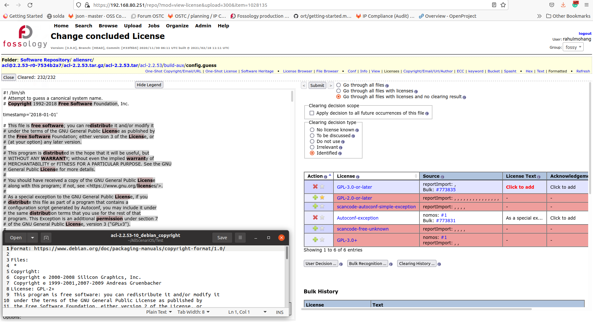
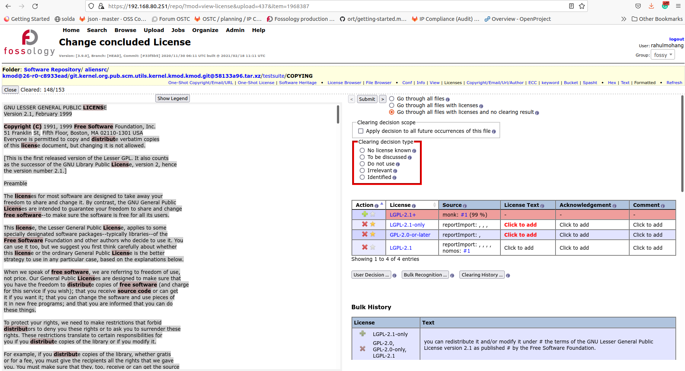

# Testing of Fossology audit part of All Scenarios OS automated toolchain for IP compliance

## Table of contents

  - [Introduction](#introduction)
  - [1. Import of wrong license decision](#1-import-of-wrong-license-decision)
  - [2. Import of additional licenses](#2-import-of-additional-licenses)
  - [3. Import of additional copyrights](#3-import-of-additional-copyrights)
  - [4. Import of scancode results](#4-import-of-scancode-results)
  - [5. Import decision on template licenses](#5-import-decision-on-template-licenses)
  - [6. Import decision on non-standard licenses](#6-import-decision-on-non-standard-licenses)
  - [7. Some cases where import decision could be applied](#7-some-cases-where-import-decision-could-be-applied)

## Introduction 
This document lists a set of improvement areas in the automated toolchain for license compliance, from the standpoint of the Fossology audit team, in the All Scenarios OS project. We have collected some examples from Fossology that shows some of the issues with the current implementation and they are organized under various categories.  

## 1. Import of wrong license decision 
The following examples from the uploaded components in Fossology, shows cases, where wrong licenses are imported and decided as licenses for files, by the compliance automation tools. 
One general solution to this problem could be to introduce one more source of truth, like the copyright file from Fedora, e.g., or to have an additional check point where a decision is made only if there is a license match with the findings of nomos or monk agents of Fossology, for a file. 

The following image shows a case where there is a reference to GPL-3.0-or-later in the file. However, the compliance automation has imported a decision of GPL-2.0-or-later. 

The following image shows a case where the license, LGPL-2.1-or-later, with weak copyleft effect, is imported and a decision is made on a file that has only a simple notice from the Free Software Foundation. 

The following are some more examples of import of wrong license decisions.

The following two images show cases where wrong license decisions are imported due to mistakes in the debain copyright files. The license information for files, as mentioned in the Debian copyright file, is different from the license information found by Fossology in the file.   

[Back to table of contents](#table-of-contents)

## 2. Import of additional licenses 
The following examples from the uploaded components in Fossology shows cases where a number of additional licenses, that are not applicable to a particular file, are imported to the file by the report import job of Fossology. When the SPDX report is generated, the additional licenses too are exported to the report. This could make the generated bill of materials to be wrong, and sometimes cause serious problems to downstream vendors, if the report import agent brings in strong copyleft licenses like AGPL without the file actually licensed under AGPL. 
Possible solutions could be varied based on the stage of automation in which the additional licenses are introduced. If we can filter them out before the Fossology stage, it would be great. It may involve another source of truth, or strictly restricting the findings to those from the debian copyright file. If the licenses are brought in later during the report import automation step, we could deactivate the licenses that do not have a matching nomos or monk finding in Fossology, so that, the licenses may not be part of the SPDX bill of materials. 

The following image shows a case where licenses are brought into a file that does not have a license text or keywords match from Fossology. There is no particular information about licenses, other than the reference to the main license, in the debian copyright file. The alien spdx file that was imported does not have the license information.  

To check whether Fossology brings in such license findings or not, we have uploaded the source code of the component shown in the example above, to Fossology. We have not found any license associated with the file in this upload. So, it could be reasonable enough to assume that the problem is in the report import job.

The following image shows a case where licenses are listed, by the compliance automation workflow, into a file that have no contents.

The following example shows that licenses with copyleft effect are imported to a file that has been placed in the public domain by the author. One possible explanation could be the wild card character in the debian copyright file that points to a possible GPL-2.0-or-later license to all the files that do not have explicit license text or license references mentioned in the files. This example shows that the case of importing such licenses to files could be improved by introducing additional comparisons in file level. However, the reason to import GPL-3.0-or-later and LGPL-2.1-or-later has not been comprehensible. 

The following images show more such examples:

[Back to table of contents](#table-of-contents)

## 3. Import of additional copyrights 
The following example from the uploaded components in Fossology shows a case where copyright statements are imported to a file that has no content. 

[Back to table of contents](#table-of-contents)

## 4. Import of scancode results 
The following examples shows some wrong license decisions and some license identifiers imported from scancode. The imported license identifiers from scancode do not contain license texts. They contain texts and hyperinks that leads to yml files in the location, [https://github.com/nexB/scancode-toolkit/blob/develop/src/licensedcode/data/licenses/](https://github.com/nexB/scancode-toolkit/blob/develop/src/licensedcode/data/licenses/). In many cases, because of the way in which the bulk identification in Fossology works, licenses of files with such identifiers from scancode will not be decided on a bulk job. This may lead to license decisions on far fewer files in spite of a bulk keyword match in a number of files. This is counterproductive, because this leads to more time spent on clearing of components that otherwise would have got cleared in a fraction of the time spent. We have observed that, in the way the compliance automation works today, importing license identifiers from scancode for files is not a value add.

 

[Back to table of contents](#table-of-contents)

## 5. Import decision on template licenses 
Template licenses should be considered special cases during audit in Fossology. The licenses like BSD license have a template like the one for BSD-3-Clause in [opensource.org](https://opensource.org/licenses/BSD-3-Clause). The first clause of most, if not all, BSD licenses states that, "1. Redistributions of source code must retain the above copyright notice, **this** list of conditions and the following disclaimer.". The "**this**" in the clause shows that capturing the license text that the author of a file licensed it under, rather than the text from the template, is important. 

In Fossology, most of the BSD licenses have a template license text associated with them. So, the audit team uses the 'License Text' field to capture the license texts provided by authors or copyright holders of such files, thereby overriding the template license text from Fossology. If a decision is imported to Fossology for files with such licenses, the audit team may not find such files in the list of files to be cleared, and may not override the template licenses with the license texts provided by authors or copyright holders of the files. So, a possible solution may be to not import a decision when the license of a file is BSD. 

[Back to table of contents](#table-of-contents)

## 6. Import decision on non-standard licenses 
There are many license texts that could be variants of other standard open source licenses that are listed at [list published by the Free Software Foundation (FSF)](https://www.gnu.org/licenses/license-list.html#NonFreeSoftwareLicenses), or licenses falling within the [Open Source Definition](https://opensource.org/osd) and/or within the [FSF definition of Free Software](https://www.gnu.org/philosophy/free-sw.html), **but** which is neither OSI-approved nor expressly listed by FSF (note that this latter option requires a previous assessment by the internal Legal Team to be considered “open source”), and others that are proprietary license texts, or special texts introduced by the authors of files. Such license texts also need to be captured in Fossology audits. 

Some examples are dual license reference texts, BSD style licenses, MIT style licenses, public domain reference texts, variations of exception texts etc. Such license texts provided by the authors are to be captured by the audit team using 'License Text' field in Fossology. If decisions are imported to Fossology for files with such licenses, the audit team may not find such files in the list of files to be cleared, and may not be able to bring such license texts to the clearing reports. So, a possible solution may be to not import a decision when a file has such a license. A list could be created for such possible license identifiers, and cover as many scenarios as possible. 

The following example shows a case where 'Dual-license', that is an identifier in Fossology used by audit team to capture references to dual licenses, has been imported as a license decision into the file. So, the audit team could not capture the original license text for the dual license. This is not a case that is serious enough to be a blocking point, because the presence of the 'Dual-license' identifier and the two licenses is a proof that the file is dual licensed. This however, undermines the importance of capturing the license text provided by the author or the copyright holder of the file.  

The following image shows the case where a decision was not imported, thereby allowing the audit team to capture the intented text of the license.

The following image shows the case of autoconf exception to GPL-3.0 license. An decision could be made with the standard license text for autoconf exception with GPL-3.0 license had Fossology identified that. However, a generic autoconf license identifier is identified. This is applicable to all cases of exception license statements in Fossology. It is essential for the audit team to have an opporunity to go through the file when any exception texts are identified. So, the solution is not to import decisions on such files.

[Back to table of contents](#table-of-contents)

## 7. Some cases where import decision could be applied 
There are many cases where an import decision could be applied without many considerations. Only prerequisite is that, we should avoid import of wrong licenses to files, as described in the section 2, though. 

The following image shows a case where a file contain only the text of a single license. In the image below, the file contains the license text of LGPL-2.0-only. The report import agent in the compliance automated tool chain should decide on such files. The prerequisite is that the additional license; in this case, LGPL-2.0-or-later, should not be an active license identifier. 

The following images shows cases where the license reference is represented in compliance to the REUSE project recommendation. This file may have a decision imported by the automated compliance toolchain. 

[Back to table of contents](#table-of-contents)
